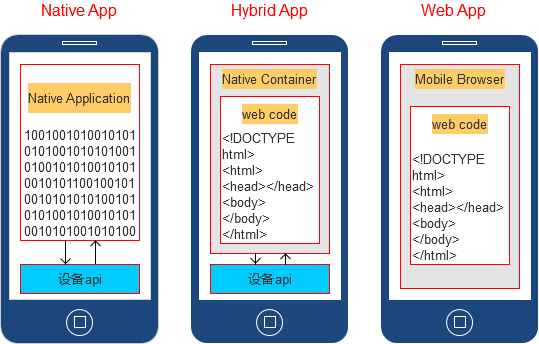
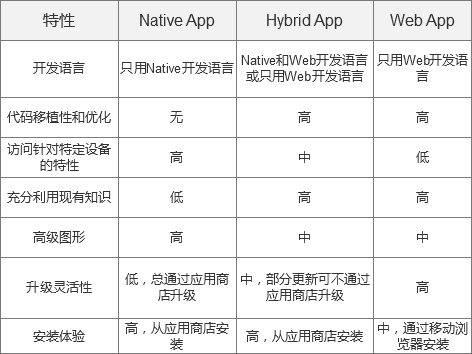

# 📱 Hybrid 混合开发完全指南

> Hybrid App 主要以 JS+Native 两者相互调用为主，从开发层面实现"一次开发，多处运行"的机制，成为真正适合跨平台的开发。

## 🎯 混合开发概述

Hybrid App 兼具了 Native App 良好用户体验的优势，也兼具了 Web App 使用 HTML5 跨平台开发低成本的优势。

混合开发具有以下优点：

- 跨平台开发：通过混合开发，开发者可以利用一套代码库同时构建适用于多个平台的应用程序，降低了开发成本和时间。
- 快速迭代：Web 技术具有快速迭代的特点，开发者可以快速地更新应用界面和业务逻辑，提高开发效率。
- 丰富的 Web 资源：Web 技术拥有丰富的资源和库，如前端框架、UI 组件等，开发者可以方便地利用这些资源来构建应用。

然而，混合开发也存在一些缺点：

- 性能问题：由于 WebView 的渲染效率低于原生代码，混合应用在性能方面可能不如原生应用。
- 用户体验：混合应用在用户体验方面也可能受到 WebView 的限制，如触控响应速度、动画效果等。
- 跨平台适配难度：虽然混合开发可以实现跨平台开发，但不同平台之间的差异仍然需要开发者进行大量的适配工作。

## 移动应用开发三种方式

- Native App： 原生应用程序（原生 App）
- Web App：网页应用程序（移动 web）
- Hybrid App：混合应用程序（混合 App）





## 混合开发的原理与实现

通过在原生应用中嵌入一个 WebView 组件，用于加载和渲染 Web 页面。开发者可以利用 HTML5、CSS 和 JavaScript 等技术构建应用界面和业务逻辑，然后通过 WebView 与原生代码进行交互。这种交互通常包括数据传递、事件处理和 UI 更新等方面。

为了实现混合开发，开发者需要掌握以下关键技术：

- WebView 的使用：WebView 是原生应用中的一个组件，用于加载和显示 Web 内容。开发者需要了解如何在原生应用中嵌入 WebView，并配置其属性以满足应用需求。
- JavaScript 与原生代码的交互：JavaScript 是 Web 技术中的核心语言，用于实现应用界面和业务逻辑。开发者需要了解如何通过 JavaScript 调用原生代码提供的功能，如访问设备摄像头、获取用户位置等。同时，也需要了解如何将原生代码的结果传递回 JavaScript 中。
- 跨平台适配与优化：混合开发虽然可以实现跨平台开发，但不同平台之间的差异仍然需要开发者进行适配和优化。这包括 UI 布局、性能优化、设备兼容性等方面。

## H5 和原生应用交互

1. Webview JavaScript Interface：在 WebView 中，可以使用 JavaScript 接口与 WebView 容器中的 Java 代码进行交互。

```js
// JavaScript 代码
window.jsInterface.someFun(arg);

window.sdk = {
  someFun(value){
    return value*2
  }
}


// Java 代码
webView.addJavascriptInterface(new Object() {
    @JavascriptInterface
    public void someFun(String arg) {
        // 处理接收到的数据
    }
}, "jsInterface");

// WebView提供了三个api用于调用js：
// void callHandler(String method, Object[] args)
// void callHandler(String method, Object[] args, CompletionHandler handler)
// void evaluateJavascript(String script)
webView.evaluateJavascript('window.sdk.someFun(10)',
new ValueCallback<String>(){
  @Override
  public void onReceiveValue(String s){} // 20
})
```

2. 通过 Intent 和 Custom Scheme：H5 页面可以通过自定义 URL Scheme 启动原生应用或者传递数据。

```js
// HTML 代码
<a href="myapp://some/path">打开原生应用</a>

// Java 代码
public class MyActivity extends Activity {
    @Override
    protected void onCreate(Bundle savedInstanceState) {
        super.onCreate(savedInstanceState);
        Uri uri = getIntent().getData();
        // 根据URI处理相应的操作
    }
}

// 检查app是否打开
 function checkOpen(cb) {
     const clickTime = +(new Date());
     function check(elsTime) {
         if (elsTime > 3000 || document.hidden || document.webkitHidden) {
             cb(true);
         } else {
             cb(false);
         }
     }
     // 启动间隔20ms运行的定时器，并检测累计消耗时间是否超过3000ms，超过则结束
     let count = 0;
     let intHandle = null;
     intHandle = setInterval(() => {
         count++;
         const elsTime = +(new Date()) - clickTime;
         if (count >= 100 || elsTime > 3000) {
             clearInterval(intHandle);
             check(elsTime);
         }
     }, 20);
 }

 /**
  * 唤起app
  * @param {any} uri  app schema
  * @param {any} fallback  唤起失败回调
  */
 function openApp(uri, fallback) {
     const ifr = document.createElement('iframe');
     ifr.src = uri;
     ifr.style.display = 'none';
     if (fallback) {
         checkOpen((opened) => {
             if (!opened) {
                 fallback();
             }
         });
     }
     document.body.appendChild(ifr);
     setTimeout(() => {
         document.body.removeChild(ifr);
     }, 2000);
 }
```

3. 使用 Cordova/PhoneGap：这是一个将 H5 作为桥梁，使开发者能够构建跨平台应用的开源移动开发框架。它允许你使用标准的 web 技术，如 HTML、CSS 和 JavaScript，并通过插件与原生功能进行交互。

```js
// JavaScript 代码
cordova.exec(successCallback, errorCallback, "NativePlugin", "someFunction", [arg0, arg1]);


// Java 代码 (Cordova 插件)
public class NativePlugin extends CordovaPlugin {
    @Override
    public boolean execute(String action, JSONArray args, CallbackContext callbackContext) throws JSONException {
        if ("someFunction".equals(action)) {
            // 处理接收到的数据
            return true;
        }
        return false;
    }
}
```

4. 使用 React Native、或 Flutter：这些框架允许你使用 H5 技术（如 React 或 JavaScript）编写应用，并利用原生系统功能。它们通常有自己的机制与原生代码交互。

```js
// React Native 示例
import { NativeModules } from "react-native";

NativeModules.NativeModule.someFunction(arg, result => {
  // 处理结果
});
```

## DSBridge

在 web 和 native 之间进行交互，如传递数据，调用函数，而连接 web 与 native 需要一个桥梁,通常称为 javascript bridge

目前 github 上开源最广的 WebViewJavascriptBridge、JsBridge、DSBridge。DSBridge 特性:

- 官方同时支持 ios 和 android。
- 双向调用:js 可以调用 native， native 可以调用 js
- 不仅支持异步调用，还支持同步调用（DSbridge 是唯一一个支持同步调用的 javascript bridge）。
- 三端友好，在接口易用性比 WebViewJavascriptBridge 强

### h5 调用原生

原理：通过拦截 JavaScript 的 prompt 事件，解析出对应的 method，然后利用 objc_msgSend 调用 OC 的方法。设计将接口封装到自定义的 JavaScriptInterface 中，支持多个 JavaScriptInterface 类。内部维护一个字典，支持多个命名空间。

```js
// Java注册供h5 中 JavaScript调用的 API
public class JsApi{
    //用于同步调用
    @JavascriptInterface
    String testSyn(JSONObject jsonObject) throws JSONException {
        // 返回值只能是字符串
        return jsonObject.getString("msg");
    }
    //用于异步调用
    @JavascriptInterface
    void testAsyn(JSONObject jsonObject, CompletionHandler handler) throws JSONException {
        handler.complete(jsonObject.getString("msg"));
    }
}

// 将实现的API安装到 DWebView
import wendu.dsbridge.DWebView
DWebView dwebView= (DWebView) findViewById(R.id.dwebview);
dwebView.setJavascriptInterface(new JsApi());


// 在h5页面中调用 Java API
var dsBridge=require("dsbridge")
// 同步调用
var str=dsBridge.call("testSyn", {msg: "testSyn"});
// 异步调用
dsBridge.call("testAsyn", {msg: "testAsyn"}, function (v) {
  alert(v);
})
```

### 原生调用 h5

原理：调用 evaluateJavaScript:completionHandler:执行 js 函数 `window._handleMessageFromNative` 调用 js 注册的方法。

```js
//Javascript 注册供 Native调用的 API
 dsBridge.register('addValue',function(l,r){
     return l+r;
 })

// 在 Java 中调用 javascript API
webView.callHandler("addValue",new Object[]{1,"hello"},new OnReturnValue(){
       @Override
       public void onValue(String retValue) {
          Log.d("jsbridge","return value is "+retValue);
       }
});
```

为了兼容 Android 和 IOS ，DSBridge 对 Native API 的签名有两个要求：

- 返回值必须是 String， 如果没有返回值，直接返回 null 就行
- API 的参数通过 JSONObject 传递，如果有些 API 没有参数，也需要申明。

### 调用时机

DSBridge 还提供了一个 WebViewClient 类，用于监听 WebView 的各种事件，如页面加载完成、页面加载失败等。通过这些事件的监听，可以实现更加复杂的交互逻辑，比如在页面加载完成后再调用原生代码，或在页面加载失败时调用 JavaScript 代码提示用户等。

DWebview 只有在 javascript context 初始化成功后才能正确执行 js 代码，而 javascript context 初始化完成的时机一般都比整个页面加载完毕要早，随然 DSBridge 能捕获到 javascript context 初始化完成的时机，但是一些 js api 可能声明在页面尾部，甚至单独的 js 文件中（请务必不要这么做），如果在 javascript context 刚初始化完成就调用 js api, 此时 js api 可能还没有注册，所以会失败，综上所述，如果是客户端主动调用 js 应该在 onPageFinished 后调用。简单的示例如下：

```java
webView.setWebViewClient(new WebViewClient(){
    @Override
    public void onPageFinished(WebView view, String url) {
        super.onPageFinished(view, url);
        //期望返回值
        webView.callHandler("test",new Object[]{1,"hello"},new CompletionHandler(){
            @Override
            public void complete(String retValue) {
                Log.d("jsbridge","call succeed,return value is "+retValue);
            }
        });
        //不期望返回值
        webView.callHandler("test",null);
    }
});
```

## DSBridge 原理

JS 核心：

```js
var bridge = {
  // js调用native的方法入口
  call: function (method, args, cb) {
    arg = JSON.stringify(arg);

    if (window._dsbridge) {
      ret = _dsbridge.call(method, arg);
    } else if (window._dswk || navigator.userAgent.indexOf("_dsbridge") != -1) {
      // 调用prompt函数，Native会拦截prompt事件，然后执行
      ret = prompt("_dsbridge=" + method, arg);
    }

    return JSON.parse(ret || "{}").data;
  },

  //Native调用的方法使用此方法注册
  // 往window注入全局参数，如存储js的注册方法等。
  register: function (name, fun, asyn) {
    //注册的方法会保存到window上，方便原生调用
    var q = asyn ? window._dsaf : window._dsf;
    //object类型保存到_obs下，方法直接保存到_dsf(_dsaf)下
    if (typeof fun == "object") {
      q._obs[name] = fun;
    } else {
      q[name] = fun;
    }
  },
};
```

Native 核心：

```js
//立即执行函数
!function () {
  //判断是否需要给window进行参数添加，如果没有添加会把ob内参数进行一次添加
  if (window._dsf) return;

  // 原生初始化时，会把数据挂载到window上
  var ob = {
    // 是否在原生webview中运行
    _dswk: true,
    //存储同步方法和相关对象
    _dsf: { _obs: {} },
    //存储异步方法和相关对象
    _dsaf: { _obs: {} },
    dscb: 0, //避免方法同名每次加1
    _dsBridge: bridge,

    //处理Native调用js方法，核心实现如下
    _handleMessageFromNative: function (info) {
      // 通过info.method 获取方法实现
      var f = this._dsf[info.method];

      // 通过info.data 获取入参，数组形式
      var arg = JSON.parse(info.data);

      // 使用apply函数，调用函数
      f.apply(ob, arg);
    },
  };
};
```
