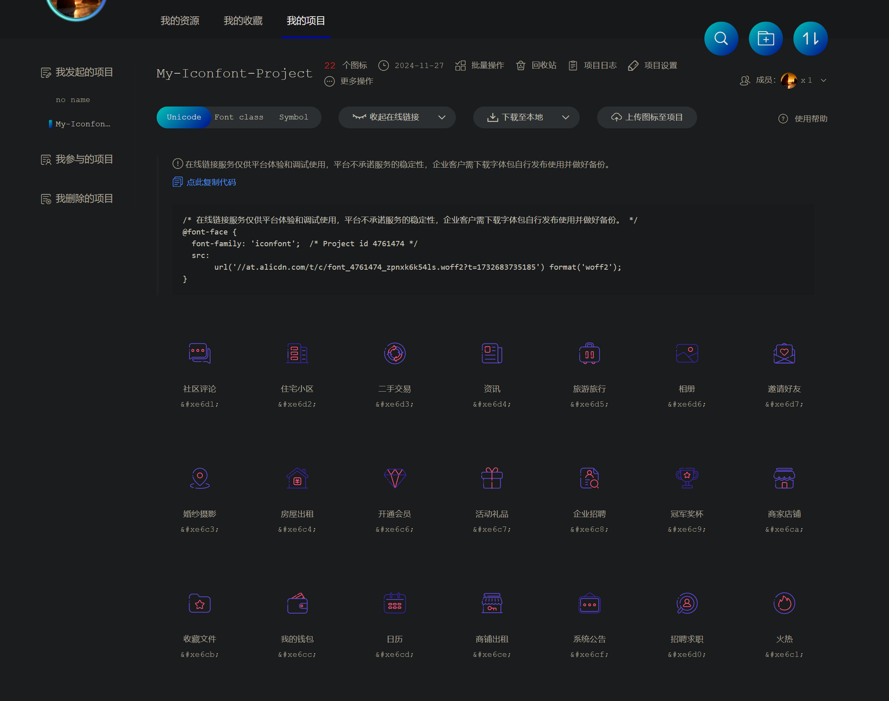

## Iconfont简介
‌iconfont是一种由阿里巴巴打造的矢量图标库，用户可以通过其平台管理和使用各种图标。‌ 使用iconfont的主要步骤包括注册账号、创建项目、搜索并添加所需的图标到项目中，最后通过不同的方式将图标引入到项目中。

官网：http://iconfont.cn/


1. 提前建好一个项目，会生成一个用来引入到项目代码的连接
2. 把喜欢的字体图标添加入库
3. 把入库的图标，添加进项目中
4. 三种方式引入字体图标到项目中：
   1. Unicode
   2. Font Class
   3. Symbol

## Unicode 引用
unicode 是字体在网页端最原始的应用方式，特点是：

- 兼容性最好，支持 IE6+，及所有现代浏览器。
- 支持按字体的方式去动态调整图标大小，颜色等等。
- 新版iconfont支持彩色字体图标，兼容所有现代浏览器

使用方式如下：
```css
/**第一步：拷贝项目下面生成的font-face */
@font-face {
    font-family: 'iconfont';
    src: url('iconfont.eot');
    src: url('iconfont.eot?#iefix') format('embedded-opentype'),
    url('iconfont.woff') format('woff'),
    url('iconfont.ttf') format('truetype'),
    url('iconfont.svg#iconfont') format('svg');
}

/**第二步：定义使用iconfont的样式 */
.iconfont{
    font-family:"iconfont" !important;
    font-size:16px;font-style:normal;
    -webkit-font-smoothing: antialiased;
    -webkit-text-stroke-width: 0.2px;
    -moz-osx-font-smoothing: grayscale;
}

/**第三步：挑选相应图标并获取字体编码，应用于页面 */
<i class="iconfont">&#x33;</i>
```

## font-class 应用
font-class是unicode使用方式的一种变种，主要是解决unicode书写不直观，语意不明确的问题。

与unicode使用方式相比，具有如下特点：

- 兼容性良好，支持ie8+，及所有现代浏览器。
- 相比于unicode语意明确，书写更直观。可以很容易分辨这个icon是什么。
- 因为使用class来定义图标，所以当要替换图标时，只需要修改class里面的unicode引用。
- 不过因为本质上还是使用的字体，所以多色图标还是不支持的。  

使用步骤如下：
```css
/** 第一步：拷贝项目下面生成的fontclass代码：*/
//at.alicdn.com/t/font_8d5l8fzk5b87iudi.css

/** 第二步：挑选相应图标并获取类名，应用于页面： */
<i class="iconfont icon-xxx"></i>
```

## symbol 引用
这是一种全新的使用方式，应该说这才是未来的主流，也是平台目前推荐的用法。这种用法其实是做了一个svg的集合，与上面两种相比具有如下特点：

- 支持多色图标了，不再受单色限制。
- 通过一些技巧，支持像字体那样，通过font-size,color来调整样式。
- 兼容性较差，支持 ie9+,及现代浏览器。
- 浏览器渲染svg的性能一般，还不如png。  

使用步骤如下：
```css
/** 第一步：拷贝项目下面生成的symbol代码： */
//at.alicdn.com/t/font_8d5l8fzk5b87iudi.js

/** 第二步：加入通用css代码（引入一次就行）： */
<style type="text/css">
    .icon {
       width: 1em; height: 1em;
       vertical-align: -0.15em;
       fill: currentColor;
       overflow: hidden;
    }
</style>

/** 第三步：挑选相应图标并获取类名，应用于页面： */
<svg class="icon" aria-hidden="true">
    <use xlink:href="#icon-xxx"></use>
</svg>
```