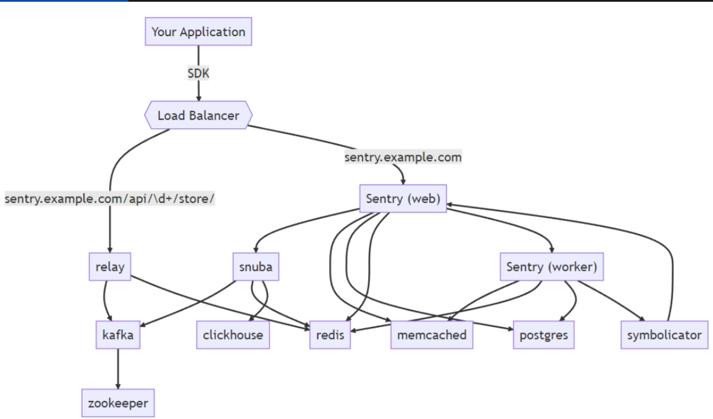
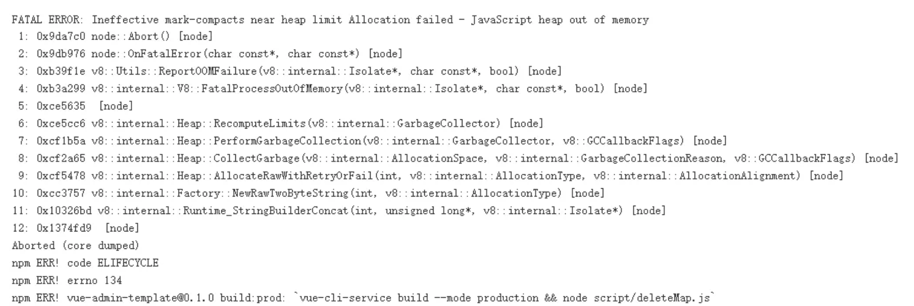

## Sentry 简介

Sentry 是一套开源的实时的异常收集、追踪、监控系统。这套解决方案由对应各种语言的 SDK 和一套庞大的数据后台服务组成，通过 Sentry SDK 的配置，还可以上报错误关联的版本信息、发布环境。同时 Sentry SDK 会自动捕捉异常发生前的相关操作，便于后续异常追踪。异常数据上报到数据服务之后，会通过过滤、关键信息提取、归纳展示在数据后台的 Web 界面中

## Sentry 性能监控

通过 window.performance.getEntries 和 performanceObserver 这两个 api，获取用户在使用应用过程中涉及的 load 相关、fcp、lcp、fid、cls 等指标数据，然后通过接口上报。监控平台拿到数据以后，通过可视化图标的方式展示性能指标数据，帮助分析性能问题。

```js
// getEntries获取所有performanceEntry条目
performance.getEntries().filter(item => item.name === "first-paint")[0]; // 获取 FP 时间
performance
  .getEntries()
  .filter(item => item.name === "first-contentful-paint")[0]; // 获取 FCP 时间

// getEntriesByName根据名字进行搜索
performance.getEntriesByName("first-paint"); // 获取 FP 时间
performance.getEntriesByName("first-contentful-paint"); // 获取 FCP 时间

// 也可以通过 performanceObserver 的方式获取
var observer = new PerformanceObserver(function (entryList, obj) {
  entryList.getEntries().forEach(item => {
    if (item.name === "first-paint") {
      console.log("筛选出首次绘制时间");
    }
    if (item.name === "first-contentful-paint") {
      console.log("筛选出首次内容绘制时间");
    }
  });
});
observer.observe({ type: "paint" });

// 获取LCP Largest-Contentful-Paint 最大内容绘制时间
observer.observe({ type: "largest-contentful-paint", buffered: true });

// 获取FID First Input Delay 首次输入延迟时间
observer.observe({ type: "first-input", buffered: true });

// 获取CLS, Cumulative Layout Shift, 累积布局偏移
observer.observe({ type: "layout-shift", buffered: true });
```

## 常见错误及监控方式

### JS 代码执行异常

js 代码执行异常，是最常遇到的异常。这一类型的异常，又可以具体细分为:Error，最基本的错误类型，其他的错误类型都继承自该类型。

- RangeError: 范围错误。当出现堆栈溢出(递归没有终止条件)、数值超出范围(new Array 传入负数或者一个特别大的整数)情况时会抛出这个异常。
- ReferenceError，引用错误。当一个不存在的对象被引用时发生的异常。
- SyntaxError，语法错误。如变量以数字开头；花括号没有闭合等。
- TypeError，类型错误。如把 number 当 str 使用。
- URIError，向全局 URI 处理函数传递一个不合法的 URI 时，就会抛出这个异常。如使用 decodeURI('%')、decodeURIComponent('%')。
- EvalError， 一个关于 eval 的异常，不会被 javascript 抛出。

通常，我们会通过 try...catch 语句块来捕获这一类型异常。也可以通过 window.onerror = callback 或者 window.addEventListener('error', callback) 的方式进行全局捕获。

### Promise 异常

在使用 promise 时，如果 promise 被 reject，就会抛出 promise 类异常。promise 类型的异常无法被 try...catch 捕获，也无法被 window.onerror 全局捕获。

- 被 catch 处理：需要通过 window.onrejectionhandled = callback 或者 window.addListener('rejectionhandled'， callback) 的方式去全局捕获。
- 没有被处理：需要通过 window.onunhandledrejection = callback 或者 window.addListener('onunhandledrejection'， callback) 的方式去全局捕

### 资源加载异常

页面的 img、js、css 等资源加载失败，就会提示资源类型加载如异常。可以通过 window.addEventListener('error', callback, true) 的方式进行全局捕获。

> 使用 window.onerror = callback 的方式是无法捕获静态资源类异常的。原因是资源类型错误没有冒泡，只能在捕获阶段捕获，而 window.onerror 是通过在冒泡阶段捕获错误，对静态资源加载类型异常无效

### 接口请求异常

在浏览器端发起一个接口请求时，如果请求失败，也会抛出异常。

- 通过 fetch 发起：通过 fetch(url).then(callback).catch(callback) 的方式去捕获异常
- 通过 XHR 发起请求：
  - xhr.open 方法执行时出现异常，可以通过 window.addEventListener('error', callback) 或者 window.onerror 的方式捕获异常。
  - xhr.send 方法执行时出现异常，可以通过 xhr.onerror 或者 xhr.addEventListener('error', callback) 的方式捕获异常

### 跨域脚本执行异常

当项目中引用的第三方脚本执行发生错误时，会抛出一类特殊的异常。这类型异常和之前讲过的异常都不同，它的 msg 只有 'Script error' 信息，没有具体的行、列、类型信息。之以会这样，是因为浏览器的安全机制: 浏览器只允许同域下的脚本捕获具体异常信息，跨域脚本中的异常，不会报告错误的细节。针对这类型的异常，我们可以通过 window.addEventListener('error', callback) 或者 window.onerror 的方式捕获异常。

如果我们想获取这类异常的详情，需要做以下两个操作:

- 在发起请求的 script 标签上添加 crossorigin="anonymous"
- 请求响应头中添加 Access-Control-Allow-Origin: \*

## Sentry 异常监控原理

为了能自动捕获应用异常，Sentry 劫持覆写了 window.onerror 和 window.unhandledrejection 这两个 api。

```js
// 劫持覆写 window.onerror 的代码如下：
oldErrorHandler = window.onerror;
window.onerror = function (msg, url, line, column, error) {
  // 收集异常信息并上报
  triggerHandlers("error", {
    column: column,
    error: error,
    line: line,
    msg: msg,
    url: url,
  });
  if (oldErrorHandler) {
    return oldErrorHandler.apply(this, arguments);
  }
  return false;
};

// 劫持覆写 window.unhandledrejection 的代码如下:
oldOnUnhandledRejectionHandler = window.onunhandledrejection;
window.onunhandledrejection = function (e) {
  // 收集异常信息并上报
  triggerHandlers("unhandledrejection", e);
  if (oldOnUnhandledRejectionHandler) {
    return oldOnUnhandledRejectionHandler.apply(this, arguments);
  }
  return true;
};
```

为了能获取更详尽的异常信息, Sentry 在内部做了一些更细微的异常捕获。具体来说，就是 Sentry 内部对异常发生的特殊上下文，做了标记。这些特殊上下文包括: dom 节点事件回调、setTimeout / setInterval 回调、xhr 接口调用、requestAnimationFrame 回调等。举个例子，如果是 click 事件的 handler 中发生了异常， Sentry 会捕获这个异常，并将异常发生时的事件 name、dom 节点描述、handler 函数名等信息上报。

## Sentry 整体架构



1. 第一层：Load Balancer（负载均衡器）负责路由转发。错误上报转发到 /api/\d+/store 。这一层承担数据入口。
2. 第二层：Sentry Web 主要跟配置等持久化数据打交道，创建项目、权限控制、限流分配等都是它负责。查询搜索错误消息、Dashboard 聚合等功能则是 Snuba 承担，由它来当翻译官，把用户查询条件转化为 SQL 语句发给 ClickHouse。
3. 第三层：
   1. Relay 负责消息中继转发，并把数据先汇集到 Kafka。
   2. Snuba 负责接收 SentryWeb 的请求，进行数据的聚合、搜索。
   3. Sentry Worker 则是一个队列服务，主要负责数据的存储。
4. 第四层：
   1. Kafka 作为消息队列。
   2. ClickHouse 负责实时的数据分析。
   3. Redis 和 Memcached 负责项目配置、错误基础信息的存储和统计。
   4. Postgres 承担基础数据持久化（主要是项目、用户权限管理等）。
   5. Symbolicator 主要用于错误信息格式化。
5. 第五层：Zookeeper 是 Kafka 用于节点信息同步，如果我们设置了多个 ClickHouse 节点，也可以用它来保存主从同步信息或者做分布式表。

## Sentry 安装部署

Sentry 的管理后台是基于 Python Django 开发的。这个管理后台由背后的 Postgres 数据库（管理后台默认的数据库）、ClickHouse（存数据特征的数据库）、relay、kafka、redis 等一些基础服务或由 Sentry 官方维护的总共 23 个服务支撑运行。可见的是，如果独立的部署和维护这 23 个服务将是异常复杂和困难的。幸运的是，官方提供了基于 docker 镜像的一键部署实现。具体落地方案可将 sentry 应用单机单节点部署在某一台独立服务器上，保证各环境数据上报网络通畅即可，具体环境和项目可以通过设置合理规范的前缀名区分，重要项目数据需要设置定时备份策略。

1. 安装 docker。
2. 使用 docker-compose 一键部署
3. 安装 sentry

```bash
$ git clone https://github.com/getsentry/onpremise.git
$ cd ./onpremise
$ chmod u+x ./install.sh
$ ./install.sh
# or
$ sudo ./install.sh
```

4. Sentry 环境配置
   1. 配置 Root URL：异常上报接口的公网根地址
   2. Outbound email：这部分内容为邮件服务配置
   3. 设置语言和时区
   4. 选取平台语言创建团队和项目
   5. 获取项目绑定的 DSN（客户端秘钥）
   6. 报警配置
      1. Password：指的是 开启 SMTP 时的授权码
   7. 等.....

## 前端接入 Sentry

1. 安装 Sentry 插件

```bash
npm install --save @sentry/vue @sentry/tracing
```

2. 创建初始化 Sentry 配置文件

```ts
import * as Sentry from "@sentry/vue";
import { Integrations } from "@sentry/tracing";
// 调用sentryInit函数进行Sentry的初始化配置
Sentry.init({
  // 将sentry的init方法和app实例传递给sentryInit
  sentry: { init },
  app,
  // 是否开启错误上报，
   enabled: true,
  // 指定Sentry项目的DSN（数据源名称），用于将错误数据发送到正确的Sentry项目
  dsn: "http://61a3c1c2ac124286ae2a13e0bd0f3824@10.84.4.231:9000/3",
  // 配置集成，这里添加了两个集成：BrowserTracing和Replay
  integrations: [
    // 跟踪浏览器中的性能问题，如页面加载时间\接口响应时间等
    new Integrations.BrowserTracing({
      // 通过vueRouterInstrumentation对Vue路由进行追踪
      routingInstrumentation: Sentry.vueRouterInstrumentation(router),
      tracingOrigins: ["localhost", "my-site-url.com", /^\//],
    }),
    // Replay集成用于记录和回放用户的操作，帮助开发者更好地理解错误发生的上下文
    new Replay({
      // 配置允许采集的接口，如果有非同源的接口域名需要在这里配置
      networkDetailAllowUrls: [window.location.origin],

      // 配置请求头中需要采集的字段 默认只采集 Content-Type、Content-Length、Accept, Authorization 需要确认需不需要
      networkRequestHeaders: [
        "traceparent",
        "__refreshid__",
        "Cookie",
        "Authorization",
      ],

      // 配置响应头中需要采集的字段
      networkResponseHeaders: ["traceparent", "set-cookie"],

      // 是否对所有文本进行脱敏处理，这里设置为false
      maskAllText: false,

      // 是否对所有输入进行脱敏处理，这里设置为false
      maskAllInputs: false,

      // 是否阻止所有媒体加载，这里设置为false
      blockAllMedia: false,
    }),
  ],
  // 配置性能监控采样率。值介于0 至1.0, 事件是随机挑选的
  tracesSampleRate: 1.0,
    // 设置环境变量，用于区分不同的环境（如开发、测试、生产等）
  environment: import.meta.env.MODE,
  //是否发送默认个人识别信息，如用户邮箱和用户名等
  send_default_pii: true,
  //标识应用程序的版本，以便在Sentry中跟踪不同版本的错误
  release: import.meta.env.BUILD_TIME as string,
  // 配置需要忽略的错误类型或错误消息，这些错误将不会被上报到Sentry
  ignoreErrors: [
     'ResizeObserver loop limit exceeded',
     /Failed to fetch dynamically imported module/,
     /Failed to load module script/,
    ],
  initialScope: {
      tags: { "my-tag": "my value" },
      user: { id: 4222xxx, email: "xxxx.com" },
  },
  // 设置用户名
  username: xxx.userName,
  // 是否将错误记录到控制台，这里设置为true
  logErrors: true,
    // 添加用户崩溃反馈弹窗
  beforeSend(event, hint) {
    // Check if it is an exception, and if so, show the report dialog
    if (event.exception) {
      Sentry.showReportDialog({ eventId: event.event_id });
    }
    return event;
  },
});

 export function configSentryPlugin() {
    return vitePluginSentry({
          // 指定 Sentry 服务的 URL
          url: 'https://sentry.xxxx.cn',

          // 指定 Sentry 的授权令牌，这是连接 Sentry 服务并进行错误追踪的凭证
          authToken: '', //sentry授权令牌

          // 指定 Sentry 中的组织名称
          org: 'sentry',

          // 指定 Sentry 中的项目名称
          project: 'xxxx',

          // 指定发布的版本，这里使用了环境变量 BUILD_TIME 的值作为版本信息
          release: process.env.BUILD_TIME as string,

          // 配置 source map 的相关设置，用于在 Sentry 中更准确地定位错误位置
         sourceMaps: {
           // 指定需要包含进 source map 的文件或文件夹，这里包含了 './dist/assets' 文件夹
           include: ['./dist/assets'],

           // 指定需要忽略的文件或文件夹，这里忽略了 'node_modules' 文件夹
           ignore: ['node_modules'],

           // 设置 source map 的 URL 前缀，用于在 Sentry 中构建正确的 source map URL
        // 设置跳过环境检查，即使在非生产环境中也上传 source map 和错误信息到 Sentry
         skipEnvironmentCheck: true,
         }
     })
 }


export type ISentry = typeof Sentry;
// 主动上报错误：是个错误，但是sentry没这么认为，所以需要主动上报
class TrackError {
  public sentry?: ISentry;

  constructor(sentry?: ISentry) {
    this.sentry = sentry;
  }

  captureException(exception: any) {
    if (!this.sentry || !exception) return;
  // 这会触发系统内部钩子（webhooks）
    this.sentry.captureException(exception);
  }
  captureMessage(exception: any) {
    if (!this.sentry || !exception) return;
  // 可以理解为埋点，不会触发系统内部钩子（webhooks），level: info
    this.sentry.captureMessage(exception);
  }
}

export default TrackError;
```

3. 在项目入口文件 main.js 中，引入 Sentry 配置文件

## Sentry 内存泄漏问题

问题：开启 sentry 配置，导致构建内存泄漏。默认使用 1 个 Worker，内存限制为 2048KB


处理方式：

```js vue.config.js
// 修改node内存限制
export NODE_OPTIONS="--max-old-space-size=8192"

// 或者修改 SourceMap 生成方式（最低成本）
// https://v3.umijs.org/zh-CN/guide/boost-compile-speed#调整-sourcemap-生成方式

const ForkTsCheckerWebpackPlugin = require('fork-ts-checker-webpack-plugin');

module.exports = {
  configureWebpack: config => {
    // 获取已经存在的ForkTsCheckerWebpackPlugin引用
    const existingForkTsChecker = config.plugins.filter(p => p instanceof ForkTsCheckerWebpackPlugin)[0];

    // 移除ForkTsCheckerWebpackPlugin，方便使用自定义的修改
    config.plugins = config.plugins.filter(p => !(p instanceof ForkTsCheckerWebpackPlugin));

    // 获取已经存在的ForkTsCheckerWebpackPlugin的配置选项
    const forkTsCheckerOptions = existingForkTsChecker.options;
    // 修改为使用2个worker
    forkTsCheckerOptions.workers = 2;
    // 修改其内存限制
    forkTsCheckerOptions.memoryLimit = 12288;
    //根据新的配置，生成新的实例，并添加到plugins数组里
    config.plugins.push(new ForkTsCheckerWebpackPlugin(forkTsCheckerOptions));
  }
};

```

## SourceMap

官网有三种做法如下：

1. sentry 提供 webpack-plugin (链接)
2. 脚手架工具 sentry-cli
3. 直接调用 sentry API（有点麻烦，参数配置有点多）

这里介绍 @sentry/webpack-plugin 方式（方便接入现有 CI/CD）

.sentryclirc:

```bash
[auth]
token=42b21a34ca654530af08			授权令牌，认证凭证token(Settings/Auth Tokens)

[defaults]
url = https://sentry.io/				上报 sentry 地址
org = ws-ap 										组织名称(Organization)
project = qv-h5									项目名称
```

vue.config.js:

```js
const SentryCliPlugin = require("@sentry/webpack-plugin");

module.exports = {
  // 开启 source map
  productionSourceMap: true,
  configureWebpack: config => {
    config.plugins.push(
      new SentryCliPlugin({
        include: "./dist/",
        configFile: "sentry.properties",
        // 版本(如果没有指定，sentry会自动创建 string 类型版本号)，记得跟 init 版本一致sourceMap才会生效
        release: process.env.VUE_APP_PROJECT_RELEASE,
        ignore: ["node_modules"],
        urlPrefix: `${process.env.VUE_APP_COS_URL}/`,
      })
    );
  },
};
```

参考文档：

https://blog.csdn.net/weixin_43860603/article/details/136038871

https://www.yuque.com/wuchendi/fe/fdcdnq
