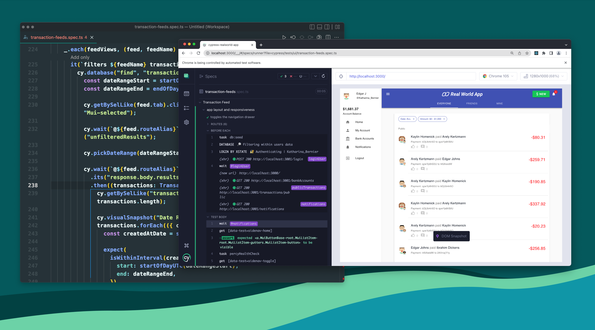
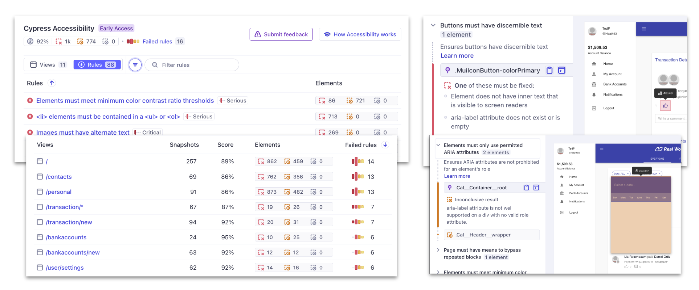

## Cypress 测试框架

[node内置测试库](/afterEnd/node/test)  
[node内置断言库](/afterEnd/node/assert)

Cypress 是为现代 Web 构建的下一代前端测试工具。 在测试现代应用程序和维护测试套件时，解决团队的关键痛点。用户通常是开发人员、QA 工程师和希望构建 Web 应用程序的团队 并提高其现有应用程序的质量。Cypress 后面是一个 Node 服务器进程。Cypress 和 Node 不断处理 代表彼此通信、同步和执行任务。拥有 访问这两个部分（正面和背面）使我们能够响应您的 应用程序的事件，同时在 browser 来执行需要更高权限的任务。由于 Cypress 安装在本地计算机上，因此 它还可以利用操作系统执行自动化任务。这 执行诸如截取屏幕截图、录制视频、 可以进行常规文件系统操作和网络操作。

Cypress 为以下方面提供解决方案：

- 端到端测试
- 组件测试
- 辅助功能测试
- UI 覆盖率
- 以及更多...

Cypress 可以测试浏览器中运行的任何内容，并深入了解如何改善运行状况 测试套件和应用程序质量。Cypress 应用程序的能力：

- 时间旅行：Cypress 在测试运行时拍摄快照。将鼠标悬停在 命令来准确查看每个步骤中发生的情况。
- 可调试性：不要再猜测测试失败的原因。直接从熟悉的工具（如 Developer）进行调试 工具。我们的可读错误和堆栈跟踪使调试快如闪电。
- 自动等待：切勿向测试添加 await 或 sleeps。Cypress 会自动等待命令和断言，然后再继续。不再有异步地狱。
- 间谍、存根和时钟：验证和控制函数的行为， server 响应或计时器。您喜爱的单元测试功能 触手可及。
- 网络流量控制：轻松控制、存根和测试边缘情况，而无需 涉及您的服务器。您可以根据需要对网络流量进行存根。
- 一致的结果：我们的架构不使用 Selenium 或 WebDriver。 向快速、一致和可靠的无片状测试问好。
- 跨浏览器测试：在 Firefox 和 Chrome 系列浏览器中运行测试 （包括 Edge 和 Electron）在本地和持续集成管道中。
  

### 端到端测试

Cypress 最初旨在对 在浏览器中运行。典型的 E2E 测试会在浏览器中访问应用程序，然后 通过 UI 执行操作，就像真实用户一样。

```js
it("adds todos", () => {
  cy.visit("https://example.cypress.io/");
  cy.get('[data-cy="new-todo"]').type("write tests{enter}");
  // confirm the application is showing one item
  cy.get('[data-cy="todos"]').should("have.length", 1);
});

it("adds and completes todos", () => {
  cy.visit("/");
  cy.get(".new-todo")
    .type("write code{enter}")
    .type("write tests{enter}")
    .type("deploy{enter}");

  cy.get(".todo").should("have.length", 3);

  cy.get(".todo").first().find(".toggle").check();

  cy.get(".todo").first().should("have.class", "completed");
});
```

### 组件测试

Cypress Component Testing 为您提供了一个组件工作台，让您能够快速 从多个前端 UI 库构建和测试组件 — 无论如何 简单或复杂

```js
// Vue
import Button from "./Button.vue";

it("uses custom text for the button label", () => {
  cy.mount(Button, {
    slots: {
      default: "Click me!",
    },
  });
  // Assert that a button component has the correct text
  cy.get("button").should("contains.text", "Click me!");
});

it("adds and completes todos", () => {
  cy.mount(<AddTodo />);
  cy.get(".new-todo")
    .type("write code{enter}")
    .type("write tests{enter}")
    .type("deploy{enter}");

  cy.get(".todo").should("have.length", 3);

  cy.get(".todo").first().find(".toggle").check();

  cy.get(".todo").first().should("have.class", "completed");
});

//Svelte
import Button from "./Button.svelte";

it("uses custom text for the button label", () => {
  cy.mount(Button, { props: { msg: "Click me!" } });
  // Assert that a button component has the correct text
  cy.get("button").should("contains.text", "Click me!");
});
```

### 单元测试

```js
// add.js
function add(a, b) {
  return a + b;
}
module.exports = { add };

// add.cy.js
const { add } = require("./add");

it("adds numbers", () => {
  expect(add(2, 3)).to.equal(5);
});
```

### 可访问性测试(集成测试)

可以编写 Cypress 测试来检查应用程序的可访问性，并使用插件运行广泛的可访问性扫描。 当与 Cypress Cloud 中的 Cypress 辅助功能结合使用时，可以在特定时显示见解 测试不符合辅助功能标准 - 无需配置

```js
it("adds todos", () => {
  cy.visit("https://example.cypress.io/");
  cy.get("img#logo")
    // Assert that an image has the correct alt text
    .should("have.attr", "alt", "Cypress Logo");
});
```



### UI 覆盖率 & 代码覆盖率

可以通过使用 UI 覆盖率缩小关键应用程序流中的测试差距来提高发布置信度。利用数据驱动的洞察来覆盖未测试的区域，减少事件并提高应用程序质量。


```js
// 安装代码覆盖率插件
npm install @cypress/code-coverage --save-dev

// cypress/support/e2e.js
import '@cypress/code-coverage/support'


// 配置e2e测试
const { defineConfig } = require('cypress')
module.exports = defineConfig({
  // setupNodeEvents can be defined in either
  // the e2e or component configuration
  e2e: {
    setupNodeEvents(on, config) {
      require('@cypress/code-coverage/task')(on, config)
      // include any other plugin code...

      // It's IMPORTANT to return the config object
      // with any changed environment variables
      return config
    },
  },
})
```

### 其他

Cypress 可以执行任意 HTTP 调用，可以将其用于 API 测试。通过大量官方和第三方插件，还可以编写许多其他类型的测试！

```js
it("adds a todo", () => {
  cy.request("POST", "/todos", { title: "Write API Tests" })
    .its("body")
    .should("contain", { title: "Write API Tests" });
});
```

## 断言

捆绑了流行的 Chai 断言 库，以及 Sinon-Chai 和 Chai-jQuery 断言

### Chai

```js
// not
.should('not.equal', 'Jane')
expect(name).to.not.equal('Jane')

// deep
.should('deep.equal', { name: 'Jane' })
expect(obj).to.deep.equal({ name: 'Jane' })

// nested 嵌套
.should('have.nested.property', 'a.b[1]')
.should('nested.include', {'a.b[1]': 'y'})
expect({a: {b: 'x'}}).to.have.nested.property('a.b')
expect({a: {b: 'x'}}).to.nested.include({'a.b': 'x'})

// ordered
.should('have.ordered.members', [1, 2])
expect([1, 2]).to.have.ordered.members([1, 2])
expect([1, 2]).not.to.have.ordered.members([2, 1])

// any
.should('have.any.keys', 'age')
expect(arr).to.have.any.keys('age')

//a(type) Aliases:an
.should('be.a', 'string')
expect('test').to.be.a('string')

// all
.should('have.all.keys', 'name', 'age')
expect(arr).to.have.all.keys('name', 'age')

//include(value) Aliases:contain includes contains
.should('include', 2)
expect([1,2,3]).to.include(2)

// ok
.should('not.be.ok')
expect(undefined).to.not.be.ok

// true
.should('be.true')
expect(true).to.be.true

// false
.should('be.false')
expect(false).to.be.false

//null
	.should('be.null')
expect(null).to.be.null

// undefined
	.should('be.undefined')
expect(undefined).to.be.undefined

// exist
.should('exist')
expect(myVar).to.exist

//arguments Aliases:Arguments
.should('be.arguments')
expect(arguments).to.be.arguments

//equel(value) Aliases: equals eq
.should('equal', 42)
expect(42).to.equal(42)

//deep.equal(value)
.should('deep.equal', { name: 'Jane' })
expect({ name: 'Jane' }).to.deep.equal({ name: 'Jane' })

//eql(value) Aliases: eqls
.should('eql', { name: 'Jane' })
expect({ name: 'Jane' }).to.eql({ name: 'Jane' })

// greaterThan(value) Aliases:gt above 大于
.should('be.greaterThan', 5)
expect(10).to.be.greaterThan(5)

// least(value)  Aliases: gte 至少 大于等于
.should('be.at.least', 10)
expect(10).to.be.at.least(10)

// lessThan(value) Aliases: it below 小于
.should('be.lessThan', 10)
expect(5).to.be.lessThan(10)

// most(value) Aliases: ite 小于等于
.should('have.length.of.at.most', 4)
expect('test').to.have.length.of.at.most(4)

//within(start,finish)
.should('be.within', 5, 10)
expect(7).to.be.within(5, 10)

// instanceOf(constructor)
.should('be.instanceOf', Array)
expect([1, 2, 3]).to.be.instanceOf(Array)

// property(name,[value])
.should('have.property', 'name')
expect(obj).to.have.property('name')

//deep.property(name, [value])
.should('have.deep.property', 'tests[1]', 'e2e')
expect(deepObj).to.have.deep.property('tests[1]', 'e2e')

//ownProperty(name) Aliases: haveOwnProperty, own.property
.should('have.ownProperty', 'length')
expect('test').to.have.ownProperty('length')

// ownPropertyDescriptor(name) Aliases: haveOwnPropertyDescriptor
.should('have.ownPropertyDescriptor', 'a')
expect({a: 1}).to.have.ownPropertyDescriptor('a')

//lengthOf(value)
.should('have.lengthOf', 4)
expect('test').to.have.lengthOf(4)

//match(RegExp) Aliases: matches
.should('to.match', /^test/)
expect('testing').to.match(/^test/)

//string(string)
.should('have.string', 'test')
expect('testing').to.have.string('test')

// keys(key1, [key2], [...])  Aliases: key
.should('have.keys', 'pass', 'fail')
expect({ pass: 1, fail: 2 }).to.have.keys('pass', 'fail')

//throw(constructor) Aliases: throws, Throw
.should('throw', Error)
expect(fn).to.throw(Error)

//respondTo(method)  Aliases: respondsTo
.should('respondTo', 'getName')
expect(obj).to.respondTo('getName')

//itself
.should('itself.respondTo', 'getName')
expect(Foo).itself.to.respondTo('bar')

//closeTo(expected, delta)  Aliases: approximately
.should('be.closeTo', 1, 0.5)
expect(1.5).to.be.closeTo(1, 0.5)

// members(set)
.should('include.members', [3, 2])
expect([1, 2, 3]).to.include.members([3, 2])

//oneOf(values)
.should('be.oneOf', [1, 2, 3])
expect(2).to.be.oneOf([1,2,3])

//change(function)  Aliases: changes
.should('change', obj, 'val')
expect(fn).to.change(obj, 'val')

//increase(function) Aliases: increases
.should('increase', obj, 'val')
expect(fn).to.increase(obj, 'val')

//decrease(function Aliases: decreases
.should('decrease', obj, 'val')
expect(fn).to.decrease(obj, 'val')
```

### Chai-jQuery

判断 dom 时，可以使用

```js
//attr(name, [value])
.should('have.attr', 'bar')
expect($el).to.have.attr('foo', 'bar')

//prop(name, [value])
	.should('have.prop', 'disabled', false)
expect($el).to.have.prop('disabled', false)

//css(name,[value])
.should('have.css', 'background-color', 'rgb(0, 0, 0)')
expect($el).to.have.css('background-color', 'rgb(0, 0, 0)')

//data(name,[value])
	.should('have.data', 'foo', 'bar')
expect($el).to.have.data('foo', 'bar')

//id(id)
.should('have.id', 'foo')
expect($el).to.have.id('foo')

//class(className)
.should('have.class', 'foo')
expect($el).to.have.class('foo')

//html(html)
.should('have.html', 'I love testing')
expect($el).to.have.html('with Cypress')

//text(text)
.should('have.text', 'I love testing')
expect($el).to.have.text('with Cypress')

//value(value)
.should('have.value', 'test@dev.com')
expect($el).to.have.value('test@dev.com')

//visible
.should('be.visible')
expect($el).to.be.visible

//hidden
.should('be.hidden')
expect($el).to.be.hidden

//selected
.should('be.selected')
expect($option).not.to.be.selected

//checked
.should('be.checked')
expect($input).not.to.be.checked

//focus(ed)
.should('have.focus')
expect($input).to.have.focus
expect($input).not.to.be.focused

//enabled
	.should('be.enabled')
expect($input).to.be.enabled

//disabled
.should('be.disabled')
expect($input).to.be.disabled

//empty
.should('be.empty')
expect($el).not.to.be.empty

//exist
.should('exist')
expect($nonexistent).not.to.exist

//match(selector)
	.should('match', ':empty')
expect($emptyEl).to.match(':empty')

//contain(text)
.should('contain', 'text')
expect($el).to.contain('text')

//descendants(selector) 是否拥有后代selector
.should('have.descendants', 'div')
expect($el).to.have.descendants('div')
```

### Sinon-Chai

这些链器通过 cy.stub（）和 cy.spy（）用于断言

```js
// called
.should('have.been.called')
expect(spy).to.be.called

//callCount
.should('have.callCount', 3)
expect(spy).to.have.callCount(n)

//calledOnce
.should('have.been.calledOnce')
expect(spy).to.be.calledOnce

//calledTwice
.should('have.been.calledTwice')
expect(spy).to.be.calledTwice

//calledThrice
.should('have.been.calledThrice')
expect(spy).to.be.calledThrice

//calledBefore
.should('have.been.calledBefore', spy2)
expect(spy1).to.be.calledBefore(spy2)

//calledAfter
.should('have.been.calledAfter', spy2)
expect(spy1).to.be.calledAfter(spy2)

//calledWithNew
.should('have.been.calledWithNew')
expect(spy).to.be.calledWithNew

//alwaysCalledWithNew
.should('have.always.been.calledWithNew')
expect(spy).to.always.be.calledWithNew

// calledOn
.should('have.been.calledOn', context)
expect(spy).to.be.calledOn(context)

// calledWith
.should('have.been.calledWith', ...args)
expect(spy).to.be.calledWith(...args)

//calledWithMatch
.should('have.been.calledWithMatch',...args)
expect(spy).to.be.calledWithMatch(...args)

//returned
.should('have.returned', 'foo')
expect(spy).to.have.returned(returnVal)

//alwaysReturned
.should('have.always.returned', 'foo')
expect(spy).to.have.always.returned(returnVal)

//throw
.should('have.thrown', TypeError)
expect(spy).to.have.thrown(errorObjOrErrorTypeStringOrNothing)

// alwaysThrow
.should('have.always.thrown', 'TypeError')
expect(spy).to.have.always.thrown(errorObjOrErrorTypeStringOrNothing)
```

## 引入 Cypress

安装 cypress 应用程序，到官网下载 cypress。需提前安装 Node.js 18.x、20.x、22.x 及更高版本

项目中使用 cypress

```js
// 安装cypress
pnpm add --save-dev cypress

// 从项目根目录打开 Cypress
pnpm cypress open

//添加 npm 脚本，使用更方便
{
  "scripts": {
    "cy:open": "cypress open"
  }
}
npm run cy:open

// 测试脚本
describe('My First Test', () => {
  it('Gets, types and asserts', () => {
    cy.visit('https://example.cypress.io')

    cy.contains('type').click()

    // Should be on a new URL which
    // includes '/commands/actions'
    cy.url().should('include', '/commands/actions')

    // Get an input, type into it
    cy.get('.action-email').type('fake@email.com')

    //  Verify that the value has been updated
    cy.get('.action-email').should('have.value', 'fake@email.com')
  })
})
```

## 查找页面元素

操作基本和 jQuery 保持一致

```js

describe(name, config, fn)
context(name, config, fn)
it(name, config, fn)
specify(name, config, fn)


describe('测试组描述信息',function(){
  before(function(){
    console.log('生命周期钩子：before，在任务开始之前执行')
    cy.visit('www.baidu.com')
        cy.exec('npm run db:reset && npm run db:seed')

    // seed a post in the DB that we control from our tests
    cy.request('POST', '/test/seed/post', {
      title: 'First Post',
      authorId: 1,
      body: '...',
    })

    // seed a user in the DB that we can control from our tests
    cy.request('POST', '/test/seed/user', { name: 'Jane' })
      .its('body')
      .as('currentUser')
    })
  })
  beforeEach(function(){
    console.log('生命周期钩子：beforeEach，在每个任务开始之前都会执行')
  })
  after(function(){
    console.log('生命周期钩子：after，在任务开始之后执行')
  })
  afterEach(function(){
    console.log('生命周期钩子：afterEach，在每个任务开始之后都会执行')
  })

  it('分组描述信息',function(){
    // 以选择器定位，find选择后代元素 contains 选择包含指定文本的元素
    cy.get(selector).find(selector).contains(context).should('exist')

    cy.get('#appid').find('.container').contains('张进喜')
    // 以别名定位
    cy.get(alias).children(selector?).parents().parent().siblings().first().last();

    cy.get(selector).next().nextAll().nextUntil(selector)

    cy.get(selector).prev().prevAll().prevUntil(selector)


    cy.get(selector).each(callback(element,index)=>console.log(element,index))

    // eq(index) 获取索引为index的元素。closest()获取最近匹配的祖先元素
    cy.get(selector).eq(1).closest(selector,options)

  })
})
```

## 操作页面

```js
context("操作页面元素相关命令介绍", function () {
  it("需要先获取dom元素，再进行操作", function () {
    /** type:输入文本和特殊字符，特殊字符需要用{}包裹，有：
     * backspace  backspace后退键
     * del
     * alt
     * shift
     * ctrl
     * downarrow
     * leftarrow
     * uparrow
     * rightarrow
     * end
     * enter
     * esc
     * home
     * insert
     * pagedown
     * pageup
     * selectall
     */
    cy.get(selector).type(text, {
      log: true, //是否在命令日志中显示命令
      delay: 10, //每次按键后的延迟，毫秒
      force: false, //是否强制执行操作
      release: true, //命令之间让按键保持长按状态
      timeout: 100, //执行type命令之前的等待超时时间
      parseSpecialCharSequences: true, //是否解析{}包裹的特殊字符
    });
    // 等同于按 shift + alt + q
    cy.get("input").type("{shift}{alt}Q");

    // 按住 shift，然后输入 test
    cy.get("input").type("{shift}test");

    /** focus() 使当前选中元素聚焦
     *  blur() 使当前元素失焦
     */
    cy.get(selector).focus({
      log: true,
      timeout: 100,
      force: false,
    });

    /**
     * 清空输入所有内容
     */
    cy.get(selector).clear({
      log: true,
      force: false,
      timeout: 100,
    });

    /**
     * 使form元素提交
     */
    cy.get(selector).submit({
      log: true,
      timeout: 100,
    });
    /**
     * check() 使单选框、复选框勾选。values：只有匹配的被勾选
     * uncheck() 不被勾选
     */
    cy.get(selector).check(values, {
      log: true,
      force: false,
      timeout: 100,
    });
    /**
     * 使select的options被选中，values:被选中的值[1,2]
     */
    cy.get(selector).select(values, {
      log: true,
      force: false,
      timeout: 100,
    });
    /**
     * 默认将指定  DOM 元素滑动到可视视图中的左上角
     */
    cy.get(selector).scrollIntoView(values, {
      log: true,
      force: false,
      timeout: 100,
      duration: 0, //滚动持续时间
      easing: "swing", //滚动时间曲线
      offset: { top: 0, left: 0 }, //滚动后的偏移量
    });
    /**
     * 将元素滚动到某个位置
     */
    cy.get(selector).scrollTo(position).scrollTo(x, y).scrollTo(position, {
      log: true,
      timeout: 100,
      duration: 0, //滚动持续时间
      easing: "swing", //滚动时间曲线
    });
    /**
     * 在DOM元素上触发指定事件，position|x,y
     * top botton left right
     * topLeft topRight bottonLeft bottonRight
     */
    cy.get(selector).trigger(eventName, positon, {
      log: true,
      force: false,
      timeout: 100,
      cancelable: true, //是否可以取消
      bubbles: true, //是否冒泡传递事件
    });
  });
});
```

## 页面事件

```js
context("页面常用的事件", function () {
  it("鼠标事件", function () {
    /**
     * click
     * dbclick
     * rightclick
     * mousedown
     * mousemove
     * mouseup
     * mouseenter
     * mouseover
     * mouseleave
     * mouseout
     * options选项属性：
     * log:true,
     * force:false,
     * multiple:false,// 连续点击多个元素
     * timeout:100,
     */
    cy.get(selector)
      .click()
      .click(position)
      .click(position, options)
      .click(x, y, options);
  });
});
```

## 页面全局对象

```js
context("获取页面全局对象的相关命令", function () {
  it("常用命令相关", function () {
    /**
     * 获取当前页面的 title
     */
    cy.title().title({
      log: true,
      timeout: 100,
    });
    /**
     * 获取当前页面的 url
     */
    cy.url().url({
      log: true,
      timeout: 100,
    });
    /**
     * 获取当前页面的 location 对象
     */
    cy.location().location(key).location(key, options).location({
      log: true,
      timeout: 100,
    });
    /**
     * 获取当前页面的 document 对象
     */
    cy.document().document({
      log: true,
      timeout: 100,
    });
    /**
     * 获取当前页面的 hash
     */
    cy.hash().hash({
      log: true,
      timeout: 100,
    });
    /**
     * 获取当前页面的根元素
     */
    cy.root().root({
      log: true,
      timeout: 100,
    });
  });
});
```

## 操作浏览器命令

```js
context('操作浏览器相关命令',function(){
  it('操作浏览器命令',function(){
    /**
     * 在浏览器历史记录中，访问前一个或后一个 URL。类似history对象的go()
     */
    cy.go(number).go('back').go('forward').go(-1,{
      log:true,
      timeout:100
    })
    /**
     * 重加载页面，forceReload是否不使用缓存强制加载
     */
    cy.reload().reload(forceReload).reload(options).reload(true,{
      log:true,
      timeout:100
    })
    /**
     * 控制浏览器窗口的尺寸和方向
     * orientation设置屏幕方向，其值有：
     * portrait 纵向，默认值
     * landscape 横向
     * preset 设备的预设值，宽高等于某个设备
     * iphone-5  width:320 height:568
     * iphone-x  width:375 height:812
     * ipad-2    width:768 heigth:1024
     * macbook-11 width:1366 heigth:768
     * ....
     */
    cy.viewport(width,height).viewport(preset,orientation).viewport(width,height,options).viewport(preset,orientation,{
      log:true,
    })
    /**
     * 访问远程 URL，可以远程url或者当前url的相对路径
     */
    cy.visit(url).visit(options).visit(url,{
      log:true,
      timeout:100,
      method:'get', // 请求方式
      body:null,// 请求体数据
      headers:{},//请求头
      qs:null,//url请求参数
      auth:null,//添加授权表头
      failOnStatusCode:true,//是否2XX和3xx以外的状态码标为失败
      onBeforeLoad:function,//页面加载成功之前的回调
      onLoad:function,// 加载成功之后的回调
      retryOnStatusCodeFailure:false,//状态码错误时，是否重试，默认最多4次
      retryOnNetworkFailure:true,//网络错误时，是否重试，默认最多4次
    })
    /**
     * 等待数毫秒或等待别名资源解析，然后再继续执行下一个命令
     */
    cy.wait(time|alias|aliases,{
      log:true,
      timeout:100,
      requestTimeout:5000,
      responseTimeout:300000
    })
  })
})
```

## 操作返回结果

```js
context('操作上一条命令返回结果的命令',function(){
  it('操作命令相关',function(){
    /**
     * 通过promise.then拿到异步结果
     */
    cy.get(selector).then((element)=>console.log(element))
    /**
     * 创建一个断言，断言将自动重试，直到它们通过或超时
     * 和should()一样的用法
     * chainers 断言器
     * value 要断言的值
     * method 需要调用的方法
     * callback return无效
     */
    cy.get(selector).and(chainers,value).and(chainers,method,value).and(callback)
    cy.get('#app').should('be.visible').and('have.class','open').and('have.css','font-family').and('match',/sefif/).and('not.be.disabled').and('have.attr','href').and('have.attr','href','/users').and('not.include','#').should('have.class','active')
    /**
     * 对前一条命令返回的结果进行调用方法
     */
    cy.wrap({animate:fn}).invoke(funName).invoke(funName,args...).invoke(options,funName,args...)

        // 调用 animate 方法
    cy.wrap({ animate: fn }).invoke('animate')

    // 找到.modal 元素并调用 show 方法
    cy.get('.modal').invoke('show')

    /**
     * 获取上一条命令结果的特性值
     */
    cy.get(selector).its(propertyName).its(propertyName,{log:true,timeout:1000})

    cy.wrap({ width: '50' }).its('width').should('eq',50) // 获取宽度属性
    cy.window().its('sessionStorage')     // 获取 sessionStorage 属性
    /**
     * 起别名以供以后使用。可在 cy.get() 或 cy.wait() 命令中引用别名
     */
    cy.get(selector).as(aliasName).as('firstName')
    cy.get(@firstName)
    /**
     * 将所有后续 cy 命令的作用域限定在此元素内
     * 在特定的元素组（例如 <form> ）中工作时很有用
     */
    cy.get(selector).within(callback).within({log:true},callback(value)=>console.log('value是上次命令返回结果'))
    /**
     * 将数组拆分成回调函数的参数
     * 返回回调函数的返回值
     */
    cy.getCookies().spread(callback).spread({timeout:1000},(...cookies)=>console.log(cookies))
  })
})
```

## 操作文件

```js
context("操作文件相关的命令", function () {
  it("命令", function () {
    /**
     * fixture()加载位于文件中的一组固定数据
     * readFile()读取文件并返回内容
     * filepath 文件路径，默认会从 cypress/fixtures 文件夹下找文件:json/js/html/txt/csv...
     * encoding 读取文件时的编码
     * ascii
     * base64
     * binary
     * utf8
     * hex
     * ....
     */
    cy.fixture(filepath)
      .fixture(filepath, encoding)
      .fixture(filepath, encoding, { log: true, timeout: 1000 });
    // 从 users.json 文件中加载数据
    cy.fixture("users")
      .as("usersJson")
      .then(data => console.log(data));

    cy.fixture("logo.png").then(logo => {
      // 加载 logo.png
    });
    cy.readFile("users.json").then(data => console.log(data));

    /**
     * 写入具有指定内容的文件
     * filepath  需要写入的文件的路径
     * contents 要写入文件的内容，可以是字符串、数组、对象类型
     * flag:文件系统标志，默认’w‘  :
     *
     */
    cy.writeFile(filepath, contents, {
      log,
      flag: "w",
      encoding: "utf8",
    }).writeFile(filepath, contents, encoding);
  });
});
```

## 网络命令

```js
context('网络相关命令',function(){
  it('命令',function(){
    /**
     * 发起一个 HTTP 请求
     */
    cy.request(url).request(url,body).request(method,url,body).request({
      log:true,
      url:'baidu.com',
      method:'get',
      auth:null,
      body:null,
      encoding:'utf8',
      headers:null,
      qs:null,
      gzip:true,//是否接受gzip编码
      form:false,//是否转化为表单格式发送
      failOnStatusCode:true,
      followRedirect:true,//是否自动重定向
      retryOnStatusCodeFailure:false
      retryOnNetworkFailure:true
    })

    // 先访问某个 url
    cy.visit('http://localhost:8080/app')

    // 请求 url 是 http://localhost:8080/users/1.json
    cy.request('users/1.json')
    cy.request({method: 'get',url: 'http://www.helloqa.com'}).as('comments')
    cy.get(@comments).then(data=>expect(data.status).to.be.eq(200))


      /**
       * 启动服务器，将响应路由到 cy.route()  并更改网络请求的行为
       * 在将来的版本中，对 cy.server() 和 cy.route() 的支持将移至插件
       * 现在优先考虑使用 cy.intercept()
       * options参数和route(options)相同
       */
       cy.server().server(options)

    /**
     * 拦截整个网络请求。需要先server()启动拦截服务器
     * url 要拦截的url
     * response  为匹配上的 URL 提供自定义响应体
     */
    cy.route(url,response).route(method,url,response).route(callback).route({
      delay:0,//延迟事件，毫秒
      force404:false,//没有匹配到请求时，强制返回404
      headers:null,
      method:'get',
      url:null,
      status:200,
      response:null,
      onRequest:function,
      onResponse:function,
      onAbort:function,
    })

    // 先启动拦截服务器
    cy.server().server(options)
      cy.route({
          url: '**/login',
          method: 'POST',
          status: 503,
          delay: 1000,
          response: {
              success: false,
              data: 'Not success'
          },
      }).as("login")
      cy.wait('@login').then((res) => {
          cy.log(res)
          expect(res.status).to.eq(503)
          expect(res.responseBody.data).to.eq('Not success')
      })

      /**
       * 在网络层管理 HTTP 请求的行为.在 HTTP 请求发送到目标服务器前，
       * 可以修改 HTTP 请求和响应的 body、headers、URL、status、code
       * 在所有阶段都可以完全访问所有 HTTP 请求。不需要启动server()服务器
       *
       * routeHandler HTTP匹配后用于处理请求和响应，
       * 接受string、object、Function(request,response)、StaticResponse
       *
       * StaticResponse自定义的响应体对象，其参数有：
       * fixture?: string  将 fixture 文件作为响应主体, 以 cypress/fixtures 为根目录
       * body?: string | object | object[] 将字符串或 JSON 对象作为响应主体
       * headers?: { [key: string]: string }  响应 headers
       * statusCode?: number 响应状态码，默认200
       * forceNetworkError?: boolean 用于模拟无法访问的服务器
       * delayMs?: number 送响应前要延迟的毫秒数
       * throttleKbps?: number 以多少 kbps 发送响应体
       *
       * routeMatcher 用于匹配此路由将处理哪些传入的 HTTP 请求，其参数有
       * method?: string | RegExp
       * url?: string | RegExp
       * port?: number | number[]
       * https?: boolean
       * path?: string | RegExp
       * pathname?: string | RegExp
       * query?: {
       *   [key: string]: string | RegExp
       *  }
       * hostname?: string | RegExp
       * headers?: {
       *   [name: string]: string | RegExp
       * }
       * auth?: { username: string | RegExp, password: string | RegExp }
       */
      cy.intercept(url, routeHandler?).intercept(method, url, routeHandler?).intercept(routeMatcher, routeHandler?)
      cy.intercept('http://example.com/widgets')
      cy.intercept('http://example.com/widgets', { fixture: 'widgets.json' }).as('login')
      cy.intercept('POST', 'http://example.com/widgets', {
        statusCode: 200,
        body: 'it worked!'
      })
      cy.wait(@login).its('response.statusCode').should('eq',200)
      cy.wait(@login).its('response.body').should('have.property','username')
  })
})
```

## cookies 相关命令

```js
describe("操作Cookies相关命令锦集", function () {
  it("Cookies命令", function () {
    /**
     * 获取所有 Cookie，返回一个 Cookie 对象数组。Cookie属性有：
     * name
     * value
     * domain
     * path
     * expires
     * httpOnly
     * secure
     * sameSite
     */
    const cookies = cy.getCookies().getCookies({ log: true, timeout: 1000 });

    // 设置Cookie
    const cookie = cy.setCookie(name, value, options);

    // 清除指定名称的 Cookie。Cypress 会在每次测试前自动清除所有 Cookie，以防止在测试用例之间共享状态
    cy.clearCookie(name, { log: true, timeout: 1000 }); // 返回undefined

    // 清除所有 Cookie.除非在测试用例中需要调用此命令清除所有 Cookie，否则不需要使用该命令
    cy.clearCookies({ log: true, timeout: 1000 }); // 返回undefined
  });
});

//<reference types="cypress" /R>

describe("getCookies 登录页面", function () {
  const username = "jane.lane";
  const password = "password123";

  before(function () {
    // 登录操作
    cy.visit("http://localhost:7079/login");
    cy.get("input[name=username]").type(username);
    cy.get("input[name=password]").type(password);
    cy.get("form").submit();
  });

  it("获取登录后的 cookie", function () {
    cy.getCookies()
      .should("exist")
      .should("have.length", 1)
      .each(cookie => {
        // 循环遍历每个 Cookie 对象
        cy.log(cookie);
      })
      .then(cookies => {
        // 打印 Cookie 对象数组
        cy.log(cookies);
      });

    cy.clearCookie("token");
    cy.setCookie("token", "我是token cookie的值");
  });
});
```

## 其他命令

```js
describe('其他命令',function(){
  it('hahaa',funtion(){
    /**
     * 返回参数的包装对象
     */
    cy.wrap(subject).wrap(subject,{log:true,timeout:1000})
    // 声明一个整数
    cy.wrap(123).should('eq', 123)

    // 声明一个字符串 end:结束命令链，返回undefined
    cy.wrap('abc').and('contain', 'a').end()

    /**
     * 从项目根目录（包含默认 cypress.json 配置文件的目录）执行的系统命令
     * @return object
     * code 0 代码成功，1 是失败
     * stder 报错信息
     * stdout 执行命令的返回结果
     */
    cy.exec(command).exec(command,{
      log:true,
      timeout:1000,
      env:{name:'zhangjinxi'},//执行命令之前要设置的环境变量的对象
      failOnNonZeroExit:true,//命令返回结果的 code 属性值非 0 时，是否失败
    })
    cy.exec('npm run build')

    /** 截取被测应用程序的屏幕快照，以及 Cypress 命令日志的屏幕快照
     * 以 cypress run 方式运行测试时，当测试发生错误时，Cypress 会自动截图，
     * 并默认保存在 cypress/screenshots 文件夹下，而录屏会保存在 cypress/video 文件夹下
     * fileName  待保存图片的名称
     */
    cy.screenshot().screenshot(fileName, {
      log:true,
      timeout:1000,
      blackout:['#wrapper'],//选择器数组，对应的元素会被涂黑
      capture:'fullPage',//截取的位置：viewport runner
      clip:{x:0,y:0,width:100,height:100},//截屏图片的位置和尺寸,px
      scale:false,//是否缩放以适合浏览器窗口
      padding:null,//更改元素截屏图尺寸的填充 ['background-color','red']
      disableTimersAndAnimations:true,//截屏时是否禁用定时器和CSS动画
      onBeforeScreenshot:(HTMLElement,Attris)=>{},//截屏前回调
      onAfterScreenshot:(HTMLElement,Attris)=>{}//截屏后回调
    })

    // 直接截图整个页面
    cy.screenshot()

    // 只截图某个特定元素
    cy.get('.post').screenshot()

    /**
     * Cypress 提供了 cy.session（） 命令，一个 强大的性能工具，可让您缓存关联的浏览器上下文
     *  与您的用户共享，并将其重新用于多个测试，而无需进行多次测试 登录流程
     */
    Cypress.Commands.add('login', (username, password) => {
    cy.session(
    username,
    () => {
      cy.visit('/login')
      cy.get('input[name=username]').type(username)
      cy.get('input[name=password]').type(`${password}{enter}`, { log: false })
      cy.url().should('include', '/dashboard')
      cy.get('h1').should('contain', username)
    },
    {
      validate: () => {
        cy.getCookie('your-session-cookie').should('exist')
      },
    }
  )
})

/**
 * mount()方法会将组件挂载到测试中 app 中，这样就可以开始针对它运行测试了。
 * 可以给组件传递props、slot等
 */
// Vue 3
import { mount } from 'cypress/vue'

// Vue 2
import { mount } from 'cypress/vue2'
cy.mount(originalComponent,MountOptions)
it('supports a "count" prop to set the value', () => {
  cy.mount(Stepper, { props: { count: 100 } })
  cy.get('[data-cy=counter]').should('have.text', '100')
})

/**
 * spy() 间谍函数是一种特殊函数，验证这些事件是否被正确调用、跟踪调用的次数以及它的任何参数
 */
it('clicking + fires a change event with the incremented value', () => {
  const onChangeSpy = cy.spy().as('onChangeSpy')
  cy.mount(Stepper, { props: { onChange: onChangeSpy } })
  cy.get('[data-cy=increment]').click()
  cy.get('@onChangeSpy').should('have.been.calledWith', 1)
})
  })
})
```

> 如果您的应用程序通过第三方身份验证提供程序（如 Auth0 或 Okta）实现登录，则可以使用 cy.origin（） 命令将其登录页面作为 身份验证测试的一部分。

## Cypress 配置文件

参考：https://docs.cypress.io/app/references/configuration

```js
const { defineConfig } = require('cypress')

interface DevServerOptions {
  specs: Cypress.Spec[]
  cypressConfig: Cypress.PluginConfigOptions
  devServerEvents: NodeJS.EventEmitter
}

module.exports = defineConfig({
  component: {
    //默认情况下，Cypress 会将组件呈现为位于 的 HTML 文件。cypress/support/component-index.html
    //索引文件允许您添加全局资源，例如样式、字体和 external 脚本。
    indexHtmlFile: '/custom/path/to/component-index.html',
    //
    specPattern: 'src/**/*.cy.{js,jsx,ts,tsx}',
    async devServer({ specs, cypressConfig, devServerEvents }) {
      const { port, close } = await startDevServer(
        specs,
        cypressConfig,
        devServerEvents
      )

      return {
        port,
        close,
      }
    },
  },
})
```

## Cypress 插件

### cypress-downloadfile

下载文件

```js
// 安装插件
npm install cypress-downloadfile

//在 cypress/support/commands.js 文件下添加下面语句
require('cypress-downloadfile/lib/downloadFileCommand')

//在 cypress/plugins/index.js 文件下写下面语句即可
const {downloadFile} = require('cypress-downloadfile/lib/addPlugin')
module.exports = (on, config) => {
  on('task', {downloadFile})
}

//如果测试文件中自动补全代码功能无法立即使用，可以在文件上方添加下面语句
/// <reference types="cypress-downloadfile"/>

//命令源码
  Cypress.Commands.add('downloadFile', (url, dir, fileName, userAgent) => {
    return cy.getCookies().then(cookies => {
        return cy.task('downloadFile', {
            url: url,
            directory: dir,
            cookies: cookies,
            fileName: fileName,
            userAgent: userAgent,
        })
    })
})


/**
 * 使用命令
 * 参数：文件url 存放目录  保存的文件名
 */
cy.downloadFile('http://zhang.com/example.jpg','./downloads/image','example.jpg')
```

### cypress-file-upload

上传文件

```js
// 安装插件
npm install --save-dev cypress-file-upload

//在 cypress/support/commands.js 文件下添加下面语句
import 'cypress-file-upload';

//在 cypress/plugins/index.js 文件下写下面语句即可
const {downloadFile} = require('cypress-downloadfile/lib/addPlugin')
module.exports = (on, config) => {
  on('task', {downloadFile})
}
/** 使用插件
 * 默认从cypress/fixture 找上传的文件
 */
cy.get("#fileUpload").attachFile('text.txt')
```

## Cypress 命令大全

```js
/** 自定义命令
 * name: 要添加或覆盖的命令的名称
 * callbackFn 自定义命令的回调函数，回调函数里自定义函数所需完成的操作步骤
 * options 仅add()支持options。允许自定义命令的隐性行为:
 *  prevSubject: Boolean, String or Array 如何处理上一条命令产生的对象:
 *  false 忽略任何以前命令产生的对象（父命令）
 *  true 接收上一个命令产生的对象（子命令）
 *  optional 可以启动链，也可以使用现有链（双命令）
 *  element 要求上一条命令产生的对象是DOM元素
 *  document 要求上一条命令产生的对象为文档
 *  window 要求上一条命令产生的对象是窗口
 *
 */
Cypress.Commands.add(name, callbackFn)
Cypress.Commands.add(name, options, callbackFn)
/**
 * 覆盖现有命令
 */
Cypress.Commands.overwrite(name, callbackFn)

Cypress.Commands.add('login', (username, pwd) => {
    Cypress.log({
        name: 'login',
        message: `${username} | ${pwd}`
    })

    return cy.request({
        method: 'POST',
        url: '/login',
        form: true,
        body: {
            username: username,
            password: pwd
        }
    })
})
 // 调用 Custom Commands 的命令
cy.login(username, pwd)

Cypress.Commands.overwrite('visit', (orig, url, options) => {})

/**
 * 用于控制打印到命令日志的内部API
 */
Cypress.log()
Cypress.log({
  $el:undefined,
  name:'zang',//在开发者工具console打印的名称
  displayName:'jin',//在命令日志打印的名称
  message:'xi',//命令日志打印的信息
  consoleProps:()=>{}//点击命令后，在开发者工具打印的对象内容
})

/**
 * 是否启用 Cookie 调试功能
 * 在编写自己的自定义命令时很有用( Cypress.Commands )
 */
Cypress.Cookies.debug(enable, options)

Cypress.Cookies.preserveOnce(names...)

Cypress.Cookies.defaults(options)
/**
 * 在测试中获取并设置配置选项
 * 设置的配置项仅在当前规范文件(js 测试文件)的范围内生效
 */

Cypress.config()
Cypress.config(name)
Cypress.config(name, value)
Cypress.config(object)
/**
 * 在测试中获取并设置环境变量
 * 设置的环境变量仅在当前规范文件(js 测试文件)的范围内生效
 */
Cypress.env()
Cypress.env(name)
Cypress.env(name, value)
Cypress.env(object)
/**
 * 与 DOM 元素相关的 helper 方法的集合
 * 这些方法几乎在每个内置命令中都由 Cypress 在内部使用
 */
Cypress.dom.isHidden(element)//判断一个元素元素是否隐藏
Cypress.dom.isattached(element)//判断元素是否附加到 DOM 树
Cypress.dom.isdetached(element)//判断一个元素是否与 DOM 树分离
Cypress.dom.isdescendent(parent,element)//判断一个元素是否是另一个元素的后代
Cypress.dom.isdocument(element)//是否是 document 文档类型
Cypress.dom.isDOM(element)//是否是 DOM 对象
Cypress.dom.iselement(element)//是否是 DOM 元素
Cypress.dom.isfocusable(element)//是否可以接收焦点
Cypress.dom.isfocused(element)//当前是否有焦点
Cypress.dom.isvisible(element)//元素是否可见
Cypress.dom.isjQuery(element)//是否为 jQuery 对象
Cypress.dom.isscrollable(element)//是否可滚动
Cypress.dom.iswindow(element)//是否为 Window 对象

/**
 * 返回基础的操作系统名称
 * 即使 Cypress 在浏览器中运行，它也会自动使该属性可用于测试
 */
Cypress.platform
/**
 * 打印内容
 */
Cypress.version
/**
 * 返回浏览器的属性
 * name 浏览器名称 chrome firefox electron
 * displayName 可读名称
 * family 渲染引擎 chromium firefox
 * path 浏览器在磁盘上的路径
 * version 完整的版本号
 * majorVersion  主要版本号
 * channel  浏览器的发布渠道 stable dev canary
 * isChosen 是否在“测试运行器”的浏览器选择器中选择了浏览器
 * isHeadless 是否无头运行
 * isHeaded 是否油头运行
 */
const browser = Cypress.browser
/**
 * 返回基础操作系统的 CPU 体系结构名称
 */
Cypress.arch  // 'x64'
```
