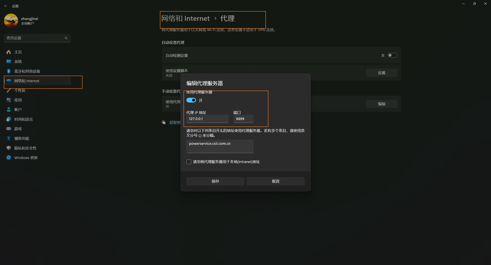
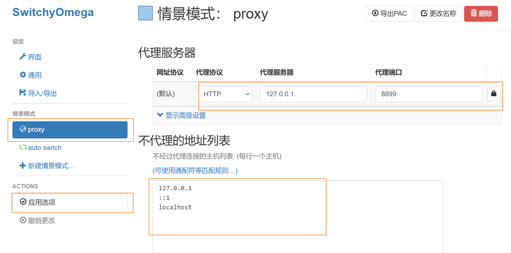
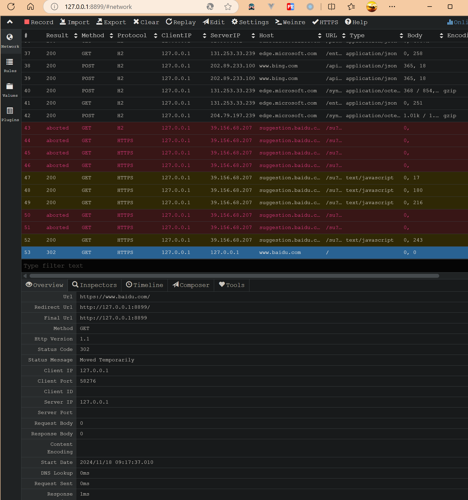
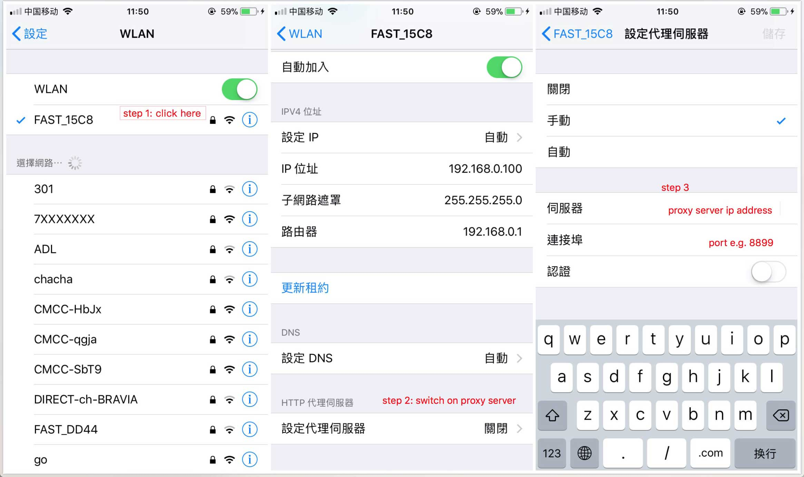
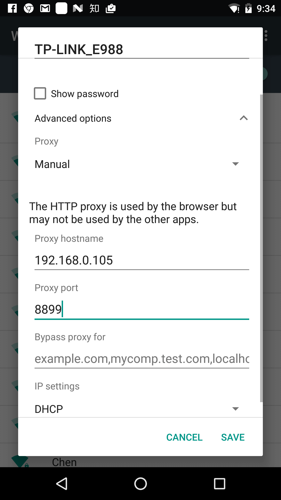
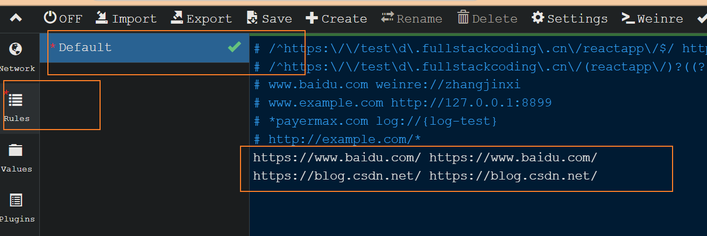
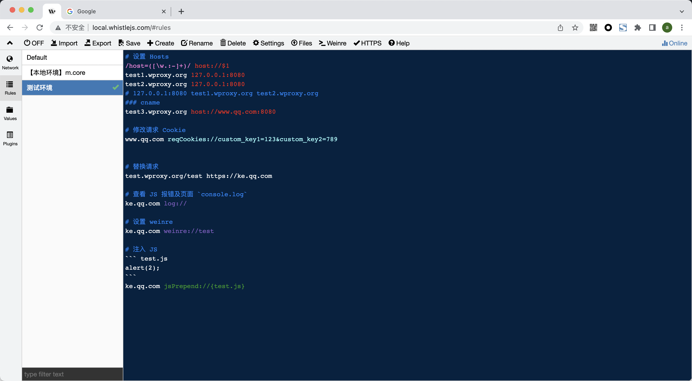
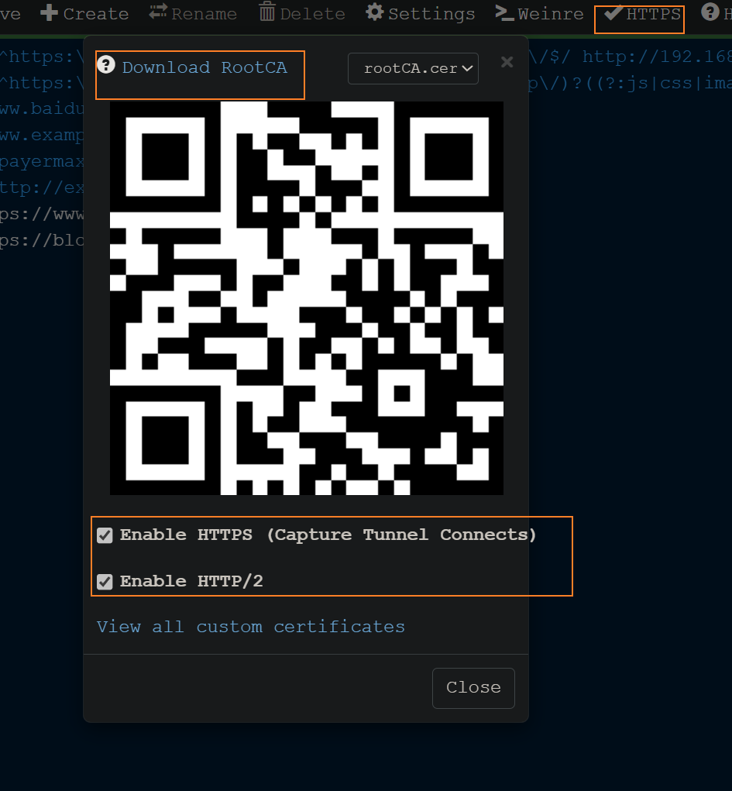
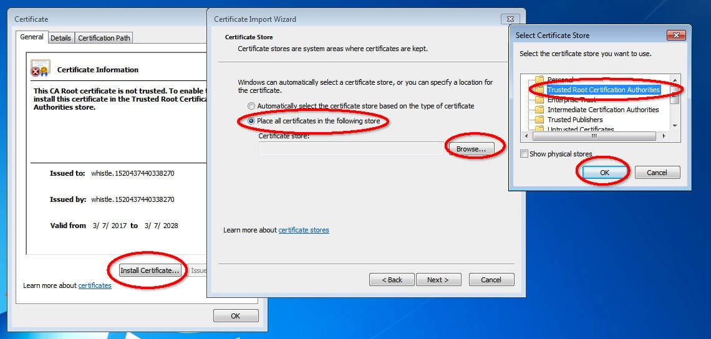

## Whistle 安装和启动

whistle 是一款基于 Node.js 实现的，类似 Fiddler、Charles 的代理工具，可用于 HTTP、Websocket 等请求的抓取、编辑、重放等功能。

与 Fiddler 等其他代理工具不同，Whistle 采用了类似于配置系统 hosts 的方式，使得一切操作都可以通过配置来实现。这使得使用 Whistle 变得更加简单和直观。

- 抓包、mock、修改返回数据、修改响应头字段、延迟模拟弱网等
- 代理转发 - 需要配置代理转发规则
  - 把某环境仅前端资源的请求代理转发到本地
  - 把某个接口地址的请求代理转发到指定的后端环境地址
- 脚本注入
  可通过拦截某页面请求，注入写好的脚本工具代码，来完成一些提效的自动化工作

```js
// 通过npm安装Whistle：
npm install -g whistle

//通过以下命令启动Whistle代理：
w2 start
//重新启动启动Whistle代理：
w2 restart
// 查看运行状态
w2 status
// 停止运行
w2 stop
```

默认情况下，Whistle 服务器会监听本地的 8899 端口。

## 拦截网络请求

需要配置代理，使请求通过代理服务器转发请求。两种方式：

- 全局代理
  这种配置，会在全局生效，设备所有的请求都会经过代理服务器。会影响其他应用的使用，不太建议。配置方式是：
  - 在设置里搜索代理，找到代理服务器配置。
  - 开启代理服务器
  - 输入 whistle 代理服务的 IP 地址和端口号，然后保存即可
    
- 浏览器代理
  只在当前浏览器里生效，不影响其他应用的正常执行。推荐使用这种方式。推荐和代理插件 SwitchyOmega 配合使用，这个插件方便随时切换代理服务器，有多种拦截请求选项。不想使用代理服务器时有方便随时停用。配置方式：

  - 在扩展里搜索 SwitchyOmega
  - 安装 SwitchyOmega
  - 开始配置 SwitchyOmega
     - 打开某个情景模式，或者新建一个情景模式 - 代理协议选择 HTTP，输入 whistle 代理服务器的 IP 地址和代理端口 - 可以配置不走代理的地址列表 - 最后点击应用选项，并选择该选项就可以了
    

- 移动端配置
  首选需要和 whistle 服务器所在的设备在同一个网络里，打开移动端 WiFi 设置，详细配置里找到代理服务器配置，输入 whistle 的 IP 地址和端口号：
  
  
  > 如果配置完代理，手机无法访问，可能是 whistle 所在的电脑防火墙限制了远程访问 whistle 的端口，关闭防火墙或者设置白名单：http://jingyan.baidu.com/article/870c6fc317cae7b03ee4be48.html

在 whistle 服务提供的管理后台里(打开：`http://127.0.0.1:8899/`)，查看 Network 面板，能看到被拦截到的 HTTP 请求。不同状态的 HTTP 请求会显示不同的颜色，方便区分。点击选中某个请求，会显示该请求的具体内容。

在 Rules 面板里，可以配置拦截转发规则，可以启用某条规则，可以使用正则模式。
如下图：配置`https://www.baidu.com/`域名的请求，会被 whistle 转发到`https://www.baidu.com/`





## 拦截 HTTPS、Websocket 请求

要拦截 HTTPS 请求，需要安装证书。操作如下：


- 在 whistle 后台，打开 Network 面板
- 点击 HTTPS，弹出以上弹窗
- 下面两个选项打勾
- 点击下载 Download RootCA，会生成 CA 证书
- 安装该证书
  

移动端需要扫描二维码安装

## 规则

```bash
# 普通的 Hosts 配置从右到左：等于whistle配置方式从左到右： 127.0.0.1 test1.wproxy.org test2.wproxy.org
 test1.wproxy.org 127.0.0.1
 test2.wproxy.org 127.0.0.1
#也支持带端口，匹配路径、协议、正则、通配符等：
 test1.wproxy.org/path/to 127.0.0.1:6001
https://test2.wproxy.org/path1/to1 127.0.0.1:6001
# 根据请求参数设置 host
/google/ 127.0.0.1:6001
 /host=([\w.:-]+)/ host://$1
# 支持 cname：
test1.wproxy.org/path/to host://www.qq.com:8080

# 修改请求 Cookie
www.qq.com reqCookies://custom_key1=123&custom_key2=789


# 设置请求头
http://example.com/* reqHeaders://`host=${url.host}`
m.aliexpress.com reqHeaders://{req-headers}

#请求替换
test.wproxy.org/test file:///Users/xx/statics
test.wproxy.org/test https://ke.qq.com

# 设置列表样式
baidu.com style://color=@fff&fontStyle=italic&bgColor=red


# 查看 JS 报错及页面 console.log
ke.qq.com log://

# 模拟响应 500（请求不会到后台服务）
test3.wproxy.org/path/to statusCode://500
# 修改响应状态码（请求会到后台服务）
test4.wproxy.org/path/to replaceStatus://400
# 302 重定向
test5.wproxy.org/path redirect://https://ke.qq.com/
# 301 重定向
test6.wproxy.org/path redirect://https://ke.qq.com/ replaceStatus://301

# 设置weinre 用于调试远程页面特别是移动端的网页
ke.qq.com weinre://test

# 注入js
ke.qq.com jsPrepend://{test.js}
# 返回HTML
www.test.com/index.html file://{test.html}

#使用变量
www.test.com/api http://`${clientIp}:8080`
# 使用文件变量
http://`{test.json}`

# whistle提供基本上覆盖抓包调试工具可以做的所有事情的对应协议:https://wproxy.org/whistle/rules/

# @ 功能
@ (用于功能扩展及引入远程规则)
#设置UI样式
style (设置抓包列表样式)
#设置hosts
host (设置host)
#设代理
proxy(http-proxy) (代理到其它http代理服务器)
https-proxy (代理到其它https代理服务器)
socks (代理到其它socks代理服务器)
pac (设置pac脚本)
#延迟请求
reqDelay (延迟请求)
reqSpeed (限制请求速度)
#修改请求URL
urlParams (修改请求url的参数)
reqMerge (修改请求参数)
pathReplace (通过正则或字符串替换请求url，类似str.replace)
#修改请求方法
method (修改请求方法)
#修改请求头
referer (修改请求referer)
auth (修改请求用户名密码)
ua (修改请求user-agent)
forwardedFor (修改请求头x-forwarded-for)
reqHeaders (修改请求头)
reqType (修改请求类型)
reqCharset (修改请求的编码)
reqCookies (修改请求cookies)
reqCors (修改请求cors)
headerReplace (通过str.replace的方式修改请求响应头)
#延迟响应
resDelay (延迟响应)
resSpeed (限制响应速度)
#修改请求内容,根据不同的数据类型采用不同的协议

reqPrepend (往请求内容前面添加数据)
reqBody (替换请求内容)
reqAppend (往请求内容后面追加数据)
reqReplace (通过正则或字符串替换请求文本内容，类似str.replace)
reqMerge (修改请求参数或请求内容)
#修改响应状态码
replaceStatus (替换后台的响应状态码)
statusCode (直接响应)
#修改响应头
resHeaders (修改响应头)
resType (修改响应类型)
resCharset (修改响应的编码)
resCookies (修改响应cookies)
resCors (修改响应cors)
attachment (设置下载头部)
#修改响应内容,根据不同的数据类型采用不同的协议

rule (设置响应规则)
#请求替换
file (替换本地文件)
xfile (替换本地文件，如果本地文件找不到会继续请求线上)
tpl (替换本地目标文件，可用于模拟jsonp请求)
xtpl (替换本地目标文件，如果本地文件找不到会继续请求线上，可用于模拟jsonp请求)
rawfile (替换本地http响应内容格式的文件)
xrawfile (替换本地http响应内容格式的文件，如果本地文件找不到会继续请求线上)
redirect (302 重定向))
locationHref (浏览器重定向))
statusCode (直接响应)
#自定义
resMerge (修改响应参数)
resPrepend (往响应内容前面添加数据)
resBody (替换响应内容)
resAppend (往响应内容后面追加数据)
resReplace (通过正则或字符串替换响应文本内容，类似str.replace)
htmlPrepend(往响应为html的内容前面添加数据)
cssPrepend (往响应为html或css的内容前面添加数据)
jsPrepend (往响应为html或js的内容前面添加数据)
htmlBody(替换响应为html的内容)
cssBody (替换响应为html或css的内容)
jsBody (替换响应为html或js的内容)
htmlAppend(往响应为html的内容后面追加数据)
cssAppend (往响应为html或css的内容后面追加数据)
jsAppend (往响应为html或js的内容后面追加数据)
#修改 trailers
trailers (302重定向)
#过滤配置
filter (excludeFilter|includeFilter) (过滤规则，隐藏请求等)
ignore (skip) (忽略规则)
#启用或禁用一些配置
enable (设置capture HTTPs，隐藏请求等)
disable (禁用缓存、cookie等)
delete (删除指定的字段)
#获取抓包数据
reqWrite (将请求内容写入指定的文件)
resWrite (将响应内容写入指定的文件)
reqWriteRaw (将请求的完整内容写入指定的文件)
resWriteRaw (将响应的完整内容写入指定的文件) 推荐通过插件获取，具体参考：插件开发
#动态设置规则
reqScript (reqRules) (批量设置请求规则或通过脚本动态获取规则)
resScript (resRules) (批量设置响应规则或通过脚本动态获取规则)
#开发调试工具
plugin (配置匹配的插件)
weinre (设置weinre，调试手机页面)
log (打印网页js错误或者调试信息)
pipe 把数据流转到插件
#修改加密算法
cipher (设置兜底加密算法)

```

参考：https://wproxy.org/whistle/
