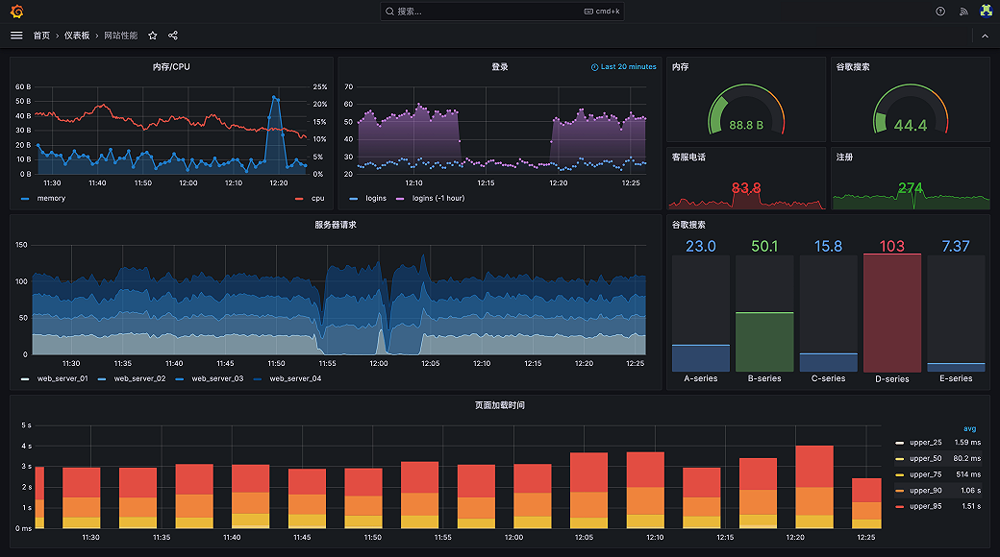

# Grafana 数据监控
Grafana是一个开源的数据可视化和监控平台，可以帮助用户通过创建仪表盘和图表来实时监控和分析数据。Grafana支持多种数据源，包括Prometheus、InfluxDB、Elasticsearch等。它提供了丰富的可视化选项和插件，用户可以根据自己的需求自定义仪表盘和图表。Grafana还具有强大的告警功能，可以及时通知用户关键指标的变化。无论是个人用户还是企业用户，都可以通过Grafana轻松地构建自己的监控系统。



为何选择 Grafana?

- 统一数据，而非数据库:Grafana 不要求将数据导入后端数据仓库或供应商数据库。相反，Grafana 采用独特的方法提供单一数据面板，无论现有数据位于何处，都可以将其统一。可以从 Kubernetes 集群、Raspberry Pi、不同的云服务、甚至是 Google Sheets 获取任何现有数据，并在单个数据面板中按照自己的需求可视化。
- 可供所有人查看的数据:Grafana 的构建原则是让组织中的每个人都可以访问数据，而不仅仅是单个运营人员。有助于打破数据孤岛并赋予团队更强的能力。
- 可供任何人使用的数据面板:可以将从众多来源收集到的数据变成有意义的图表，还可以与其他团队成员共享创建的数据面板，共同探索数据。任何人都可以创建和共享动态数据面板，增进协作和透明度。
- 灵活性和多功能性：与其他工具不同，在 Grafana 将任何数据翻译，转换并创建灵活且多功能的专属数据面板。借助高级查询和转换功能，以自定义面板，创建真正有帮助的可视化内容。

参考：https://grafana.com/zh-cn/grafana/?tab=revenue

## Lucene 查询语法

Lucene 提供了丰富的 API 来组合定制你所需要的查询器，同时也可以利用 Query Parser 提供的强大的查询语法解析来构造你想要的查询器

- Terms：一个查询将分解为若干 Term 以及操作符，有两种 Term，其一是单一 Term，其二为短语。单一 Term 是经过分析器分词后的最小单元，他就是一个简单 的词，例如“Test”和“Hello”。短语则是一组被双引号括起来的一组词，例如：“Hello dolly”，多个 Term 可以通过布尔操作合并在一个更加复杂的查询器中。

- Fields：Lucene 支持在查询中指定字段，以实现对文档中特定字段的查询，例如：title:hello。也可以使用默认的字段，默认字段在查询语法中可以不需要显式指定

```bash
# 标题title包含“The Right Way”同时默认文本字段text中包含“go”
title:"The Right Way" AND go
# 相等
title:"The Right Way" AND text:go

# 通配符
# 匹配单一字符使用符号“?”，匹配多个字符使用符号“*”。
text:te?t
text:test*
text:te*t

# 模糊查询
# 与“roam”拼写相近的词,类似“foam”和“roams”
text:roam~
# 搜索“apache”和“jakarta”距离10个字符以内
text:"jakarta apache"~10

# 范围搜索：范围查询允许你指定某个字段最大值和最小，字典顺序来排序
# mode_date字段在大于等于20020101，小于等于20030101范围的所有文档
mod_date:[20020101 TO 20030101]
# 标题在Aida和Carmen之间但不包含Aida和Carmen的文档
title:{Aida TO Carmen}

# 优先级:将“^”放于查询词的尾部，同时跟上权重值，权重因子越大，该词越重要。默认权重为1
# “jakarta”在查询时中更加重要
text:jakarta^4 apache
# 含有Jakarta的文档具有更高的相关性
text:"jakarta apache"^4 "jakarta lucene"

# Terms操作符
# 同时含有“jakarta apache”和“jakarta lucene”
text:"jakarta apache" AND jakarta
# OR 默认操作符，含有“jakarta apache”或者“jakarta”
text:"jakarta apache" OR jakarta
text:"jakarta apache" jakarta
# 含有“jakarta apache”同时不能含有“Jakarta lucene”时
text:"jakarta apache" NOT jakarta
# 必须包含“jakarta”
text:+jakarta apache
# 搜索“Jakarta apache”但不包含“Jakarta lucene”时
text:"jakarta apache" -"jakarta lucene"

# 分组：使用圆括号来将查询表达式分组
# 必须含有“website”，另外必须含有“jakarta”和“apache”之一
text:(jakarta OR apache) AND website
# 含有“return”和“pink ranther”时
title:(+return +"pink panther")

# 转义：支持转义查询中的特殊字符，以下是Lucene的特殊字符清单：
# + - && || ! ( ) { } [ ] ^ " ~ * ? : \
# 搜索(1+1):2
num:1\+1\:2

```
