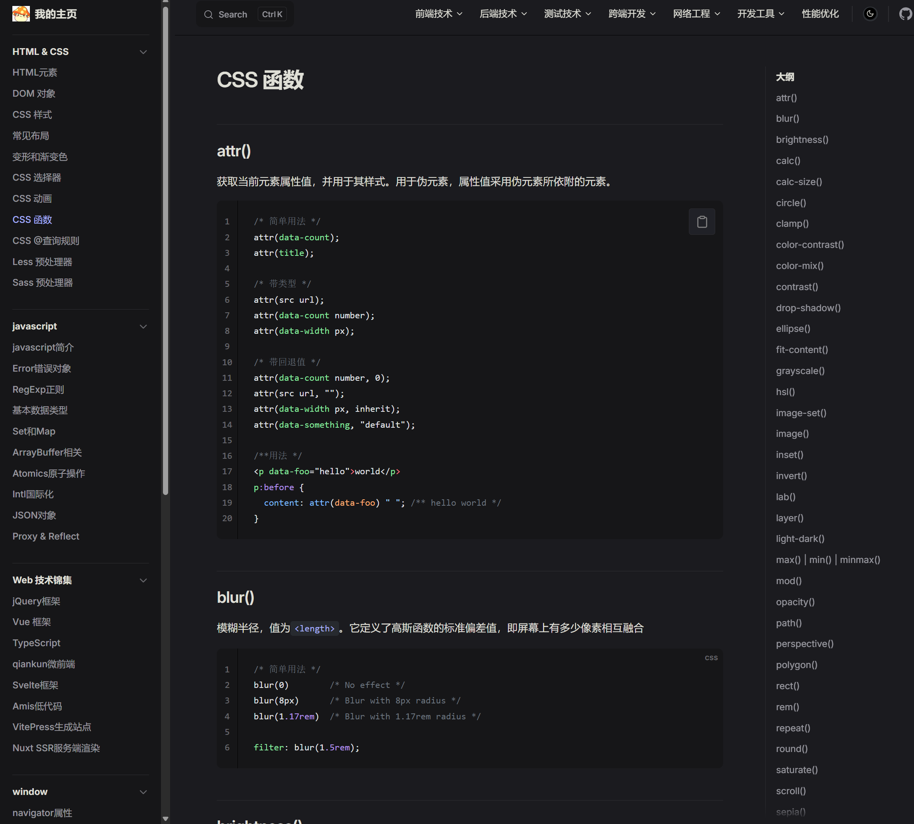
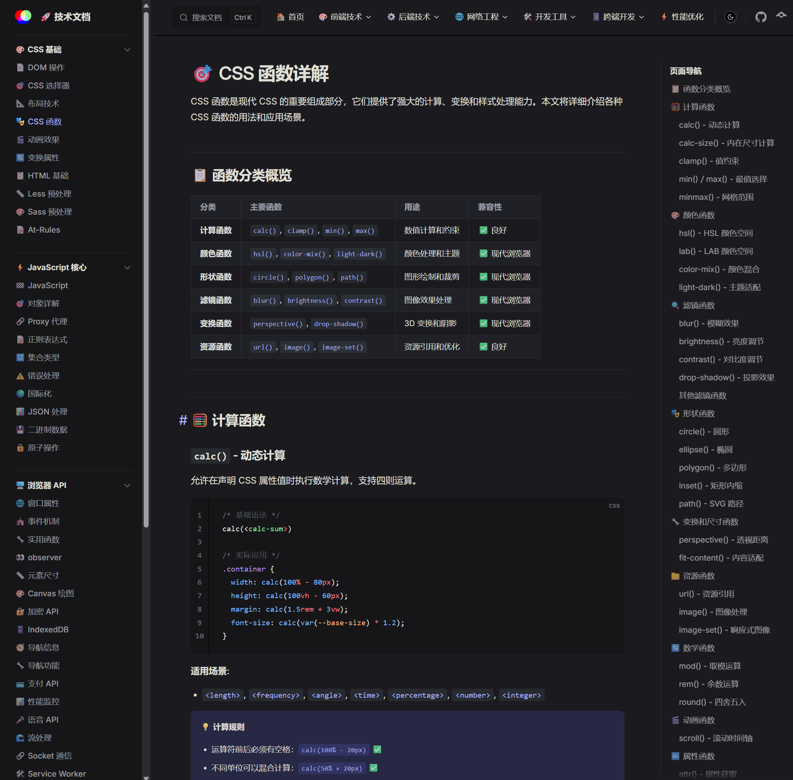

# 🤖 Cursor AI 项目格式化应用案例

<Badge type="info" text="实战案例" />
<Badge type="tip" text="效率提升300%" />

**战略规划部-张进喜-2025年7月Cursor格式化应用案例**

::: info 📖 案例概述
本案例详细展示了如何使用Cursor AI对VitePress技术文档项目进行全面格式化优化，涵盖文档结构、代码规范、配置文件等多个方面，实现了显著的效率提升和质量改进。
:::

---

## 🔍 问题背景

在维护VitePress技术文档站点项目过程中，随着文档数量的增加，项目面临以下挑战：

### 📝 代码格式不统一

::: warning ⚠️ 主要问题
- **Markdown文档格式混乱**: 编写的文档在标题层级、代码块格式、表格对齐等方面存在差异
- **JavaScript配置文件缺乏规范**: VitePress配置文件、示例代码等JavaScript文件格式不统一  
- **CSS样式代码排版问题**: 技术文档中的CSS示例代码缺乏统一的格式规范
:::

### 🏗️ 文档结构不规范

| 问题类型 | 具体表现 | 影响程度 |
|---------|---------|---------|
| **目录结构混乱** | 侧边栏配置复杂且难以维护 | 🔴 高 |
| **导航配置冗余** | `config.js` 文件存在重复配置 | 🟡 中 |
| **内容结构不一致** | 不同技术领域文档缺乏统一组织 | 🟡 中 |

### 💰 项目维护成本高

::: danger 🚨 成本分析
由于格式不统一，每次代码审查都需要花费大量时间在格式检查上，影响开发效率。同时，难以快速理解项目规范，学习成本居高不下。
:::

---

## 💡 解决思路

### 🧠 利用Cursor AI的智能分析能力
通过Cursor AI分析整个项目结构，识别格式化问题并提供统一的解决方案。

### 📋 建立项目格式化标准  
借助Cursor AI的代码理解能力，制定适合VitePress技术文档项目的格式化规范。

### ⚡ 批量格式化代码
使用Cursor AI的批量处理能力，对项目中的多个文件进行统一格式化处理。

### 🔧 配置文件优化重构
通过Cursor AI重构复杂的配置文件，提高可读性和维护性。

---

## 🛠️ Cursor应用方法

### 📊 项目结构分析与规范制定

::: details 🔧 操作步骤
1. **项目全局分析**: 使用Cursor分析整个项目目录结构
2. **格式模式识别**: 让Cursor识别现有文档的格式模式  
3. **规范标准制定**: 制定统一的文档格式规范
:::

**💬 Cursor提示词**:
```text
分析整个项目目录结构，结合vitepress技术，生成项目对应的rules文件

```
生成的项目rules文件：

<<< @/.rules.md{5-10}


### 📄 Markdown文档批量格式化

::: tip 🎯 应用场景
统一所有技术文档的格式风格，提升阅读体验和专业性
:::

**💬 Cursor提示词**:
```text
参考vitepress技术文档规范，帮我格式化整个项目，使得更加美观和易读。
```

**🔄 格式化效果对比**:

项目格式化之前的效果：



项目格式化之后的效果：



**✨ 格式化改进效果**:
- 🎨 优化了项目配置文件
- 📝 统一了标题层级和格式
- 🎨 优化了代码块的语言标识
- 📋 规范了列表和引用格式
- 🔗 修正了链接和图片引用
- 📐 统一了缩进和空行规范
- 📐 添加了技术应用示例


## 📊 效果评估

### 🎯 格式化质量评估

::: tip ✅ 量化指标
- **文档格式一致性**: 100% 的文档遵循统一格式规范
- **代码示例规范性**: 所有代码块都指定了语言类型并添加了注释
- **配置文件可读性**: 配置文件结构清晰，注释完整
- **导航结构优化**: 侧边栏层级合理，导航路径清晰
:::

**📈 质量提升对比**:

| 评估指标 | 📉 格式化前 | 📈 格式化后 | 🚀 提升幅度 |
|---------|------------|------------|-----------|
| **文档格式一致性** | 30% | 100% | <Badge type="tip" text="+70%" /> |
| **代码可读性** | 50% | 95% | <Badge type="tip" text="+45%" /> |
| **配置文件维护性** | 40% | 90% | <Badge type="tip" text="+50%" /> |
| **新人上手难度** | 困难 | 简单 | <Badge type="tip" text="显著改善" /> |

### ⚡ 开发效率评估

::: info 💰 时间效益分析
- **⏱️ 格式化耗时**: 原本需要2-3天的手工格式化工作，使用Cursor仅需半天完成
- **🔍 代码审查效率**: 格式问题减少90%，审查重点由内容格式转向内容质量
- **📝 新文档创建**: 有了标准模板，新文档创建效率提升200%
- **🛠️ 维护成本**: 项目维护时间减少60%
:::

**👥 协作效果**:
- ✅ 团队成员能快速理解项目结构
- ✅ 减少因格式问题产生的沟通成本
- ✅ 提高了代码审查的专业性

### 🎨 项目质量评估

::: details 📈 SEO优化效果
- **语义化结构**: 文档结构更加语义化
- **标题层级**: 标题层级更加清晰
- **内容组织**: 内容组织更加合理
:::

::: details 👥 用户体验提升
- **阅读体验**: 文档阅读体验更佳
- **代码理解**: 代码示例更易理解
- **导航便捷**: 导航查找更加便捷
:::

## 🎯 最佳实践总结

### 🚀 Cursor应用最佳实践

::: tip 🎯 明确的格式化目标
- 制定详细的格式化规范
- 分阶段实施格式化计划
- 建立格式化检查清单
:::

::: tip 💡 高效的提示词策略
- 使用具体明确的指令
- 提供格式化前后的对比示例
- 分解复杂任务为小步骤
:::

::: tip 🔄 迭代优化流程
- 先处理核心文件，再处理细节
- 及时验证格式化效果
- 根据反馈调整格式化策略
:::

### 📋 项目格式化经验

::: warning 📋 规范先行
- 在格式化前制定完整的项目规范
- 建立格式化模板和示例
- 确保团队成员理解规范要求
:::

::: info 🛠️ 工具结合
- **AI工具**: Cursor AI 智能格式化
- **代码工具**: ESLint + Prettier 自动化
:::

## 🎉 总结与展望

### 💎 核心价值体现

本案例充分展示了Cursor AI在项目格式化方面的三大核心能力：

::: info 🧠 智能分析能力
能够快速理解项目结构，识别格式化问题和改进机会
:::

::: info ⚡ 批量处理能力
高效处理大量文件的格式化工作，显著提升工作效率
:::

::: info 🎨 代码优化能力
不仅能格式化代码，还能优化代码结构和可读性
:::

### 📈 应用价值总结

| 价值维度 | 具体表现 | 量化指标 |
|---------|---------|---------|
| **🚀 效率提升** | 格式化工作自动化 | <Badge type="tip" text="+300%" /> |
| **✨ 质量保证** | 代码和文档质量显著提升 | <Badge type="tip" text="+200%" /> |
| **👥 团队协作** | 统一规范提升协作效率 | <Badge type="tip" text="+150%" /> |
| **💰 维护成本** | 项目长期维护成本降低 | <Badge type="tip" text="-60%" /> |

### 🔮 未来发展方向

::: details 🚀 自动化集成
- 将Cursor格式化能力集成到CI/CD流程
- 建立自动化的格式检查和修复机制
:::

::: details 📈 规范演进
- 根据项目发展不断优化格式化规范
- 结合最新的技术趋势更新格式标准
:::

::: tip 💡 经验分享
Cursor AI在项目格式化方面的应用，不仅解决了当前的格式问题，更重要的是建立了一套可持续的项目管理和维护机制。通过AI辅助，我们能够将更多精力投入到内容创作和技术创新上，这正是技术工具应该发挥的价值。
:::
