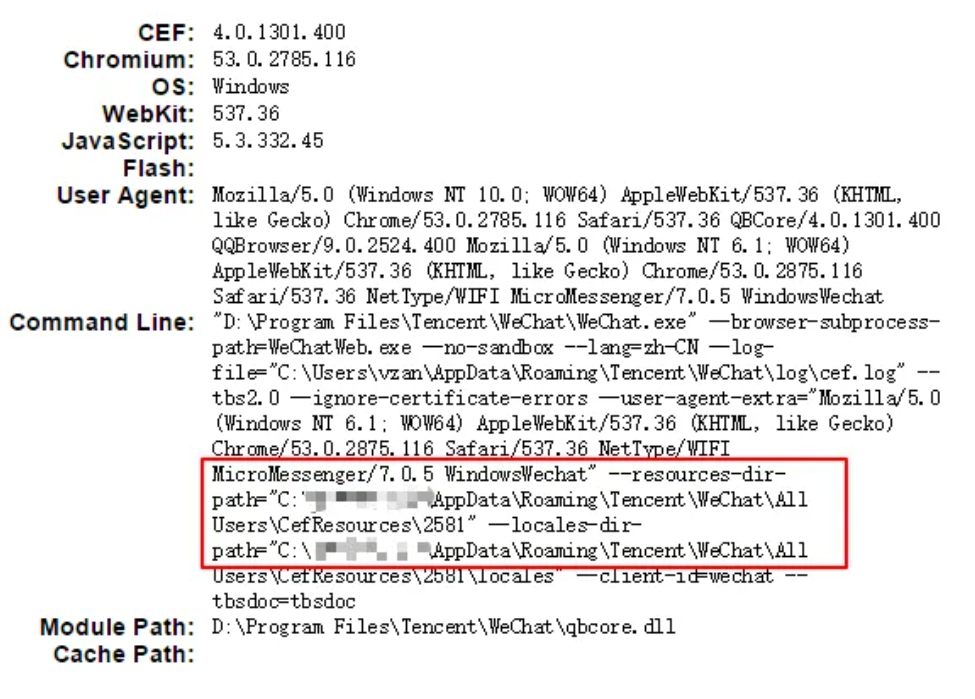
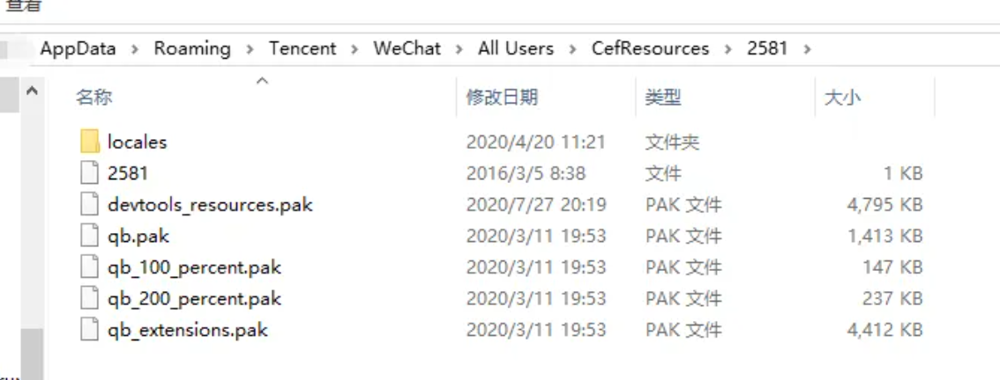
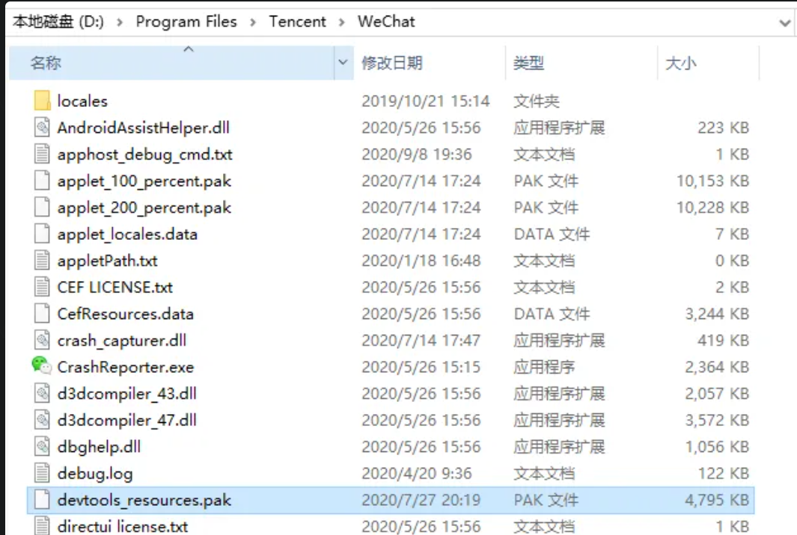
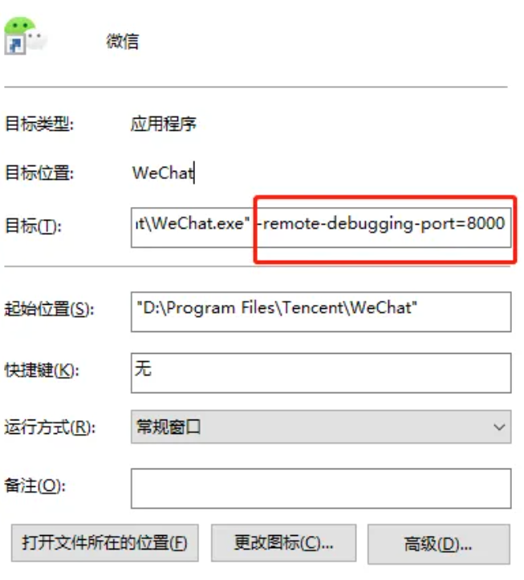
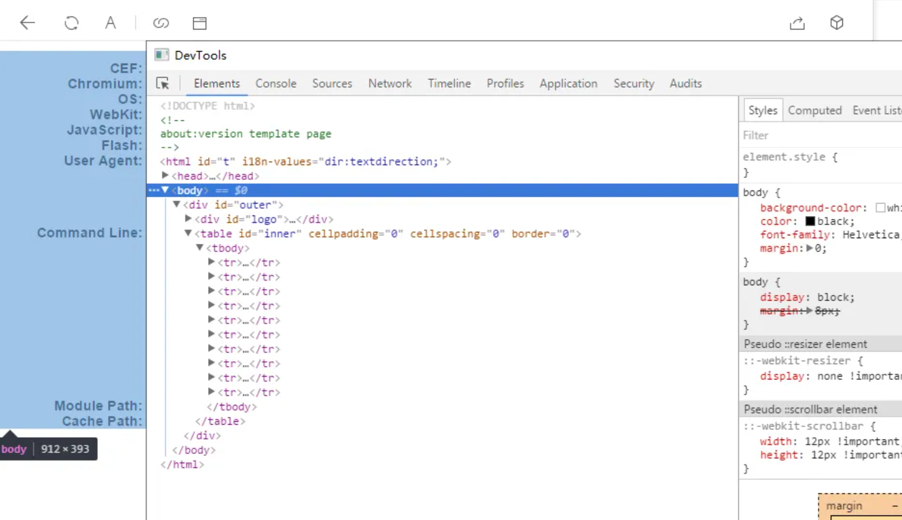
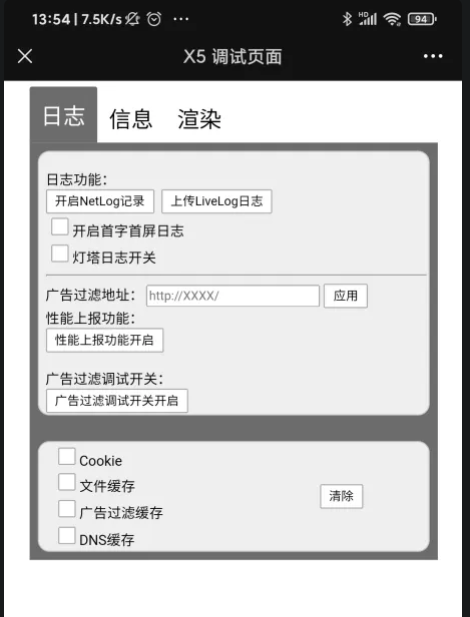
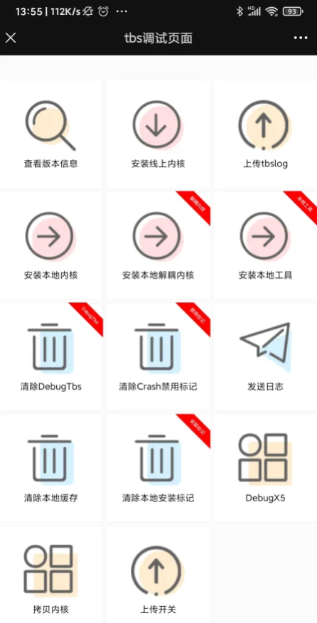
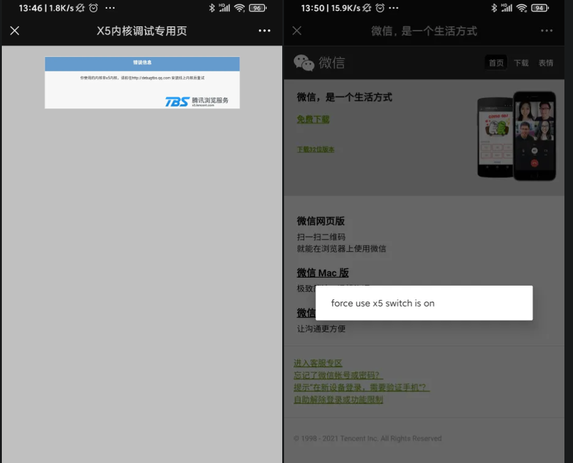
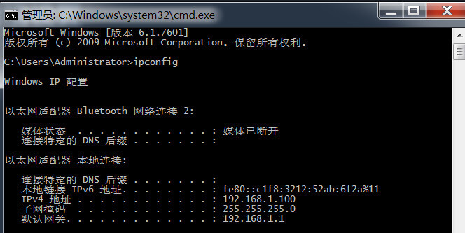

## 微信内置浏览器调试

- 运行 window.open("chrome://version");



- 下载 devtools_resources.pak 放入 --resources-dir-path 后面路径与微信安装目录中，如下图所示




- 微信快捷方式右键选中属性，增加 -remote-debugging-port=8000



- 重启微信，鼠标右击，选择 Show DevTools，即可打开调试工具。如下：



## 微信内置浏览器缓存清理

### Android（x5 内核）

- x5 调试页面：debugx5.qq.com



- tbs 调试页面：debugtas.qq.com



- 如果提示您使用的内核非 x5 内核，解决如下：

https://debugmm.qq.com/?forcex5=true


然后在回去打开以上页面即可

### IOS（WKWebView）

清除全部缓存信息。步骤：设置-通用-存储空间-缓存-清理

## 移动端调试

1. 使用 vConsole 和 eruda 工具，在移动端显示 dev-tool 调试工具

```html
<script src="https://cdnjs.cloudflare.com/ajax/libs/vConsole/3.3.4/vconsole.min.js"></script>
<script>
  // 使用 vConsole
  var vConsole = new VConsole();
  console.log(
    "引入模块后，vConsole会有一小段时间用于初始化工作，在渲染出面板HTML之前将无法立即打印log"
  );

  vConsole.ready(function () {
    console.log("引入模块后立即打印log");
  });
</script>

<script src="https://cdnjs.cloudflare.com/ajax/libs/eruda/2.3.3/eruda.min.js"></script>
<script>
  // 使用 eruda
  eruda.init();
</script>
```

2. browser-sync 真机调试

```bash
# 安装依赖包
npm install -g browser-sync

# BrowserSync监听文件变动：files 路径是相对于运行该命令的项目
# 如果需要监听多个类型的文件，需要用逗号隔开，检测到文件变动后，会自动刷新浏览器
browser-sync start --server --files "css/*.css, *.html"
```

移动端设置：移动端设备和桌面端设备处于同一局域网(一般地，都连入一个路由器即可)。移动端无法访问 localhost，需要查找电脑的内网 ip。通过在命令行中输入 ipconfig，查看 ip 地址为 192.168.1.100。所以手机端访问的地址为http://192.168.1.100:3000

