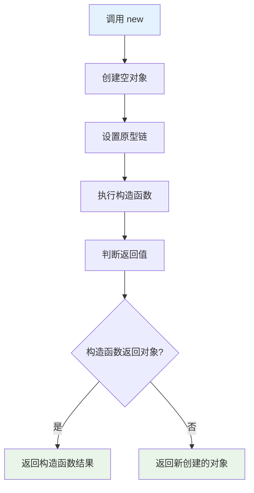
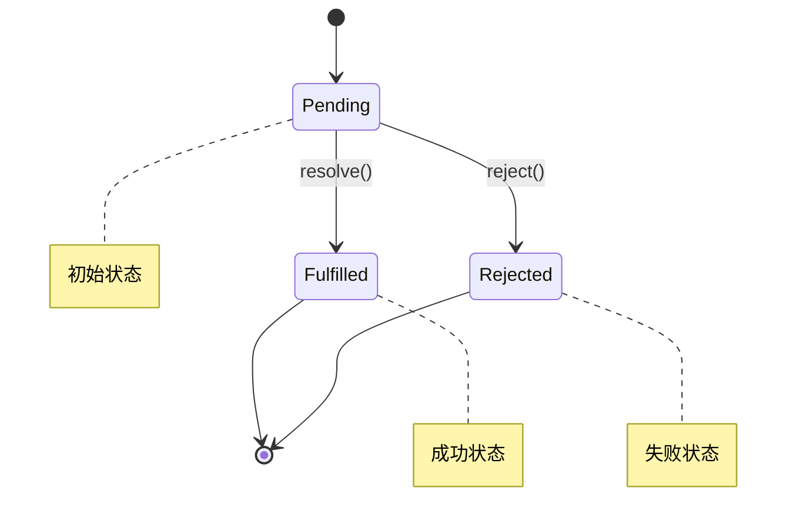

# ✍️ 前端手写题完全指南

> 💡 **手写题** 是前端面试的重要环节，考查对JavaScript核心概念的深度理解。本文汇总了常见手写题目，每道题都提供详细解答和多种实现方式。

## 📖 目录导航

- [🔧 函数实现类](#🔧-函数实现类)
- [📚 数组方法实现](#📚-数组方法实现)
- [🚀 异步编程实现](#🚀-异步编程实现)
- [🎨 设计模式实现](#🎨-设计模式实现)
- [🌐 工具函数实现](#🌐-工具函数实现)
- [🧮 算法相关实现](#🧮-算法相关实现)
- [💡 实用技巧](#💡-实用技巧)
- [🎯 面试要点](#🎯-面试要点)

---

::: tip 📚 学习建议
建议先理解每道题的核心原理，然后尝试自己实现，最后参考提供的解答。重点关注边界情况的处理和性能优化。
:::

## 🔧 函数实现类

### 1. 手写 new 操作符

`new` 操作符用于创建对象实例，理解其内部机制对掌握JavaScript面向对象编程至关重要。

#### 💡 实现原理



1. 创建一个空对象，设置其原型为构造函数的 prototype
2. 将构造函数的 this 指向新创建的对象
3. 执行构造函数，为新对象添加属性
4. 如果构造函数返回对象，则返回该对象；否则返回新创建的对象

#### 🛠️ 代码实现

```javascript
/**
 * 手写 new 操作符
 * @param {Function} constructor - 构造函数
 * @param {...any} args - 构造函数参数
 * @returns {Object} 新创建的对象实例
 */
function myNew(constructor, ...args) {
  // 1. 参数校验
  if (typeof constructor !== "function") {
    throw new TypeError("构造函数必须是一个函数");
  }

  // 2. 创建一个空对象，设置原型链
  const obj = Object.create(constructor.prototype);
  
  // 3. 执行构造函数，并将this指向新创建的对象
  const result = constructor.apply(obj, args);
  
  // 4. 如果构造函数返回对象，则返回该对象；否则返回新创建的对象
  return result instanceof Object ? result : obj;
}

// 🧪 使用示例
function Person(name, age) {
  this.name = name;
  this.age = age;
}

Person.prototype.sayHello = function() {
  console.log(`Hello, I'm ${this.name}`);
};

const person = myNew(Person, "张三", 25);
person.sayHello(); // Hello, I'm 张三
console.log(person instanceof Person); // true
```

### 2. 手写 call 方法

`call` 方法允许为不同的对象分配和调用属于一个对象的函数/方法。

#### 💡 实现原理

| 步骤 | 操作 | 目的 |
|------|------|------|
| **1** | 处理 context 参数 | 确保有有效的执行上下文 |
| **2** | 将函数设为对象的方法 | 改变函数内部 this 指向 |
| **3** | 执行函数 | 获取函数执行结果 |
| **4** | 删除临时属性 | 清理副作用 |

```javascript
/**
 * 手写 call 方法
 * @param {Object} context - 执行上下文
 * @param {...any} args - 函数参数
 * @returns {any} 函数执行结果
 */
Function.prototype.myCall = function(context, ...args) {
  // 1. 类型校验
  if (typeof this !== "function") {
    throw new TypeError("myCall 必须由函数调用");
  }

  // 2. 处理 context：null 或 undefined 时指向全局对象
  context = context || globalThis;
  
  // 3. 创建唯一的属性名，避免覆盖原有属性
  const fnSymbol = Symbol('fn');
  context[fnSymbol] = this;
  
  // 4. 通过对象调用函数，改变 this 指向
  const result = context[fnSymbol](...args);
  
  // 5. 清理临时属性
  delete context[fnSymbol];
  
  return result;
};

// 🧪 使用示例
const person = {
  name: '张三',
  greet: function(prefix, suffix) {
    return `${prefix} ${this.name} ${suffix}`;
  }
};

const anotherPerson = { name: '李四' };
const result = person.greet.myCall(anotherPerson, 'Hello', '!');
console.log(result); // Hello 李四 !
```

### 3. 手写 apply 方法

`apply` 方法与 `call` 类似，区别在于参数传递方式。

```javascript
/**
 * 手写 apply 方法
 * @param {Object} context - 执行上下文
 * @param {Array} argsArray - 参数数组
 * @returns {any} 函数执行结果
 */
Function.prototype.myApply = function(context, argsArray) {
  // 1. 类型校验
  if (typeof this !== "function") {
    throw new TypeError("myApply 必须由函数调用");
  }

  // 2. 处理 context
  context = context || globalThis;
  
  // 3. 处理参数数组
  const args = Array.isArray(argsArray) ? argsArray : [];
  
  // 4. 创建唯一的属性名
  const fnSymbol = Symbol('fn');
  context[fnSymbol] = this;
  
  // 5. 执行函数
  const result = context[fnSymbol](...args);
  
  // 6. 清理临时属性
  delete context[fnSymbol];
  
  return result;
};

// 🧪 使用示例
function sum(a, b, c) {
  return a + b + c;
}

const result = sum.myApply(null, [1, 2, 3]);
console.log(result); // 6
```

### 4. 手写 bind 方法

`bind` 方法创建一个新函数，当调用时设置 `this` 关键字为提供的值。

::: warning ⚠️ 注意事项
`bind` 的返回值可以作为构造函数使用，此时需要特殊处理 `this` 指向。
:::

```javascript
/**
 * 手写 bind 方法
 * @param {Object} context - 绑定的上下文
 * @param {...any} args1 - 预设参数
 * @returns {Function} 绑定后的新函数
 */
Function.prototype.myBind = function(context, ...args1) {
  if (typeof this !== "function") {
    throw new TypeError("myBind 必须由函数调用");
  }
  
  const fn = this;
  context = context || globalThis;
  
  // 返回的绑定函数
  function BoundFunction(...args2) {
    // 判断是否作为构造函数调用
    if (this instanceof BoundFunction) {
      // 作为构造函数调用时，this 指向新创建的实例
      return fn.apply(this, [...args1, ...args2]);
    } else {
      // 作为普通函数调用时，this 指向绑定的 context
      return fn.apply(context, [...args1, ...args2]);
    }
  }
  
  // 维护原型链
  if (fn.prototype) {
    BoundFunction.prototype = Object.create(fn.prototype);
  }
  
  return BoundFunction;
};

// 🧪 使用示例
function Person(name, age) {
  this.name = name;
  this.age = age;
}

const BoundPerson = Person.myBind(null, "张三");
const person = new BoundPerson(25); // 作为构造函数
console.log(person.name, person.age); // 张三 25

function greet(greeting, punctuation) {
  return `${greeting} ${this.name}${punctuation}`;
}

const obj = { name: "李四" };
const boundGreet = greet.myBind(obj, "Hello");
console.log(boundGreet("!")); // Hello 李四!
```

---

## 📚 数组方法实现

### 1. 数组扁平化（flat）

数组扁平化是将多维数组转换为一维数组的过程。

#### 🔧 方法一：递归实现

```javascript
/**
 * 数组扁平化 - 递归实现
 * @param {Array} arr - 多维数组
 * @param {number} depth - 扁平化深度，默认为 1
 * @returns {Array} 扁平化后的数组
 */
function flattenRecursive(arr, depth = 1) {
  const result = [];
  
  for (const item of arr) {
    if (Array.isArray(item) && depth > 0) {
      // 递归处理子数组
      result.push(...flattenRecursive(item, depth - 1));
    } else {
      result.push(item);
    }
  }
  
  return result;
}

// 🧪 测试示例
const nestedArray = [1, [2, 3], [4, [5, 6]], 7];
console.log(flattenRecursive(nestedArray, 1)); // [1, 2, 3, 4, [5, 6], 7]
console.log(flattenRecursive(nestedArray, 2)); // [1, 2, 3, 4, 5, 6, 7]
```

#### ⚡ 方法二：迭代实现

```javascript
/**
 * 数组扁平化 - 迭代实现
 * @param {Array} arr - 多维数组
 * @param {number} depth - 扁平化深度
 * @returns {Array} 扁平化后的数组
 */
function flattenIterative(arr, depth = 1) {
  let result = [...arr];
  let currentDepth = 0;
  
  while (currentDepth < depth) {
    let hasNestedArray = false;
    const temp = [];
    
    for (const item of result) {
      if (Array.isArray(item)) {
        temp.push(...item);
        hasNestedArray = true;
      } else {
        temp.push(item);
      }
    }
    
    result = temp;
    
    // 如果没有嵌套数组，提前结束
    if (!hasNestedArray) break;
    
    currentDepth++;
  }
  
  return result;
}
```

#### 🚀 方法三：完全扁平化

```javascript
/**
 * 完全扁平化数组
 * @param {Array} arr - 多维数组
 * @returns {Array} 完全扁平化的数组
 */
function flattenDeep(arr) {
  return arr.reduce((result, item) => {
    return Array.isArray(item) 
      ? result.concat(flattenDeep(item))
      : result.concat(item);
  }, []);
}

// 🧪 测试
const deepNestedArray = [1, [2, [3, [4, [5]]]]];
console.log(flattenDeep(deepNestedArray)); // [1, 2, 3, 4, 5]
```

### 2. 数组去重

#### 🎯 方法对比

| 方法 | 时间复杂度 | 空间复杂度 | 特点 |
|------|------------|------------|------|
| **Set** | O(n) | O(n) | 简洁高效，推荐 |
| **Map** | O(n) | O(n) | 功能强大 |
| **indexOf** | O(n²) | O(1) | 兼容性好，效率低 |
| **includes** | O(n²) | O(1) | 语义清晰，效率低 |

#### ⭐ 推荐方法：使用 Set

```javascript
/**
 * 数组去重 - Set 方法（推荐）
 * @param {Array} arr - 待去重数组
 * @returns {Array} 去重后的数组
 */
function uniqueWithSet(arr) {
  return [...new Set(arr)];
}

// 🧪 测试
const duplicateArray = [1, 2, 2, 3, 4, 4, 5];
console.log(uniqueWithSet(duplicateArray)); // [1, 2, 3, 4, 5]
```

#### 🔧 对象去重

```javascript
/**
 * 对象数组去重 - 根据指定属性
 * @param {Array} arr - 对象数组
 * @param {string} key - 去重依据的属性名
 * @returns {Array} 去重后的数组
 */
function uniqueByProperty(arr, key) {
  const seen = new Map();
  return arr.filter(item => {
    const value = item[key];
    if (seen.has(value)) {
      return false;
    }
    seen.set(value, true);
    return true;
  });
}

// 🧪 测试
const users = [
  { id: 1, name: '张三' },
  { id: 2, name: '李四' },
  { id: 1, name: '张三' }, // 重复
  { id: 3, name: '王五' }
];
console.log(uniqueByProperty(users, 'id'));
// [{ id: 1, name: '张三' }, { id: 2, name: '李四' }, { id: 3, name: '王五' }]
```

---

## 🔢 工具函数类

### 1. 数字格式化（千分位分隔符）

```javascript
function formatNumber(num) {
  // 处理数字和字符串
  const str = num.toString();
  const parts = str.split('.');
  
  // 为整数部分添加千分位分隔符
  parts[0] = parts[0].replace(/\B(?=(\d{3})+(?!\d))/g, ',');
  
  return parts.join('.');
}

// 使用本地化方法（推荐）
function formatNumberLocale(num) {
  return num.toLocaleString();
}

// 测试
console.log(formatNumber(1234567.89)); // 1,234,567.89
console.log(formatNumber(1234567));    // 1,234,567
```

### 2. 数组乱序（洗牌算法）

#### Fisher-Yates 洗牌算法

```javascript
function shuffle(array) {
  const arr = [...array]; // 避免修改原数组
  
  for (let i = arr.length - 1; i > 0; i--) {
    const j = Math.floor(Math.random() * (i + 1));
    [arr[i], arr[j]] = [arr[j], arr[i]]; // 交换元素
  }
  
  return arr;
}

// 测试
const originalArray = [1, 2, 3, 4, 5];
console.log(shuffle(originalArray)); // 随机排列
console.log(originalArray); // 原数组不变
```

### 3. 深拷贝

```javascript
/**
 * 深拷贝实现
 * @param {any} obj - 要拷贝的对象
 * @param {WeakMap} hash - 用于处理循环引用
 * @returns {any} 深拷贝后的对象
 */
function deepClone(obj, hash = new WeakMap()) {
  // 处理 null 和 undefined
  if (obj === null || obj === undefined) return obj;
  
  // 处理基本数据类型
  if (typeof obj !== 'object') return obj;
  
  // 处理日期
  if (obj instanceof Date) return new Date(obj);
  
  // 处理正则表达式
  if (obj instanceof RegExp) return new RegExp(obj);
  
  // 处理循环引用
  if (hash.has(obj)) return hash.get(obj);
  
  // 创建新对象
  const cloneObj = new obj.constructor();
  hash.set(obj, cloneObj);
  
  // 拷贝属性
  for (const key in obj) {
    if (obj.hasOwnProperty(key)) {
      cloneObj[key] = deepClone(obj[key], hash);
    }
  }
  
  return cloneObj;
}

// 🧪 测试
const original = {
  name: '张三',
  age: 25,
  hobbies: ['读书', '游泳'],
  address: {
    city: '北京',
    district: '朝阳区'
  },
  date: new Date(),
  regex: /test/g
};

// 创建循环引用
original.self = original;

const cloned = deepClone(original);
console.log(cloned);
console.log(cloned === original); // false
console.log(cloned.self === cloned); // true
```

### 4. 函数柯里化

```javascript
/**
 * 函数柯里化实现
 * @param {Function} fn - 要柯里化的函数
 * @returns {Function} 柯里化后的函数
 */
function curry(fn) {
  return function curried(...args) {
    if (args.length >= fn.length) {
      // 参数足够，直接调用
      return fn.apply(this, args);
    } else {
      // 参数不够，返回新函数继续收集参数
      return function(...nextArgs) {
        return curried.apply(this, args.concat(nextArgs));
      };
    }
  };
}

// 🧪 使用示例
function add(a, b, c) {
  return a + b + c;
}

const curriedAdd = curry(add);

console.log(curriedAdd(1)(2)(3)); // 6
console.log(curriedAdd(1, 2)(3)); // 6
console.log(curriedAdd(1)(2, 3)); // 6
console.log(curriedAdd(1, 2, 3)); // 6
```

## 🚀 异步编程实现

### 1. 手写 Promise

Promise 是处理异步操作的重要工具，理解其内部实现有助于更好地使用它。

#### 📋 Promise 状态机制



#### 🛠️ 基础 Promise 实现

```javascript
/**
 * 手写 Promise 基础实现
 */
class MyPromise {
  constructor(executor) {
    // Promise 状态
    this.state = 'pending';
    this.value = undefined;
    this.reason = undefined;
    
    // 回调函数队列
    this.onFulfilledCallbacks = [];
    this.onRejectedCallbacks = [];
    
    // resolve 函数
    const resolve = (value) => {
      if (this.state === 'pending') {
        this.state = 'fulfilled';
        this.value = value;
        // 执行所有成功回调
        this.onFulfilledCallbacks.forEach(fn => fn());
      }
    };
    
    // reject 函数
    const reject = (reason) => {
      if (this.state === 'pending') {
        this.state = 'rejected';
        this.reason = reason;
        // 执行所有失败回调
        this.onRejectedCallbacks.forEach(fn => fn());
      }
    };
    
    // 执行 executor
    try {
      executor(resolve, reject);
    } catch (error) {
      reject(error);
    }
  }
  
  then(onFulfilled, onRejected) {
    // 参数处理
    onFulfilled = typeof onFulfilled === 'function' ? onFulfilled : value => value;
    onRejected = typeof onRejected === 'function' ? onRejected : reason => { throw reason; };
    
    // 返回新的 Promise
    return new MyPromise((resolve, reject) => {
      // 处理 fulfilled 状态
      const handleFulfilled = () => {
        try {
          const result = onFulfilled(this.value);
          resolve(result);
        } catch (error) {
          reject(error);
        }
      };
      
      // 处理 rejected 状态
      const handleRejected = () => {
        try {
          const result = onRejected(this.reason);
          resolve(result);
        } catch (error) {
          reject(error);
        }
      };
      
      if (this.state === 'fulfilled') {
        setTimeout(handleFulfilled, 0);
      } else if (this.state === 'rejected') {
        setTimeout(handleRejected, 0);
      } else if (this.state === 'pending') {
        this.onFulfilledCallbacks.push(() => setTimeout(handleFulfilled, 0));
        this.onRejectedCallbacks.push(() => setTimeout(handleRejected, 0));
      }
    });
  }
  
  catch(onRejected) {
    return this.then(null, onRejected);
  }
  
  finally(onFinally) {
    return this.then(
      value => MyPromise.resolve(onFinally()).then(() => value),
      reason => MyPromise.resolve(onFinally()).then(() => { throw reason; })
    );
  }
  
  // 静态方法
  static resolve(value) {
    return new MyPromise((resolve) => resolve(value));
  }
  
  static reject(reason) {
    return new MyPromise((resolve, reject) => reject(reason));
  }
  
  static all(promises) {
    return new MyPromise((resolve, reject) => {
      const results = [];
      let completedCount = 0;
      
      if (promises.length === 0) {
        resolve(results);
        return;
      }
      
      promises.forEach((promise, index) => {
        Promise.resolve(promise).then(
          value => {
            results[index] = value;
            completedCount++;
            if (completedCount === promises.length) {
              resolve(results);
            }
          },
          reject
        );
      });
    });
  }
  
  static race(promises) {
    return new MyPromise((resolve, reject) => {
      promises.forEach(promise => {
        Promise.resolve(promise).then(resolve, reject);
      });
    });
  }
}

// 🧪 使用示例
const myPromise = new MyPromise((resolve, reject) => {
  setTimeout(() => resolve('Hello World'), 1000);
});

myPromise
  .then(value => {
    console.log(value); // Hello World
    return 'Next step';
  })
  .then(value => {
    console.log(value); // Next step
  })
  .catch(error => {
    console.error(error);
  });
```

### 2. 防抖和节流

#### 🔄 防抖（Debounce）

防抖函数在事件被触发n秒后再执行回调，如果在这n秒内又被触发，则重新计时。

```javascript
/**
 * 防抖函数
 * @param {Function} func - 要防抖的函数
 * @param {number} delay - 延迟时间（毫秒）
 * @param {boolean} immediate - 是否立即执行
 * @returns {Function} 防抖后的函数
 */
function debounce(func, delay, immediate = false) {
  let timeoutId;
  let hasExecuted = false;
  
  return function debounced(...args) {
    const context = this;
    
    // 清除之前的定时器
    clearTimeout(timeoutId);
    
    if (immediate && !hasExecuted) {
      // 立即执行模式
      func.apply(context, args);
      hasExecuted = true;
    } else {
      // 延迟执行模式
      timeoutId = setTimeout(() => {
        func.apply(context, args);
        hasExecuted = false;
      }, delay);
    }
  };
}

// 🧪 使用示例
const searchInput = document.getElementById('search');
const debouncedSearch = debounce((e) => {
  console.log('搜索:', e.target.value);
  // 执行搜索逻辑
}, 500);

searchInput?.addEventListener('input', debouncedSearch);
```

#### ⏱️ 节流（Throttle）

节流函数限制一个函数在指定时间间隔内只能执行一次。

```javascript
/**
 * 节流函数
 * @param {Function} func - 要节流的函数
 * @param {number} delay - 时间间隔（毫秒）
 * @param {boolean} leading - 是否在开始时执行
 * @param {boolean} trailing - 是否在结束时执行
 * @returns {Function} 节流后的函数
 */
function throttle(func, delay, { leading = true, trailing = true } = {}) {
  let timeoutId;
  let lastExecTime = 0;
  
  return function throttled(...args) {
    const context = this;
    const now = Date.now();
    
    // 如果是第一次执行且不需要leading执行
    if (!lastExecTime && !leading) {
      lastExecTime = now;
    }
    
    const remainingTime = delay - (now - lastExecTime);
    
    if (remainingTime <= 0 || remainingTime > delay) {
      // 可以执行
      if (timeoutId) {
        clearTimeout(timeoutId);
        timeoutId = null;
      }
      
      func.apply(context, args);
      lastExecTime = now;
    } else if (!timeoutId && trailing) {
      // 设置延迟执行
      timeoutId = setTimeout(() => {
        lastExecTime = leading ? Date.now() : 0;
        timeoutId = null;
        func.apply(context, args);
      }, remainingTime);
    }
  };
}

// 🧪 使用示例
const scrollHandler = throttle(() => {
  console.log('页面滚动:', window.scrollY);
}, 100);

window.addEventListener('scroll', scrollHandler);
```

---


## 💡 实用技巧

### 📊 性能对比测试

```javascript
/**
 * 性能测试工具
 * @param {Function} fn - 要测试的函数
 * @param {Array} args - 函数参数
 * @param {number} iterations - 迭代次数
 * @returns {number} 平均执行时间（毫秒）
 */
function performanceTest(fn, args = [], iterations = 1000) {
  const start = performance.now();
  
  for (let i = 0; i < iterations; i++) {
    fn(...args);
  }
  
  const end = performance.now();
  return (end - start) / iterations;
}

// 🧪 使用示例
const testArray = Array.from({length: 10000}, (_, i) => i);

const avgTimeSet = performanceTest(() => [...new Set(testArray)]);
const avgTimeFilter = performanceTest(() => 
  testArray.filter((item, index) => testArray.indexOf(item) === index)
);

console.log(`Set方法平均时间: ${avgTimeSet.toFixed(4)}ms`);
console.log(`Filter方法平均时间: ${avgTimeFilter.toFixed(4)}ms`);
```

---

## 🎯 面试要点

### ✅ 评分标准

| 层次 | 要求 | 分数 |
|------|------|------|
| **🔴 不合格** | 无法实现基本功能 | 0-40分 |
| **🟡 基础** | 能实现基本功能，但有bug | 40-60分 |
| **🟢 良好** | 功能正确，考虑边界情况 | 60-80分 |
| **🟦 优秀** | 性能优化，代码优雅 | 80-95分 |
| **🟣 卓越** | 扩展性强，设计模式应用 | 95-100分 |

### 💡 加分要点

1. **🛡️ 边界处理**: 考虑 null、undefined、空数组等边界情况
2. **⚡ 性能优化**: 时间复杂度和空间复杂度优化
3. **🧪 错误处理**: 合理的错误检查和异常处理
4. **📝 代码规范**: 清晰的变量命名和注释
5. **🔧 扩展性**: 代码的可维护性和扩展性

### 🎤 面试技巧

```javascript
// ✅ 好的做法：先思考再编码
function myFunction() {
  // 1. 参数校验
  // 2. 边界情况处理
  // 3. 核心逻辑实现
  // 4. 返回结果
}

// ❌ 避免的做法：直接开始写代码
function badFunction() {
  // 没有思考就开始写，容易出错
}
```

---

::: tip 🎯 总结

手写题是检验JavaScript基础功底的重要方式：

### 🎯 重点掌握
- **🔧 核心API**: call、apply、bind、new、Promise等原理
- **📚 数组方法**: map、filter、reduce、flat等实现
- **🚀 异步编程**: Promise、防抖节流、并发控制
- **🎨 设计模式**: 观察者、发布订阅、单例等
- **🌐 工具函数**: 深拷贝、柯里化、类型判断

### 💡 学习建议
1. **理解原理**: 先理解API的工作原理和使用场景
2. **循序渐进**: 从简单实现开始，逐步完善功能
3. **关注细节**: 重视边界情况和错误处理
4. **性能意识**: 分析时间空间复杂度，寻求优化
5. **实际应用**: 在项目中运用这些实现思路

坚持练习，手写能力会成为你面试和工作中的有力武器！🎉

:::

::: warning 📋 注意事项
- 面试时先思考再编码，不要急于下手
- 注意代码的可读性和规范性
- 主动说明自己的思路和考虑的边界情况
- 如果时间允许，可以讨论性能优化和扩展方案
:::

---

> 🌟 **细节决定成败，原理照亮前路** - 用深度理解驾驭JavaScript的精妙世界！
