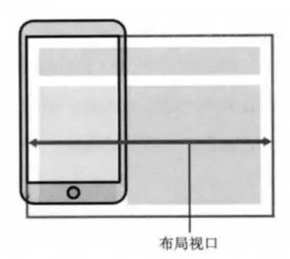
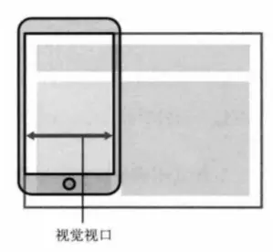
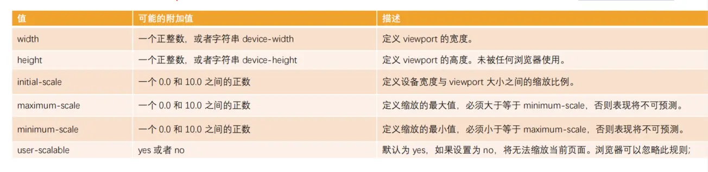

## 为什么要做移动端适配

- 自适应：根据不同的设备屏幕大小来自动调整尺寸，大小。
- 响应式：会随着屏幕的实时变动而自动调整，是一种自适应。

市面上移动端屏幕尺寸非常的繁多，很多时候我们希望一个元素在不同的屏幕上显示不同的大小以此来更好的还原效果图

提前设置好 meta 标签 viewport:

```html
<!-- 
    initial-scale=1.0  一般都是1.0
    user-scalable=no  不可以缩放
    minimum-scale=1.0 最小缩放比例
    maximum-scale=1.0  最小缩放比例
 -->
<meta
  name="viewport"
  content="width=device-width, initial-scale=1.0, 
user-scalable=no, minimum-scale=1.0, maximum-scale=1.0" />
```

当前流行的几种适配方案

- 方案一：百分比设置（不推荐）

因为不同属性的百分比值，相对的可能是不同参照物，所以百分比往往很难统一

- 方案二：rem 单位+动态 html 的 font-size

- 方案三：vw 单位（推荐）

- 方案四：flex 弹性布局、多列布局、grid布局

## 视口

- 布局视口 layout viewport：PC 端的网页在移动端会相对于 980px 布局的这个视口



- 视觉视口 visual viewport：显示在可见区域的这个视口，也是设备宽度

默认情况下，手机端浏览器按照 980px 的布局视口来渲染内容，一般大于视觉视口，那么右侧有一部分区域就会无法显示，手机端浏览器会默认对页面进行缩放以显示到用户的可见区域中



- 理想视口：

如果所有的网页都按照 980px 在移动端布局，那么最终页面都会被缩放显示。不利于进行移动的开发的，希望的是设置 100px 就显示 100px 逻辑像素

可以对 layout viewport 进行宽度和缩放的设置，以满足正常在一个移动端窗口的布局。可以设置 meta 中的 viewport，仅对移动端生效：

令布局视口宽度等于视觉视口时，即为理想视口：

```html
<meta name="viewport" content="width=device-width, initial-scale=1.0" />
```

## JS 监听屏幕尺寸

通过监听屏幕尺寸的变化来动态修改 html 元素的 font-size 大小。

```js
function setRemUnit() {
  // 获取 html 元素
  const htmlEl = document.documentElement;
  // 获取 HTML 元素宽度
  const htmlWidth = htmlEl.clientWidth;
  // 将宽度分成10份
  const htmlFontSize = htmlWidth / 10;
  // 将值给到html的font-size
  htmlEl.style.fontSize = htmlFontSize + "px";
}

setRemUnit();
// 给 window 添加监听事件
window.addEventListener("resize", setRemUnit);
//跳转的页面计算一下
window.addEventListener("pageshow", function (e) {
  if (e.persisted) {
    setRemUnit();
  }
});
```

## lib-flexible 库

淘宝团队出品的一个移动端自适应解决方案，通过动态计算 viewport 设置 font-size 实现不同屏幕宽度下的 UI 自适应缩放。

```js
(function flexible(window, document) {
  // 获取HTML元素
  var docEl = document.documentElement;
  // 获取设备像素比
  var dpr = window.devicePixelRatio || 1;

  // 设置body元素font-size
  function setBodyFontSize() {
    if (document.body) {
      document.body.style.fontSize = 12 * dpr + "px";
    } else {
      document.addEventListener("DOMContentLoaded", setBodyFontSize);
    }
  }
  setBodyFontSize();

  // 配置 1rem = viewWidth / 10
  function setRemUnit() {
    var rem = docEl.clientWidth / 10;
    docEl.style.fontSize = rem + "px";
  }

  setRemUnit();

  // 监控页面resize，重置 html 元素的 font-size
  window.addEventListener("resize", setRemUnit);
  window.addEventListener("pageshow", function (e) {
    if (e.persisted) {
      setRemUnit();
    }
  });

  // 检测 0.5px 支持
  if (dpr >= 2) {
    var fakeBody = document.createElement("body");
    var testElement = document.createElement("div");
    testElement.style.border = ".5px solid transparent";
    fakeBody.appendChild(testElement);
    docEl.appendChild(fakeBody);
    if (testElement.offsetHeight === 1) {
      docEl.classList.add("hairlines");
    }
    docEl.removeChild(fakeBody);
  }
})(window, document);
```

## vw 适配方案

100vw 相当于整个视口的宽度 innerWidth，1vw 相当于视口宽度的 1%，将 px 转换为 vw 即可完成适配，其实上面的 rem 就是模仿 vw 方案

vw 相比于 rem 的优势：

- 不需要去计算 html 的 font-size 大小，也不需要去给 html 设置 font-size

- 不会因为设置 html 的 font-size 大小，而必须再给 body 设置一个 font-size 防止继承

- 因为不依赖 font-size 的尺寸，所以不用担心某些原因的 html 的 font-size 尺寸被篡改，导致页面尺寸混乱

- vw 更加语义话，1vw 相当于 1/100 viewport 的大小

- rem 事实上作为一种过渡的方案，它利用的也是 vw 的思想

### px 与 其他单位转换

1. 手动换算

less/sass 函数

```less
@vwUnit: 3.75;
.pxToVw(@px) {
  result: (@px / @vw) * 1vw;
}

.pxToRem(@px) {
  result: 1rem * (@px / 37.5);

.box {
  width: .pxToVw(100) [result];
  height: .pxToVw(100) [result];
  font-size: .pxToRem(14)[result];
}
```

2. webpack 插件

和 rem 一样，在前端的工程化开发中，我们可以借助于 webpack 的工具来完成自动的转化:`npm install postcss-px-to-viewport`或者 postcss-pxtorem 插件

3. VS Code 插件

px to rem & rpx & vw 插件，在编写时自动转化：
