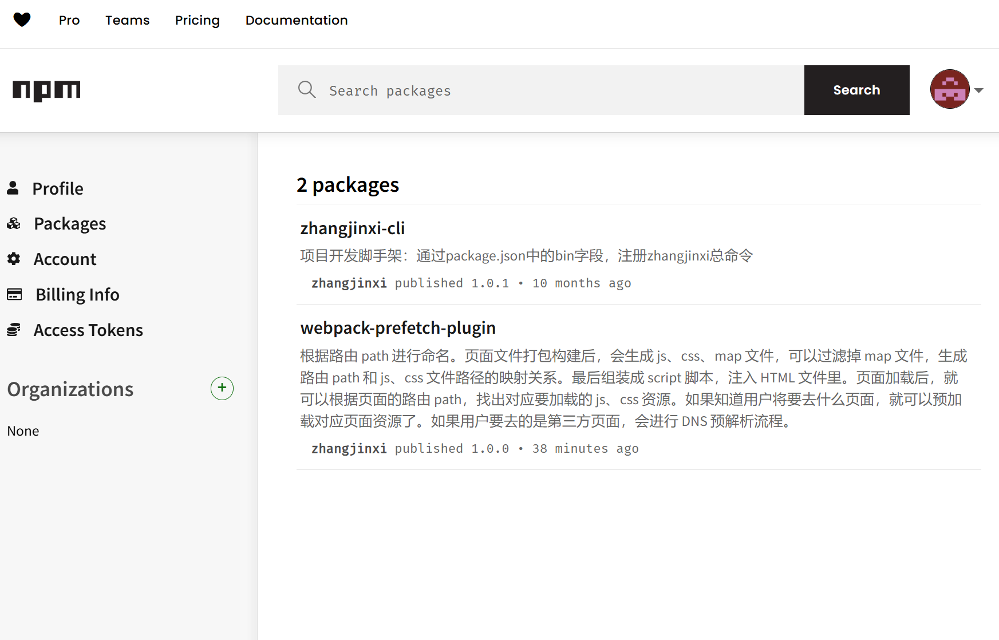

# 📱 移动端适配解决方案完全指南

> 移动端屏幕尺寸繁多，合理的适配方案能够确保应用在不同设备上都有良好的显示效果。

## 1. 概述

### 1.1 为什么要做移动端适配

- 自适应：根据不同的设备屏幕大小来自动调整尺寸，大小。
- 响应式：会随着屏幕的实时变动而自动调整，是一种自适应。

市面上移动端屏幕尺寸非常的繁多，很多时候我们希望一个元素在不同的屏幕上显示不同的大小以此来更好的还原效果图。

### 1.2 基础配置

提前设置好 meta 标签 viewport:

```html
<!--
  initial-scale=1.0  一般都是 1.0
  user-scalable=no  不可以缩放
  minimum-scale=1.0 最小缩放比例
  maximum-scale=1.0 最大缩放比例
-->
<meta
  name="viewport"
  content="width=device-width, initial-scale=1.0, user-scalable=no, minimum-scale=1.0, maximum-scale=1.0" />
```

## 2. 主流适配方案对比

### 2.1 百分比布局（不推荐）

**优点：**
- 简单易用
- 原生支持
- 相对容器动态计算

**缺点：**
- 不同属性的百分比值可能有不同参照物
- 容器层级多时，计算复杂
- 无法统一控制

### 2.2 rem 适配方案

**优点：**
- 相对根元素，易于统一控制
- 兼容性好
- 可以配合 JS 动态计算

**缺点：**
- 需要额外的 JS 计算
- 可能存在字体大小继承问题
- 小数像素可能导致边框显示问题

### 2.3 vw 适配方案（推荐）

**优点：**
- 不需要 JS 计算
- 更加语义化
- 直接相对于视口宽度
- 可以与 rem 方案搭配使用

**缺点：**
- iOS 8 以下不支持
- 不支持 vw 单位的浏览器需要降级处理

### 2.4 弹性布局方案

**优点：**
- 更加灵活
- 支持复杂的布局需求
- 原生支持响应式

**缺点：**
- 需要考虑兼容性处理
- 不适合处理字体大小等属性

## 3. 视口详解

### 3.1 布局视口 (Layout Viewport)

PC 端的网页在移动端会相对于 980px 布局的这个视口：


### 3.2 视觉视口 (Visual Viewport)

显示在可见区域的这个视口，也是设备宽度：


默认情况下，手机端浏览器按照 980px 的布局视口来渲染内容，一般大于视觉视口，那么右侧有一部分区域就会无法显示，手机端浏览器会默认对页面进行缩放以显示到用户的可见区域中。

### 3.3 理想视口 (Ideal Viewport)

如果所有的网页都按照 980px 在移动端布局，那么最终页面都会被缩放显示。不利于进行移动的开发，希望的是设置 100px 就显示 100px 逻辑像素。

可以对 layout viewport 进行宽度和缩放的设置，以满足正常在一个移动端窗口的布局：


设置理想视口：

```html
<meta name="viewport" content="width=device-width, initial-scale=1.0" />
```

## 4. 实现方案详解

### 4.1 rem 实现方案

#### 4.1.1 JS 动态设置

```js
function setRemUnit() {
  // 获取 html 元素
  const htmlEl = document.documentElement;
  // 获取 HTML 元素宽度
  const htmlWidth = htmlEl.clientWidth;
  // 将宽度分成 10 份
  const htmlFontSize = htmlWidth / 10;
  // 将值给到 html 的 font-size
  htmlEl.style.fontSize = htmlFontSize + "px";
}

setRemUnit();
// 给 window 添加监听事件
window.addEventListener("resize", setRemUnit);
// 跳转的页面计算一下
window.addEventListener("pageshow", function (e) {
  if (e.persisted) {
    setRemUnit();
  }
});
```

#### 4.1.2 lib-flexible 方案

淘宝团队出品的移动端自适应解决方案：

```js
(function flexible(window, document) {
  // 获取 HTML 元素
  var docEl = document.documentElement;
  // 获取设备像素比
  var dpr = window.devicePixelRatio || 1;

  // 设置 body 元素 font-size
  function setBodyFontSize() {
    if (document.body) {
      document.body.style.fontSize = 12 * dpr + "px";
    } else {
      document.addEventListener("DOMContentLoaded", setBodyFontSize);
    }
  }
  setBodyFontSize();

  // 配置 1rem = viewWidth / 10
  function setRemUnit() {
    var rem = docEl.clientWidth / 10;
    docEl.style.fontSize = rem + "px";
  }

  setRemUnit();

  // 监控页面 resize，重置 html 元素的 font-size
  window.addEventListener("resize", setRemUnit);
  window.addEventListener("pageshow", function (e) {
    if (e.persisted) {
      setRemUnit();
    }
  });

  // 检测 0.5px 支持
  if (dpr >= 2) {
    var fakeBody = document.createElement("body");
    var testElement = document.createElement("div");
    testElement.style.border = ".5px solid transparent";
    fakeBody.appendChild(testElement);
    docEl.appendChild(fakeBody);
    if (testElement.offsetHeight === 1) {
      docEl.classList.add("hairlines");
    }
    docEl.removeChild(fakeBody);
  }
})(window, document);
```

### 4.2 vw 适配方案

100vw 相当于整个视口的宽度 `innerWidth`，1vw 相当于视口宽度的 1%，将 px 转换为 vw 即可完成适配。

**vw 相比于 rem 的优势：**

- 不需要去计算 html 的 font-size 大小，也不需要去给 html 设置 font-size；
- 不会因为设置 html 的 font-size 大小，而必须再给 body 设置一个 font-size 防止继承；
- 因为不依赖 font-size 的尺寸，所以不用担心某些原因的 html 的 font-size 尺寸被篡改，导致页面尺寸混乱；
- vw 更加语义化，1vw 相当于 1/100 viewport 的大小；
- rem 事实上作为一种过渡的方案，它利用的也是 vw 的思想。

## 5. 单位转换方案

### 5.1 手动换算

**Less/Sass 函数示例：**

```less
@vwUnit: 3.75;
.pxToVw(@px) {
  result: (@px / @vwUnit) * 1vw;
}

.pxToRem(@px) {
  result: 1rem * (@px / 37.5);
}

.box {
  width: .pxToVw(100) [result];
  height: .pxToVw(100) [result];
  font-size: .pxToRem(14) [result];
}
```

### 5.2 自动转换工具

1. **Webpack 插件**
   - `postcss-px-to-viewport`：将 px 单位转换为 vw/vh
   - `postcss-pxtorem`：将 px 单位转换为 rem

2. **VS Code 插件**
   - `px to rem & rpx & vw`：编写时自动转换单位

## 6. 兼容性问题及解决方案

### 6.1 1px 边框问题

在高清屏幕下 1px 边框显示过粗的问题。

**解决方案：**

1. **transform 缩放**

```css
.border-1px {
  position: relative;
}
.border-1px::after {
  content: '';
  position: absolute;
  left: 0;
  bottom: 0;
  width: 100%;
  height: 1px;
  background: #000;
  transform: scaleY(0.5);
  transform-origin: 0 0;
}
```

2. **媒体查询适配**

```css
.border-1px {
  border: 1px solid #000;
}
@media screen and (-webkit-min-device-pixel-ratio: 2) {
  .border-1px {
    border-width: 0.5px;
  }
}
```

### 6.2 图片模糊问题

在高清屏幕下图片显示模糊。

**解决方案：**

1. **使用 2x/3x 图片**

```css
.image {
  width: 100px;
  height: 100px;
  background-image: url(./image.png);
}
@media screen and (-webkit-min-device-pixel-ratio: 2) {
  .image {
    background-image: url(./image@2x.png);
  }
}
```

2. **使用 srcset 属性**

```html

```

### 6.3 vw 兼容性处理

对于不支持 vw 的浏览器，可以使用 CSS 回退方案。

```css
.container {
  width: 320px; /* 回退方案 */
  width: 100vw; /* 现代浏览器 */
}
```

使用 `postcss-px-to-viewport` 时可以配置回退方案：

```js
// postcss.config.js
module.exports = {
  plugins: {
    'postcss-px-to-viewport': {
      viewportWidth: 375,
      viewportUnit: 'vw',
      fontViewportUnit: 'vw',
      selectorBlackList: ['.ignore'],
      minPixelValue: 1,
      mediaQuery: false,
      replace: true,
      exclude: [/node_modules/],
      landscape: false
    }
  }
}
```

## 7. 最佳实践建议

1. **选择适配方案**
   - 新项目推荐使用 vw 方案
   - 老项目可以继续使用 rem 方案
   - 特殊场景可以混合使用多种方案

2. **设计稿规范**
   - 使用 750px 宽度的设计稿
   - 遵循 8px 网格系统
   - 考虑不同屏幕尺寸的适配效果

3. **开发规范**
   - 统一使用 postcss 插件进行单位转换
   - 建立公共的 mixin 或函数库
   - 制定团队统一的开发规范文档

4. **测试验证**
   - 在不同尺寸设备上进行测试
   - 检查边界场景下的显示效果
   - 验证动画和交互效果

## 8. 参考资料

- [使用 Viewport 单位](https://www.w3.org/TR/css-values-3/#viewport-relative-lengths)
- [Flexible.js 实现原理](https://github.com/amfe/lib-flexible)
- [PostCSS 插件指南](https://github.com/postcss/postcss/blob/main/docs/README-cn.md)
- [移动端适配方案对比](https://www.w3cplus.com/mobile/vw-layout-in-vue.html)