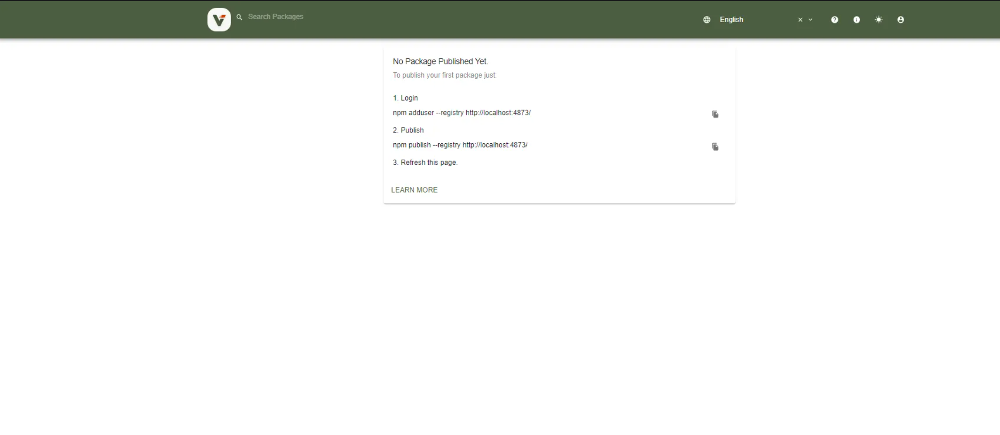
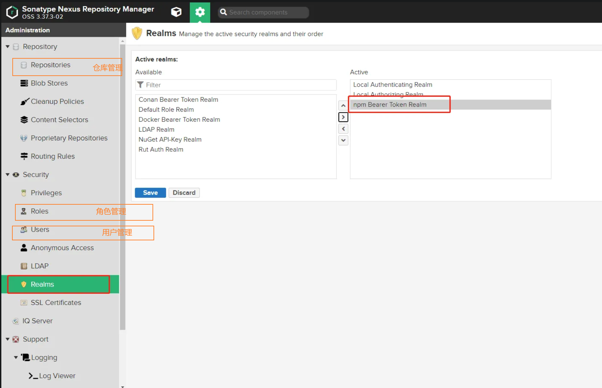

## Verdaccio

安装和启动私服服务器：

```bash
# 通过 npm yarn包管理器安装
$ npm install -g verdaccio
$ yarn global add verdaccio

# 启动
$ verdaccio

#通过docker安装
$ docker pull verdaccio/verdaccio

# 启动
$ docker run --name verdaccio-test -p 4873:4873 -d verdaccio/verdaccio
```

会启动一个后台服务：`http://localhost:4873/`


登录和管理包：

```bash
# 添加用户，根据提示，输入用户和密码
$ npm adduser --registry http://localhost:4873/

# 用户登录，根据提示，输入用户和密码
$ npm login --registry http://localhost:4873/

# 发布，在包根目录下，发布当前包到私服服务器
$ npm publish --registry http://localhost:4873/

# 删除包
$ npm unpublish --force react-components --registry http://localhost:4873/

# 删除v1.0.1版本
$ npm unpublish react-components@1.0.1
```

## Nexus

提前安装好 JDK 和 Docker。实用 Docker 安装 Nexus，在 dockerHub 里搜索和安装。运行以下命令启动私服服务器：

> 给予宿主机文件夹权限：新建文件夹并且给予权限：chmod 777 /home/nexus/nexus-data。启动服务后进入后台

```bash
# 使用参数 -v 建立宿主机与 Docker 目录映射关系, /nexus-data：docker里存nexus数据目录，所以将数据目录存放到宿主机/home/nexus-data
$ docker run -d --restart=always --net=host -p 8081:8081 -p 5000:5000 --name nexus -v /home/nexus/nexus-data:/nexus-data sonatype/nexus3

# 查看日志
$ docker logs nexus -f
```

- 登录：内部有一个初始密码文件 admin.password，这个密码将用来进行第一次登陆的密码，用户名是 admin。查看密码：cat /home/nexus/nexus-data/admin.password
- 配置 setup
  - 重新设置 admin 密码
  - 设置访问权限：搜索、浏览、下载包的权限
- 新建仓库，仓库类型有：
  - hosted（私有|宿主 仓库）：用于发布个人开发的 npm 组件
  - proxy（代理仓库）：从配置的远程仓库中下载包到该仓库，下次用户访问时会优先检查本仓库，如果有对应的包则使用本仓库中的包，不会再从远程仓库下载（可以代理 npm 和淘宝镜像）。
  - group（组合仓库）：仓库组，把多个仓库聚合起来，这样对用户只需要提供一个地址即可访问组中所有仓库（集合了 hosted 和 proxy）：本地私服仓库 hosted——>proxy 仓库——>proxy 代理的源中去下载
- 新建两个角色：
  - admin：用于管理 npm 包
  - user：用于获取 npm 包
- 新建用户
- 设置 npm 发布权限（必须）：
  

```bash
# 登录私服
npm login --registry=http://ip:8081/repository/npm-hosted/
# 查看登录用户
npm whoami --registry=http://ip:8081/repository/npm-hosted/
# 发布包到npm私服
npm publish --registry=http://ip:8081/repository/npm-hosted/
```

- 私有包推荐添加命名空间：`@zhangjinxi/chunks-plugin`
- 配置项目`.npmrc`文件，镜像源设置为私服仓库地址。\_auth 是 base64 加密的：admin:adminadmin（用户名:密码）

```txt
registry=http://ip:8081/repository/npm-group/
_auth=YWRtaW46YWRtaW5hZG1pbg==
```
