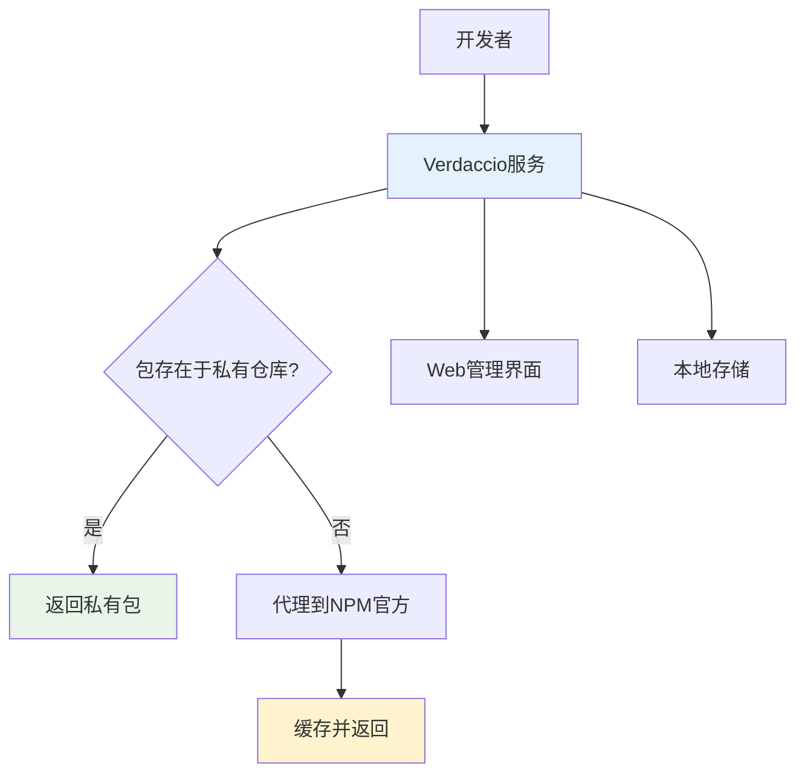
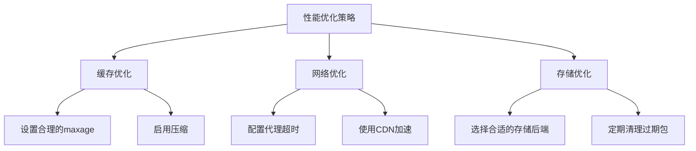

# 📦 Verdaccio私有NPM仓库搭建指南

> Verdaccio是一个轻量级的私有NPM代理注册表，可以帮助企业和团队搭建自己的NPM包管理服务，提供更好的安全性和控制能力。

## 📋 目录导航

<details>
<summary>点击展开完整目录</summary>

### 🎯 基础概念
- [什么是Verdaccio](#什么是verdaccio)
- [核心特性](#核心特性)
- [使用场景](#使用场景)

### 🚀 快速开始
- [安装方式](#安装方式)
- [启动服务](#启动服务)
- [Web界面](#web界面)

### 👥 用户管理
- [用户注册](#用户注册)
- [用户登录](#用户登录)
- [权限配置](#权限配置)

### 📦 包管理
- [发布包](#发布包)
- [安装包](#安装包)
- [版本管理](#版本管理)

### ⚙️ 高级配置
- [配置文件](#配置文件)
- [存储配置](#存储配置)
- [代理设置](#代理设置)
- [安全配置](#安全配置)

### 🐳 Docker部署
- [Docker安装](#docker安装)
- [Docker Compose](#docker-compose配置)
- [数据持久化](#数据持久化)

</details>

## 🎯 什么是Verdaccio

**Verdaccio**是一个开源的轻量级私有NPM代理注册表，用TypeScript编写。它允许您创建本地的NPM仓库，同时代理官方NPM注册表。



### 核心特性

| 特性 | 说明 | 优势 |
|------|------|------|
| **🔒 私有包管理** | 支持发布和管理私有NPM包 | 保护企业代码安全 |
| **🚀 代理功能** | 代理NPM官方注册表 | 提高下载速度，减少网络依赖 |
| **💾 离线缓存** | 本地缓存已下载的包 | 支持离线开发 |
| **👥 用户系统** | 内置用户认证和权限管理 | 细粒度访问控制 |
| **🌐 Web界面** | 友好的Web管理界面 | 便于包的浏览和管理 |
| **🐳 容器化** | 支持Docker部署 | 简化部署和运维 |

### 使用场景

**🏢 企业级应用：**
- 内部组件库管理
- 私有模块发布
- 依赖包缓存加速
- 安全合规要求

**👥 团队协作：**
- 共享工具包
- 代码模块复用
- 版本统一管理
- 开发效率提升

## 🚀 快速开始

### 安装方式

#### 方式一：NPM安装

```bash
# 全局安装Verdaccio
npm install -g verdaccio

# 或使用Yarn
yarn global add verdaccio

# 验证安装
verdaccio --version
```

#### 方式二：使用pnpm

```bash
# 使用pnpm安装
pnpm add -g verdaccio

# 验证安装
verdaccio --help
```

### 启动服务

```bash
# 启动Verdaccio服务
verdaccio

# 指定配置文件启动
verdaccio --config /path/to/config.yaml

# 指定监听地址和端口
verdaccio --listen 0.0.0.0:4873
```

**🔧 启动输出示例：**

```bash
 warn --- config file  - /home/user/.config/verdaccio/config.yaml
 warn --- Plugin successfully loaded: verdaccio-htpasswd
 warn --- Plugin successfully loaded: verdaccio-audit
 warn --- http address - http://localhost:4873/ - verdaccio/5.15.4
```

### Web界面

启动成功后，访问 `http://localhost:4873` 即可看到Verdaccio的Web管理界面：


**🎨 界面功能：**
- 📦 包列表浏览
- 🔍 包搜索功能
- 📋 包详情查看
- 👥 用户管理
- ⚙️ 配置管理

## 👥 用户管理

### 用户注册

```bash
# 方式一：添加新用户（管理员操作）
npm adduser --registry http://localhost:4873/

# 方式二：用户自助注册（如果允许）
npm adduser --registry http://localhost:4873/
```

**📝 注册流程：**

```bash
$ npm adduser --registry http://localhost:4873/
Username: (输入用户名)
Password: (输入密码)
Email: (this IS public) (输入邮箱地址)
```

### 用户登录

```bash
# 用户登录
npm login --registry http://localhost:4873/

# 查看当前登录用户
npm whoami --registry http://localhost:4873/

# 登出
npm logout --registry http://localhost:4873/
```

**🔑 登录状态验证：**

```bash
# 检查认证信息
npm config list --registry http://localhost:4873/

# 查看.npmrc文件
cat ~/.npmrc
```

### 权限配置

在配置文件中设置用户权限：

```yaml
# config.yaml
auth:
  htpasswd:
    file: ./htpasswd
    max_users: 1000

packages:
  '@company/*':
    access: ['$authenticated']
    publish: ['admin', 'developer']
    unpublish: ['admin']
  
  '**':
    access: ['$all']
    publish: ['$authenticated']
    unpublish: ['admin']
```

## 📦 包管理

### 发布包

#### 配置项目

```bash
# 1. 初始化项目
mkdir my-private-package
cd my-private-package
npm init -y

# 2. 修改package.json
```

```json
{
  "name": "@company/my-package",
  "version": "1.0.0",
  "main": "index.js",
  "publishConfig": {
    "registry": "http://localhost:4873/"
  }
}
```

#### 发布流程

```bash
# 1. 确保已登录
npm whoami --registry http://localhost:4873/

# 2. 发布包
npm publish --registry http://localhost:4873/

# 3. 验证发布
npm view @company/my-package --registry http://localhost:4873/
```

**📊 发布成功输出：**

```bash
+ @company/my-package@1.0.0
```

### 安装包

```bash
# 安装私有包
npm install @company/my-package --registry http://localhost:4873/

# 设置默认仓库
npm config set registry http://localhost:4873/

# 恢复官方仓库
npm config set registry https://registry.npmjs.org/
```

### 版本管理

```bash
# 更新版本并发布
npm version patch  # 修复版本 1.0.0 -> 1.0.1
npm version minor  # 次要版本 1.0.1 -> 1.1.0
npm version major  # 主要版本 1.1.0 -> 2.0.0

# 发布新版本
npm publish --registry http://localhost:4873/

# 撤销发布（需要权限）
npm unpublish @company/my-package@1.0.0 --registry http://localhost:4873/
```

## ⚙️ 高级配置

### 配置文件

Verdaccio配置文件位置：

```bash
# Linux/macOS
~/.config/verdaccio/config.yaml

# Windows
%APPDATA%\verdaccio\config.yaml

# 自定义位置
verdaccio --config /path/to/config.yaml
```

**🔧 基础配置示例：**

```yaml
# config.yaml
storage: ./storage
auth:
  htpasswd:
    file: ./htpasswd
    max_users: 1000

uplinks:
  npmjs:
    url: https://registry.npmjs.org/
    timeout: 30s

packages:
  '@*/*':
    access: $all
    publish: $authenticated
    unpublish: $authenticated
    proxy: npmjs

  '**':
    proxy: npmjs

server:
  keepAliveTimeout: 60

middlewares:
  audit:
    enabled: true

logs:
  - { type: stdout, format: pretty, level: http }

listen: 0.0.0.0:4873
```

### 存储配置

```yaml
# 本地存储
storage: ./storage

# 数据库存储插件
store:
  mongodb:
    uri: mongodb://localhost:27017/verdaccio
    
# AWS S3存储
store:
  aws-s3:
    bucket: my-verdaccio-bucket
    region: us-east-1
```

### 代理设置

```yaml
uplinks:
  npmjs:
    url: https://registry.npmjs.org/
    timeout: 30s
    maxage: 2m
    max_fails: 3
    fail_timeout: 5m
    
  taobao:
    url: https://registry.npmmirror.com/
    timeout: 30s
    
packages:
  '**':
    proxy: taobao npmjs
```

### 安全配置

```yaml
# JWT Token配置
security:
  api:
    legacy: true
    jwt:
      sign:
        expiresIn: 7d
      verify:
        someProp: [value]

# HTTPS配置
https:
  key: path/to/server.key
  cert: path/to/server.crt
  ca: path/to/ca.crt

# CORS配置
middlewares:
  audit:
    enabled: true
  
web:
    enable: true
    title: "Private NPM Registry"
```

## 🐳 Docker部署

### Docker安装

```bash
# 拉取官方镜像
docker pull verdaccio/verdaccio

# 运行容器
docker run -it --rm --name verdaccio-test \
  -p 4873:4873 \
  verdaccio/verdaccio

# 后台运行
docker run -d --name verdaccio \
  -p 4873:4873 \
  -v /path/to/storage:/verdaccio/storage \
  -v /path/to/config:/verdaccio/conf \
  verdaccio/verdaccio
```

### Docker Compose配置

```yaml
# docker-compose.yml
version: '3.8'

services:
  verdaccio:
    image: verdaccio/verdaccio:latest
    container_name: verdaccio
    networks:
      - node-network
    environment:
      - VERDACCIO_PORT=4873
    ports:
      - "4873:4873"
    volumes:
      - "./storage:/verdaccio/storage"
      - "./config:/verdaccio/conf"
      - "./plugins:/verdaccio/plugins"
    restart: unless-stopped

networks:
  node-network:
    driver: bridge
```

**🚀 启动服务：**

```bash
# 启动服务
docker-compose up -d

# 查看日志
docker-compose logs -f verdaccio

# 停止服务
docker-compose down
```

### 数据持久化

```bash
# 创建持久化目录
mkdir -p ./storage ./config ./plugins

# 设置权限
sudo chown -R 10001:65533 ./storage
sudo chown -R 10001:65533 ./config
```

**📁 目录结构：**

```
project/
├── docker-compose.yml
├── storage/          # 包存储目录
├── config/          # 配置文件目录
│   └── config.yaml
└── plugins/         # 插件目录
```

## 🔧 插件系统

### 常用插件

| 插件名称 | 功能 | 安装命令 |
|----------|------|----------|
| **verdaccio-ldap** | LDAP认证 | `npm install verdaccio-ldap` |
| **verdaccio-google-cloud** | Google Cloud存储 | `npm install verdaccio-google-cloud` |
| **verdaccio-aws-s3-storage** | AWS S3存储 | `npm install verdaccio-aws-s3-storage` |
| **verdaccio-memory** | 内存存储 | `npm install verdaccio-memory` |

### 插件配置

```yaml
# config.yaml
auth:
  ldap:
    type: ldap
    client_options:
      url: "ldap://ldap.example.com"
      baseDN: 'dc=example,dc=com'
      bindDN: 'cn=admin,dc=example,dc=com'
      bindCredentials: 'admin'

store:
  aws-s3:
    bucket: my-bucket
    keyPrefix: verdaccio/
    region: us-west-2
```

## 📊 监控和维护

### 健康检查

```bash
# API健康检查
curl http://localhost:4873/-/ping

# 获取服务器信息
curl http://localhost:4873/-/whoami

# 包统计信息
curl http://localhost:4873/-/all
```

### 日志管理

```yaml
# 日志配置
logs:
  - { type: stdout, format: pretty, level: http }
  - { type: file, path: verdaccio.log, level: info }
  - { type: rotating-file, format: json, path: access.log, level: http, options: { period: '1d', count: 7 } }
```

### 备份策略

```bash
# 备份存储目录
tar -czf verdaccio-backup-$(date +%Y%m%d).tar.gz ./storage

# 备份配置文件
cp config.yaml config-backup-$(date +%Y%m%d).yaml

# 自动备份脚本
#!/bin/bash
DATE=$(date +%Y%m%d)
tar -czf "/backup/verdaccio-${DATE}.tar.gz" ./storage ./config
find /backup -name "verdaccio-*.tar.gz" -mtime +30 -delete
```

## 🎯 最佳实践

### 性能优化



### 安全建议

| 安全措施 | 配置方法 | 重要性 |
|----------|----------|--------|
| **🔐 强密码策略** | 配置密码复杂度要求 | 🔴 高 |
| **🛡️ HTTPS启用** | 配置SSL证书 | 🔴 高 |
| **👥 权限控制** | 细化包访问权限 | 🟡 中 |
| **🔍 审计日志** | 启用详细日志记录 | 🟡 中 |
| **🚫 IP限制** | 配置访问白名单 | 🟡 中 |

### 团队协作

```bash
# .npmrc项目配置
@company:registry=http://verdaccio.company.com:4873/
registry=https://registry.npmjs.org/

# package.json发布配置
{
  "publishConfig": {
    "registry": "http://verdaccio.company.com:4873/"
  }
}
```

## 🎯 总结

### 优势总结

| 优势 | 说明 | 适用场景 |
|------|------|----------|
| **🚀 简单易用** | 安装配置简单，界面友好 | 快速搭建私有仓库 |
| **🔒 安全可控** | 私有包管理，权限控制 | 企业内部开发 |
| **⚡ 性能提升** | 本地缓存，加速下载 | 网络环境受限 |
| **💰 成本低廉** | 开源免费，资源占用少 | 预算有限的团队 |

### 使用建议

::: tip 💡 最佳实践建议
- **渐进式迁移**：从部分项目开始，逐步推广到整个团队
- **权限管理**：建立清晰的权限体系，确保安全性
- **监控维护**：定期备份数据，监控服务状态
- **文档培训**：为团队成员提供使用培训和文档
:::

---

> 📚 **相关资源**：
> - [Verdaccio官方文档](https://verdaccio.org/docs/en/what-is-verdaccio)
> - [NPM私有仓库最佳实践](https://docs.npmjs.com/cli/v8/using-npm/registry)
> - [Docker容器化部署指南](https://verdaccio.org/docs/en/docker)
> - [企业级NPM管理方案](https://verdaccio.org/docs/en/best-practices)
