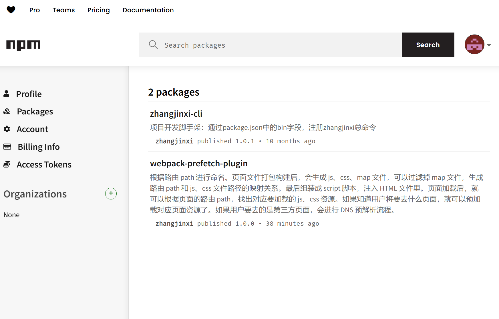

# 发布自己的 npm 包流程

## 构建自己的项目

首先安装 node 运行环境：

- 进入 node 官网下载最新的稳定版本的 node
- 安装 node，按照一步步提示即可

- node 自带 npm 包管理器

建立自己的项目：

- 建立项目存放文件夹
- 进入文件夹
- 打开该文件夹的命令行窗口
- 输入`npm init`初始化一个包，过程中会让输入项目有关信息。也可以暂时都用默认值，后续可以修改。

  - name：项目名称也是插件的名称，必须唯一且没有与其他包冲突。
  - version：插件的版本号，遵循语义化版本规则。
  - description：插件的简短描述。

  - main：指向插件的入口文件。
  - keywords：插件的关键词，有助于搜索引擎发现你的包。
  - author 作者联系方式
  - license：插件的许可证。

- 完成之后会生成一个 package.json 文件，如下：

```json
{
  "name": "webpack-prefetch-plugin",
  "version": "1.0.0",
  "main": "./src/index.js",
  "scripts": {
    "test": "echo \"Error: no test specified\" && exit 1"
  },
  "author": "1334640772@qq.com",
  "license": "ISC",
  "keywords": ["webpack", "prefetch", "dns-prefetch"],
  "description": "根据路由 path 进行命名。页面文件打包构建后，会生成 js、css、map 文件，可以过滤掉 map 文件，生成路由 path 和 js、css 文件路径的映射关系。最后组装成 script 脚本，注入 HTML 文件里。页面加载后，就可以根据页面的路由 path，找出对应要加载的 js、css 资源。如果知道用户将要去什么页面，就可以预加载对应页面资源了。如果用户要去的是第三方页面，会进行 DNS 预解析流程。",
  "dependencies": {
    "zhangjinxi": "^1.0.3",
    "zhangjinxi-cli": "^1.0.1"
  }
}
```

- 设置 npm 忽略文件。通过创建 .npmignore 文件，指定在发布时需要忽略的文件和文件夹。例如，node_modules、dist 等。

```md
# 以下文件夹都会被忽略掉，不会被发送到镜像源里

node_modules
dist
```

## 加入 git 版本管理

需要提前安装好 git，不在介绍。使用 git，可以更好的管理代码。

- 执行`git init`命令，会把项目初始化 git 项目。生成一个.git 的隐藏文件夹，里面保存着各种分支、版本、origin、操作等信息

- 新增`.gitignore`忽略文件，把不需要 git 监控的文件或者文件夹放进去，如下所示：

```md
.DS_Store
node_modules
docs/.vitepress/dist
docs/.vitepress/cache

# local env files

.env.local
.env.\*.local

# Log files

npm-debug.log*
yarn-debug.log*
yarn-error.log*
pnpm-debug.log*

# Editor directories and files

.idea
.vscode
_.suo
_.ntvs\*
_.njsproj
_.sln
\*.sw?
```

- 查看 git 相关命令：[git 命令](../stardard/git.md)

## npm 账号注册、登录、发布

1. npm 账号注册

- 打开 NPM 官网，点击右上角的 “Sign Up” 按钮。
- 填写必要的个人信息，包括用户名、密码和邮箱地址。
- 完成注册后，你将收到一封确认邮件，点击邮件中的链接来验证你的邮箱。

2. npm 登录
   命令行里输入`npm login`命令，控制台会提示属于账号和密码。
   > 密码不会被显示，但实际已经输入进去，需要留意

完成之后，控制台会自动保存认证信息，使得你能够发布和管理你的包。

3. npm 发布
   项目做好之后，要发布到 npm 镜像源，供其他人学习和使用，可以控制台输入命令`npm pulish`。等待一会，就可以发布到 npm 里了，然后登录官网账号就可以查看自己发布的 npm 包了。如果网速不好，可能会操作失败，中国大陆对外网有限制，速度比较慢，甚至由网络超时的可能。失败就多试几次，有条件可以翻墙.....
   

## npm 包版本管理

在 NPM 上发布的每个插件都必须有一个唯一的版本号。如果你对插件做了任何更改并想重新发布，需要更新版本号。可以在项目里修改版本号，也可以通过命令行修改

NPM 使用语义化版本控制：

- MAJOR：做了不兼容的 API 修改。
- MINOR：增加了功能，并且没有破坏兼容性。
- PATCH：修复了问题，并且没有破坏兼容性。

```md
# 新增修订版本，小版本会自动+1

npm version patch

# 更改好版本，在执行发布命令

npm publish
```
