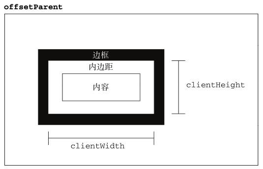
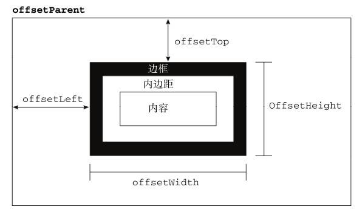

# 🔧 前端开发常见问题解决方案

> 前端开发过程中会遇到各种技术问题，本文汇总了常见问题的解决方案和最佳实践。

## 📝 中文输入事件

> 当监听 input 事件时，输入英文时，每输入一个字母，就会把这个字母送到输入框内，触发一次 input 事件。但当输入中文时，每个汉字或者每个词语都需要多次敲击键盘才能完成，未完成前并不需要触发 input 事件。

此时可以利用 composition 合成事件：

- `compositionstart` 开始输入时触发
  > 在文本合成系统如 IME：input method editor（即输入法编辑器）的文本复合系统打开时触发，表示要开始输入
- `compositionupdate` 更新输入时触发
- `compositionend` 结束输入时触发
  > 在 IME 的文本复合系统关闭时触发，表示返回正常键盘输入状态(选中文字，输入法消失的那一刻)

代码实现过程：

```js
// 提前定义好一个变量，代表是否合成事件
let isOnComposition = false;
// 定义input事件处理器
handleInput(event){
  // 是合成事件，则结束，不执行input逻辑
  if(isOnComposition) return;
  // 非合成事件，处理input事件逻辑
}

// 定义compositionstart事件处理器
handleCompositionstart(event){
  // 合成事件开始，令isOnComposition=true
  isOnComposition = true;
  // 为true时，不会触发input事件逻辑
}

// 定义compositionend事件处理器
handleCompositionend(event){
  // 合成事件结束，令isOnComposition=false，然后触发一次input事件
  isOnComposition = false;
  handleInput(event)
}

```

## 脚本 async 和 defer 属性

> HTML 文档中的 js 脚本文件，默认加载和执行都会阻塞 HTML 文档的解析和渲染

```js
<script src='/js/xx.js' async></script>
<script src='/js/xx.js' defer></script>

```

- async：异步加载。加载脚本和 HTML 解析并行，当脚本下载完成后，立即执行脚本，并且暂停 HTML 的解析。无法保证脚本的执行顺序。
- defer：延迟执行。加载脚本和 HTML 解析并行，脚本下载完成后并不立刻执行，而是等到 HTML 文件解析完毕之后在执行。并且脚本的执行顺序和在 HTML 文档中的书写顺序保持一直。

他们的加载和执行，如图所示：


> 如何选择：当多个脚本执行有依赖关系时，使用 defer 属性，否则使用 async 属性

## 惰性函数

惰性函数表示函数第一次执行遇到分支时，会被某一分支重写为另一个更合适的函数，以后对原函数的调用就不必在经过分支的判断了。常用来处理兼容性问题

比如对元素添加事件处理器的时候，首先检查是否支持 addEventListener，如果不支持，再检查是否支持 attachEvent（ie 老版本浏览器），如果还不支持，就只能用 dom0 级的方法添加事件。这个过程每次都要执行一遍，实际上如果浏览器支持其中的一种方法，下次调用函数就没必要判断了。这就是惰性函数的应用之一，本质就是函数重写，有两种方法实现：

```js
// 该方法有个缺点，要是函数名称改变的话，修改起来有点麻烦，要修改每个重新赋值的地方。
function addEvent(ele, type, fn) {
  if (ele.addEventListener) {
    addEvent = function (ele, type, fn) {
      ele.addEventListener(type, fn, false);
    };
  } else if (ele.attachEvent) {
    addEvent = function (ele, type, fn) {
      ele.attachEvent("on" + type, fn); //老版本ie浏览器只支持冒泡，所以没有第三个参数，并且事件类型都以on开头，所以要进行拼接
    };
  } else {
    addEvent = function (ele, type, fn) {
      ele["on" + type] = fn;
    };
  }
  return addEvent(ele, type, fn);
}
// 利用自执行函数和闭包，把嗅探浏览器的操作提前到代码加载的时候：在代码加载时就立即进行一次判断，以便让addEvent返回一个包裹了正确逻辑的函数：
let addEvent = (function () {
  if (document.addEventListener) {
    return function (ele, type, fn) {
      ele, addEventListener(type, fn, false);
    };
  } else if (document.attachEvent) {
    return function (ele, type, fn) {
      ele.attachEvent("on" + type, fn);
    };
  } else {
    return function (ele, type, fn) {
      ele["on" + type] = fn;
    };
  }
})();

// 示例2：解决XMLHttpRequest的兼容性问题

//惰性函数

function createXHR() {
  var xhr = null;
  if (typeof XMLHttpRequest != "undefined") {
    xhr = new XMLHttpRequest();
    createXHR = function () {
      // 每次调用createXHR函数，返回不同的实例
      return new XMLHttpRequest();
    };
  } else {
    try {
      xhr = new ActiveXObject("Msxml2.XMLHTTP");
      createXHR = function () {
        return new ActiveXObject("Msxml2.XMLHTTP");
      };
    } catch (e) {
      try {
        xhr = new ActiveXObject("Microsoft.XMLHTTP");
        createXHR = function () {
          return new ActiveXObject("Microsoft.XMLHTTP");
        };
      } catch (e) {
        createXHR = function () {
          return null;
        };
      }
    }
  }
  return xhr;
}
```

惰性函数的优点：

- 是显而易见的效率问题，虽然在第一次执行的时候函数会意味赋值而执行的慢一些，但是后续的调用会因为避免的重复检测更快；

- 是要执行的适当代码只有当实际调用函数是才执行，很多 JavaScript 库在在加载的时候就根据浏览器不同而执行很多分支，把所有东西实现设置好，而惰性载入函数将计算延迟，不影响初始脚本的执行时间

## 数组分块技术

> 遇到的问题：当一次执行大量逻辑代码，例如一次性往页面添加大量 dom，就可能导致页面卡死，可以利用数组分块技术处理这个问题。其实就是利用定时器分割循环的技术，在每次时间间隔内只处理一定数量的任务，

函数封装如下：

```js
//循环的数组，处理函数，每次处理数量，时间间隔
function chunk(array, fn, count, delay) {
  // 每次执行start函数，处理count条数据
  let start = function () {
    //每次处理count条数据，如果剩余数据不够count条，就处理array剩余的所有的数据
    count = array.length > count ? count : array.length;
    for (let i = 0; i < count; i++) {
      // 依次处理count条数据
      fn(array.shift());
    }
  };
  return function () {
    // 调用函数，首先处理一组数据，然后计时，delay时间后，继续处理一下组数据，循环这个过程，知道数据处理完毕
    start();
    let timer = setInternal(() => {
      // 如果数组处理完毕，清空定时器，结束循环
      if (array.length === 0) {
        clearInternal(timer);
        return;
      }
      // 还有数据待处理，继续处理下一组数据
      start();
    }, delay);
  };
}
```

## clientHeight offsetHeight scrollHeight 区别

clientHeight：元素内容高度，包含 padding，不包含 border 和滚动条。clientLeft 属性返回左边框的宽度，clientTop 属性返回上边框的宽度。



offsetHeight：元素内容高度，包含 padding 和 border，但不包含滚动条。



scrollHeight：元素总高度，包括由于溢出而无法展示在网页的不可见部分，包含 padding、border、滚动条。

## URL 编码问题

1.  encodeURI & decodeURI

encodeURI() 函数通过将特定字符的每个实例替换为 1-4 个转义序列来对统一资源标识符 (URI) 进行编码（由两个“代理”字符组成的字符才会被编码为四个转义序列）。会替换所有的字符，但不包括以下字符：
|类型|包含|
|----|----|
|保留字符|`; , / ? : @ & = + $`|
|非转义字符|`字母 数字 - _ . ! ~ * ' ( )`|
|数字符号|`#`|

> encodeURI 自身无法产生能适用于 GET 或 POST 请求的 URI，例如 "&", "+", 和 "=" 不会被编码，然而在 GET 和 POST 请求中它们是特殊字符。需要使用 encodeURIComponent 这个方法会对这些字符编码。

```js
// 编码高 - 低位完整字符 ok
console.log(encodeURI("\uD800\uDFFF"));

// 编码单独的高位字符抛出 "Uncaught URIError: URI malformed"
console.log(encodeURI("\uD800"));

// 编码单独的低位字符抛出 "Uncaught URIError: URI malformed"
console.log(encodeURI("\uDFFF"));

/**如果 URL 需要遵循较新的RFC3986标准，那么方括号是被保留的 (给 IPv6)，因此对于那些没有被编码的 URL 部分 (例如主机)，可以使用下面的代码： */
function fixedEncodeURI(str) {
  return encodeURI(str).replace(/%5B/g, "[").replace(/%5D/g, "]");
}

const uri = "https://mozilla.org/?x=шеллы";
const encoded = encodeURI(uri);
console.log(encoded);
//"https://mozilla.org/?x=%D1%88%D0%B5%D0%BB%D0%BB%D1%8B"

try {
  // decodeURI() 解码由 encodeURI 编码过后的 URI
  console.log(decodeURI(encoded));
} catch (e) {
  console.error(e);
}
```

2.  encodeURIComponent & decodeURIComponent

将特定字符的每个实例替换成代表字符的 UTF-8 编码的 1-4 个转义序列来编码 URI（由两个“代理”字符组成的字符才会被编码为四个转义序列）。与 encodeURI() 相比，此函数会编码更多的字符，包括 URI 语法的一部分。

> 转义除了所示外的所有字符：`A-Z a-z 0-9 - _ . ! ~ * ' ( )`

encodeURIComponent() 和 encodeURI 有以下几个不同点：

```js
var set1 = ";,/?:@&=+$"; // 保留字符
var set3 = "#"; // 数字标志

console.log(encodeURI(set1)); // ;,/?:@&=+$
console.log(encodeURI(set3)); // #

console.log(encodeURIComponent(set1)); // %3B%2C%2F%3F%3A%40%26%3D%2B%24
console.log(encodeURIComponent(set3)); // %23

// decodeURIComponent解码由 encodeURIComponent 编码后的 URI
decodeURIComponent("JavaScript_%D1%88%D0%B5%D0%BB%D0%BB%D1%8B");
// "JavaScript_шеллы"

//捕获异常
try {
  var a = decodeURIComponent("%E0%A4%A");
} catch (e) {
  console.error(e);
  // URIError: malformed URI sequence
}
```

为了避免服务器收到不可预知的请求，对任何用户输入的作为 URI 部分的内容都需要用 encodeURIComponent 进行转义。比如，一个用户可能会输入"Thyme &time=again"作为 comment 变量的一部分。如果不使用 encodeURIComponent 对此内容进行转义，服务器得到的将是 comment=Thyme%20&time=again 两个键值对。因为输入的 "&"符号和"="符号产生了一个新的键值对

## 数字转中文

```js
function digitUppercase(n) {
  let fraction = ["角", "分"];
  let digit = ["零", "壹", "贰", "叁", "肆", "伍", "陆", "柒", "捌", "玖"];
  let unit = [
    ["元", "万", "亿"],
    ["", "拾", "佰", "仟"],
  ];
  let head = n < 0 ? "欠" : "";
  n = Math.abs(n);
  let s = "";
  for (let i = 0; i < fraction.length; i++) {
    s += (
      digit[Math.floor(n * 10 * Math.pow(10, i)) % 10] + fraction[i]
    ).replace(/零./, "");
  }
  s = s || "整";
  n = Math.floor(n);
  for (let k = 0; k < unit[0].length && n > 0; k++) {
    let p = "";
    for (let j = 0; j < unit[1].length && n > 0; j++) {
      p = digit[n % 10] + unit[1][j] + p;
      n = Math.floor(n / 10);
    }
    s = `${p.replace(/(零.)*零$/, "").replace(/^$/, "零")}${unit[0][k]}${s}`;
  }
  return `${head}${s
    .replace(/(零.)*零元/, "元")
    .replace(/(零.)+/g, "零")
    .replace(/^整$/, "零元整")}`;
}

console.log(digitUppercase(7682.01)); // 柒仟陆佰捌拾贰元壹分
console.log(digitUppercase(7682)); // 柒仟陆佰捌拾贰元整
console.log(digitUppercase(951434677682.0)); // 玖仟伍佰壹拾肆亿叁仟肆佰陆拾柒万柒仟陆佰捌拾贰元整

function noToChinese(num) {
  if (!/^\d*(\.\d*)?$/.test(num)) return;

  var digit = new Array(
    "零",
    "壹",
    "贰",
    "叁",
    "肆",
    "伍",
    "陆",
    "柒",
    "捌",
    "玖"
  );
  var unit = new Array("", "拾", "佰", "仟", "萬", "億", "点", "");
  var a = ("" + num).replace(/(^0*)/g, "").split("."),
    k = 0,
    re = "";
  for (var i = a[0].length - 1; i >= 0; i--) {
    switch (k) {
      case 0:
        re = unit[7] + re;
        break;
      case 4:
        if (!new RegExp("0{4}\\d{" + (a[0].length - i - 1) + "}$").test(a[0]))
          re = unit[4] + re;
        break;
      case 8:
        re = unit[5] + re;
        unit[7] = unit[5];
        k = 0;
        break;
    }
    if (k % 4 == 2 && a[0].charAt(i + 2) != 0 && a[0].charAt(i + 1) == 0)
      re = digit[0] + re;
    if (a[0].charAt(i) != 0) re = digit[a[0].charAt(i)] + unit[k % 4] + re;
    k++;
  }
  // 处理小数部分
  if (a.length > 1) {
    re += unit[6];
    for (var i = 0; i < a[1].length; i++) re += digit[a[1].charAt(i)];
  }
  return re;
}
```

## 规则验证

```js
/**
 * @description 手机号(严谨), 根据工信部2019年最新公布的手机号段
 * @param  {String|Number} tel
 * @returns {Boolean}
 */
function isPhoneNum(tel) {
  return /^1((3[\d])|(4[5,6,7,9])|(5[0-3,5-9])|(6[5-7])|(7[0-8])|(8[\d])|(9[1,8,9]))\d{8}$/.test(
    tel
  );
}

/**
 * @description 判断是否为邮箱地址
 * @param {String} email
 * @returns {Boolean}
 */
function isEmail(email) {
  return /^([a-zA-Z0-9_\-])+@([a-zA-Z0-9_\-])+(\.[a-zA-Z0-9_\-])+$/.test(email);
}

/**
 * @description 验证身份证号码
 * @param {String} idCard
 * @returns {Boolean}
 */
function isIDCard(idCard) {
  return /(^\d{8}(0\d|11|12)([0-2]\d|30|31)\d{3}$)|(^\d{6}(18|19|20)\d{2}(0\d|11|12)([0-2]\d|30|31)\d{3}(\d|X|x)$)/.test(
    idCard
  );
}

// 帐号是否合法(字母开头，允许5-16字节，允许字母数字下划线组合
function isPassword(password) {
  // 用户名正则
  var regx1 = /^[a-zA-Z0-9_-]{4,16}$/;

  // 密码强度正则，最少6位，包括至少1个大写字母，1个小写字母，1个数字，1个特殊字符
  var regx2 = /^.*(?=.{6,})(?=.*\d)(?=.*[A-Z])(?=.*[a-z])(?=.*[!@#$%^&*? ]).*$/;

  return /^[a-zA-Z][a-zA-Z0-9_]{4,15}$/.test(password);
}

// 车牌号正则
var regx =
  /^[京津沪渝冀豫云辽黑湘皖鲁新苏浙赣鄂桂甘晋蒙陕吉闽贵粤青藏川宁琼使领A-Z]{1}[A-Z]{1}[A-Z0-9]{4}[A-Z0-9挂学警港澳]{1}$/;

// 新能源车牌号
var regx1 =
  /[京津沪渝冀豫云辽黑湘皖鲁新苏浙赣鄂桂甘晋蒙陕吉闽贵粤青藏川宁琼使领 A-Z]{1}[A-HJ-NP-Z]{1}(([0-9]{5}[DF])|([DF][A-HJ-NP-Z0-9][0-9]{4}))$/;

// 非新能源车牌号
var regx2 =
  /^[京津沪渝冀豫云辽黑湘皖鲁新苏浙赣鄂桂甘晋蒙陕吉闽贵粤青藏川宁琼使领 A-Z]{1}[A-HJ-NP-Z]{1}[A-Z0-9]{4}[A-Z0-9挂学警港澳]{1}$/;

// 车牌号(新能源+非新能源)
var regx3 =
  /^([京津沪渝冀豫云辽黑湘皖鲁新苏浙赣鄂桂甘晋蒙陕吉闽贵粤青藏川宁琼使领 A-Z]{1}[A-HJ-NP-Z]{1}(([0-9]{5}[DF])|([DF]([A-HJ-NP-Z0-9])[0-9]{4})))|([京津沪渝冀豫云辽黑湘皖鲁新苏浙赣鄂桂甘晋蒙陕吉闽贵粤青藏川宁琼使领 A-Z]{1}[A-Z]{1}[A-HJ-NP-Z0-9]{4}[A-HJ-NP-Z0-9 挂学警港澳]{1})$/;

// 合法uri
function validateURL(textval) {
  const urlregex =
    /^(https?|ftp):\/\/([a-zA-Z0-9.-]+(:[a-zA-Z0-9.&%$-]+)*@)*((25[0-5]|2[0-4][0-9]|1[0-9]{2}|[1-9][0-9]?)(\.(25[0-5]|2[0-4][0-9]|1[0-9]{2}|[1-9]?[0-9])){3}|([a-zA-Z0-9-]+\.)*[a-zA-Z0-9-]+\.(com|edu|gov|int|mil|net|org|biz|arpa|info|name|pro|aero|coop|museum|[a-zA-Z]{2}))(:[0-9]+)*(\/($|[a-zA-Z0-9.,?'\\+&%$#=~_-]+))*$/;
  return urlregex.test(textval);
}

// 生成随机HEX色值
const RandomColor = () =>
  "#" +
  Math.floor(Math.random() * 0xffffff)
    .toString(16)
    .padEnd(6, "0");
const color = RandomColor();
// color => "#f03665"

// 生成星级评分
const StartScore = rate => "★★★★★☆☆☆☆☆".slice(5 - rate, 10 - rate);
const start = StartScore(3);
// start => "★★★"

/**
 * @description 千位分隔符(格式化金钱)
 * @param {String|Number} num
 * @returns {string}
 */
function thousandNum(num) {
  var regx = /\d{1,3}(?=(\d{3})+$)/g;
  return (num + "").replace(regx, "$&,"); // $&表示与regx相匹配的字符串
}

/**
 * @description 千位分隔符(格式化金钱)
 * @param {String|Number} num
 * @returns {string}
 */
function thousandNum(num) {
  return num.toString().replace(/\B(?=(\d{3})+(?!\d))/g, ",");
}
// thousandNum(123456789) => "123,456,789"

//  判断是否为空
function validatenull(val) {
  if (typeof val === "boolean") {
    return false;
  }
  if (val instanceof Array) {
    if (val.length === 0) return true;
  } else if (val instanceof Object) {
    if (JSON.stringify(val) === "{}") return true;
  } else {
    if (
      val === "null" ||
      val == null ||
      val === "undefined" ||
      val === undefined ||
      val === ""
    )
      return true;
    return false;
  }
  return false;
}
// 下划线命名到驼峰命名
const strToCamel = str =>
  str.replace(/(^|_)(\w)/g, (m, $1, $2) => $2.toUpperCase());

  /**
 * @method 时间格式化
 * @param {string} time
 * @param {string} format yyyy/mm/dd hh:ii:ss(2019/07/24 09:45:43) yy/m/d hh:ii:ss(19/07/24 09:45:43) yyyy/mm/dd w(2019/07/24 星期三) mm/dd/yyyy(07/24/2019)
 * @returns
 */
export const formatTime = (time, format = "yyyy-mm-dd") => {
	const d = time ? new Date(time) : new Date();
	const t = (i) => {
		return (i < 10 ? "0" : "") + i;
	};

	const year = d.getFullYear();
	const month = d.getMonth() + 1;
	const day = d.getDate();
	const hour = d.getHours();
	const minutes = d.getMinutes();
	const seconds = d.getSeconds();
	const weekday = d.getDay();

	return format.replace(
		/(yy){1,2}|m{1,2}|d{1,2}|h{1,2}|i{1,2}|s{1,2}|w{1,2}/gi,
		function (r) {
			switch (r.toUpperCase()) {
				case "YY":
					return ("" + year).substr(2);
				case "YYYY":
					return year;
				case "M":
					return month;
				case "MM":
					return t(month);
				case "D":
					return day;
				case "DD":
					return t(day);
				case "H":
					return hour;
				case "HH":
					return t(hour);
				case "I":
					return minutes;
				case "II":
					return t(minutes);
				case "S":
					return seconds;
				case "SS":
					return t(seconds);
				case "W":
					return `星期${["日", "一", "二", "三", "四", "五", "六"][weekday]}`;
				case "WW":
					return [
						"Sunday",
						"Monday",
						"TuesDay",
						"Wednesday",
						"Thursday",
						"Friday",
						"Saturday",
					][weekday];
			}
		}
	);
};

// html 转义
const escapeHtml = (str) => {
	if (!str) return;
	str = str.replace(/&/g, "&amp;");
	str = str.replace(/</g, "&lt;");
	str = str.replace(/>/g, "&gt;");
	str = str.replace(/“/g, "&quto;");
	str = str.replace(/'/g, "&#39;");
	return str;
};

// 检查函数是否是一个生成器
isGeneratorFunction(fn){
  return fn.constructor.name === 'GeneratorFunction'
}
```

## 实现一个抽奖程序

实现一个前端抽奖程序，可以按照以下步骤进行：

1. 准备奖品数据：

- 创建一个奖品数组，其中包含所有可能的奖品信息，如奖品名称、图片、描述等。
- 可以将这些奖品数据存储在 JavaScript 对象中，或者通过 Ajax 请求从服务器获取。

2. 设计抽奖界面：

使用 HTML、CSS 和 JavaScript 来设计和实现一个用户友好的界面，包括抽奖按钮、奖品展示区域、抽奖结果展示区域等。

3. 实现抽奖逻辑：

- 当用户点击抽奖按钮时，触发抽奖函数。
- 在抽奖函数中，使用随机数生成器（如 Math.random()）来从奖品数组中随机选择一个奖品。
- 将选中的奖品信息显示在抽奖结果展示区域。

```js
// 奖品列表 probability:中奖时的 randomValue 范围
let prizeList = [
  { name: "手机", title: "一等奖:概率10%", probability: [0, 0.1] },
  { name: "电视", title: "二等奖:概率20%", probability: [0.1, 0.3] },
  { name: "空调", title: "三等奖:概率30%", probability: [0.3, 0.6] },
  { name: "没中奖", title: "谢谢惠顾:概率40%", probability: [0.6, 1] },
];

// 更新奖品列表
function updatePrizeList() {
  const list = document.getElementById("prizeList");
  list.innerHTML = "";
  prizeList.forEach((name, index) => {
    const li = document.createElement("li");
    li.textContent = `${index + 1}. ${name}`;
    list.appendChild(li);
  });
}

// 开始抽奖
function startLottery() {
  if (prizeList.length === 0) {
    alert("请先添加奖品！");
    return;
  }

  // 中奖区域
  const result = document.getElementById("result");
  result.textContent = "抽奖中...";
  // 动态滚动效果
  let currentIndex = 0;
  rollingInterval = setInterval(() => {
    result.textContent = `当前选中: ${prizeList[currentIndex]}`;
    currentIndex = (currentIndex + 1) % prizeList.length;
  }, 100);

  // 停止滚动并选出赢家
  setTimeout(() => {
    clearInterval(rollingInterval);
    // 中奖概率随机
    // const currentIndex = Math.floor(Math.random() * prizeList.length);

    // 中奖概率不随机：根据 randomValue 的范围确定奖品概率
    let randomValue = Math.random();
    let currentIndex = prizeList.findIndex(prize => {
      let [min, max] = prize.proprobability;
      return min <= randomValue < max;
    });
    result.innerHTML = `奖品：${prizeList[currentIndex]}！`;
  }, 3000);
}
```

4. 添加动画和音效：

- 为了增强用户体验，可以在抽奖过程中添加动画效果，如旋转的轮盘、闪烁的灯光等。
- 同时，可以播放一些音效来营造氛围，如点击按钮时的声音、中奖时的欢庆音乐等。

5. 处理多次抽奖：

- 如果需要支持多次抽奖，可以在用户点击抽奖按钮后，更新奖品数组，以确保每次抽奖的公平性。
- 同时，需要处理好抽奖次数的限制，防止用户无限制地抽奖。

6. 优化和测试：

- 对抽奖程序进行优化，确保其在各种设备和浏览器上都能正常运行。
- 进行充分的测试，包括功能测试、性能测试和安全测试，以确保抽奖程序的稳定性和安全性。

7. 反馈和统计：

- 可以添加一些用户反馈机制，如中奖后的分享功能，以便用户将中奖信息分享到社交媒体。
- 同时，可以记录每次抽奖的结果，以便后续进行数据统计和分析。

在实际应用中，前端抽奖程序通常与后端服务相结合，以确保抽奖的公平性和安全性。例如，可以在后端生成随机数来选择奖品，然后通过 API 将结果返回给前端展示。这样可以防止前端作弊，并确保每次抽奖都是公正的。
