## 软件开发原则

1. `开闭原则`  
   强调软件实体应当对扩展开放，对修改关闭。这意味着当应用需求改变时，可以通过扩展模块功能来满足新需求，而不需要修改现有的源代码或二进制代码
2. `里氏替换原则`  
   要求子类对象能够替换其基类对象，且不改变程序的正确性。这意味着子类应当保持与基类相同的接口和行为。要求在继承时，子类可以扩展父类的功能，但不能修改父类原有的功能
3. `依赖倒置原则`  
   该原则强调高层模块不应依赖于低层模块，二者都应依赖于抽象。抽象不应依赖于细节，细节应依赖于抽象

4. `单一职责原则`  
   一个类应该只有一个引起它变化的原因，即一个类只负责一项职责或功能。这是为了减少类的复杂度，提高类的可读性、可维护性，避免由于职责过多导致的类的变更频繁，从而引发系统的脆弱性。
5. `接口隔离原则`  
   该原则要求接口应该小而精，只暴露需要的方法。这意味着在设计接口时，应尽量减少接口的复杂度，只包含必要的操作
6. `迪米特法则`  
   该原则要求一个类应当与其直接朋友通信，而不是通过朋友的朋友进行通信。这有助于降低类之间的耦合度，提高系统的可维护性。
7. `合成复用原则`  
   该原则提倡使用组合或聚合关系复用代码，而不是继承关系。这有助于降低代码的耦合度，提高代码的可维护性和扩展性。

## 软件架构设计

软件架构指软件系统的顶层结构。架构是经过系统性地思考, 权衡利弊之后在现有资源约束下的最合理决策, 最终明确的系统骨架: 包括子系统, 模块, 组件. 以及他们之间协作关系, 约束规范, 指导原则.并由它来指导团队中的每个人思想层面上的一致。涉及四方面：

- 系统性思考的合理决策：比如技术选型、解决方案等。
- 明确的系统骨架：明确系统有哪些部分组成。
- 系统协作关系：各个组成部分如何协作来实现业务请求。
- 约束规范和指导原则：保证系统有序，高效、稳定运行。

因此架构师具备能力：理解业务，全局把控，选择合适技术，解决关键问题、指导研发落地实施。

架构的本质就是对系统进行有序化地重构以致符合当前业务的发展，并可以快速扩展。

架构的发展和需求是基于业务的驱动。架构设计完全是为了业务，那什么样的系统要考虑做架构设计？

- 需求相对复杂.
- 非功能性需求在整个系统占据重要位置.
- 系统生命周期长,有扩展性需求.
- 系统基于组件或者集成的需要.
- 业务流程再造的需要.

## 架构分类

架构分类可细分为业务架构、应用架构、技术架构, 代码架构, 部署架构
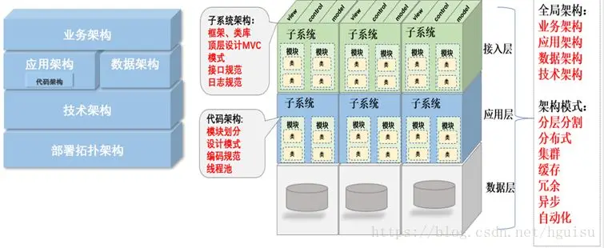
业务架构是战略，应用架构是战术，技术架构是装备。其中应用架构承上启下，一方面承接业务架构的落地，另一方面影响技术选型。
熟悉业务，形成业务架构，根据业务架构，做出相应的应用架构，最后技术架构落地实施。
如何针对当前需求，选择合适的应用架构，如何面向未来，保证架构平滑过渡，这个是软件开发者，特别是架构师，都需要深入思考的问题。

### 业务架构

包括业务规划，业务模块、业务流程，对整个系统的业务进行拆分，对领域模型进行设计，把现实的业务转化成抽象对象。

没有最优的架构，只有最合适的架构，一切系统设计原则都要以解决业务问题为最终目标。前提要搞清楚业务量有多大，增长走势是什么样，而且解决高并发的过程，一定是一个循序渐进逐步的过程。合理的架构能够提前预见业务发展 1~2 年为宜。这样可以付出较为合理的代价换来真正达到技术引领业务成长的效果。

参考京东业务架构：
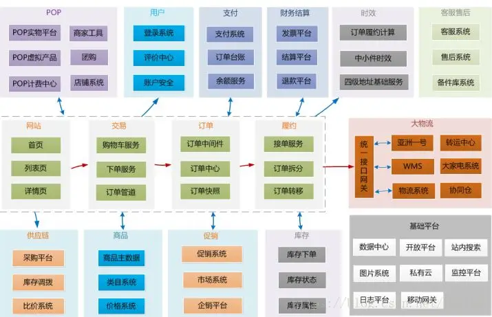

### 应用架构

硬件到应用的抽象，包括抽象层和编程接口。应用架构和业务架构是相辅相成的关系。业务架构的每一部分都有应用架构。

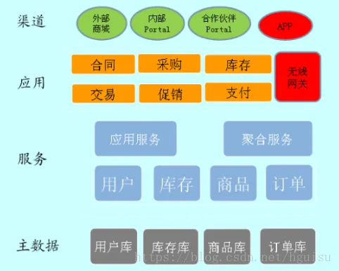

应用架构：应用作为独立可部署的单元，为系统划分了明确的边界，深刻影响系统功能组织、代码开发、部署和运维等各方面。

- 定义系统有哪些应用（各个逻辑模块或者子系统）
  - 按照功能处理顺序划分应用，比如把系统分为 web 前端/中间服务/后台任务，这是面向业务深度的划分。
  - 按照不同的业务类型划分应用，比如进销存系统可以划分为三个独立的应用，这是面向业务广度的划分。
- 应用之间如何分工和合作。
  - 合作：主要体现在应用之间的通讯机制和数据格式
    - 通讯机制可以是同步调用/异步消息/共享 DB 访问等
    - 数据格式可以是文本/XML/JSON/二进制等。
  - 分工：偏向于业务，反映业务架构，应用的合偏向于技术，影响技术架构。分降低了业务复杂度，系统更有序，合增加了技术复杂度，系统更无序。

应用架构的本质是通过系统拆分，平衡业务和技术复杂性，保证系统形散神不散。
系统采用什么样的应用架构，受业务复杂性影响，包括企业发展阶段和业务特点；同时受技术复杂性影响，包括 IT 技术发展阶段和内部技术人员水平。业务复杂性（包括业务量大）必然带来技术复杂性，应用架构目标是解决业务复杂性的同时，避免技术太复杂，确保业务架构落地。

### 数据架构

数据架构指导数据库的设计. 不仅仅要考虑开发中涉及到的数据库，实体模型，也要考虑物理架构中数据存储的设计。
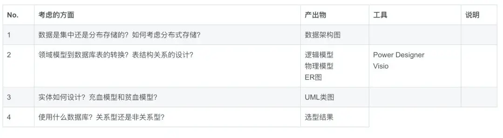

### 代码架构

也叫开发架构。主要为开发人员提供切实可行的指导，如果代码架构设计不足，就会造成影响全局的架构设计。比如公司内不同的开发团队使用不同的技术栈或者组件，结果公司整体架构设计就会失控。

- 代码单元
  - 配置设计
  - 框架、类库
- 组织代码单元
  - 编码规范，编码的惯例。
  - 项目模块划分
  - 顶层文件结构设计，比如 mvc 设计。
  - 依赖关系
    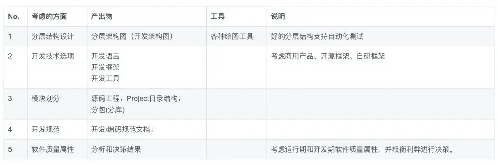

### 技术架构

技术架构：确定组成应用系统的实际运行组件之间的关系，以及部署到硬件的策略。主要考虑系统的非功能性特征，对系统的高可用、高性能、扩展、安全、伸缩性、简洁等做系统级的把握。

系统架构的设计要求架构师具备软件和硬件的功能和性能的过硬知识，这也是架构设计工作中最为困难的工作。

### 部署架构

部署拓扑架构，包括架构部署了几个节点，节点之间的关系，服务器的高可用，网路接口和协议等，决定了应用如何运行，运行的性能，可维护性，可扩展性，是所有架构的基础。这个图主要是运维工程师主要关注的对象。
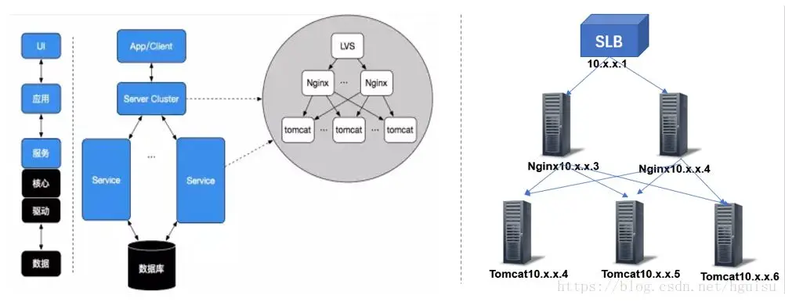

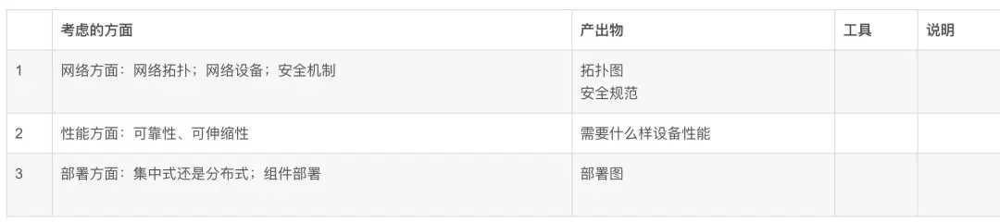

## 应用架构演进

架构演进路程：单体应用 → 分布式应用服务化 → 微服务
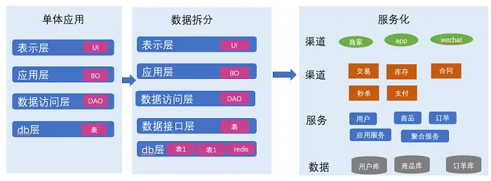

### 单体应用

单体架构的应用比较容易部署、测试， 在项目的初期，单体应用可以很好地运行。然而，随着需求的不断增加， 越来越多的人加入开发团队，代码库也在飞速地膨胀。慢慢地，单体应用变得越来越臃肿，可维护性、灵活性逐渐降低，维护成本越来越高。

### 分布式

系统按照业务功能模块拆分，将各个模块服务化，变成一个分布式系统。业务模块分别部署在不同的服务器上，各个业务模块之间通过接口进行数据交互。

该架构相对于单体架构来说，这种架构提供了负载均衡的能力，大大提高了系统负载能力，解决了网站高并发的需求。另外还有以下特点：

- 降低了耦合度：把模块拆分，使用接口通信,降低模块之间的耦合度。

- 责任清晰：把项目拆分成若干个子项目，不同的团队负责不同的子项目。

- 扩展方便：增加功能时只需要再增加一个子项目，调用其他系统的接口就可以。

- 部署方便：可以灵活的进行分布式部署。

- 提高代码的复用性：比如 Service 层，如果不采用分布式 rest 服务方式架构就会在手机 Wap 商城，微信商城，PC，Android，iOS 每个端都要写一个 Service 层逻辑，开发量大，难以维护一起升级，这时候就可以采用分布式 rest 服务方式，公用一个 service 层。

缺点：系统之间的交互要使用远程通信，接口开发增大工作量，但是利大于弊。

### 微服务

紧接着业务模式越来越复杂，各个模块都很深入，容易相互冲突，需要把分散到各个业务某一逻辑进行统一管理，透明地提供给上层应用，变成一个微内核的服务化架构，即微服务。

微服务的特点：

- 易于开发和维护：一个微服务只会关注一个特定的业务功能，所以它业务清晰、代码量较少。开发和维护单个微服务相对简单。而整个应用是由若干个微服务构建而成的，所以整个应用也会被维持在一个可控状态。

- 单个微服务启动较快：单个微服务代码量较少， 所以启动会比较快。

- 局部修改容易部署：单体应用只要有修改，就得重新部署整个应用，微服务解决了这样的问题。一般来说，对某个微服务进行修改，只需要重新部署这个服务即可。

- 技术栈不受限：在微服务架构中，可以结合项目业务及团队的特点，合理地选择技术栈。例如某些服务可使用关系型数据库 MySQL；某些微服务有图形计算的需求，可以使用 Neo4j；甚至可根据需要，部分微服务使用 Java 开发，部分微服务使用 Node.js 开发。

微服务虽然有很多吸引人的地方，但它并不是免费的午餐，使用它是有代价的。使用微服务架构面临的挑战。

- 运维要求较高：更多的服务意味着更多的运维投入。在单体架构中，只需要保证一个应用的正常运行。而在微服务中，需要保证几十甚至几百个服务服务的正常运行与协作，这给运维带来了很大的挑战。

- 分布式固有的复杂性：使用微服务构建的是分布式系统。对于一个分布式系统，系统容错、网络延迟、分布式事务等都会带来巨大的挑战。

- 接口调整成本高：微服务之间通过接口进行通信。如果修改某一个微服务的 API，可能所有使用了该接口的微服务都需要做调整。

- 重复劳动：很多服务可能都会使用到相同的功能，而这个功能并没有达到分解为一个微服务的程度，这个时候，可能各个服务都会开发这一功能，从而导致代码重复。尽管可以使用共享库来解决这个问题（例如可以将这个功能封装成公共组件，需要该功能的微服务引用该组件），但共享库在多语言环境下就不一定行得通了。

## 衡量架构合理性

架构为业务服务，没有最优的架构，只有最合适的架构，架构始终以高效，稳定，安全为目标来衡量其合理性。

合理的架构设计：

- 业务需求角度
  - 能解决当下业务需求和问题
  - 高效完成业务需求: 能以优雅且可复用的方式解决当下所有业务问题
    前瞻性设计: 能在未来一段时间都能以第 2 种方式满足业务，从而不会每次当业务进行演变时，导致架构翻天覆地的变化。
- 非业务需求角度
  - 稳定性
    - 高可用：要尽可能的提高软件的可用性，我想每个操作人都不愿意看到自己的工作无法正常进行。黑盒白盒测试、单元测试、自动化测试、故障注入测试、提高测试覆盖率等方式来一步一步推进。
  - 高效性
    - 文档化：不管是整体还是部分的整个生命周期内都必须做好文档化，变动的来源包括但不限于 BUG，需求。
    - 可扩展：软件的设计秉承着低耦合的理念去做，注意在合理的地方抽象。方便功能更改、新增和运用技术的迭代，并且支持在适时对架构做出重构。
    - 高复用：为了避免重复劳动，为了降低成本，我们希望能够重用之前的代码、之前的设计。这点对于架构环境的依赖是最大的。
  - 安全性
    - 安全：组织的运作过程中产生的数据都是具有商业价值的，保证数据的安全也是刻不容缓的一部分。以免出现 XX 门之类丑闻。加密、https 等为普遍手段

## 常见架构误区

- **误区 1——架构专门由架构师来做，业务开发人员无需关注**：架构的再好，最终还是需要代码来落地，并且组织越大这个落地的难度越大。不单单是系统架构，每个解决方案每个项目也由自己的架构，如分层、设计模式等。如果每一块砖瓦不够坚固，那么整个系统还是会由崩塌的风险。所谓“千里之堤，溃于蚁穴”。
- **误区 2——架构师确定了架构蓝图之后任务就结束了**：架构不是“空中楼阁”，最终还是要落地的，但是架构师完全不去深入到第一线怎么知道“地”在哪？怎么才能落的稳稳当当。
- **误区 3——不做出完美的架构设计不开工**：世上没有最好架构，只有最合适的架构,不要企图一步到位。我们需要的不是一下子造出一辆汽车，而是从单轮车 → 自行车 → 摩托车，最后再到汽车。想象一下 2 年后才能造出的产品，当初市场还存在吗？
- **误区 4—— 为虚无的未来埋单而过度设计**：在创业公司初期，业务场景和需求边界很难把握，产品需要快速迭代和变现，需求频繁更新，这个时候需要的是快速实现。不要过多考虑未来的扩展，说不定功能做完，效果不好就无用了。如果业务模式和应用场景边界都已经比较清晰，是应该适当的考虑未来的扩展性设计。
- **误区 5——一味追随大公司的解决方案**：由于大公司巨大成功的光环效应，再加上从大公司挖来的技术高手的影响，网站在讨论架构决策时，最有说服力的一句话就成了“淘宝就是这么搞的”或者“腾讯 就是这么搞的”。大公司的经验和成功模式固然重要，值得学习借鉴，但如果因此而变得盲从，就失去了坚持自我的勇气，在架构演化的道路上迟早会迷路。
- **误区 6——为了技术而技术**：技术是为业务而存在的，除此毫无意义。在技术选型和架构设计中，脱离网站业务发展的实际，一味追求时髦的新技术，可能会将技术发展引入崎岖小道，架构之路越走越难。考虑实现成本、时间、人员等各方面都要综合考虑，理想与现实需要折中。

## 常见前端架构

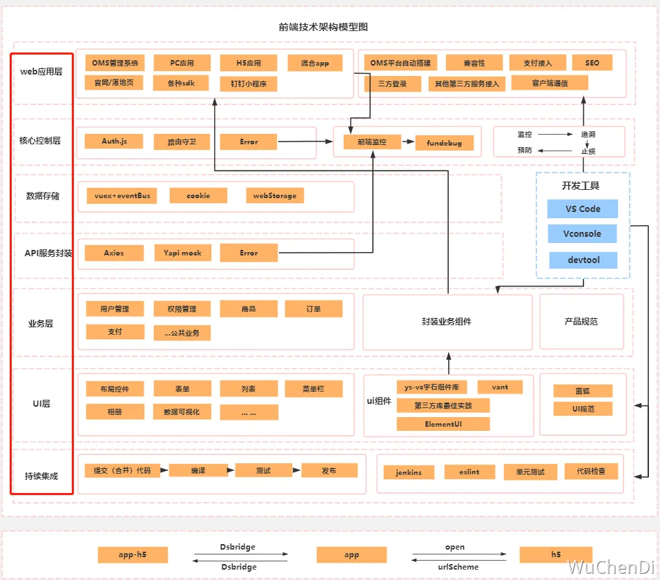

### 前后端混合架构

- 前端写好静态的 HTML 页面交付给后端开发。静态页面可以本地开发，也无需考虑业务逻辑只需要实现 View 即可。
- 后端使用模板引擎去套模板，同时内嵌一些后端提供的模板变量和一些逻辑操作。
- 前后端集成对接，遇到问题，前台返工，后台返工，直至集成成功。

前后端代码混合在一个项目里，前后端耦合严重。沟通、开发、调试、打包构建、部署都不方便，项目不容易管理和维护。

### 前后端分离架构

- 在开发阶段，前后端工程师约定好数据交互接口，实现并行开发和测试
- 在运行阶段，前后端分离部署，前后端使用 HTTP 或者其他协议进行交互请求。
- 客户端和服务端采用 RESTFul API 的交互方式进行交互

前后端代码在不同项目里，单独开发部署，互不影响，提升开发效率，易于开发维护。

前端架构级别和各级别需要考虑的因素：  
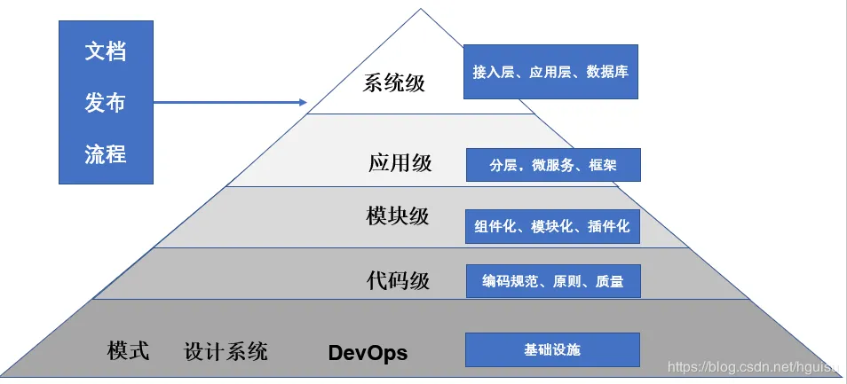

- `系统级别`：即整个系统内各部分的关系以及如何治理：分层。与后端如何交互、数据库

- `应用级别`：即单个应用的整体架构，及其与系统内单个应用的关系等。应用间数据共享、代码复用、组件共享、统一设计等

  - `适用平台`：PC web、移动 web、移动客户端、桌面客户端、小程序....
  - `技术选型`：Vue、react、Svelte、Solidjs.....
  - `脚手架`：VueCli、Cteate-Vite、Cteate-react-app....

  - `构建工具`：Vite、Webpck、Gulp....
  - `应用监控`:错误监控、性能监控、用户行为监控、用户信息监控、数据分析
  - `模式库`:
  - `设计系统`：UI 库，theme 主题，设计规范....

- `模块级别`：即应用内部的模块架构，如代码的模块化、数据和状态的管理等。代码组织、代码复用、目录构成、设计模式
  - `模块化`：应用如何划分各个模块
  - `组件化`：模块如何划分为具体的组件构成
  - `插件化`
- `代码级别`：即从代码级别保障架构实施。规范、原则、质量。使用`规范而非默契`保证项目质量

  - `代码风格`
  - `质量把控`

  - `开发流程`
  - `提交流程`
  - `测试流程`
  - `部署流程`
  - `回滚流程`

### 微前端架构

微前端架构，是多个应用组件的统一应用，这些应用可以交由多个团队来开发。要遵循统一的接口规范或者框架，以便于系统集成到一起，相互之间不存在依赖关系。

- `应用自治`：各个应用互相独立。
  - `组件与模式库`：在应用之间提供通用的 UI 组件、共享的业务组件，以及相应的通用函数功能模块，如日期转换等。
  - `应用通信机制`：设计应用间的通信机制，并提供相应的底层库支持。
  - `数据共享机制`：对于通用的数据，采取一定的策略来缓存数据，而不是每个应用单独获取自己的数据。
  - `专用的构建系统`：在某些微前端实现里，如微件化，构建系统用于构建出每个单独的应用，又可以构建出最后的整个应用。
- `单一职责`：微前端架构理应满足单一职责原则
- `技术栈无关`

## 前端发展方向

- `JavaScript 框架`：React 和 Vue.js 等现代 JavaScript 框架将继续流行，Svelte、Solidjs 这类无虚拟 dom 框架会迅速发展。
- `跨端开发框架`：随着移动互联网的普及，越来越多的应用程序需要同时兼容多个平台。因此，跨端开发框架已经成为了前端开发的一个重要的研究方向。目前比较流行的跨端开发框架包括 React Native、Flutter、taro、uni-app 等。
- `单页网站`：单页网站可以通过使用动态页面渲染技术来实现快速的页面加载，从而提高用户体验。

- `构建工具`：Vite 和 Webpack 将继续流行。
- `低代码平台`：低代码平台可以更加轻松地创建和管理应用程序。目前比较流行的低代码平台包括百度 Amis、Google G Suite 等。
- `serverLess&云服务&微前端`：随着云计算和容器化技术的不断发展，这些技术可以让开发者更加高效地构建和维护应用程序，并且能够更好地应对不断增长的数据处理需求。
- `人工智能、虚拟现实、增强现实、自然语言处理和机器学习`：新兴技术都需要前端开发人员进行相应的开发和优化。
- `WebAssembly`：将成为处理高性能计算和游戏开发的重要工具
- `PWA(渐进式 web 应用)`：将越来越受欢迎，因为它们提供了类似原生应用的体验

## web 重要性能指标

- `First Contentful Paint (FCP)`:首次内容绘制（白屏时间），从网页开始加载到网页任何部分的内容呈现在屏幕上所用的时间。
- `Largest Contentful Paint (LCP)`:最大内容绘制，从网页开始加载到屏幕上呈现最大的文本块或图片元素所用的时间。不超过 2.5s
- `Cumulative Layout Shift (CLS)`:累计布局偏移，从页面开始加载到其生命周期状态更改为隐藏期间发生的所有意外布局偏移的累计得分。不超过 0.1s
- `Interaction to Next Paint (INP)`:距离下次绘制的交互时间，包括输入延迟、处理器处理时间、页面渲染时间。输入延迟：与网页进行的每次点按、点击或键盘互动的延迟时间。 根据互动次数，此指标选择网页的最差互动延迟时间作为单个代表性值，以描述网页的整体响应能力。不超过 200ms
- `Total Blocking Time (TBT)`:总阻塞时间，从 FCP 到可交互时间 (TTI) 之间的总时长，其中主线程处于阻塞状态的时间足够长，足以阻止输入响应能力。
- `Speed Index (SI)`:速度指标, lighthouse 面板中的六大指标之一，用于衡量页面加载期间内容的绘制速度，值越小约好。
- `Time To Interactive (TTI)`:可交互时间， lighthouse 面板中的六大指标之一, 用于测量页面从开始加载到主要资源完成渲染，并能够快速、可靠地响应用户输入所需的时间

- `首字节时间 (TTFB)`:网络使用资 s 源的第一个字节响应用户请求所需的时间
- `可交互时间`:从网页开始加载到网页可以响应用户操作所用的时间
- `加载时间`:从网页开始加载到网页完全呈现给用户所用的时间
- `First Paint FP`:页面开始首次绘制的时间点
- `First Input Delay FID`:首次输入延迟，测量从用户第一次与页面交互（例如当他们单击链接、点按按钮或使用由 JavaScript 驱动的自定义控件）直到浏览器对交互作出响应，并实际能够开始处理事件处理程序所经过的时间，已被 INP 替代。

## 前端工程化

前端工程化是指将前端开发到部署过程中的一系列流程和工具进行规范和自动化，包括但不限于代码编写、测试、构建、部署等环节，从而提高开发效率、减少重复劳动、降低出错率。前端工程化的目标是让前端开发更高效、更优质。

核心概念包括规范化、模块化、打包构建、自动化部署、自动化测试和持续集成等。
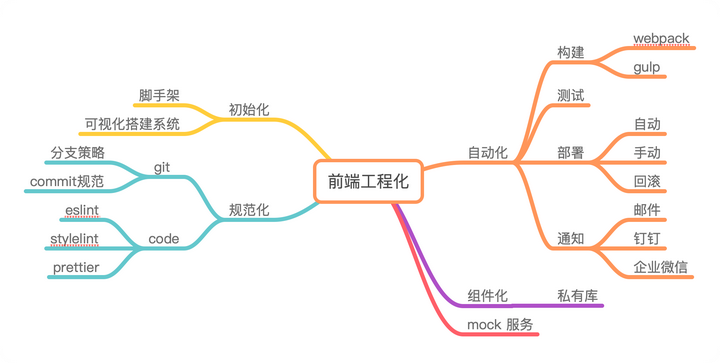

以下是一些常见的前端工程化工具：

- 代码规范：Eslint、Stylelint、commitlint
- 模块化：CommonJS、AMD、ES6 模块化等
- 包管理工具：npm、Yarn、pnpm
- 构建工具：Webpack、Rollup、Vite、Gulp
- 自动化测试工具：Jest、Mocha、Karma、Cypress、Puppeteer
- 集成工具 CI\CD：Jenkins、GitLab CI/CD、GitHub Actions
- 缺陷控制工具：钉钉 Teambition、飞书 Ones、腾讯 tapd、禅道
- 文档工具：石墨、语雀
- 接口管理：swagger、yapi

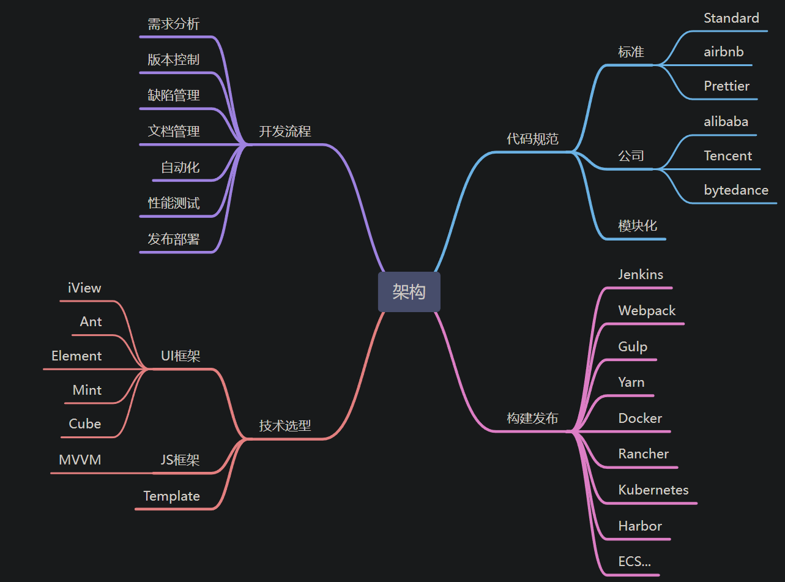

## Linux 命令

角色：

- 文件创建者(u)
- 文件创建者同组(g)
- 其它人(o)

操作权限：

- r 读权限，用数字 4 表示
- w 写权限，用数字 2 表示
- x 执行权限，用数字 1 表示

### 目录

```bash
/ 根目录
/bin 存放系统命令
/sbin 存放只有管理员才能执行的系统命令
/usr 系统资源保存目录，包含了一般不需要修改的应用程序，命令程序文件、程序库、手册和其它文档
/usr/bin 存放系统命令
/usr/sbin 存放只有管理员才能执行的系统命令

/boot 存放内核以及启动所需的文件等
/dev 存放设备文件
/etc 存放系统的配置文件
/lib 存放函数库
/home 用户文件的主目录，用户数据存放在此目录中
/root 管理员的主目录

/mnt 空目录，存放临时的映射文件系统，常把软驱和光驱挂装在这里的floppy和cdrom子目录下
/media 空目录，存放临时的映射文件系统，老式linux无该目录
/misc 空目录，存放临时的映射文件系统，老式linux无该目录
/proc 不能直接操作，存放存储进程和系统信息
/sys 不能直接操作，存放存储进程和系统信息
/tmp 存放临时文件的目录
/var 包含系统产生的经常变化的文件
```

### 快捷键

```bash
ctrl+l 清屏
ctrl+c 强制终止当前命令
ctrl+a 光标移动到命令行首
ctrl+e 光标移动到命令行尾
ctrl+u 从光标所在位置删除到行首
ctrl+z 把命令放入后台
ctrl+r 在历史命令中搜索
一次tab 补全
两次tab 提示
shift+pageup 向上翻页
shift+pagedown 向下翻页
```

### 系统操作

```bash
shutdown [-c:取消关机|-h:关机|-r:重启] 时间  #关机
shutdown -h now 立刻关机

ps aux 查看系统当前所有进程
kill 1234  强制关闭进程号为1234的进程
bg  后台执行
fg 程序回到前台

# 【df】查看磁盘分区使用状况
-I 仅显示本地磁盘(默认)
-a 显示所有文件系统的磁盘使用情况
-h 以1024进制计算最合适的单位显示磁盘容量
-H 以1000进制计算最合适的单位显示磁盘容量(新购买的U盘实际容量小于标识容量，是因为工业生产使用1000进制，而不是1024进制)
-T 显示磁盘分区类型
-t 显示指定类型文件系统的磁盘分区
-x 不显示指定类型文件系统的磁盘分区
```

### 目录操作

- 创建目录 mkdir <目录名称>
- 删除目录 rm <目录名称>
- 定位目录 cd <目录名称>
- 查看目录文件 ls ll
- 修改目录名 mv <目录名称> <新目录名称>
- 拷贝目录 cp <目录名称> <新目录名称>
- 修改文件权限 chomd 777 test.txt
- pwd 显示当前目录

### 文件操作

- 创建文件 touch <文件名称> vi <文件名称> tail <文件名称>
- 删除文件 rm <文件名称>
- 修改文件名 mv <文件名称> <新文件名称>
- 拷贝文件 cp <文件名称> <新文件名称>

- ls -a （all 的意思，包括以.开头的隐藏文件）
- ls xxx 查看文件夹（平铺展开）
- ll 查看文件夹（列表）
- ll xxx （查看 xxx 文件夹下的文件）
- mkdir xxx （创建 xxx 文件夹）
- rm -rf xxx （把 xxx 及其所有子文件全部删除）
- cd xxx （进入 xxx 目录）
- mv abc xxx （把 abc 文件重命名为 xxx 文件）
- mv xxx sss 路径 （把 xxx 文件移到 sss 路径目录）
- cp a.js a1.js （拷贝、复制 a.js 为 a1.js）
- rm a1.js （直接删除单个文件）
- touch d.js （新建文件 d.js）
- diff [options] [file|dir] [file:dir] 按行显示两个文本文件的不同
- cat xxx （查看 xxx 文件所有内容但不进入）
- head xxx （查看 xxx 文件前面几行也不进入）
- grep "babel" xxx （在 xxx 文件里查找 babel 内容）
- ln -s [原文件] [目标文件] 生成链接文件，
  - -s 选项表示生成软链接：类似快捷方式，不包含文件数据
  - 默认生成硬链接：看作同一个文件，包含文件数据
- vi d.js （新建或进入一个文件 d.js 并且进入编辑）。Vim 编辑器操作：
  - 按 i 开始编辑
  - Esc 可退出编辑模式
  - :w 保存写入
  - :q 退出
  - :wq （保存后退出）
  - :q! （强制退出，不保存）

```bash
# Vim 编辑器操作
# 底行模式
  :w    保存
  :q    退出
  :!    强制执行
  :ls   列出当前编辑器中打开的所有文件
  :n    切换到下一个文件
  :N    切换到上一个文件
  :15   光标快速定位到15行
  /xxx  从光标位置开始向后搜索第一次出现xxx的行
  ?xxx  从光标位置开始向前搜索第一次出现xxx的行

#命令模式
  h  光标左移
  j  光标下移
  k  光标上移
  l  光标右移
  Ctrl+f  向下翻页(front)
  Ctrl+b  向上翻页(back)
  ctrl+d  向下翻半页(down)
  Ctrl+u  向上翻半页(up)
  dd  删除光标所在行
  o  在光标所在行的下方插入一行并切换到输入模式
  yy  复制光标所在的行
  p  在光标所在行的下方粘贴
  P  在光标所在行的上方粘贴
```

### 搜索命令

- find [搜索范围] [搜索条件] 把所有文件都搜索一遍
- where [cmd] 搜索该命令的所在路径及帮助文档所在位置
- which [cmd] 搜索命令的所在路径及可能存在的别名
- who
- whatis
- echo $PATH 查看环境变量 path 路径
- wc [options] [file-list] 显示行数、单词数和字节数
- alias [cmd] #查看和设置系统中命令别名
  - alias 别名= '原命令'
  - unallias 别名 #删除别名
- history [选项] [历史命令保存文件] 查看使用命令的历史

### 防火墙

1. 查看防火墙状态
   `systemctl status firewalld.service`
2. 开启防火墙
   `systemctl start firewalld.service`
3. 关闭防火墙
   `systemctl stop firewalld.service`
4. 禁用防火墙
   `systemctl disable firewalld.service`
5. 防火墙开放端口，比如：

```bash
$ firewall-cmd --permanent --zone=public --add-port=80/tcp
# 防火墙中开启80端口，如果有另行配置，就开启你配置的端口
# success

$ firewall-cmd --reload
# 重新加载防火墙配置
# success

$ firewall-cmd --zone=public --query-port=80/tcp
# 查看是否生效
# yes
```
