# 🏗️ 软件架构设计完全指南

> 软件架构是系统设计的核心，是经过系统性思考和权衡后的最佳决策，本指南全面介绍架构设计的原则、分类和演进过程。

## 📚 目录导航

::: details 🔍 点击展开完整目录
- [🎯 软件开发原则](#软件开发原则)
- [🏗️ 软件架构设计](#软件架构设计)
- [📊 架构分类](#架构分类)
- [🔄 应用架构演进](#应用架构演进)
- [⚖️ 衡量架构合理性](#衡量架构合理性)
- [❌ 常见架构误区](#常见架构误区)
- [🎨 常见前端架构](#常见前端架构)
- [🐧 Linux 系统管理](#linux-系统管理)
- [🔧 运维工具链](#运维工具链)
- [📈 最佳实践](#最佳实践)
:::

## 🎯 软件开发原则

### 📋 SOLID 原则

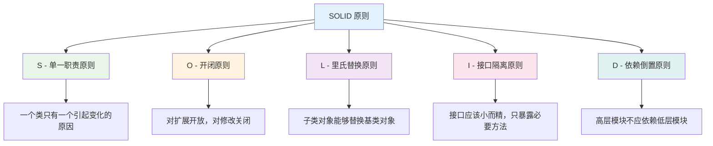

| 原则 | 描述 | 目的 | 实践建议 |
|------|------|------|----------|
| **单一职责原则** | 一个类应该只有一个引起它变化的原因 | 🎯 减少类的复杂度，提高可维护性 | 职责分离，功能单一 |
| **开闭原则** | 对扩展开放，对修改关闭 | 🔧 通过扩展实现新功能，不修改现有代码 | 使用抽象和多态 |
| **里氏替换原则** | 子类对象能够替换基类对象 | 🔄 保持继承关系的正确性 | 子类不改变父类行为 |
| **接口隔离原则** | 接口应该小而精，只暴露必要方法 | 💡 避免接口污染，提高内聚性 | 接口细化，按需暴露 |
| **依赖倒置原则** | 高层模块不应依赖低层模块 | 🏗️ 降低耦合，提高灵活性 | 依赖抽象而非具体实现 |

### 🎨 其他重要原则

#### 🔗 迪米特法则

**定义**: 一个类应当与其直接朋友通信，而不是通过朋友的朋友进行通信。

**优势**:
- 降低类之间的耦合度
- 提高系统的可维护性
- 减少信息传递链

```javascript
// ❌ 违反迪米特法则
class Order {
  constructor(customer) {
    this.customer = customer;
  }
  
  getCustomerCity() {
    return this.customer.getAddress().getCity(); // 通过朋友的朋友获取信息
  }
}

// ✅ 遵循迪米特法则
class Order {
  constructor(customer) {
    this.customer = customer;
  }
  
  getCustomerCity() {
    return this.customer.getCity(); // 直接通过朋友获取信息
  }
}

class Customer {
  constructor(address) {
    this.address = address;
  }
  
  getCity() {
    return this.address.getCity(); // 封装内部细节
  }
}
```

#### 🔄 合成复用原则

**定义**: 优先使用组合或聚合关系复用代码，而不是继承关系。

```javascript
// ❌ 使用继承
class Bird {
  fly() {
    console.log('Flying...');
  }
}

class Duck extends Bird {
  swim() {
    console.log('Swimming...');
  }
}

// ✅ 使用组合
class FlyBehavior {
  fly() {
    console.log('Flying...');
  }
}

class SwimBehavior {
  swim() {
    console.log('Swimming...');
  }
}

class Duck {
  constructor() {
    this.flyBehavior = new FlyBehavior();
    this.swimBehavior = new SwimBehavior();
  }
  
  fly() {
    this.flyBehavior.fly();
  }
  
  swim() {
    this.swimBehavior.swim();
  }
}
```

## 🏗️ 软件架构设计

### 🎯 架构设计核心

软件架构指软件系统的顶层结构，是经过系统性思考、权衡利弊之后在现有资源约束下的最合理决策。

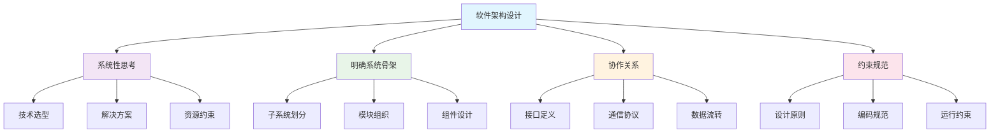

### 📊 架构师核心能力

| 能力维度 | 具体要求 | 实践方法 |
|----------|----------|----------|
| **业务理解** | 深入理解业务需求和痛点 | 🔍 需求分析、用户调研、业务建模 |
| **全局把控** | 统筹考虑系统整体架构 | 🎯 系统设计、模块划分、依赖管理 |
| **技术选型** | 选择合适的技术栈和工具 | 🔧 技术评估、POC 验证、成本分析 |
| **问题解决** | 解决关键技术难题 | 💡 技术攻关、方案对比、风险评估 |
| **团队协作** | 指导团队落地实施 | 👥 技术培训、代码审查、最佳实践 |

### 🎪 架构设计适用场景

::: tip 📋 何时需要架构设计
- **复杂需求**: 业务逻辑复杂，涉及多个子系统
- **非功能需求**: 性能、可用性、扩展性要求高
- **长期演进**: 系统生命周期长，需要持续扩展
- **组件集成**: 需要集成多个组件或第三方系统
- **流程再造**: 业务流程重构或优化需求
:::

## 📊 架构分类

### 🏗️ 架构层次图

```mermaid
graph TB
    A[架构分类] --> B[业务架构]
    A --> C[应用架构]
    A --> D[数据架构]
    A --> E[代码架构]
    A --> F[技术架构]
    A --> G[部署架构]
    
    B --> B1[业务规划]
    B --> B2[业务模块]
    B --> B3[业务流程]
    B --> B4[领域模型]
    
    C --> C1[应用划分]
    C --> C2[服务拆分]
    C --> C3[接口设计]
    C --> C4[集成方案]
    
    D --> D1[数据模型]
    D --> D2[存储设计]
    D --> D3[数据流转]
    D --> D4[数据治理]
    
    E --> E1[代码结构]
    E --> E2[框架选择]
    E --> E3[编码规范]
    E --> E4[依赖管理]
    
    F --> F1[技术栈]
    F --> F2[中间件]
    F --> F3[非功能需求]
    F --> F4[性能优化]
    
    G --> G1[部署拓扑]
    G --> G2[环境配置]
    G --> G3[监控运维]
    G --> G4[扩展策略]
    
    style A fill:#e3f2fd
    style B fill:#e8f5e8
    style C fill:#fff3e0
    style D fill:#f3e5f5
    style E fill:#fce4ec
    style F fill:#e0f2f1
    style G fill:#f1f8e9
```

### 🎯 业务架构

**定义**: 业务架构是战略层面的架构，包括业务规划、业务模块、业务流程设计。

**核心要素**:
- 业务规划: 明确业务目标和发展方向
- 业务模块: 按业务功能进行模块化拆分
- 业务流程: 设计业务处理流程
- 领域模型: 将现实业务转化为抽象对象

**京东业务架构示例**:


### 🔧 应用架构

**定义**: 应用架构是战术层面的架构，定义系统的应用边界和协作关系。

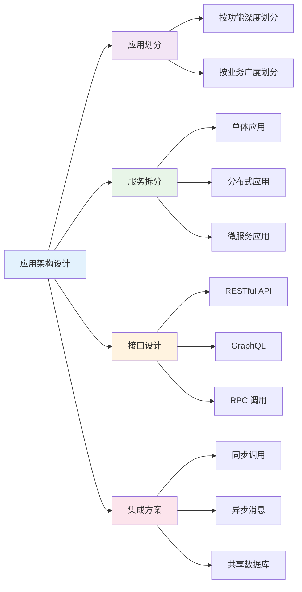

**应用架构核心原则**:
- 通过系统拆分平衡业务和技术复杂性
- 保证系统形散神不散
- 降低业务复杂度，控制技术复杂度

### 🗄️ 数据架构

**定义**: 数据架构指导数据的存储、流转和治理，包括数据模型设计和物理存储设计。

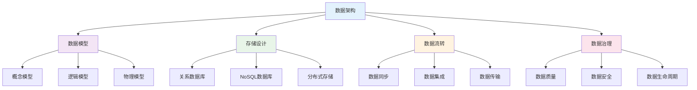

### 💻 代码架构

**定义**: 代码架构为开发人员提供切实可行的指导，包括代码组织和规范约束。

**核心内容**:
- **代码单元**: 配置设计、框架选择、类库使用
- **代码组织**: 编码规范、模块划分、文件结构
- **依赖管理**: 依赖关系、版本控制、包管理

```javascript
// 示例: MVC 架构模式
// Model - 数据模型
class UserModel {
  constructor() {
    this.users = [];
  }
  
  async getUsers() {
    // 数据访问逻辑
    return this.users;
  }
  
  async addUser(user) {
    // 数据操作逻辑
    this.users.push(user);
  }
}

// View - 视图层
class UserView {
  render(users) {
    // 渲染逻辑
    return `<div>${users.map(u => `<p>${u.name}</p>`).join('')}</div>`;
  }
}

// Controller - 控制器
class UserController {
  constructor(model, view) {
    this.model = model;
    this.view = view;
  }
  
  async handleGetUsers() {
    const users = await this.model.getUsers();
    return this.view.render(users);
  }
}
```

### 🔧 技术架构

**定义**: 技术架构确定运行组件的关系和部署策略，主要考虑非功能性需求。

**关注点**:
- 高可用性设计
- 高性能优化
- 可扩展性规划
- 安全性保障
- 可维护性提升

### 🚀 部署架构

**定义**: 部署架构定义应用的部署拓扑，包括节点关系、网络配置、运维策略。

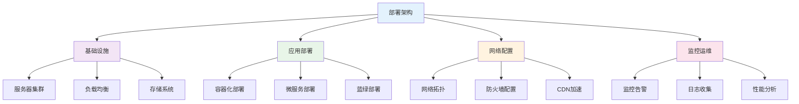

## 🔄 应用架构演进

### 📈 架构演进路径

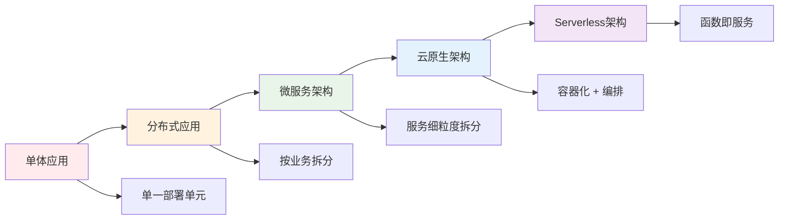

### 🏠 单体应用

**特点**:
- 所有功能在一个部署单元中
- 开发简单，部署容易
- 适合小型项目和团队

**优势**:
- 🚀 快速开发和部署
- 🔧 容易测试和调试
- 💰 运维成本低

**劣势**:
- 📈 扩展性受限
- 🔄 技术栈固定
- 👥 团队协作困难

```javascript
// 单体应用示例
class MonolithicApp {
  constructor() {
    this.userService = new UserService();
    this.orderService = new OrderService();
    this.paymentService = new PaymentService();
  }
  
  // 用户管理
  async createUser(userData) {
    return await this.userService.create(userData);
  }
  
  // 订单管理
  async createOrder(orderData) {
    return await this.orderService.create(orderData);
  }
  
  // 支付处理
  async processPayment(paymentData) {
    return await this.paymentService.process(paymentData);
  }
}
```

### 🌐 分布式应用

**特点**:
- 按业务功能模块拆分
- 各模块独立部署
- 通过接口进行通信

**优势**:
- 🔗 降低耦合度
- 🎯 职责清晰
- 📈 扩展方便
- 🚀 部署灵活

**挑战**:
- 🌐 网络通信复杂
- 🔄 分布式事务
- 📊 运维复杂度增加

```javascript
// 分布式应用示例
// 用户服务
class UserService {
  async getUser(id) {
    // 用户相关业务逻辑
    return await UserRepository.findById(id);
  }
}

// 订单服务
class OrderService {
  async createOrder(orderData) {
    // 调用用户服务验证用户
    const user = await this.userServiceClient.getUser(orderData.userId);
    
    // 创建订单
    const order = await OrderRepository.create(orderData);
    
    // 调用支付服务
    await this.paymentServiceClient.processPayment(order.id);
    
    return order;
  }
}
```

### 🔬 微服务架构

**特点**:
- 服务细粒度拆分
- 服务完全自治
- 多语言、多技术栈

**优势**:
- 🛠️ 易于开发和维护
- ⚡ 启动速度快
- 🔄 局部修改容易部署
- 🎯 技术栈不受限

**挑战**:
- 🔧 运维要求高
- 🌐 分布式系统复杂性
- 📈 接口调整成本高
- 🔄 可能的重复劳动

```javascript
// 微服务架构示例
// 用户微服务
class UserMicroservice {
  constructor() {
    this.port = 3001;
    this.app = express();
    this.setupRoutes();
  }
  
  setupRoutes() {
    this.app.get('/users/:id', async (req, res) => {
      const user = await UserRepository.findById(req.params.id);
      res.json(user);
    });
  }
}

// 订单微服务
class OrderMicroservice {
  constructor() {
    this.port = 3002;
    this.app = express();
    this.userServiceUrl = 'http://user-service:3001';
    this.setupRoutes();
  }
  
  setupRoutes() {
    this.app.post('/orders', async (req, res) => {
      // 调用用户服务
      const userResponse = await fetch(
        `${this.userServiceUrl}/users/${req.body.userId}`
      );
      const user = await userResponse.json();
      
      // 创建订单
      const order = await OrderRepository.create(req.body);
      res.json(order);
    });
  }
}
```

## ⚖️ 衡量架构合理性

### 📊 评估维度

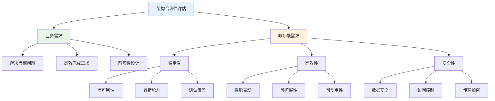

### 📈 关键指标

| 维度 | 指标 | 目标值 | 评估方法 |
|------|------|--------|----------|
| **可用性** | 系统可用时间 | 99.9% | 监控统计 |
| **性能** | 响应时间 | < 500ms | 性能测试 |
| **扩展性** | 扩容时间 | < 30min | 扩容演练 |
| **可维护性** | 代码质量 | A级 | 代码审查 |
| **安全性** | 漏洞数量 | 0个高危 | 安全扫描 |

### 🎯 最佳实践原则

::: tip 💡 架构设计原则
1. **没有最优架构，只有最合适架构**
2. **架构始终以高效、稳定、安全为目标**
3. **合理的架构能够预见业务发展1-2年**
4. **付出合理代价换取技术引领业务成长**
:::

## ❌ 常见架构误区

### 🚫 架构设计陷阱

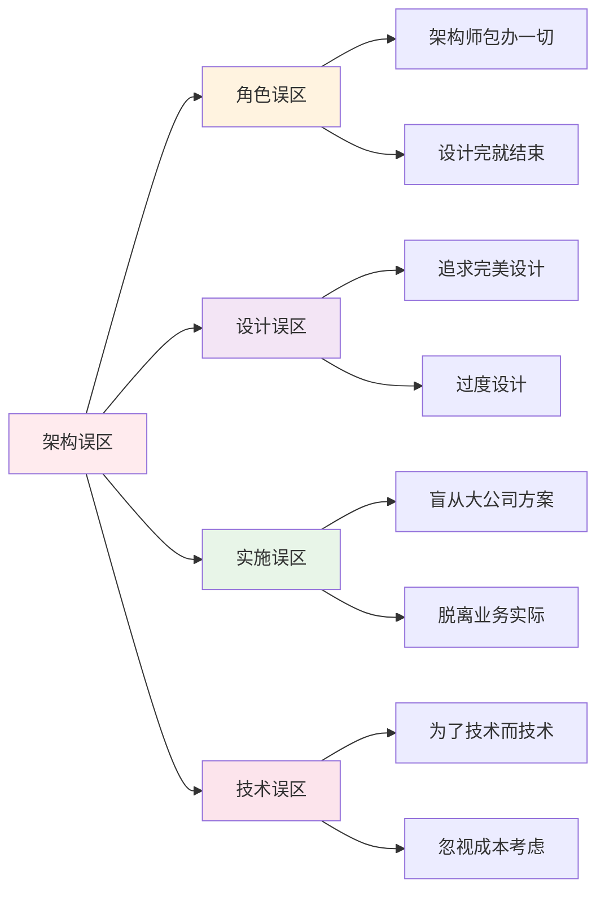

### ⚠️ 详细误区分析

#### 1. 架构专门由架构师负责

**问题**: 认为架构设计是架构师的专职工作，开发人员无需关注。

**危害**:
- 架构落地困难
- 代码质量难以保证
- 团队协作效率低

**解决方案**:
- 架构师与开发团队密切协作
- 建立架构评审机制
- 加强架构培训和指导

#### 2. 架构设计一步到位

**问题**: 企图设计出完美的架构，不开工就不满意。

**危害**:
- 错失市场机会
- 需求变化适应性差
- 投入产出比不合理

**解决方案**:
- 采用迭代式架构设计
- 最小可行架构（MVA）
- 持续演进和优化

#### 3. 过度设计未来需求

**问题**: 为虚无的未来需求买单，进行过度设计。

**危害**:
- 开发周期过长
- 系统复杂度过高
- 资源浪费

**解决方案**:
- 聚焦当前核心需求
- 预留扩展接口
- 渐进式演进

## 🎨 常见前端架构

### 🛠️ 前端技术栈

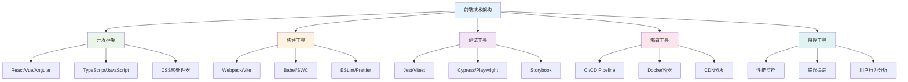

### 🔧 核心工具链

| 类别 | 工具 | 用途 | 推荐指数 |
|------|------|------|----------|
| **开发框架** | React/Vue/Angular | 前端框架 | ⭐⭐⭐⭐⭐ |
| **构建工具** | Webpack/Vite/Rollup | 项目构建 | ⭐⭐⭐⭐⭐ |
| **测试工具** | Jest/Cypress/Playwright | 自动化测试 | ⭐⭐⭐⭐ |
| **CI/CD** | GitHub Actions/Jenkins | 持续集成 | ⭐⭐⭐⭐⭐ |
| **项目管理** | Jira/Trello/Notion | 项目协作 | ⭐⭐⭐⭐ |

### 📊 前端架构模式

```javascript
// 微前端架构示例
class MicroFrontendRegistry {
  constructor() {
    this.applications = new Map();
  }
  
  register(name, config) {
    this.applications.set(name, {
      name,
      activeWhen: config.activeWhen,
      app: config.app,
      customProps: config.customProps
    });
  }
  
  async loadApp(name) {
    const config = this.applications.get(name);
    if (!config) {
      throw new Error(`Application ${name} not found`);
    }
    
    const app = await config.app();
    return app;
  }
}

// 注册微前端应用
const registry = new MicroFrontendRegistry();
registry.register('user-management', {
  activeWhen: '/user',
  app: () => import('./user-management/index.js'),
  customProps: { theme: 'dark' }
});
```

## 🐧 Linux 系统管理

### 📁 目录结构

```mermaid
graph TB
    A[Linux 目录结构] --> B[/ 根目录]
    B --> C[/bin 系统命令]
    B --> D[/usr 系统资源]
    B --> E[/etc 配置文件]
    B --> F[/home 用户目录]
    B --> G[/var 变量文件]
    B --> H[/tmp 临时文件]
    
    C --> C1[基础命令]
    D --> D1[应用程序]
    E --> E1[系统配置]
    F --> F1[用户数据]
    G --> G1[日志文件]
    H --> H1[临时数据]
    
    style A fill:#e3f2fd
    style B fill:#e8f5e8
    style C fill:#fff3e0
    style D fill:#f3e5f5
    style E fill:#fce4ec
    style F fill:#e0f2f1
    style G fill:#f1f8e9
    style H fill:#fff9c4
```

### 🔧 常用命令

#### 文件操作

::: code-group
```bash [基础操作]
# 创建目录
mkdir project
mkdir -p project/src/components

# 创建文件
touch README.md
echo "Hello World" > hello.txt

# 复制文件
cp source.txt destination.txt
cp -r source_dir/ destination_dir/

# 移动/重命名
mv old_name.txt new_name.txt
mv file.txt /path/to/destination/

# 删除文件
rm file.txt
rm -rf directory/
```

```bash [文件查看]
# 查看文件内容
cat file.txt
less file.txt
head -n 10 file.txt
tail -n 10 file.txt

# 实时查看日志
tail -f /var/log/app.log

# 查找文件
find /path -name "*.js"
find . -type f -size +100M

# 查看目录
ls -la
tree project/
```

```bash [权限管理]
# 查看权限
ls -l file.txt

# 修改权限
chmod 755 script.sh
chmod u+x script.sh

# 修改所有者
chown user:group file.txt
chown -R user:group directory/
```
:::

#### 系统管理

::: code-group
```bash [进程管理]
# 查看进程
ps aux
ps -ef | grep nginx

# 杀死进程
kill 1234
kill -9 1234
killall nginx

# 后台运行
nohup command &
screen -S session_name
```

```bash [系统监控]
# 系统信息
top
htop
vmstat 1
iostat 1

# 磁盘使用
df -h
du -sh /path/to/directory

# 内存使用
free -h
cat /proc/meminfo
```

```bash [网络管理]
# 网络连接
netstat -tuln
ss -tuln
lsof -i :8080

# 网络测试
ping google.com
curl -I http://example.com
wget http://example.com/file.zip
```
:::

#### 防火墙配置

```bash
# 查看防火墙状态
systemctl status firewalld

# 开启/关闭防火墙
systemctl start firewalld
systemctl stop firewalld

# 开放端口
firewall-cmd --permanent --add-port=8080/tcp
firewall-cmd --reload

# 查看开放端口
firewall-cmd --list-ports
```

### 📝 Vim 编辑器

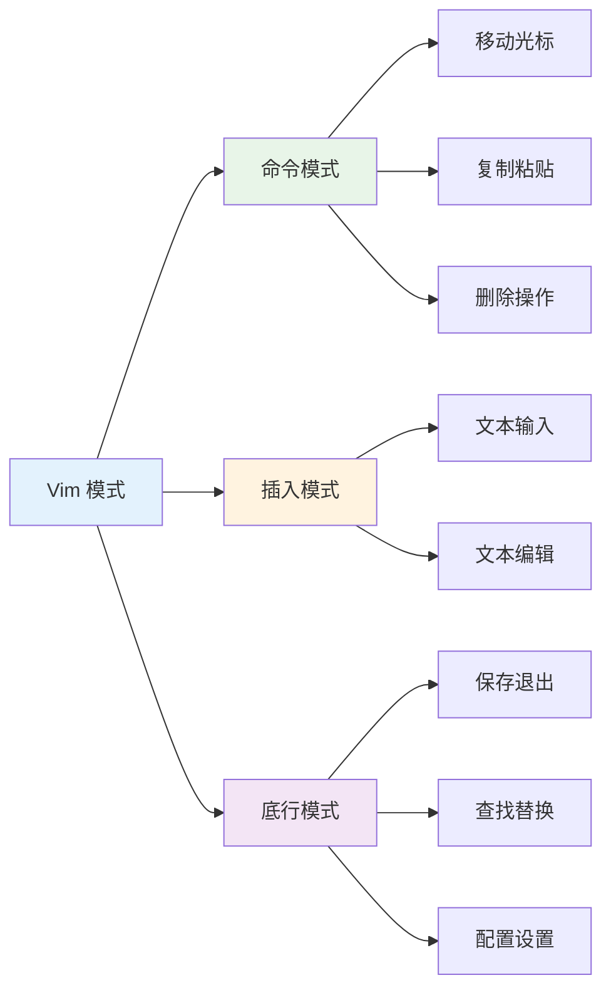

::: code-group
```bash [基础操作]
# 编辑文件
vi filename.txt
vim filename.txt

# 模式切换
i         # 进入插入模式
ESC       # 返回命令模式
:         # 进入底行模式
```

```bash [移动和编辑]
# 光标移动
h j k l   # 左下上右
0 $       # 行首行尾
gg G      # 文件开头结尾

# 复制粘贴
yy        # 复制行
p         # 粘贴
dd        # 删除行
```

```bash [保存退出]
:w        # 保存
:q        # 退出
:wq       # 保存并退出
:q!       # 强制退出
```
:::

## 🔧 运维工具链

### 🛠️ DevOps 工具生态

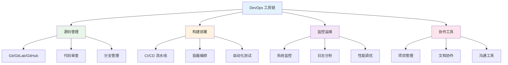

### 📊 工具分类对比

| 类别 | 工具 | 特点 | 适用场景 |
|------|------|------|----------|
| **构建工具** | Webpack/Vite/Rollup | 模块打包，资源优化 | 前端项目构建 |
| **测试工具** | Jest/Cypress/Playwright | 自动化测试，质量保证 | 测试驱动开发 |
| **CI/CD** | Jenkins/GitHub Actions | 持续集成，自动部署 | 敏捷开发流程 |
| **项目管理** | Jira/Trello/Notion | 需求管理，任务跟踪 | 团队协作 |
| **文档工具** | 语雀/Notion/GitBook | 知识管理，文档协作 | 技术文档 |

## 📈 最佳实践

### 🎯 架构设计原则

::: tip 💡 设计原则
1. **简单性优先**: 简单的架构更容易理解和维护
2. **渐进式演进**: 不要一次性设计完美架构
3. **业务驱动**: 架构设计必须服务于业务需求
4. **技术适配**: 选择团队熟悉的技术栈
5. **成本可控**: 平衡功能需求和开发成本
:::

### 🔧 实施建议

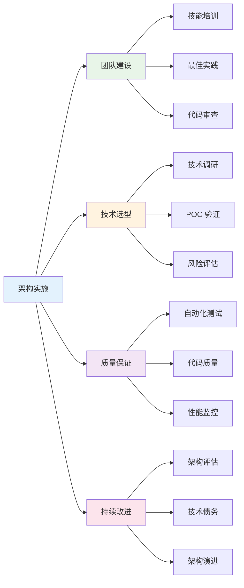

### 📊 成功指标

| 指标 | 目标 | 测量方法 |
|------|------|----------|
| **开发效率** | 提升30% | 功能交付时间 |
| **系统稳定性** | 99.9%可用性 | 监控数据统计 |
| **代码质量** | 缺陷密度<1% | 代码审查结果 |
| **团队满意度** | >4.5分 | 定期调研问卷 |

---

::: tip 🎯 总结
软件架构设计是一个系统工程，需要综合考虑业务需求、技术选型、团队能力等多个因素。成功的架构不是一蹴而就的，而是在实践中不断演进和优化的结果。记住：没有最好的架构，只有最合适的架构。
:::
