# 💰 微信支付开发完全指南

> 微信支付是腾讯公司的支付业务品牌，为用户提供安全、快捷、高效的支付服务，本指南详细介绍 JSAPI 支付的完整开发流程。

## 🎯 开发前准备

需要提前开通商户号，选择对应的经营场景

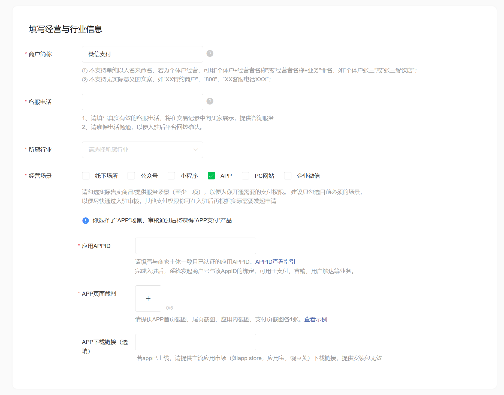

并开启对应的支付功能。

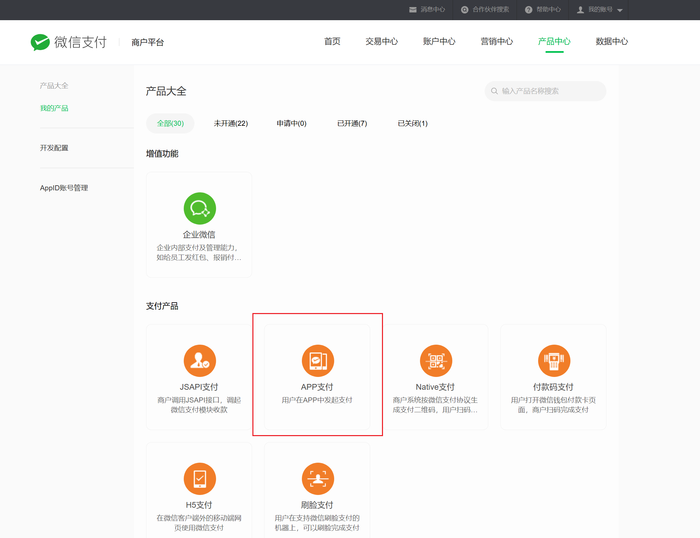

开发前准备：

- 设置安全联系人：微信支付日常安全监测发现技术异常时，会向安全联系人和超级管理员发送风险提醒。请商户超级管理员尽快设置技术同事为安全联系人，确保能及时接收异常信息评估业务风险。微信支付-> 账户中心-> 安全中心-> 安全联系人
- 熟悉微信支付接口规则：开发者需要先阅读基本规则、签名和验签规则了解调用微信支付接口的基本规则和签名规则

- 准备开发参数：在发起接口请求时的必要参数

  - 商户号 mchid:商户号 mchid 是商户在微信支付侧的唯一身份标识，所有接口调用都必须包含此参数，以便微信支付确认商户的身份。登录商户平台，点击【账户中心->商户信息】即可查看商户号
  - appid:appid 是商户在微信开放平台（移动应用）或公众平台（公众号/小程序）上申请的一个唯一标识。为了在该载体上使用微信支付功能，该 appid 必须与商户号 mchid 进行绑定

  - APIV3 密钥:微信支付会使用 APIv3 密钥加密回调信息，然后将加密后的密文回调给商户，商户接收到 APIv3 回调通知的密文后，需使用该密钥进行解密。在下载平台证书公钥时，需要使用该密钥进行解密
  - 商户 API 证书:商户发起 APIv3 接口请求时，需要使用该证书私钥生成请求签名
  - 微信支付平台证书:商户接收到 APIV3 接口的返回内容，需要使用该证书公钥进行验签，另外某些敏感信息参数(如姓名、身份证号码)也需要使用该证书公钥加密后传输
  - 微信支付公钥:作用等同于微信支付平台证书，主要用于 APIV3 接口的返回内容验签和加密敏感信息参数。

## JSAPI 支付

JSAPI 支付，提供商户在微信客户端内部浏览器网页中使用微信支付收款的能力。

**支付流程：**

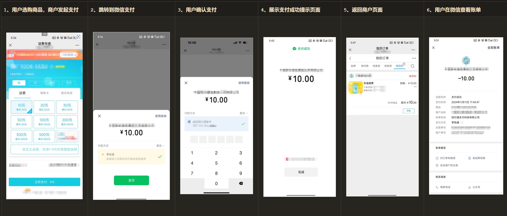

需要有关联的公众号（需要公众号 appid），并配置 JSAPI 支付授权目录：调起微信支付的商户网页地址路径，我们称之为“支付授权目录”，例如：商户支付页面https://www.weixin.com/123/pay.php的支付授权目录为：https://www.weixin.com/123/，该目录需要与商户在微信支付商户平台设置的一致。若不设置支付授权目录将无法调起支付。

订单状态流程图：
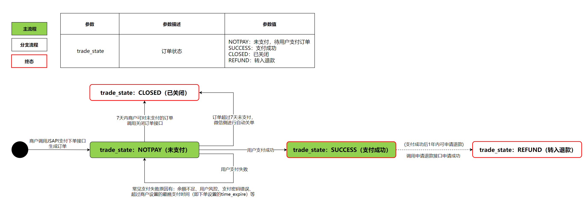
**业务流程：**
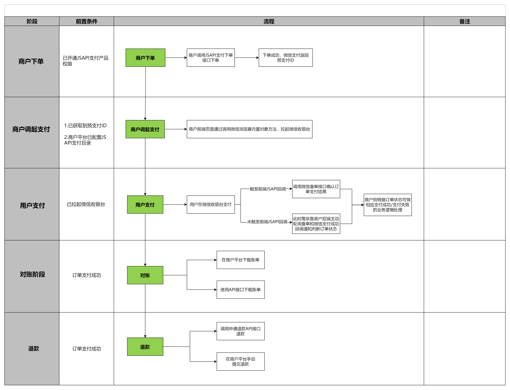

### 下单接口

用户在微信内置浏览器访问商户网页并选择微信支付后，商户需调用该接口在微信支付下单，生成用于调起支付的预支付交易会话标识(prepay_id)。

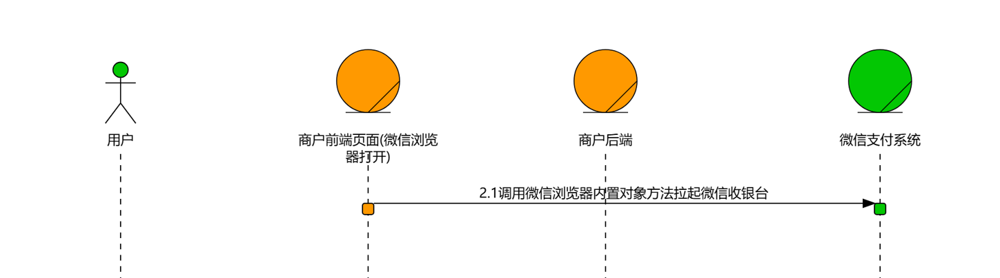

请求方式：【POST】/v3/pay/transactions/jsapi

请求域名：【主域名】https://api.mch.weixin.qq.com 使用该域名将访问就近的接入点

请求头设置：

```bash
# 签名认证生成认证信息
Authorization: WECHATPAY2-SHA256-RSA2048 mchid=\"1900000001\",...
Accept: application/json
Content-Type: application/json
```

请求参数：

```js
  {
    // 公众账号id：与mchid有绑定关系的商户公众号唯一标识：appid
    "appid" : "wxd678efh567hg6787",
    // 商户号：微信支付系统生成并分配给每个商户的唯一标识符
    "mchid" : "1230000109",
    // 商品信息描述，用户微信账单的商品字段中可见
    "description" : "Image形象店-深圳腾大-QQ公仔",
    // 【商户订单号】商户系统内部订单号，要求6-32个字符内，只能是数字、大小写字母_-|* 且在同一个商户号下唯一
    "out_trade_no" : "1217752501201407033233368018",
    // 支付结束时间，格式为yyyy-MM-ddTHH:mm:ss+TIMEZONE，yyyy-MM-dd表示年月日，T出现在字符串中，表示time元素的开头，HH:mm:ss表示时分秒，TIMEZONE表示时区（+08:00表示东八区时间，领先UTC 8小时，即北京时间）。可选
    "time_expire" : "2018-06-08T10:34:56+08:00",
    // 【商户数据包】商户在创建订单时可传入自定义数据包，该数据对用户不可见，用于存储订单相关的商户自定义信息，其总长度限制在128字符以内。支付成功后查询订单API和支付成功回调通知均会将此字段返回给商户，并且该字段还会体现在交易账单。可选
    "attach" : "自定义数据说明",
    // 【商户回调地址】商户接收支付成功回调通知的地址，需按照notify_url填写注意事项规范填写。
    "notify_url" : " https://www.weixin.qq.com/wxpay/pay.php",
    // 【订单优惠标记】代金券在创建时可以配置多个订单优惠标记，标记的内容由创券商户自定义设置。可选
    "goods_tag" : "WXG",
    // 【电子发票入口开放标识】 传入true时，支付成功消息和支付详情页将出现开票入口。需要在微信支付商户平台或微信公众平台开通电子发票功能，传此字段才可生效。可选
    "support_fapiao" : false,
    // 订单金额】订单金额信息
    "amount" : {
      // 【总金额】 订单总金额，单位为分，整型。
      "total" : 100,
      // 【支付币种】固定传：CNY，代表人民币。可选
      "currency" : "CNY"
    },
    // 【支付者】支付者信息
    "payer" : {
      // 用户平台标识：用户在商户appid下的唯一标识。下单前需获取到用户的OpenID
      "openid" : "ovqdowRIfstpQK_kYShFS2MSS9XS"
    },
    // 【优惠功能】 优惠功能 可选
    "detail" : {
      "cost_price" : 608800, //【订单原价】可选
      "invoice_id" : "微信123", //【商品小票ID】 商家小票ID可选
      "goods_detail" : [ //【单品列表】 单品列表信息 可选
        {
          // 【商户侧商品编码】 由半角的大小写字母、数字、中划线、下划线中的一种或几种组成。
          "merchant_goods_id" : "1246464644",
          // 【微信支付商品编码】 微信支付定义的统一商品编号（没有可不传）
          "wechatpay_goods_id" : "1001",
          // 【商品名称】 商品的实际名称 可选
          "goods_name" : "iPhoneX 256G",
          // 【商品数量】 用户购买的数量
          "quantity" : 1,
          // 【商品单价】整型，单位为：分。如果商户有优惠，需传输商户优惠后的单价
          "unit_price" : 528800
        }
      ]
    },
    // 【场景信息】 场景信息 可选
    "scene_info" : {
      // 【用户终端IP】 用户的客户端IP，支持IPv4和IPv6两种格式的IP地址。
      "payer_client_ip" : "14.23.150.211",
      // 【商户端设备号】 商户端设备号（门店号或收银设备ID）可选
      "device_id" : "013467007045764",
      // 【商户门店信息】 商户门店信息 可选
      "store_info" : {
        // 【门店编号】商户侧门店编号，总长度不超过32字符。
        "id" : "0001",
        // 【门店名称】 商户侧门店名称 可选
        "name" : "腾讯大厦分店",
        // 【地区编码】 地区编码 可选
        "area_code" : "440305",
        // 【详细地址】 详细的商户门店地址 可选
        "address" : "广东省深圳市南山区科技中一道10000号"
      }
    },
    // 结算信息 可选
    "settle_info" : {
      // 【分账标识】订单的分账标识在下单时设置，传入true表示在订单支付成功后可进行分账操作
      "profit_sharing" : false
    }
  }
```

应答参数：

- status_code': 200
- prepay_id：【预支付交易会话标识】预支付交易会话标识，JSAPI 调起支付时需要使用的参数，有效期为 2 小时，失效后需要重新请求该接口以获取新的 prepay_id。

### 发起支付

商户通过 JSAPI 下单接口获取到发起支付的必要参数 prepay_id 后，再通过微信浏览器内置对象方法(WeixinJSBridge)调起微信支付收银台。


```js
function onBridgeReady() {
  WeixinJSBridge.invoke(
    "getBrandWCPayRequest",
    {
      appId: "wx2421b1c4370ec43b", //公众号ID，由商户传入
      timeStamp: "1395712654", //时间戳，自1970年以来的秒数
      nonceStr: "e61463f8efa94090b1f366cccfbbb444", //随机串
      // JSAPI下单接口返回的prepay_id参数值，提交格式如：prepay_id=***。
      package: "prepay_id=wx21201855730335ac86f8c43d1889123400",
      signType: "RSA", //微信签名方式：固定填RSA。
      // 微信签名，使用字段appId、timeStamp、nonceStr、package计算得出的签名值 注意：取值RSA格式
      paySign:
        "oR9d8PuhnIc+YZ8cBHFCwfgpaK9gd7vaRvkYD7rthRAZ/X+QBhcCYL21N7cHCTUxbQ+EAt6Uy+lwSN22f5YZvI45MLko8Pfso0jm46v5hqcVwrk6uddkGuT+Cdvu4WBqDzaDjnNa5UK3GfE1Wfl2gHxIIY5lLdUgWFts17D4WuolLLkiFZV+JSHMvH7eaLdT9N5GBovBwu5yYKUR7skR8Fu+LozcSqQixnlEZUfyE55feLOQTUYzLmR9pNtPbPsu6WVhbNHMS3Ss2+AehHvz+n64GDmXxbX++IOBvm2olHu3PsOUGRwhudhVf7UcGcunXt8cqNjKNqZLhLw4jq/xDg==",
    },
    // 回调函数：用户从微信收银台返回商户页面时会触发
    function (res) {
      // 端回调并不保证它绝对可靠，不可只依赖前端回调判断订单支付状态，订单状态需以后端查询订单和支付成功回调通知为准。
      if (res.err_msg == "get_brand_wcpay_request:ok") {
        //调用后端接口查单，如果订单已支付则展示支付成功页面。
      } else if (res.err_msg == "get_brand_wcpay_request:cancel") {
        // 用户取消支付，商户可自行处理展示。
      } else if (res.err_msg == "get_brand_wcpay_request:fail") {
        // 支付失败，展示订单支付失败结果。
      }
    }
  );
}

if (typeof WeixinJSBridge == "undefined") {
  if (document.addEventListener) {
    document.addEventListener("WeixinJSBridgeReady", onBridgeReady, false);
  } else if (document.attachEvent) {
    document.attachEvent("WeixinJSBridgeReady", onBridgeReady);
    document.attachEvent("onWeixinJSBridgeReady", onBridgeReady);
  }
} else {
  onBridgeReady();
}
```

### 查询订单

订单支付成功后，商户可通过微信交易订单号或使用商户订单号查询订单；若订单未支付，则只能使用商户订单号查询订单

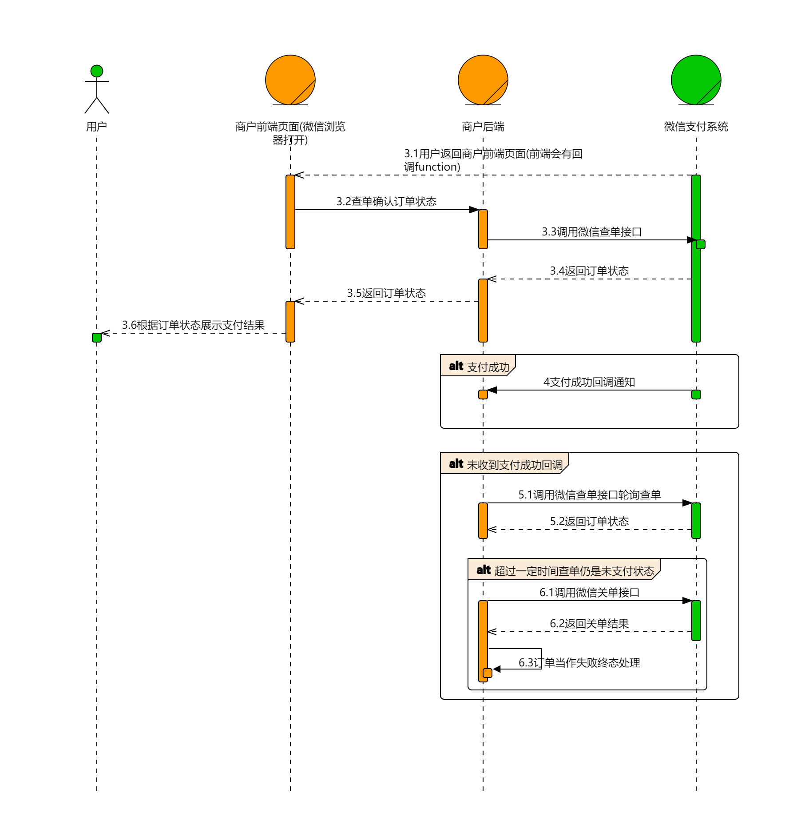

请求头：

```bash
# 签名认证生成认证信息
Authorization: WECHATPAY2-SHA256-RSA2048 mchid=\"1900000001\",...
Accept: application/json
```

1. 【微信支付订单号】查询订单
   请求方式：【GET】/v3/pay/transactions/id/{transaction_id}?mchid={mchid}

请求域名：【主域名】https://api.mch.weixin.qq.com 使用该域名将访问就近的接入点。

路径参数：transaction_id：【微信支付订单号】 微信支付侧订单的唯一标识，订单支付成功后，支付成功回调通知和商户订单号查询订单会返回该参数

查询参数：mchid：【商户号】商户下单时传入的商户号。 2. 【商户订单号】查询订单
请求方式：【GET】/v3/pay/transactions/out-trade-no/{out_trade_no}?mchid={mchid}

请求域名：【主域名】https://api.mch.weixin.qq.com 使用该域名将访问就近的接入点

路径参数：out_trade_no：【商户订单号】 商户下单时传入的商户系统内部订单号。

查询参数：mchid：【商户号】商户下单时传入的商户号。 3. 应答参数：

- status_code': 200

```js
{
  "appid" : "wxd678efh567hg6787",
  "mchid" : "1230000109",
  // 【商户订单号】商户下单时传入的商户系统内部订单号。
  "out_trade_no" : "1217752501201407033233368018",
  // 【微信支付订单号】 微信支付侧订单的唯一标识。
  "transaction_id" : "1217752501201407033233368018",
  // 【交易类型】JSAPI:公众号、小程序支付，NATIVE：Native支付，APP：APP支付，MICROPAY：付款码支付，MWEB：H5支付，FACEPAY:刷脸支付
  "trade_type" : "APP",
  // 【交易状态】 返回订单当前交易状态 SUCCESS：支付成功，REFUND：转入退款，NOTPAY：未支付，CLOSED：已关闭，REVOKED：已撤销（仅付款码支付），USERPAYING：用户支付中（仅付款码支付），PAYERROR：支付失败/异常（仅付款码支付）
  "trade_state" : "SUCCESS",
  // 【交易状态描述】 对交易状态的详细说明。
  "trade_state_desc" : "支付成功",
  // 【银行类型】 用户支付方式说明，订单支付成功后返回，格式为银行简码_具体类型(DEBIT借记卡/CREDIT信用卡/ECNY数字人民币)，例如ICBC_DEBIT代表工商银行借记卡，非银行卡支付类型(例如余额/零钱通等)统一为OTHERS
  "bank_type" : "CMC",
  "attach" : "自定义数据",
  // 支付完成时间
  "success_time" : "2018-06-08T10:34:56+08:00",
  "payer" : {
    "openid" : "oUpF8uMuAJO_M2pxb1Q9zNjWeS6o\t"
  },
  "amount" : {
    "total" : 100,
    // 【用户支付金额】用户实际支付金额，整型，单位为分，用户支付金额=总金额-代金券金额。
    "payer_total" : 90,
    "currency" : "CNY",
    "payer_currency" : "CNY"
  },
  "scene_info" : {
    "device_id" : "013467007045764"
  },
  //  代金券信息，当订单有使用代金券时
  "promotion_detail" : [
    {
      // 【券ID】 代金券id，微信为代金券分配的唯一标识，创券商户调用发放指定批次的代金券时返回的代金券ID
      "coupon_id" : "109519",
      // 【优惠名称】 优惠名称，创券商户创建代金券批次时传入的批次名称stock_name。
      "name" : "单品惠-6",
//【优惠范围】优惠活动中代金券的适用范围，分为两种类型：
// 1、GLOBAL：全场代金券-以订单整体可优惠的金额为优惠门槛的代金券；
// 2、SINGLE：单品优惠-以订单中具体某个单品的总金额为优惠门槛的代金券
      "scope" : "SINGLE",
// 【优惠类型】代金券资金类型，优惠活动中代金券的结算资金类型，分为两种类型：
// 1、CASH：预充值-带有结算资金的代金券，会随订单结算给订单收款商户；
// 2、NOCASH：免充值-不带有结算资金的代金券，无资金结算给订单收款商户。
      "type" : "CASH",
      // 【优惠券面额】代金券优惠的金额。
      "amount" : 10,
      // 【活动ID】单张代金券所对应的批次号
      "stock_id" : "931386",
      // 【微信出资】微信出资金额，单位为分。
      "wechatpay_contribute" : 0,
      // 【商家出资】商家出资金额，单位为分。
      "merchant_contribute" : 10,
      // 【其他出资】其他出资金额，单位为分。
      "other_contribute" : 0,
      // 优惠币种 代金券金额所对应的货币种类：固定为：CNY，人民币。
      "currency" : "CNY",
      // 【单品列表】scope为SINGLE（单品优惠）时返回该参数
      "goods_detail" : [
        {
          "goods_id" : "M1006",//【商品编码】
          "quantity" : 1,//【商品数量】
          "unit_price" : 100,//【商品单价】
          "discount_amount" : 10,//【商品优惠金额】
          //【商品备注】创券商户在商户平台创建单品券时设置
          "goods_remark" : "商品备注信息"
        }
      ]
    }
  ]
}
```

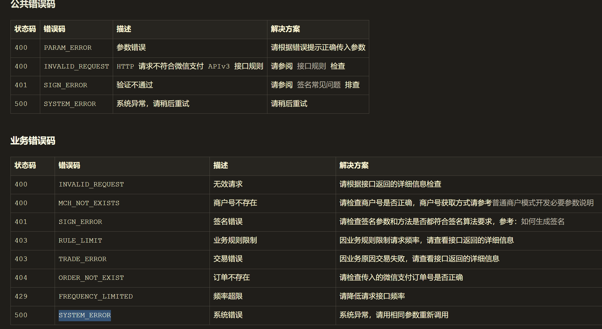

### 关闭订单

未支付状态的订单，可在无需支付时调用此接口关闭订单。常见关单情况包括：

- 用户在商户系统提交取消订单请求，商户需执行关单操作。
- 订单超时未支付（超出商户系统设定的可支付时间或下单时的 time_expire 支付截止时间），商户需进行关单处理。

请求方式：【POST】/v3/pay/transactions/out-trade-no/{out_trade_no}/close

请求域名：【主域名】https://api.mch.weixin.qq.com 使用该域名将访问就近的接入点

```bash
curl -X POST \
  https://api.mch.weixin.qq.com/v3/pay/transactions/out-trade-no/1217752501201407033233368018/close \
  -H "Authorization: WECHATPAY2-SHA256-RSA2048 mchid=\"1900000001\",..." \
  -H "Accept: application/json" \
  -H "Content-Type: application/json" \
  -d '{
    "mchid" : "1900000001"
  }'
```

返回：204 No Content

### 支付成功回调通知

用户使用普通支付（APP 支付/H5 支付/JSAPI 支付/Native 支付/小程序支付）功能，当用户成功支付订单后，微信支付会通过 POST 的请求方式，向商户预先设置的回调地址(APP 支付/H5 支付/JSAPI 支付/Native 支付/小程序支付下单接口传入的 notify_url)发送回调通知，让商户知晓用户已完成支付。

若商户应答回调接收失败，或超时(5s)未应答时，微信支付会按照（15s/15s/30s/3m/10m/20m/30m/30m/30m/60m/3h/3h/3h/6h/6h）的频次重复发送回调通知，直至微信支付接收到商户应答成功，或达到最大发送次数（15 次）

注意： 商户侧对微信支付回调 IP 有防火墙策略限制的，需要对微信回调 IP 段开通白名单，否则会导致收不到回调。

回调报文的 HTTP 请求头中会包含报文的签名信息，用于后续验签:

```bash
Wechatpay-Serial:验签的微信支付平台证书序列号/微信支付公钥ID
Wechatpay-Signature:验签的签名值
Wechatpay-Timestamp:验签的时间戳
Wechatpay-Nonce:验签的随机串
```

回调通知的请求主体中会包含 JSON 格式的通知参数:

```js
{
// 【通知ID】回调通知的唯一编号。
  "id": "EV-2018022511223320873",
  // 本次回调通知创建的时间。
  "create_time": "2015-05-20T13:29:35+08:00",
  // 【通知数据类型】通知的资源数据类型，固定为encrypt-resource。
  "resource_type": "encrypt-resource",
  // 【通知的类型】微信支付回调通知的类型。
  "event_type": "TRANSACTION.SUCCESS",
  // 【回调摘要】微信支付对回调内容的摘要备注。
  "summary": "支付成功",
  // 【通知数据】通知资源数据。
  "resource": {
    // 【原始回调类型】加密前的对象类型，为transaction。
      "original_type": "transaction",
      // 【加密算法类型】目前为AEAD_AES_256_GCM，开发者需要使用同样类型的数据进行解密。
      "algorithm": "AEAD_AES_256_GCM",
// 【数据密文】Base64编码后的回调数据密文，商户需Base64解码并使用APIV3密钥解密:
// 1. 获取商户平台上设置的APIv3密钥，记为key；
// 2. 通过回调通知参数resource.algorithm确认加密算法:目前仅支持AEAD_AES_256_GCM
// 3. 使用key与回调通知参数resource.nonce和resource.associated_data，对数据密文resource.ciphertext进行解密，最终可得到JSON格式的订单信息。
      "ciphertext": "",
      // 【附加数据】参与解密的附加数据，该字段可能为空。
      "associated_data": "",
      // 【随机串】参与解密的随机串
      "nonce": ""
  }
}
```

商户接收到回调通知报文后，需在 5 秒内完成对报文的验签，并应答回调通知。

- 验签通过：商户需告知微信支付接收回调成功，HTTP 应答状态码需返回 200 或 204，无需返回应答报文。

- 验签不通过：商户需告知微信支付接收回调失败，HTTP 应答状态码需返回 5XX 或 4XX，同时需返回以下应答报文：

```js
{
  // 【返回状态码】商户验签不通过时返回FAIL，代表回调接收失败。
  "code": "FAIL",
  // 【返回信息】返回信息，回调接收失败原因。
  "message": "失败"
}
```

验签需使用请求头中的【Wechatpay-Timestamp】、【Wechatpay-Nonce】以及请求主体中 JSON 格式的通知参数构建出验签串，然后使用【Wechatpay-Serial】对应的微信支付平台证书/微信支付公钥对验签串和【Wechatpay-Signature】进行验签，确保接收的回调内容是来自微信支付。

### 申请退款

在交易完成后的一年内（以支付成功时间为起点+365 天计算），若因用户或商户方面导致需进行订单退款，商户可通过此接口将支付金额的全部或部分原路退还至用户。

> 申请退款接口返回成功仅表示退款单已受理成功，具体的退款结果需依据退款结果通知及查询退款的返回信息为准。
> 在申请退款失败后进行重试时，请务必使用原商户退款单号，以避免因重复退款而导致的资金损失。

请求方式：【POST】/v3/refund/domestic/refunds

请求域名：【主域名】https://api.mch.weixin.qq.com 使用该域名将访问就近的接入点

```bash
curl -X POST \
  https://api.mch.weixin.qq.com/v3/refund/domestic/refunds \
  -H "Authorization: WECHATPAY2-SHA256-RSA2048 mchid=\"1900000001\",..." \
  -H "Accept: application/json" \
  -H "Content-Type: application/json" \
  -d '{
    "transaction_id" : "1217752501201407033233368018",
    "out_trade_no" : "1217752501201407033233368018",
    # 商户退款单号】 商户系统内部的退款单号，商户系统内部唯一，只能是数字、大小写字母_-|*@ ，同一商户退款单号多次请求只退一笔。不可超过64个字节数。
    "out_refund_no" : "1217752501201407033233368018",
    # 【退款原因】该原因将在下发给用户的退款消息中显示
    "reason" : "商品已售完",
    # 【退款结果回调url】 异步接收微信支付退款结果通知的回调地址，通知url必须为外网可访问的url，不能携带参数
    "notify_url" : "https://weixin.qq.com",
    # 退款资金来源
    # AVAILABLE: 仅对旧资金流商户适用:可用余额账户出资
    # UNSETTLED: 仅对出行预付押金退款适用，指定从未结算资金出资。
    "funds_account" : "AVAILABLE",
    "amount" : {
      "refund" : 888,
      "from" : [
        {
          "account" : "AVAILABLE",
          "amount" : 444
        }
      ],
      "total" : 888,
      "currency" : "CNY"
    },
    "goods_detail" : [
      {
        "merchant_goods_id" : "1217752501201407033233368018",
        "wechatpay_goods_id" : "1001",
        "goods_name" : "iPhone6s 16G",
        "unit_price" : 528800,
        "refund_amount" : 528800,
        "refund_quantity" : 1
      }
    ]
  }'
```

应答参数：

```js
{
  // 【微信支付退款订单号】申请退款受理成功时，该笔退款单在微信支付侧生成的唯一标识。
  "refund_id" : "50000000382019052709732678859",
  // 【商户退款单号】 商户申请退款时传的商户系统内部退款单号。
  "out_refund_no" : "1217752501201407033233368018",
  "transaction_id" : "1217752501201407033233368018",
  "out_trade_no" : "1217752501201407033233368018",
  // 【退款渠道】 ORIGINAL: 原路退款 BALANCE: 退回到余额 OTHER_BALANCE: 原账户异常退到其他余额账户 OTHER_BANKCARD: 原银行卡异常退到其他银行卡(发起异常退款成功后返回)
  "channel" : "ORIGINAL",
  // 退款入账账户 取当前退款单的退款入账方
  "user_received_account" : "招商银行信用卡0403",
  // 退款成功时间
  "success_time" : "2020-12-01T16:18:12+08:00",
  // 微信受理退款申请单的时间。
  "create_time" : "2020-12-01T16:18:12+08:00",
  // 【退款状态】 SUCCESS: 退款成功 CLOSED: 退款关闭 PROCESSING: 退款处理中 ABNORMAL: 退款异常，退款到银行发现用户的卡作废或者冻结了
  "status" : "SUCCESS",
  // 【资金账户】 退款所使用资金对应的资金账户类型
  "funds_account" : "UNSETTLED",
  "amount" : {
    "total" : 100,
    "refund" : 100,
    "from" : [
      {
        "account" : "AVAILABLE",
        "amount" : 444
      }
    ],
    "payer_total" : 90,
    "payer_refund" : 90,
    "settlement_refund" : 100,
    "settlement_total" : 100,
    "discount_refund" : 10,
    "currency" : "CNY",
    "refund_fee" : 100
  },
  "promotion_detail" : [
    {
      "promotion_id" : "109519",
      "scope" : "GLOBAL",
      "type" : "COUPON",
      "amount" : 5,
      "refund_amount" : 100,
      "goods_detail" : [
        {
          "merchant_goods_id" : "1217752501201407033233368018",
          "wechatpay_goods_id" : "1001",
          "goods_name" : "iPhone6s 16G",
          "unit_price" : 528800,
          "refund_amount" : 528800,
          "refund_quantity" : 1
        }
      ]
    }
  ]
}
```

### 查询退款

请求方式：【GET】/v3/refund/domestic/refunds/{out_refund_no}

请求域名：【主域名】https://api.mch.weixin.qq.com 使用该域名将访问就近的接入点

路径参数 out_refund_no：【商户退款单号】 商户申请退款时传入的商户系统内部退款单号。

```bash
curl -X GET \
  https://api.mch.weixin.qq.com/v3/refund/domestic/refunds/1217752501201407033233368018 \
  -H "Authorization: WECHATPAY2-SHA256-RSA2048 mchid=\"1900000001\",..." \
  -H "Accept: application/json"
```

应答参数和退款单信息相同；

### 发起异常退款

提交退款申请后，退款结果通知或查询退款确认状态为退款异常，可调用此接口发起异常退款处理。支持退款至用户、退款至交易商户银行账户两种处理方式。

> 退款至用户时，仅支持以下银行的借记卡：招行、交通银行、农行、建行、工商、中行、平安、浦发、中信、光大、民生、兴业、广发、邮储、宁波银行

请求方式：【POST】/v3/refund/domestic/refunds/{refund_id}/apply-abnormal-refund

请求域名：【主域名】https://api.mch.weixin.qq.com 使用该域名将访问就近的接入点

路径参数 refund_id：【微信支付退款单号】申请退款受理成功时，该笔退款单在微信支付侧生成的唯一标识。

```bash
curl -X POST \
  https://api.mch.weixin.qq.com/v3/refund/domestic/refunds/50000000382019052709732678859/apply-abnormal-refund \
  -H "Authorization: WECHATPAY2-SHA256-RSA2048 mchid=\"1900000001\",..." \
  -H "Accept: application/json" \
  -H "Wechatpay-Serial: 5157F09EFDC096DE15EBE81A47057A7232F1B8E1"  \
  -H "Content-Type: application/json" \
  -d '{
  # 【商户退款单号】商户申请退款时传入的商户系统内部退款单号。
    "out_refund_no" : "1217752501201407033233368018",
  # 【异常退款处理方式】 可选：退款至用户银行卡USER_BANK_CARD、退款至交易商户银行账户MERCHANT_BANK_CARD
    "type" : "USER_BANK_CARD",
    # 银行类型，采用字符串类型的银行标识
    "bank_type" : "ICBC_DEBIT",
    # 收款银行卡号】用户的银行卡账号，该字段需要使用微信支付公钥加密（推荐）
    "bank_account" : "d+xT+MQCvrLHUVDWv/8MR/dB7TkXLVfSrUxMPZy6jWWYzpRrEEaYQE8ZRGYoeorwC+w==",
    # 【收款用户姓名】 收款用户姓名，该字段需要使用微信支付公钥加密（推荐）
    "real_name" : "UPgQcZSdq3zOayJwZ5XLrHY2dZU1W2Cd"
  }'
```

应答参数同退款单。

### 退款结果回调通知

用户支付完成后，商户可根据需求发起退款。当退款单状态发生变更时（变更为退款成功/退款关闭/退款异常），微信支付会通过 POST 的请求方式，向商户预先设置的退款回调地址(申请退款传入的 notfiy_url)发送回调通知，让商户知晓退款单的处理结果。

回调报文的 HTTP 请求头中会包含报文的签名信息，用于后续验签:

```bash
Wechatpay-Serial:验签的微信支付平台证书序列号/微信支付公钥ID
Wechatpay-Signature:验签的签名值
Wechatpay-Timestamp:验签的时间戳
Wechatpay-Nonce:验签的随机串
```

报文参数同支付成功回调通知：

```js
{
  "id":"EV-2018022511223320873",
  "create_time":"2018-06-08T10:34:56+08:00",
  "resource_type":"encrypt-resource",
  "event_type":"REFUND.SUCCESS",
  "summary":"退款成功",
  "resource" : {
  "algorithm":"AEAD_AES_256_GCM",
  "original_type": "refund",
      "ciphertext": "...",
      "nonce": "...",
      "associated_data": ""
  }
}
```

### 申请交易账单

微信支付在每日 10 点后生成昨日交易账单文件，商户可通过接口获取账单下载链接。账单包含交易金额、时间及营销信息，利于订单核对、退款审查及银行到账确认。

请求方式：【GET】/v3/bill/tradebill

请求域名：【主域名】https://api.mch.weixin.qq.com 使用该域名将访问就近的接入点

查询参数：
| 参数名 | 类型 | 必填 | 描述 |
| --- | --- | --- | --- |
| bill_date | String | 是 | 账单日期，格式：yyyy-MM-dd。仅支持三个月内的账单下载申请。 |
| bill_type | String | 否 | 账单类型，SUCCESS-成功支付的账单，REFUND: 退款订单，ALL-全部账单。默认为 ALL |
| sub_mchid | String | 否 | 子商户的商户号，由微信支付生成并下发。 |
| tar_type | String | 否 | 压缩账单，非必传参数，固定值：GZIP，返回格式为.gzip 的压缩包账单。不传则默认为数据流形式。 |

```bash
curl -X GET \
  https://api.mch.weixin.qq.com/v3/bill/tradebill?bill_date=2019-06-11&sub_mchid=19000000001&bill_type=ALL&tar_type=GZIP \
  -H "Authorization: WECHATPAY2-SHA256-RSA2048 mchid=\"1900000001\",..." \
  -H "Accept: application/json"
```

应答参数：

```js
{
  // 【哈希类型】 哈希类型，固定为SHA1。
  "hash_type" : "SHA1",
  // 【哈希值】 账单文件的SHA1摘要值，用于商户侧校验文件的一致性。
  "hash_value" : "79bb0f45fc4c42234a918000b2668d689e2bde04",
  // 【下载地址】 供下一步请求账单文件的下载地址，该地址5min内有效
  "download_url" : "https://api.mch.weixin.qq.com/v3/bill/downloadurl?token=xxx"
}
```

### 申请资金账单

微信支付按天提供商户各账户的资金流水账单文件，商户可以通过该接口获取账单文件的下载地址。账单文件详细记录了账户资金操作的相关信息，包括业务单号、收支金额及记账时间等，以便商户进行核对与确认。

请求方式：【GET】/v3/bill/fundflowbill

请求域名：【主域名】https://api.mch.weixin.qq.com 使用该域名将访问就近的接入点

查询参数：
| 参数名 | 类型 | 必填 | 描述 |
| --- | --- | --- | --- |
| bill_date | String | 是 | 账单日期，格式：yyyy-MM-dd。仅支持三个月内的账单下载申请。 |
| account_type | String | 否 | 资金账户类型，BASIC-基本账户，OPERATION-运营账户，FEES-手续费账户，默认为 BASIC。 |
| tar_type | String | 否 | 压缩类型，非必传参数，固定值：GZIP，返回格式为.gzip 的压缩包账单。不传则默认为数据流形式。 |

```bash
curl -X GET \
  https://api.mch.weixin.qq.com/v3/bill/fundflowbill?bill_date=2019-06-11&account_type=BASIC&tar_type=GZIP \
  -H "Authorization: WECHATPAY2-SHA256-RSA2048 mchid=\"1900000001\",..." \
  -H "Accept: application/json"
```

应答参数：

```js
{
  // 【哈希类型】 哈希类型，固定为SHA1。
  "hash_type" : "SHA1",
  // 【哈希值】 账单文件的SHA1摘要值，用于商户侧校验文件的一致性。
  "hash_value" : "79bb0f45fc4c42234a918000b2668d689e2bde04",
  // 【下载地址】 供下一步请求账单文件的下载地址，该地址5min内有效
  "download_url" : "https://api.mch.weixin.qq.com/v3/bill/downloadurl?token=xxx"
}
```

### 下载账单

当商户调用申请交易账单/申请资金账单接口，获取到下载账单链接 download_url 后，需按照 V3 接口规则生成签名，然后请求下载账单链接 download_url 获取对应的账单文件。

```bash
$ curl https://api.mch.weixin.qq.com/v3/billdownload/file?token=xxx
-H 'Authorization: WECHATPAY2-SHA256-RSA2048 mchid="1900000001",nonce_str="593BEC0C930BF1AFEB40B4A08C8FB242",signature="uOVRnA4qG/MNnYzdQxJxxxxxxxxxanN+zU+lTgIcH/84nLBiCwIUFluw==",timestamp="1554208460",serial_no="1DDE55AD98xxxxxxx996DE7B47773A8C"'
```

## APP 支付

APP 支付，提供商户在自己的 APP 中使用微信支付收款的能力。商户在客户端生成支付参数后，将参数发送至微信支付后台，微信支付后台返回支付参数，商户再调用微信支付 SDK 完成支付。

- 微信 OpenSDK 是微信为开发者提供的客户端 SDK。通过微信 OpenSDK，你可以使用微信客户端的支付能力，如调起微信支付。接入指南：https://developers.weixin.qq.com/doc/oplatform/Mobile_App/Access_Guide/Android.html
- 服务端 SDK:微信支付提供了多种编程语言的开源服务端 SDK，以帮助开发者快速、高效地接入微信支付功能

SDK 的使用：

- Android 系统和鸿蒙系统中，商户 APP 使用 openSDK 调起微信支付时，微信支付会校验商户创建移动应用 APPID 时填写的应用包名、应用签名（在鸿蒙系统中对应为 Bundle ID 和 Identifier）是否与商户 App 项目配置文件中的信息一致，若不一致将无法调起支付。
- 商户可在开放平台中的【管理中心 - 移动应用 - 详情 - 开发配置】页面查看 appid 的开发配置

开发前，需要提前申请移动应用 APPID，APP 支付流程：

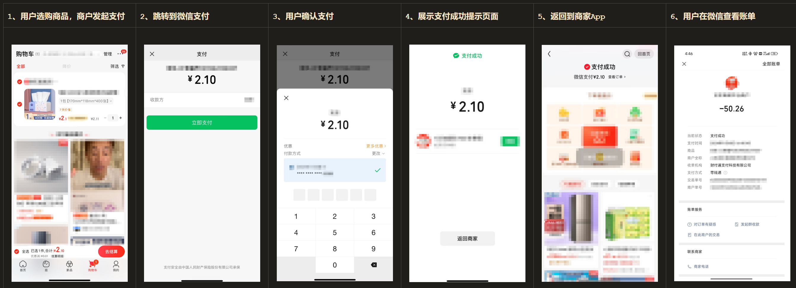

开发流程：
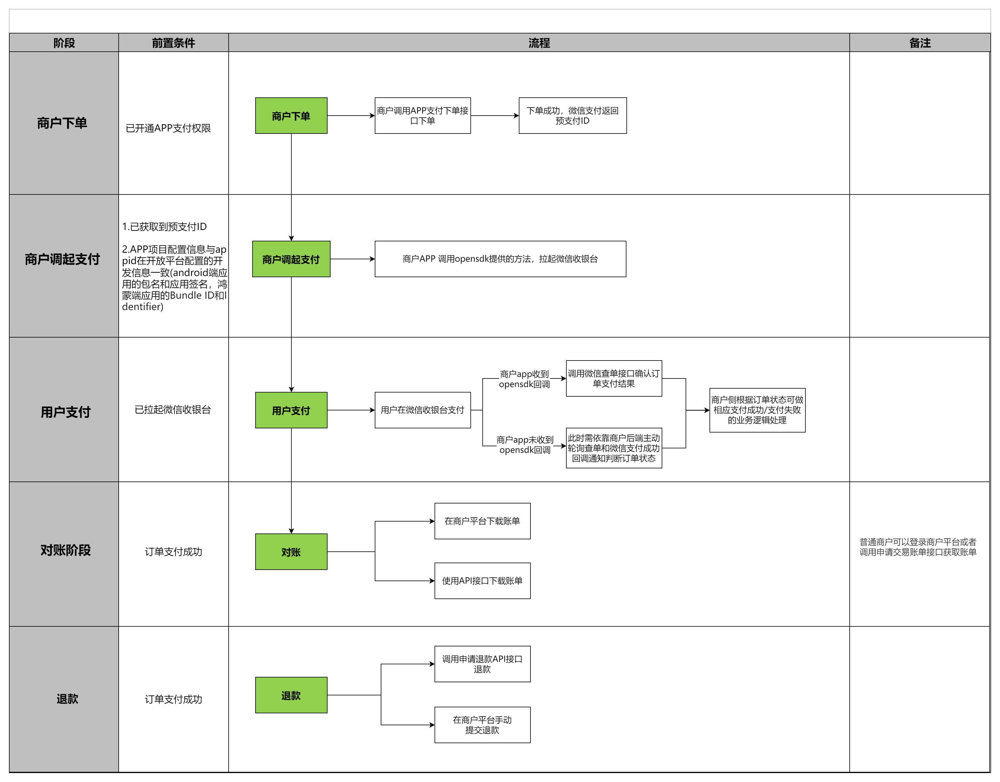

1. APP 下单

请求方式：【POST】/v3/pay/transactions/`app` 其余和 JSAPI 支付一致 2. APP 调起支付

商户通过 App 下单接口获取到发起支付的必要参数 prepay_id 后，商户 APP 再通过 openSDK(详见安卓/IOS/鸿蒙接入指引)的 sendReq 方法拉起微信支付。

```js
// android示例代码：
IWXAPI api;
PayReq request = new PayReq();
request.appId = "wxd930ea5d5a258f4f";
// 填写下单时传入的【商户号】mchid。
request.partnerId = "1900000109";
request.prepayId= "1101000000140415649af9fc314aa427",;
// 填写固定值Sign=WXPay
request.packageValue = "Sign=WXPay";
// 随机字符串，不长于32位。该值建议使用随机数算法生成。
request.nonceStr= "1101000000140429eb40476f8896f4c9";
// Unix时间戳，秒数
request.timeStamp= "1398746574";
req.sign = '签名'
api.sendReq(request);

// ios示例代码：
PayReq *request = [[[PayReq alloc] init] autorelease];
request.appId = "wxd930ea5d5a258f4f";
request.partnerId = "1900000109";
request.prepayId= "1101000000140415649af9fc314aa427",;
request.packageValue = "Sign=WXPay";
request.nonceStr= "1101000000140429eb40476f8896f4c9";
request.timeStamp= "1398746574";
req.sign = '签名'
[WXApi sendReq：request];

// 鸿蒙示例代码：
IWXAPI api;
let req = new wxopensdk.PayReq
req.appId = 'wxd930ea5d5a258f4f'
req.partnerId = '1900000109'
req.prepayId = '1101000000140415649af9fc314aa427'
req.packageValue = 'Sign=WXPay'
req.nonceStr = '1101000000140429eb40476f8896f4c9'
req.timeStamp = '1398746574'
req.sign = '签名'
api.sendReq(context: common.UIAbilityContext, req)
```

用户从微信收银台返回商户 APP 时 openSDK 会 onResp 回调，商户可通过回调 errCode 参数展示相应支付结果：

- 0：支付成功：调用后端接口查单，如果订单已支付则展示支付成功页面
- -1：支付失败：可能的原因：签名错误、未注册 AppID、项目设置 AppID 不正确、注册的 AppID 与设置的不匹配、其他异常原因等。
- -2：支付取消：用户取消支付返回 App，商户可自行处理展示。

```java
// android示例代码：
public void onResp(BaseRespresp){
    if(resp.getType()==ConstantsAPI.COMMAND_PAY_BY_WX){
    Log.d(TAG,"onPayFinish,errCode="+resp.errCode);
    AlertDialog.Builderbuilder=newAlertDialog.Builder(this);
    builder.setTitle(R.string.app_tip);
    }
}
```

其他流程基本和 JSAPI 一致

## H5 支付

H5 支付，提供商户在移动客户端浏览器网页（非微信客户端内部浏览器）中使用微信支付收款的能力。支付流程：

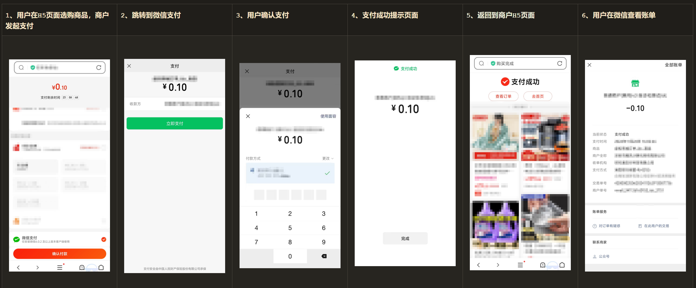

需要提前申请商户号，且需要开通 H5 支付，可通过【商户平台 -> 产品中心 -> H5 支付 -> 申请开通 -> 填写支付域名、支付域名 ICP 备案截图及经营场所简介等信息 -> 提交申请】操作，待审核(7 个工作日内)通过后将开通 H5 支付权限。

业务流程：
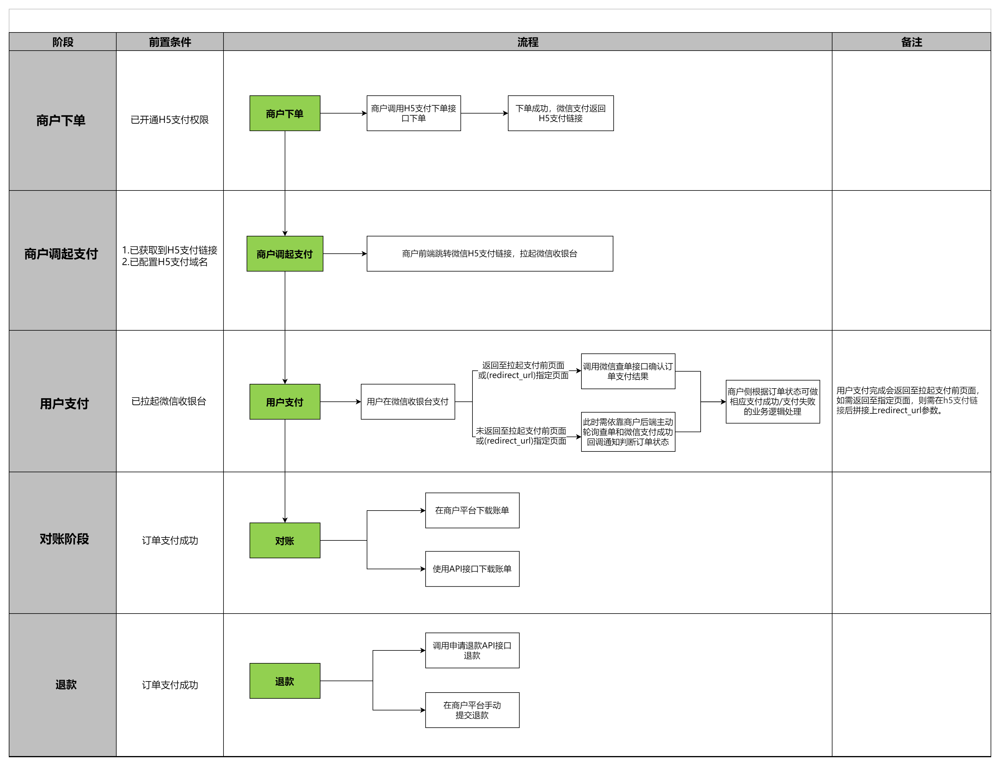

1. H5 下单

用户在商户 H5 页面选择微信支付后，商户需调用该接口在微信支付下单，生成用于调起支付的 H5 支付链接（h5_url）。

详细下单步骤：
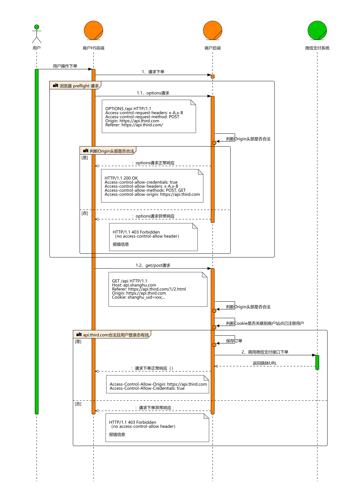

请求方式：【POST】/v3/pay/transactions/h5

请求域名：【主域名】https://api.mch.weixin.qq.com 使用该域名将访问就近的接入点

请求参数基本都相同。

2. 调起支付

1、商户通过 H5 下单接口获取到发起支付的必要参数 h5_url。

2、商户在配置了 H5 支付域名的网页中跳转 h5_url，调起微信支付收银台中间页。

3、微信支付收银台中间页会进行 H5 权限的校验，安全性检查。校验通过后，用户可正常进行支付。

## Native 支付

Native 支付，提供商户在 PC 端网页浏览器中使用微信支付收款的能力。
支付流程：
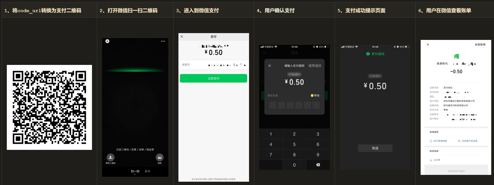

开发流程：
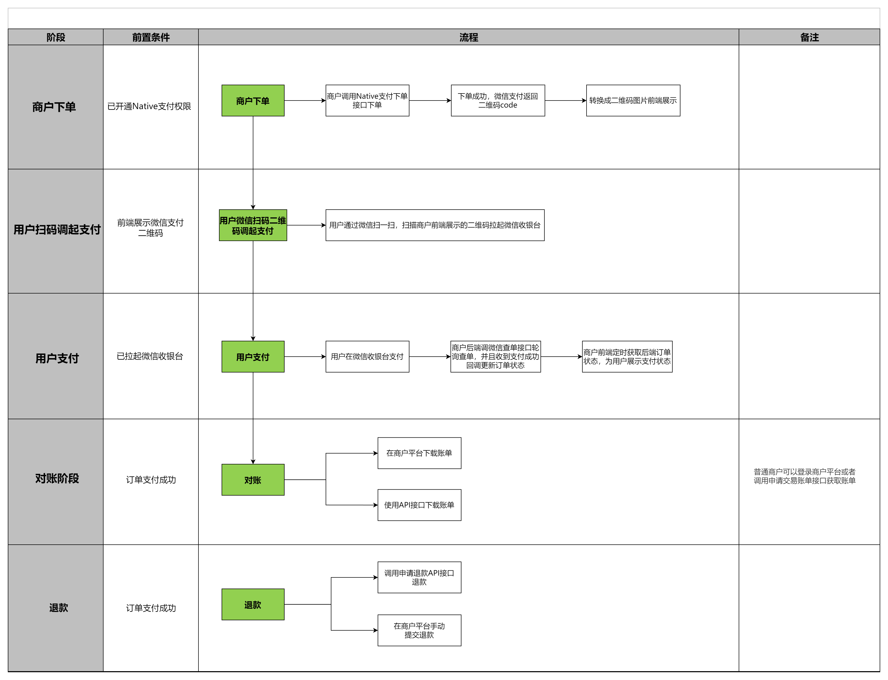

1. Native 下单
   用户在商户前端选择微信支付后，商户需要调用该接口在微信支付下单，生成用于调起支付的二维码链接 code_url

请求方式：【POST】/v3/pay/transactions/native

请求域名：【主域名】https://api.mch.weixin.qq.com 使用该域名将访问就近的接入点

2. Native 调起支付

- 通过 Native 下单接口获取到发起支付的必要参数 code_url。

- 将 code_url 链接转换为二维码图片后，展示给用户。

示例：将 weixin://pay.weixin.qq.com/bizpayurl/up?pr=NwY5Mz9&groupid=00 生成二维码

- 用户打开微信“扫一扫”功能，扫描二维码，进行 Native 支付(注意：直接在微信中打开 code_url 链接，无法支付)

## 小程序支付

提供商户在微信小程序中使用微信支付收款的能力。需要申请开通小程序(即 JSAPI)支付产品权限

> 小程序内嵌 H5 页面不能调用 jsapi 支付收款，小程序内只能使用小程序支付收款。

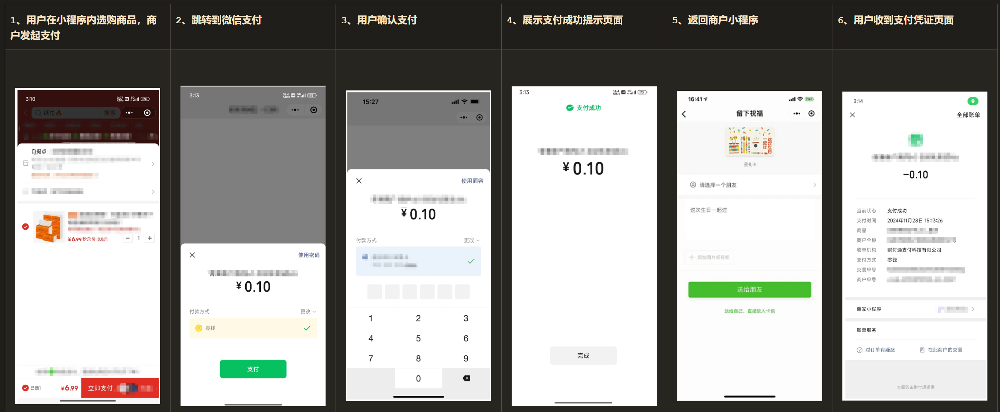

开发流程：
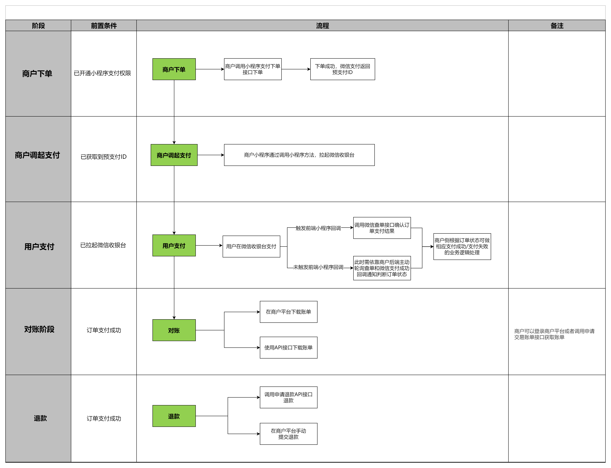

## 付款码支付

商户收银员用扫码设备扫描用户的条码/二维码，商户收银系统提交支付；

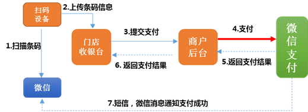

请求参数：

```xml
<xml>
   <appid>wx2421b1c4370ec43b</appid>
   <attach>订单额外描述</attach>
   <auth_code>120269300684844649</auth_code>
   <body>付款码支付测试</body>
   <device_info>1000</device_info>
   <goods_tag></goods_tag>
   <mch_id>10000100</mch_id>
   <nonce_str>8aaee146b1dee7cec9100add9b96cbe2</nonce_str>
   <out_trade_no>1415757673</out_trade_no>
   <spbill_create_ip>14.17.22.52</spbill_create_ip>
   <time_expire></time_expire>
   <total_fee>1</total_fee>
   <sign>C29DB7DB1FD4136B84AE35604756362C</sign>
</xml>
```

返回参数：

```xml
<xml>
   <return_code><![CDATA[SUCCESS]]></return_code>
   <return_msg><![CDATA[OK]]></return_msg>
   <appid><![CDATA[wx2421b1c4370ec43b]]></appid>
   <mch_id><![CDATA[10000100]]></mch_id>
   <device_info><![CDATA[1000]]></device_info>
   <nonce_str><![CDATA[GOp3TRyMXzbMlkun]]></nonce_str>
   <sign><![CDATA[D6C76CB785F07992CDE05494BB7DF7FD]]></sign>
   <result_code><![CDATA[SUCCESS]]></result_code>
   <openid><![CDATA[oUpF8uN95-Ptaags6E_roPHg7AG0]]></openid>
   <is_subscribe><![CDATA[N]]></is_subscribe>
   <trade_type><![CDATA[MICROPAY]]></trade_type>
   <bank_type><![CDATA[CCB_DEBIT]]></bank_type>
   <total_fee>1</total_fee>
   <coupon_fee>0</coupon_fee>
   <fee_type><![CDATA[CNY]]></fee_type>
   <transaction_id><![CDATA[1008450740201411110005820873]]></transaction_id>
   <out_trade_no><![CDATA[1415757673]]></out_trade_no>
   <attach><![CDATA[订单额外描述]]></attach>
   <time_end><![CDATA[20141111170043]]></time_end>
</xml>
```
