# 💰 微信支付开发完全指南

> 微信支付是腾讯公司的支付业务品牌，为用户提供安全、快捷、高效的支付服务，本指南详细介绍各种支付方式的完整开发流程。

## 📋 目录导航

<details>
<summary>点击展开完整目录</summary>

### 🎯 开发前准备
- [商户号申请与配置](#商户号申请与配置)
- [开发参数准备](#开发参数准备)
- [安全配置](#安全配置)

### 📱 JSAPI支付（公众号/小程序）
- [支付流程概述](#jsapi支付流程概述)
- [下单接口](#jsapi下单接口)
- [发起支付](#jsapi发起支付)
- [查询订单](#jsapi查询订单)
- [关闭订单](#jsapi关闭订单)
- [支付回调](#jsapi支付回调)
- [申请退款](#jsapi申请退款)
- [查询退款](#jsapi查询退款)
- [退款回调](#jsapi退款回调)
- [账单下载](#jsapi账单下载)

### 📲 APP支付
- [APP支付流程](#app支付流程)
- [SDK集成](#app-sdk集成)
- [下单与调起](#app下单与调起)
- [回调处理](#app回调处理)

### 🌐 H5支付
- [H5支付流程](#h5支付流程)
- [域名配置](#h5域名配置)
- [调起支付](#h5调起支付)

### 🖥️ Native支付（PC扫码）
- [Native支付流程](#native支付流程)
- [二维码生成](#native二维码生成)
- [支付处理](#native支付处理)

### 🏪 付款码支付
- [付款码支付流程](#付款码支付流程)
- [商户收银](#付款码商户收银)

### 🔧 开发工具与SDK
- [官方SDK](#官方sdk)
- [调试工具](#调试工具)
- [最佳实践](#最佳实践)

</details>

## 🎯 开发前准备

### 商户号申请与配置

```mermaid
graph TD
    A[申请商户号] --> B[选择经营场景]
    B --> C[上传资质材料]
    C --> D[等待审核]
    D --> E[审核通过]
    E --> F[开通支付功能]
    F --> G{选择支付方式}
    G -->|网页支付| H[JSAPI支付]
    G -->|移动应用| I[APP支付]
    G -->|H5页面| J[H5支付]
    G -->|PC扫码| K[Native支付]
    G -->|线下收银| L[付款码支付]
```

需要提前开通商户号，选择对应的经营场景：


并开启对应的支付功能：


### 开发参数准备

```mermaid
graph LR
    A[开发参数] --> B[商户号 mchid]
    A --> C[应用ID appid]
    A --> D[APIv3密钥]
    A --> E[商户API证书]
    A --> F[微信支付平台证书]
    A --> G[微信支付公钥]
    
    B --> B1[唯一商户标识]
    C --> C1[公众号/小程序/APP标识]
    D --> D1[回调信息解密]
    E --> E1[请求签名生成]
    F --> F1[返回验签]
    G --> G1[敏感信息加密]
```

**核心参数说明：**

| 参数 | 描述 | 用途 |
|------|------|------|
| **商户号 mchid** | 商户在微信支付侧的唯一身份标识 | 所有接口调用必需参数 |
| **appid** | 公众号/小程序/APP的唯一标识 | 必须与商户号绑定 |
| **APIv3密钥** | 32位字符串 | 加密回调信息，下载平台证书 |
| **商户API证书** | 商户私钥证书 | 生成请求签名 |
| **微信支付平台证书** | 微信公钥证书 | 验签返回内容，加密敏感信息 |

### 安全配置

**必需的安全配置：**

- **设置安全联系人**：微信支付 → 账户中心 → 安全中心 → 安全联系人
- **配置支付授权目录**：设置调起支付的页面URL路径
- **IP白名单配置**：对微信回调IP段开通白名单
- **证书管理**：定期更新商户API证书

::: warning 重要提醒
- 所有敏感信息（如证书私钥、APIv3密钥）必须妥善保管，不得泄露
- 建议使用HTTPS协议进行所有接口调用
- 定期检查和更新证书，避免过期导致支付失败
:::

## 📱 JSAPI支付

JSAPI支付提供商户在微信客户端内部浏览器网页中使用微信支付收款的能力。

### JSAPI支付流程概述

```mermaid
sequenceDiagram
    participant U as 用户
    participant M as 商户页面
    participant MS as 商户服务器
    participant WX as 微信支付
    
    U->>M: 1. 选择商品，点击支付
    M->>MS: 2. 请求下单
    MS->>WX: 3. 调用下单接口
    WX->>MS: 4. 返回prepay_id
    MS->>M: 5. 返回支付参数
    M->>U: 6. 调起微信支付
    U->>WX: 7. 确认支付
    WX->>MS: 8. 支付结果回调
    WX->>U: 9. 返回支付结果
    U->>M: 10. 回到商户页面
```

**订单状态流转：**

```mermaid
graph LR
    A[未支付 NOTPAY] --> B[支付中 USERPAYING]
    B --> C[支付成功 SUCCESS]
    B --> D[支付失败 PAYERROR]
    A --> E[已关闭 CLOSED]
    C --> F[转入退款 REFUND]
    A --> G[已撤销 REVOKED]
```


**业务流程详图：**


### JSAPI下单接口

用户在微信内置浏览器访问商户网页并选择微信支付后，商户需调用该接口在微信支付下单，生成用于调起支付的预支付交易会话标识(prepay_id)。


**接口信息：**
- **请求方式**：`POST`
- **请求URL**：`https://api.mch.weixin.qq.com/v3/pay/transactions/jsapi`
- **请求域名**：使用主域名将访问就近的接入点

**请求头设置：**

```bash
# 签名认证生成认证信息
Authorization: WECHATPAY2-SHA256-RSA2048 mchid="1900000001",...
Accept: application/json
Content-Type: application/json
```

**请求参数详解：**

```js
  {
  // 🔸 必需参数
  "appid": "wxd678efh567hg6787",              // 公众号ID
  "mchid": "1230000109",                     // 商户号
  "description": "Image形象店-深圳腾大-QQ公仔",  // 商品描述
  "out_trade_no": "1217752501201407033233368018", // 商户订单号
  "notify_url": "https://www.weixin.qq.com/wxpay/pay.php", // 回调地址
  
  // 🔸 订单金额
  "amount": {
    "total": 100,                            // 总金额（分）
    "currency": "CNY"                        // 币种，固定CNY
  },
  
  // 🔸 支付者信息
  "payer": {
    "openid": "ovqdowRIfstpQK_kYShFS2MSS9XS" // 用户OpenID
  },
  
  // 🔹 可选参数
  "time_expire": "2018-06-08T10:34:56+08:00", // 支付截止时间
  "attach": "自定义数据说明",                    // 商户数据包
  "goods_tag": "WXG",                          // 订单优惠标记
  "support_fapiao": false,                     // 电子发票开关
  
  // 🔹 优惠详情
  "detail": {
    "cost_price": 608800,                      // 订单原价
    "invoice_id": "微信123",                   // 商品小票ID
    "goods_detail": [{
      "merchant_goods_id": "1246464644",       // 商户商品编码
      "wechatpay_goods_id": "1001",           // 微信商品编码
      "goods_name": "iPhoneX 256G",           // 商品名称
      "quantity": 1,                          // 商品数量
      "unit_price": 528800                    // 商品单价（分）
    }]
  },
  
  // 🔹 场景信息
  "scene_info": {
    "payer_client_ip": "14.23.150.211",      // 用户IP
    "device_id": "013467007045764",           // 设备号
    "store_info": {
      "id": "0001",                           // 门店编号
      "name": "腾讯大厦分店",                  // 门店名称
      "area_code": "440305",                  // 地区编码
      "address": "广东省深圳市南山区科技中一道10000号" // 详细地址
    }
  },
  
  // 🔹 结算信息
  "settle_info": {
    "profit_sharing": false                   // 是否分账
    }
  }
```

**参数校验规则：**

| 参数 | 格式要求 | 说明 |
|------|----------|------|
| `out_trade_no` | 6-32位字符，数字、字母、`_-|*` | 同一商户号下唯一 |
| `description` | 1-127个字符 | 用户账单商品字段显示 |
| `total` | 正整数 | 单位：分，最小值1 |
| `openid` | 用户在appid下的唯一标识 | 下单前需先获取 |
| `notify_url` | HTTPS URL | 必须为外网可访问 |

**应答参数：**

```js
{
  "prepay_id": "wx201410272009395522657a690389285100" // 预支付交易会话标识
}
```

::: tip 开发提示
- `prepay_id` 有效期为2小时，过期需重新获取
- 建议在获取OpenID后立即调用下单接口
- 商户订单号建议使用时间戳+随机数保证唯一性
:::

### JSAPI发起支付

商户通过JSAPI下单接口获取到发起支付的必要参数`prepay_id`后，再通过微信浏览器内置对象方法调起微信支付收银台。


**支付参数签名算法：**

```mermaid
graph TD
    A[准备签名参数] --> B[appId]
    A --> C[timeStamp]
    A --> D[nonceStr]
    A --> E[package]
    
    B --> F[构造签名字符串]
    C --> F
    D --> F
    E --> F
    
    F --> G[使用商户私钥RSA签名]
    G --> H[Base64编码]
    H --> I[得到paySign]
```

**调起支付代码实现：**

```js
function onBridgeReady() {
  WeixinJSBridge.invoke(
    "getBrandWCPayRequest",
    {
      appId: "wx2421b1c4370ec43b",     // 公众号ID
      timeStamp: "1395712654",         // 时间戳（秒）
      nonceStr: "e61463f8efa94090b1f366cccfbbb444", // 随机串
      package: "prepay_id=wx21201855730335ac86f8c43d1889123400", // 预支付订单
      signType: "RSA",                 // 签名类型，固定RSA
      paySign: "oR9d8PuhnIc+YZ8cBHFCwfgpaK9gd7vaRvkYD7rthRAZ..." // 签名
    },
    function (res) {
      // 🔸 支付结果处理
      if (res.err_msg == "get_brand_wcpay_request:ok") {
        // ✅ 支付成功 - 调用后端查单接口确认
        console.log("支付成功，正在确认订单状态...");
        checkOrderStatus(); // 建议调用查单接口二次确认
      } else if (res.err_msg == "get_brand_wcpay_request:cancel") {
        // ❌ 用户取消支付
        console.log("用户取消支付");
        showCancelMessage();
      } else if (res.err_msg == "get_brand_wcpay_request:fail") {
        // ❌ 支付失败
        console.log("支付失败：" + res.err_desc);
        showFailMessage();
      }
    }
  );
}

// 🔸 微信JS-SDK加载检测
if (typeof WeixinJSBridge == "undefined") {
  if (document.addEventListener) {
    document.addEventListener("WeixinJSBridgeReady", onBridgeReady, false);
  } else if (document.attachEvent) {
    document.attachEvent("WeixinJSBridgeReady", onBridgeReady);
    document.attachEvent("onWeixinJSBridgeReady", onBridgeReady);
  }
} else {
  onBridgeReady();
}

// 🔸 订单状态确认函数
function checkOrderStatus() {
  fetch('/api/order/status', {
    method: 'POST',
    headers: {
      'Content-Type': 'application/json',
    },
    body: JSON.stringify({
      out_trade_no: '商户订单号'
    })
  })
  .then(response => response.json())
  .then(data => {
    if (data.trade_state === 'SUCCESS') {
      // 支付确认成功，跳转成功页面
      window.location.href = '/success.html';
    } else {
      // 支付状态异常，显示错误信息
      showErrorMessage('支付状态异常，请联系客服');
    }
  });
}
```

::: warning 重要提醒
- 前端回调不能完全依赖，必须通过后端查单接口确认支付状态
- 建议在支付成功后立即调用查单接口进行二次确认
- 签名算法必须严格按照微信支付规范实现
:::

### JSAPI查询订单

订单支付成功后，商户可通过微信交易订单号或商户订单号查询订单状态。


**查询方式对比：**

| 查询方式 | 使用场景 | 优势 | 限制 |
|----------|----------|------|------|
| 微信支付订单号 | 支付成功后 | 微信系统唯一标识 | 需要支付成功才返回 |
| 商户订单号 | 任何时候 | 商户系统可控 | 需要传入商户号 |

**1. 通过微信支付订单号查询：**

```bash
GET /v3/pay/transactions/id/{transaction_id}?mchid={mchid}
Host: api.mch.weixin.qq.com
Authorization: WECHATPAY2-SHA256-RSA2048 mchid="1900000001",...
Accept: application/json
```

**2. 通过商户订单号查询：**

```bash
GET /v3/pay/transactions/out-trade-no/{out_trade_no}?mchid={mchid}
Host: api.mch.weixin.qq.com
Authorization: WECHATPAY2-SHA256-RSA2048 mchid="1900000001",...
Accept: application/json
```

**应答参数详解：**

```js
{
  "appid": "wxd678efh567hg6787",
  "mchid": "1230000109",
  "out_trade_no": "1217752501201407033233368018",  // 商户订单号
  "transaction_id": "1217752501201407033233368018", // 微信支付订单号
  "trade_type": "JSAPI",                           // 交易类型
  "trade_state": "SUCCESS",                        // 交易状态
  "trade_state_desc": "支付成功",                   // 状态描述
  "bank_type": "CMC",                              // 银行类型
  "attach": "自定义数据",                            // 商户数据包
  "success_time": "2018-06-08T10:34:56+08:00",    // 支付完成时间
  
  // 🔸 支付者信息
  "payer": {
    "openid": "oUpF8uMuAJO_M2pxb1Q9zNjWeS6o"
  },
  
  // 🔸 金额信息
  "amount": {
    "total": 100,                                  // 总金额
    "payer_total": 90,                            // 用户实际支付金额
    "currency": "CNY",                            // 币种
    "payer_currency": "CNY"                       // 用户支付币种
  },
  
  // 🔸 场景信息
  "scene_info": {
    "device_id": "013467007045764"
  },
  
  // 🔸 优惠详情（如有使用代金券）
  "promotion_detail": [{
    "coupon_id": "109519",                         // 券ID
    "name": "单品惠-6",                            // 优惠名称
    "scope": "SINGLE",                             // 优惠范围
    "type": "CASH",                                // 优惠类型
    "amount": 10,                                  // 优惠金额
    "stock_id": "931386",                          // 活动ID
    "wechatpay_contribute": 0,                     // 微信出资
    "merchant_contribute": 10,                     // 商户出资
    "other_contribute": 0,                         // 其他出资
    "currency": "CNY",                             // 优惠币种
    "goods_detail": [{
      "goods_id": "M1006",                         // 商品编码
      "quantity": 1,                               // 商品数量
      "unit_price": 100,                           // 商品单价
      "discount_amount": 10,                       // 商品优惠金额
      "goods_remark": "商品备注信息"                // 商品备注
    }]
  }]
}
```

**交易状态说明：**

| 状态 | 说明 | 后续处理 |
|------|------|----------|
| `SUCCESS` | 支付成功 | 发货/提供服务 |
| `REFUND` | 转入退款 | 关注退款状态 |
| `NOTPAY` | 未支付 | 可关闭订单 |
| `CLOSED` | 已关闭 | 重新下单 |
| `REVOKED` | 已撤销 | 重新下单 |
| `USERPAYING` | 用户支付中 | 继续查询 |
| `PAYERROR` | 支付失败 | 重新下单 |


### JSAPI关闭订单

对于未支付状态的订单，商户可在不需要支付时调用此接口关闭订单。

**常见关单场景：**

```mermaid
graph TD
    A[关单场景] --> B[用户主动取消]
    A --> C[订单超时]
    A --> D[商品缺货]
    A --> E[系统异常]
    
    B --> F[调用关单接口]
    C --> F
    D --> F
    E --> F
    
    F --> G[订单状态变更为CLOSED]
    G --> H[释放库存]
    G --> I[清理缓存]
```

**接口调用：**

```bash
POST /v3/pay/transactions/out-trade-no/{out_trade_no}/close
Host: api.mch.weixin.qq.com
Authorization: WECHATPAY2-SHA256-RSA2048 mchid="1900000001",...
Accept: application/json
Content-Type: application/json

{
  "mchid": "1900000001"
}
```

**响应结果：**
- 成功：`204 No Content`
- 失败：返回错误码和错误描述

::: tip 最佳实践
- 建议在用户取消支付或订单超时时及时关闭订单
- 关单成功后应该释放相关库存
- 已支付的订单无法关闭，需要通过退款处理
:::

### JSAPI支付回调

当用户成功支付订单后，微信支付会向商户预先设置的回调地址发送支付结果通知。

**回调重试机制：**

```mermaid
graph LR
    A[支付成功] --> B[发送回调]
    B --> C{商户响应}
    C -->|成功200/204| D[回调完成]
    C -->|失败4xx/5xx| E[等待重试]
    C -->|超时5s| E
    
    E --> F[15s后重试]
    F --> G[15s后重试]
    G --> H[30s后重试]
    H --> I[3m后重试]
    I --> J[最多重试15次]
```

**回调请求头：**

```bash
Wechatpay-Serial: 验签的微信支付平台证书序列号
Wechatpay-Signature: 验签的签名值
Wechatpay-Timestamp: 验签的时间戳
Wechatpay-Nonce: 验签的随机串
```

**回调请求体：**

```js
{
  "id": "EV-2018022511223320873",              // 通知ID
  "create_time": "2015-05-20T13:29:35+08:00", // 通知创建时间
  "resource_type": "encrypt-resource",         // 通知数据类型
  "event_type": "TRANSACTION.SUCCESS",         // 通知类型
  "summary": "支付成功",                        // 回调摘要
  "resource": {
    "original_type": "transaction",            // 原始数据类型
    "algorithm": "AEAD_AES_256_GCM",          // 加密算法
    "ciphertext": "...",                      // 加密数据
    "associated_data": "",                     // 附加数据
    "nonce": ""                               // 随机串
  }
}
```

**回调处理流程：**

```js
// Node.js 示例
const crypto = require('crypto');

// 🔸 验签函数
function verifySignature(signature, timestamp, nonce, body, cert) {
  const signStr = `${timestamp}\n${nonce}\n${body}\n`;
  const verify = crypto.createVerify('RSA-SHA256');
  verify.update(signStr);
  return verify.verify(cert, signature, 'base64');
}

// 🔸 解密函数
function decryptData(ciphertext, key, nonce, associatedData) {
  const decipher = crypto.createDecipherGCM('aes-256-gcm', key);
  decipher.setAuthTag(Buffer.from(ciphertext.slice(-32), 'hex'));
  if (associatedData) {
    decipher.setAAD(Buffer.from(associatedData));
  }
  
  let decrypted = decipher.update(ciphertext.slice(0, -32), 'base64', 'utf8');
  decrypted += decipher.final('utf8');
  return JSON.parse(decrypted);
}

// 🔸 回调处理主函数
app.post('/wxpay/callback', (req, res) => {
  const signature = req.headers['wechatpay-signature'];
  const timestamp = req.headers['wechatpay-timestamp'];
  const nonce = req.headers['wechatpay-nonce'];
  const body = JSON.stringify(req.body);
  
  // 1. 验签
  if (!verifySignature(signature, timestamp, nonce, body, wxpayCert)) {
    return res.status(400).json({ code: 'FAIL', message: '验签失败' });
  }
  
  // 2. 解密
  const resource = req.body.resource;
  const decryptedData = decryptData(
    resource.ciphertext,
    apiv3Key,
    resource.nonce,
    resource.associated_data
  );
  
  // 3. 处理业务逻辑
  if (decryptedData.trade_state === 'SUCCESS') {
    // 支付成功处理
    updateOrderStatus(decryptedData.out_trade_no, 'paid');
    // 发货逻辑
    processDelivery(decryptedData.out_trade_no);
    
    // 4. 返回成功响应
    res.status(200).json({ code: 'SUCCESS', message: '处理成功' });
  } else {
    // 支付失败处理
    res.status(200).json({ code: 'SUCCESS', message: '已处理' });
  }
});
```

**回调应答要求：**

| 场景 | HTTP状态码 | 应答内容 |
|------|------------|----------|
| 验签成功 | 200 或 204 | 无需应答体 |
| 验签失败 | 4xx 或 5xx | `{"code":"FAIL","message":"失败原因"}` |

::: warning 安全要求
- 必须验证回调请求的签名，确保来源可信
- 建议对相同订单的重复回调进行幂等处理
- 回调处理完成后应立即返回200状态码
- 商户服务器必须对微信支付回调IP开放访问权限
:::

### JSAPI申请退款

在交易完成后的一年内，商户可通过退款接口将支付金额的全部或部分原路退还给用户。

**退款业务流程：**

```mermaid
graph TD
    A[用户申请退款] --> B[商户审核]
    B --> C{审核结果}
    C -->|通过| D[调用退款接口]
    C -->|拒绝| E[拒绝退款]
    
    D --> F[微信处理退款]
    F --> G[退款结果回调]
    G --> H[更新订单状态]
    H --> I[通知用户]
    
    E --> J[通知用户被拒原因]
```

**接口信息：**
- **请求方式**：`POST`
- **请求URL**：`https://api.mch.weixin.qq.com/v3/refund/domestic/refunds`

**请求参数：**

```js
{
  // 🔸 订单标识（二选一）
  "transaction_id": "1217752501201407033233368018",  // 微信支付订单号
  "out_trade_no": "1217752501201407033233368018",    // 商户订单号
  
  // 🔸 退款标识
  "out_refund_no": "1217752501201407033233368018",   // 商户退款单号
  "reason": "商品已售完",                             // 退款原因
  "notify_url": "https://weixin.qq.com",             // 退款结果回调URL
  
  // 🔸 退款金额
  "amount": {
    "refund": 888,                                   // 退款金额（分）
    "total": 888,                                    // 订单总金额（分）
    "currency": "CNY",                               // 币种
    "from": [{                                       // 退款出资账户
      "account": "AVAILABLE",                        // 账户类型
      "amount": 444                                  // 出资金额
    }]
  },
  
  // 🔸 退款商品详情
  "goods_detail": [{
    "merchant_goods_id": "1217752501201407033233368018", // 商户商品ID
    "wechatpay_goods_id": "1001",                        // 微信商品ID
    "goods_name": "iPhone6s 16G",                        // 商品名称
    "unit_price": 528800,                                // 商品单价
    "refund_amount": 528800,                             // 退款金额
    "refund_quantity": 1                                 // 退款数量
  }],
  
  // 🔸 退款资金来源
  "funds_account": "AVAILABLE"                           // 资金账户
}
```

**退款资金来源说明：**

| 资金来源 | 说明 | 适用场景 |
|----------|------|----------|
| `AVAILABLE` | 可用余额 | 普通退款 |
| `UNSETTLED` | 未结算资金 | 预付押金退款 |

**应答参数：**

```js
{
  "refund_id": "50000000382019052709732678859",      // 微信退款单号
  "out_refund_no": "1217752501201407033233368018",   // 商户退款单号
  "transaction_id": "1217752501201407033233368018",  // 微信支付订单号
  "out_trade_no": "1217752501201407033233368018",    // 商户订单号
  "channel": "ORIGINAL",                             // 退款渠道
  "user_received_account": "招商银行信用卡0403",       // 退款入账账户
  "success_time": "2020-12-01T16:18:12+08:00",      // 退款成功时间
  "create_time": "2020-12-01T16:18:12+08:00",       // 退款受理时间
  "status": "SUCCESS",                               // 退款状态
  "funds_account": "UNSETTLED",                      // 资金账户
  
  // 🔸 退款金额详情
  "amount": {
    "total": 100,                                    // 订单总金额
    "refund": 100,                                   // 退款金额
    "payer_total": 90,                              // 用户实际支付
    "payer_refund": 90,                             // 用户实际退款
    "settlement_refund": 100,                       // 结算退款金额
    "settlement_total": 100,                        // 结算总金额
    "discount_refund": 10,                          // 优惠退款金额
    "currency": "CNY",                              // 币种
    "refund_fee": 100                               // 退款手续费
  }
}
```

**退款状态说明：**

| 状态 | 说明 | 处理建议 |
|------|------|----------|
| `SUCCESS` | 退款成功 | 通知用户退款完成 |
| `CLOSED` | 退款关闭 | 查看关闭原因 |
| `PROCESSING` | 退款处理中 | 继续关注状态 |
| `ABNORMAL` | 退款异常 | 联系微信客服 |

### JSAPI查询退款

商户可通过商户退款单号查询退款详情。

**接口调用：**

```bash
GET /v3/refund/domestic/refunds/{out_refund_no}
Host: api.mch.weixin.qq.com
Authorization: WECHATPAY2-SHA256-RSA2048 mchid="1900000001",...
Accept: application/json
```

**应答参数：**

应答参数与申请退款接口返回的参数结构相同，包含退款的完整信息。

### JSAPI退款回调

当退款单状态发生变更时，微信支付会向商户预设的回调地址发送通知。

**回调处理示例：**

```js
app.post('/wxpay/refund-callback', (req, res) => {
  // 验签和解密过程与支付回调相同
  const decryptedData = decryptRefundData(req.body);
  
  if (decryptedData.refund_status === 'SUCCESS') {
    // 退款成功处理
    updateRefundStatus(decryptedData.out_refund_no, 'success');
    notifyUserRefundSuccess(decryptedData.out_trade_no);
    
    res.status(200).json({ code: 'SUCCESS', message: '处理成功' });
  } else {
    // 退款失败处理
    handleRefundFail(decryptedData);
    res.status(200).json({ code: 'SUCCESS', message: '已处理' });
  }
});
```

### JSAPI账单下载

微信支付提供交易账单和资金账单的下载功能，帮助商户进行对账和财务管理。

**账单类型对比：**

| 账单类型 | 内容 | 用途 |
|----------|------|------|
| 交易账单 | 交易明细、金额、时间等 | 订单核对、退款审查 |
| 资金账单 | 资金流水、收支记录 | 财务对账、资金确认 |

**申请交易账单：**

```bash
GET /v3/bill/tradebill?bill_date=2019-06-11&bill_type=ALL&tar_type=GZIP
Host: api.mch.weixin.qq.com
Authorization: WECHATPAY2-SHA256-RSA2048 mchid="1900000001",...
Accept: application/json
```

**查询参数：**

| 参数 | 必填 | 说明 |
|------|------|------|
| `bill_date` | 是 | 账单日期，格式：yyyy-MM-dd |
| `bill_type` | 否 | SUCCESS/REFUND/ALL，默认ALL |
| `tar_type` | 否 | GZIP压缩，默认数据流 |

**申请资金账单：**

```bash
GET /v3/bill/fundflowbill?bill_date=2019-06-11&account_type=BASIC&tar_type=GZIP
Host: api.mch.weixin.qq.com
Authorization: WECHATPAY2-SHA256-RSA2048 mchid="1900000001",...
Accept: application/json
```

**应答参数：**

```js
{
  "hash_type": "SHA1",                                    // 哈希类型
  "hash_value": "79bb0f45fc4c42234a918000b2668d689e2bde04", // 哈希值
  "download_url": "https://api.mch.weixin.qq.com/v3/bill/downloadurl?token=xxx" // 下载地址
}
```

**下载账单：**

```bash
curl https://api.mch.weixin.qq.com/v3/billdownload/file?token=xxx \
  -H 'Authorization: WECHATPAY2-SHA256-RSA2048 mchid="1900000001",...'
```

::: tip 账单处理建议
- 账单每日10点后生成，仅支持近3个月的账单下载
- 建议使用GZIP压缩格式减少下载时间
- 下载后应验证hash值确保文件完整性
- 账单可用于自动化对账和财务报表生成
:::

## 📲 APP支付

APP支付提供商户在自己的APP中使用微信支付收款的能力。

### APP支付流程

**整体流程图：**

```mermaid
sequenceDiagram
    participant A as APP客户端
    participant S as 商户服务器
    participant W as 微信支付
    participant WX as 微信客户端
    
    A->>S: 1. 选择商品，发起支付
    S->>W: 2. 调用APP下单接口
    W->>S: 3. 返回prepay_id
    S->>A: 4. 返回支付参数
    A->>WX: 5. 调用微信SDK唤起支付
    WX->>W: 6. 用户确认支付
    W->>S: 7. 支付结果回调
    W->>WX: 8. 返回支付结果
    WX->>A: 9. 返回APP
    A->>S: 10. 查询支付结果
```


**开发流程：**


### APP SDK集成

**平台支持：**

| 平台 | SDK | 文档链接 |
|------|-----|----------|
| Android | OpenSDK | https://developers.weixin.qq.com/doc/oplatform/Mobile_App/Access_Guide/Android.html |
| iOS | OpenSDK | https://developers.weixin.qq.com/doc/oplatform/Mobile_App/Access_Guide/iOS.html |
| 鸿蒙 | OpenSDK | https://developers.weixin.qq.com/doc/oplatform/Mobile_App/Access_Guide/HarmonyOS.html |

**SDK校验机制：**

```mermaid
graph TD
    A[APP调用SDK] --> B[微信校验]
    B --> C{应用信息匹配}
    C -->|匹配| D[调起支付]
    C -->|不匹配| E[调起失败]
    
    B --> F[应用包名]
    B --> G[应用签名]
    B --> H[Bundle ID]
    B --> I[Identifier]
```

**重要配置要求：**
- Android/鸿蒙：应用包名和应用签名必须与开放平台注册信息一致
- iOS：Bundle ID必须与开放平台注册信息一致
- 可在开放平台【管理中心 → 移动应用 → 详情 → 开发配置】查看配置信息

### APP下单与调起

**1. APP下单接口**

```bash
POST /v3/pay/transactions/app
Host: api.mch.weixin.qq.com
Authorization: WECHATPAY2-SHA256-RSA2048 mchid="1900000001",...
Content-Type: application/json
```

请求参数与JSAPI支付基本相同，只是接口路径不同。

**2. 调起支付代码示例**

**Android示例：**

```java
// 初始化微信API
private IWXAPI api;

// 在onCreate中初始化
api = WXAPIFactory.createWXAPI(this, APP_ID, true);
api.registerApp(APP_ID);

// 调起支付
private void startPay(String prepayId) {
    PayReq request = new PayReq();
    request.appId = "wxd930ea5d5a258f4f";           // 应用ID
    request.partnerId = "1900000109";                // 商户号
    request.prepayId = prepayId;                     // 预支付订单号
    request.packageValue = "Sign=WXPay";             // 固定值
    request.nonceStr = generateNonceStr();           // 随机字符串
    request.timeStamp = String.valueOf(System.currentTimeMillis() / 1000); // 时间戳
    request.sign = generateSign(request);            // 签名
    
    api.sendReq(request);
}

// 生成随机字符串
private String generateNonceStr() {
    return UUID.randomUUID().toString().replace("-", "");
}

// 生成签名
private String generateSign(PayReq request) {
    // 使用商户私钥进行RSA签名
    String signStr = String.format("appid=%s&noncestr=%s&package=%s&partnerid=%s&prepayid=%s&timestamp=%s",
        request.appId, request.nonceStr, request.packageValue, 
        request.partnerId, request.prepayId, request.timeStamp);
    return RSAUtils.sign(signStr, privateKey);
}
```

**iOS示例：**

```objc
// 调起支付
- (void)startPayWithPrepayId:(NSString *)prepayId {
    PayReq *request = [[PayReq alloc] init];
    request.appId = @"wxd930ea5d5a258f4f";
    request.partnerId = @"1900000109";
    request.prepayId = prepayId;
    request.packageValue = @"Sign=WXPay";
    request.nonceStr = [self generateNonceStr];
    request.timeStamp = [NSString stringWithFormat:@"%ld", (long)[[NSDate date] timeIntervalSince1970]];
    request.sign = [self generateSign:request];
    
    [WXApi sendReq:request completion:^(BOOL success) {
        if (success) {
            NSLog(@"微信支付调起成功");
        } else {
            NSLog(@"微信支付调起失败");
        }
    }];
}
```

**鸿蒙示例：**

```javascript
// 调起支付
private startPay(prepayId: string) {
  let req = new wxopensdk.PayReq();
  req.appId = 'wxd930ea5d5a258f4f';
  req.partnerId = '1900000109';
  req.prepayId = prepayId;
  req.packageValue = 'Sign=WXPay';
  req.nonceStr = this.generateNonceStr();
  req.timeStamp = Math.floor(Date.now() / 1000).toString();
  req.sign = this.generateSign(req);
  
  this.api.sendReq(this.context, req);
}
```

### APP回调处理

**支付结果回调：**

```java
// Android回调处理
@Override
public void onResp(BaseResp resp) {
    if (resp.getType() == ConstantsAPI.COMMAND_PAY_BY_WX) {
        AlertDialog.Builder builder = new AlertDialog.Builder(this);
        builder.setTitle("支付结果");
        
        switch (resp.errCode) {
            case 0:
                // 支付成功
                builder.setMessage("支付成功");
                // 建议调用后端接口确认支付状态
                checkPaymentStatus();
                break;
            case -1:
                // 支付失败
                builder.setMessage("支付失败：" + resp.errStr);
                break;
            case -2:
                // 用户取消
                builder.setMessage("用户取消支付");
                break;
            default:
                builder.setMessage("支付异常");
                break;
        }
        
        builder.show();
    }
}

// 查询支付状态
private void checkPaymentStatus() {
    // 调用后端接口查询订单状态
    // 确保订单确实已经支付成功
}
```

**回调错误码说明：**

| 错误码 | 说明 | 处理建议 |
|--------|------|----------|
| 0 | 支付成功 | 调用查单接口确认 |
| -1 | 支付失败 | 检查签名和参数 |
| -2 | 用户取消 | 允许重新支付 |

::: warning 重要提醒
- APP支付回调只能作为支付结果的初步判断
- 必须通过服务端查单接口确认最终支付状态
- 建议在回调成功后立即调用查单接口
:::

## 🌐 H5支付

H5支付提供商户在移动客户端浏览器网页中使用微信支付收款的能力。

### H5支付流程

**支付流程图：**


**业务流程：**


### H5域名配置

**申请H5支付权限：**

```mermaid
graph TD
    A[商户平台] --> B[产品中心]
    B --> C[H5支付]
    C --> D[申请开通]
    D --> E[填写支付域名]
    E --> F[上传ICP备案截图]
    F --> G[经营场所简介]
    G --> H[提交申请]
    H --> I[等待审核]
    I --> J[审核通过]
    J --> K[开通H5支付权限]
```

**配置要求：**
- 支付域名必须完成ICP备案
- 域名必须与实际支付页面一致
- 审核周期：7个工作日内

### H5调起支付

**1. H5下单**

```bash
POST /v3/pay/transactions/h5
Host: api.mch.weixin.qq.com
Authorization: WECHATPAY2-SHA256-RSA2048 mchid="1900000001",...
Content-Type: application/json
```

**详细下单步骤：**


**2. 调起支付流程**

```mermaid
sequenceDiagram
    participant U as 用户
    participant H as H5页面
    participant W as 微信支付
    participant WX as 微信客户端
    
    U->>H: 1. 点击支付按钮
    H->>W: 2. 获取h5_url
    W->>H: 3. 返回支付链接
    H->>U: 4. 跳转到h5_url
    U->>W: 5. 微信收银台中间页
    W->>WX: 6. 调起微信客户端
    WX->>U: 7. 用户确认支付
    U->>H: 8. 返回商户页面
```

**调起支付代码：**

```html
<!-- H5支付页面 -->
<!DOCTYPE html>
<html>
<head>
    <meta charset="UTF-8">
    <meta name="viewport" content="width=device-width, initial-scale=1.0">
    <title>微信支付</title>
</head>
<body>
    <script>
        // 获取支付链接
        function startPay() {
            fetch('/api/h5-pay', {
                method: 'POST',
                headers: {
                    'Content-Type': 'application/json',
                },
                body: JSON.stringify({
                    out_trade_no: 'ORDER123456',
                    total_fee: 100,
                    body: '测试商品'
                })
            })
            .then(response => response.json())
            .then(data => {
                if (data.h5_url) {
                    // 跳转到微信支付页面
                    window.location.href = data.h5_url;
                } else {
                    alert('获取支付链接失败');
                }
            });
        }
        
        // 页面加载完成后检查支付结果
        window.onload = function() {
            const urlParams = new URLSearchParams(window.location.search);
            if (urlParams.get('pay_result') === 'success') {
                // 支付成功处理
                checkPaymentStatus();
            }
        };
        
        // 检查支付状态
        function checkPaymentStatus() {
            fetch('/api/order-status', {
                method: 'POST',
                headers: {
                    'Content-Type': 'application/json',
                },
                body: JSON.stringify({
                    out_trade_no: 'ORDER123456'
                })
            })
            .then(response => response.json())
            .then(data => {
                if (data.trade_state === 'SUCCESS') {
                    showSuccessPage();
                } else {
                    showFailPage();
                }
            });
        }
    </script>
</body>
</html>
```

**H5支付注意事项：**

| 场景 | 要求 | 说明 |
|------|------|------|
| 域名校验 | 必须在配置域名下 | 否则无法调起支付 |
| 用户代理 | 移动浏览器 | 非微信内置浏览器 |
| 网络环境 | 良好的网络连接 | 避免支付中断 |

::: tip H5支付优化建议
- 在支付页面添加loading状态提示
- 处理支付过程中的网络异常
- 提供客服联系方式
- 优化移动端页面体验
:::

## 🖥️ Native支付

Native支付提供商户在PC端网页浏览器中使用微信支付收款的能力。

### Native支付流程

**支付流程图：**


**开发流程：**


### Native二维码生成

**1. Native下单**

```bash
POST /v3/pay/transactions/native
Host: api.mch.weixin.qq.com
Authorization: WECHATPAY2-SHA256-RSA2048 mchid="1900000001",...
Content-Type: application/json
```

**2. 生成二维码**

```javascript
// 前端二维码生成示例
function generateQRCode(codeUrl) {
    // 使用qrcode.js库生成二维码
    QRCode.toCanvas(document.getElementById('qr-canvas'), codeUrl, {
        width: 256,
        height: 256,
        margin: 2,
        color: {
            dark: '#000000',
            light: '#FFFFFF'
        }
    }, function (error) {
        if (error) {
            console.error('二维码生成失败：', error);
        } else {
            console.log('二维码生成成功');
        }
    });
}

// 后端生成二维码
const QRCode = require('qrcode');

app.post('/api/native-pay', async (req, res) => {
    try {
        // 调用微信支付下单接口
        const wxResponse = await callWXPayAPI(req.body);
        const codeUrl = wxResponse.code_url;
        
        // 生成二维码图片
        const qrCodeDataURL = await QRCode.toDataURL(codeUrl, {
            width: 256,
            margin: 2
        });
        
        res.json({
            code_url: codeUrl,
            qr_code: qrCodeDataURL
        });
    } catch (error) {
        res.status(500).json({ error: '生成二维码失败' });
    }
});
```

### Native支付处理

**完整的Native支付页面：**

```html
<!DOCTYPE html>
<html>
<head>
    <meta charset="UTF-8">
    <title>微信支付</title>
    <style>
        .pay-container {
            max-width: 400px;
            margin: 50px auto;
            padding: 20px;
            text-align: center;
            box-shadow: 0 2px 10px rgba(0,0,0,0.1);
        }
        
        .qr-code {
            margin: 20px 0;
            padding: 20px;
            border: 1px solid #eee;
        }
        
        .pay-status {
            margin: 20px 0;
            padding: 10px;
            border-radius: 4px;
        }
        
        .success { background-color: #d4edda; color: #155724; }
        .waiting { background-color: #fff3cd; color: #856404; }
        .failed { background-color: #f8d7da; color: #721c24; }
        
        .countdown {
            font-size: 18px;
            font-weight: bold;
            color: #ff6b6b;
        }
    </style>
</head>
<body>
    <div class="pay-container">
        <h2>微信支付</h2>
        <p>订单金额：¥<span id="amount">1.00</span></p>
        <p>请使用微信扫描二维码完成支付</p>
        
        <div class="qr-code">
            <canvas id="qr-canvas"></canvas>
        </div>
        
        <div id="pay-status" class="pay-status waiting">
            等待支付中...
        </div>
        
        <div class="countdown">
            支付剩余时间：<span id="countdown">05:00</span>
        </div>
        
        <button onclick="refreshQRCode()">刷新二维码</button>
    </div>

    <script src="https://cdn.jsdelivr.net/npm/qrcode@1.5.3/build/qrcode.min.js"></script>
    <script>
        let paymentTimer = null;
        let countdownTimer = null;
        let remainingTime = 300; // 5分钟
        
        // 初始化支付
        function initPayment() {
            fetch('/api/native-pay', {
                method: 'POST',
                headers: {
                    'Content-Type': 'application/json',
                },
                body: JSON.stringify({
                    out_trade_no: 'ORDER' + Date.now(),
                    total_fee: 100,
                    body: '测试商品'
                })
            })
            .then(response => response.json())
            .then(data => {
                if (data.code_url) {
                    generateQRCode(data.code_url);
                    startPaymentCheck();
                    startCountdown();
                } else {
                    showStatus('生成二维码失败', 'failed');
                }
            });
        }
        
        // 生成二维码
        function generateQRCode(codeUrl) {
            QRCode.toCanvas(document.getElementById('qr-canvas'), codeUrl, {
                width: 200,
                height: 200,
                margin: 2
            });
        }
        
        // 开始支付状态检查
        function startPaymentCheck() {
            paymentTimer = setInterval(() => {
                checkPaymentStatus();
            }, 3000); // 每3秒检查一次
        }
        
        // 检查支付状态
        function checkPaymentStatus() {
            fetch('/api/order-status', {
                method: 'POST',
                headers: {
                    'Content-Type': 'application/json',
                },
                body: JSON.stringify({
                    out_trade_no: window.currentOrderNo
                })
            })
            .then(response => response.json())
            .then(data => {
                if (data.trade_state === 'SUCCESS') {
                    showStatus('支付成功！', 'success');
                    clearInterval(paymentTimer);
                    clearInterval(countdownTimer);
                    setTimeout(() => {
                        window.location.href = '/success.html';
                    }, 2000);
                } else if (data.trade_state === 'CLOSED') {
                    showStatus('订单已关闭', 'failed');
                    clearInterval(paymentTimer);
                    clearInterval(countdownTimer);
                }
            });
        }
        
        // 开始倒计时
        function startCountdown() {
            countdownTimer = setInterval(() => {
                remainingTime--;
                updateCountdown();
                
                if (remainingTime <= 0) {
                    showStatus('支付超时', 'failed');
                    clearInterval(paymentTimer);
                    clearInterval(countdownTimer);
                }
            }, 1000);
        }
        
        // 更新倒计时显示
        function updateCountdown() {
            const minutes = Math.floor(remainingTime / 60);
            const seconds = remainingTime % 60;
            document.getElementById('countdown').textContent = 
                `${minutes.toString().padStart(2, '0')}:${seconds.toString().padStart(2, '0')}`;
        }
        
        // 显示状态
        function showStatus(message, type) {
            const statusEl = document.getElementById('pay-status');
            statusEl.textContent = message;
            statusEl.className = `pay-status ${type}`;
        }
        
        // 刷新二维码
        function refreshQRCode() {
            clearInterval(paymentTimer);
            clearInterval(countdownTimer);
            remainingTime = 300;
            showStatus('等待支付中...', 'waiting');
            initPayment();
        }
        
        // 页面加载完成后初始化
        window.onload = function() {
            initPayment();
        };
        
        // 页面关闭时清理定时器
        window.onbeforeunload = function() {
            clearInterval(paymentTimer);
            clearInterval(countdownTimer);
        };
    </script>
</body>
</html>
```

**Native支付最佳实践：**

| 方面 | 建议 |
|------|------|
| 二维码有效期 | 建议5-10分钟 |
| 状态检查频率 | 每3-5秒检查一次 |
| 用户提示 | 清晰的支付状态显示 |
| 异常处理 | 提供刷新和重新支付选项 |

::: warning 使用注意事项
- 用户必须使用微信"扫一扫"功能扫描二维码
- 直接在微信中打开code_url链接无法支付
- 建议在PC端使用，移动端推荐使用H5支付
- 二维码过期后需要重新生成
:::

## 🏪 付款码支付

付款码支付用于线下商户收银场景，商户收银员使用扫码设备扫描用户的付款码完成支付。

### 付款码支付流程


**业务流程：**

```mermaid
sequenceDiagram
    participant C as 收银员
    participant S as 收银系统
    participant W as 微信支付
    participant U as 用户
    
    U->>C: 1. 出示付款码
    C->>S: 2. 扫描付款码
    S->>W: 3. 提交支付请求
    W->>U: 4. 发送支付验证
    U->>W: 5. 确认支付
    W->>S: 6. 返回支付结果
    S->>C: 7. 显示支付结果
    C->>U: 8. 完成交易
```

### 付款码商户收银

**请求参数（XML格式）：**

```xml
<xml>
   <appid>wx2421b1c4370ec43b</appid>
   <attach>订单额外描述</attach>
   <auth_code>120269300684844649</auth_code>  <!-- 扫码支付授权码 -->
   <body>付款码支付测试</body>
   <device_info>1000</device_info>
   <goods_tag></goods_tag>
   <mch_id>10000100</mch_id>
   <nonce_str>8aaee146b1dee7cec9100add9b96cbe2</nonce_str>
   <out_trade_no>1415757673</out_trade_no>
   <spbill_create_ip>14.17.22.52</spbill_create_ip>
   <time_expire></time_expire>
   <total_fee>1</total_fee>
   <sign>C29DB7DB1FD4136B84AE35604756362C</sign>
</xml>
```

**返回参数（XML格式）：**

```xml
<xml>
   <return_code><![CDATA[SUCCESS]]></return_code>
   <return_msg><![CDATA[OK]]></return_msg>
   <appid><![CDATA[wx2421b1c4370ec43b]]></appid>
   <mch_id><![CDATA[10000100]]></mch_id>
   <device_info><![CDATA[1000]]></device_info>
   <nonce_str><![CDATA[GOp3TRyMXzbMlkun]]></nonce_str>
   <sign><![CDATA[D6C76CB785F07992CDE05494BB7DF7FD]]></sign>
   <result_code><![CDATA[SUCCESS]]></result_code>
   <openid><![CDATA[oUpF8uN95-Ptaags6E_roPHg7AG0]]></openid>
   <is_subscribe><![CDATA[N]]></is_subscribe>
   <trade_type><![CDATA[MICROPAY]]></trade_type>
   <bank_type><![CDATA[CCB_DEBIT]]></bank_type>
   <total_fee>1</total_fee>
   <coupon_fee>0</coupon_fee>
   <fee_type><![CDATA[CNY]]></fee_type>
   <transaction_id><![CDATA[1008450740201411110005820873]]></transaction_id>
   <out_trade_no><![CDATA[1415757673]]></out_trade_no>
   <attach><![CDATA[订单额外描述]]></attach>
   <time_end><![CDATA[20141111170043]]></time_end>
</xml>
```

**付款码支付特点：**

| 特点 | 说明 |
|------|------|
| 即时性 | 扫码后立即完成支付 |
| 安全性 | 付款码动态变化，防止截图盗用 |
| 便捷性 | 用户只需出示付款码 |
| 适用场景 | 线下门店、超市、餐厅等 |

## 🔧 开发工具与SDK

### 官方SDK

**服务端SDK：**

| 语言 | 官方SDK | 特点 |
|------|---------|------|
| Java | wechatpay-java | 完整支付功能，自动签名验签 |
| PHP | wechatpay-php | 支持所有接口，简单易用 |
| .NET | wechatpay-dotnet | 支持.NET Core/.NET Framework |
| Node.js | wechatpay-nodejs | 轻量级，支持TypeScript |
| Python | wechatpay-python | 支持Python 3.6+ |
| Go | wechatpay-go | 高性能，支持并发 |

**客户端SDK：**

| 平台 | SDK | 版本要求 |
|------|-----|----------|
| Android | OpenSDK | Android 4.0+ |
| iOS | OpenSDK | iOS 9.0+ |
| 鸿蒙 | OpenSDK | HarmonyOS 2.0+ |

### 调试工具

**微信支付调试工具：**

1. **微信开发者工具**
   - 小程序支付调试
   - 网页授权调试
   - 接口调试功能

2. **Postman集合**
   - 接口测试模板
   - 自动签名生成
   - 批量接口测试

3. **在线签名工具**
   - 签名算法验证
   - 参数格式检查
   - 错误排查辅助

### 最佳实践

**安全实践：**

```mermaid
graph TD
    A[安全最佳实践] --> B[证书管理]
    A --> C[签名验签]
    A --> D[敏感信息加密]
    A --> E[回调验证]
    A --> F[日志记录]
    
    B --> B1[定期更新证书]
    B --> B2[安全存储私钥]
    
    C --> C1[使用官方SDK]
    C --> C2[验证所有响应]
    
    D --> D1[使用HTTPS]
    D --> D2[加密存储敏感数据]
    
    E --> E1[验证回调签名]
    E --> E2[幂等性处理]
    
    F --> F1[记录关键操作]
    F --> F2[异常监控告警]
```

**开发建议：**

| 阶段 | 建议 |
|------|------|
| 开发环境 | 使用沙盒环境测试 |
| 测试环境 | 小额真实交易验证 |
| 生产环境 | 完整的监控和报警 |
| 运维阶段 | 定期检查证书有效期 |

**错误处理：**

```js
// 统一错误处理示例
class WXPayError extends Error {
    constructor(code, message, detail) {
        super(message);
        this.code = code;
        this.detail = detail;
    }
}

// 接口调用错误处理
async function callWXPayAPI(apiPath, data) {
    try {
        const response = await fetch(apiPath, {
            method: 'POST',
            headers: {
                'Authorization': generateAuth(),
                'Content-Type': 'application/json'
            },
            body: JSON.stringify(data)
        });
        
        if (!response.ok) {
            const error = await response.json();
            throw new WXPayError(error.code, error.message, error.detail);
        }
        
        return await response.json();
    } catch (error) {
        // 记录错误日志
        console.error('微信支付接口调用失败：', error);
        
        // 根据错误类型进行处理
        if (error instanceof WXPayError) {
            handleWXPayError(error);
        } else {
            handleNetworkError(error);
        }
        
        throw error;
    }
}
```

::: tip 开发总结
- 优先使用官方SDK，减少开发工作量
- 严格按照接口文档进行开发和测试
- 重视安全性，妥善保管证书和密钥
- 建立完善的错误处理和监控机制
- 定期关注微信支付的更新和公告
:::

## 📚 参考资料

- [微信支付官方文档](https://pay.weixin.qq.com/wiki/doc/apiv3/index.shtml)
- [微信开放平台](https://open.weixin.qq.com/)
- [微信支付商户平台](https://pay.weixin.qq.com/)
- [微信支付SDK下载](https://pay.weixin.qq.com/wiki/doc/apiv3/open/pay/chapter2_1_1.shtml)

---

> 💡 本文档将持续更新，请关注微信支付官方文档的最新变化。如有问题欢迎交流讨论！
