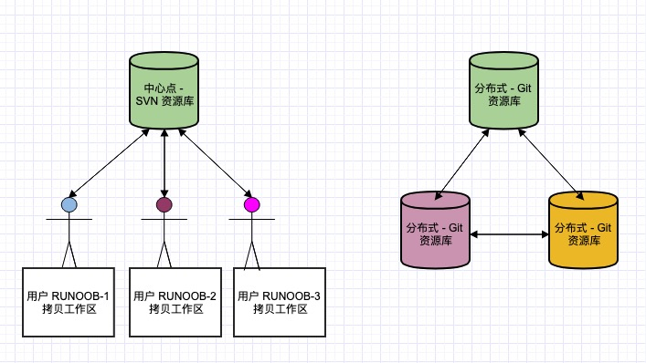

## Git 简介

Git 是一个开源的分布式版本控制系统，也是个内容管理系统(CMS)，工作管理系统等，用于敏捷高效地处理任何或小或大的项目。

Git 是 Linus Torvalds 为了帮助管理 Linux 内核开发而开发的一个开放源码的版本控制软件。

Git 与常用的版本控制工具 CVS, Subversion 等不同，它采用了分布式版本库的方式，不必服务器端软件支持。

::: danger Git 命令
进行项目开发之前，需要对 git 版本库有起码的认识，具有基本的操作能力。git 命令参考文档：https://gitee.com/all-about-git
:::

Git 与 SVN 区别点：

1、Git 是分布式的，SVN 不是：这是 Git 和其它非分布式的版本控制系统，例如 SVN，CVS 等，最核心的区别。

2、Git 把内容按元数据方式存储，而 SVN 是按文件：所有的资源控制系统都是把文件的元信息隐藏在一个类似 .svn、.cvs 等的文件夹里。

3、Git 分支和 SVN 的分支不同：分支在 SVN 中一点都不特别，其实它就是版本库中的另外一个目录。

4、Git 没有一个全局的版本号，而 SVN 有：目前为止这是跟 SVN 相比 Git 缺少的最大的一个特征。

5、Git 的内容完整性要优于 SVN：Git 的内容存储使用的是 SHA-1 哈希算法。这能确保代码内容的完整性，确保在遇到磁盘故障和网络问题时降低对版本库的破坏。



## Git 常用命令

```bash
# git配置
git config --list 显示当前的Git配置
git config --globel user.name zhangjinxi 配置git全局用户名
git config --globel use.email zhangjinxi@gaodun.com 配置git全局邮箱

# ssh加密，生成公钥和私钥，存在~/.ssh目录内，把公钥id_rsa.pub内容复制到远端仓库中
ssh-keygen -t rsa

# git项目初始化操作
git init 初始化一个本地git仓库
git init [project-name] 新建一个目录，将其初始化为Git代码库
git clone [url] 克隆远程仓库url，到本地

# git远程仓库
git remote 查看远程仓库 -v 显示所有远程仓库
git remote show [remote] 显示远程仓库的信息
git remote add [name] [url] 添加远程仓库url,别名为name
git remote rm [name] 删除远程仓库
git remote rename [oldName] [newName] 修改远程仓库别名

# 融合代码
git fetch [remote] 拉取远程仓库最新代码到`本地对应的远程分支`。切记，此时并没有merge到当前分支
git merge [branch] 融合branch分支的代码到当前分支
git pull [remote] [branch]  取回远程仓库的变化，并与本地分支合并。等于git fetch + git merge
git cherry-pick [commitId] merge某个commitId的更改
#把branch|commitId作为基点，commit记录为直线，
# -i:进入交互模式，--continue 需要继续rebase操作 --abort终止rebase
git rebase [branch|commitId]

# 提交代码
git add [filename]  把filename的更改添加到缓存区
git add . 所有更改添加到缓存区
git commit -m [message] 提交到版本库，注解信息为message
git commit -am [message] 跳过缓存区，直接提交到版本库，注解信息为message
#跳过缓存区，直接提交到版本库，注解信息为message 有message时会覆盖上次提交信息
git commit -amend [message]

# 推送代码到远程仓库
git push [remote] [branch] 上传本地指定分支到远程仓库同名分支
#推送本地指定分支到远程仓库指定分支，-u 跟踪，-f:--force强推
# -d：--delete 删除远程分支 -a:--all 推送所有分支到远程仓库
git push [remote] [localBranch]:[remoteBranch]

# git日志和状态
git status 查看项目状态
git log 查看commit记录 --stat 详细信息
git log -S [keyword] 根据关键词搜索提交历史
git reflog 查看所有操作记录，删除、提交、创建新分支等操作
git blame [file] 显示指定文件是什么人在什么时间修改过
git diff 显示暂存区和工作区的差异
git diff HEAD 显示工作区与当前分支最新commit之间的差异
git show [commit|tag]:[file] 显示某次提交|tag的某个文件的内容元数据和内容变化

# 分支操作
git branch 查看本地分支 -a 查看所有分支 -r 查看远程分支
git branch [branchName] [commit] 创建branchName分支，指向指定commit
git checkout [branchName] 切换到branchName分支
git checkout -b [branchName] 创建并切换到branchName分支
git branch --track [branch] [remote-branch] 新建一个分支，与指定的远程分支建立追踪关系
git branch --set-upstream [branch] [remote-branch] 在现有分支与指定的远程分支之间建立追踪关系
git branch -d [branch-name] 删除分支
git push origin --delete [branch-name] 删除远程分支
git branch -dr [remote/branch] 删除远程分支

# 标签操作
git tag 列出所有tag
git tag [tag] [commit] 在指定commit新建一个tag
git tag -d [tag] 删除本地tag
git push remote :refs/tags/[tag] 删除远程tag
git push [remote] [tag]  提交指定tag --tags：提交所有tag
git checkout -b [branch] [tag] 新建一个分支，指向某个tag

# 撤销操作
git checkout -- [filename] 撤销工作目录中filename文件的修改操作
# 把本分支重置为远程仓库的某个分支或者commitId
# type:hard工作区、缓存区、版本库全部重置，mixed缓存区和版本库重置，soft只有版本库重置
git reset --[type] [remoteName]/[branchName|commitId]
git revert [commitId] 回退某个commitId：通过添加一个commitId回退

# git暂存操作
git stash 暂存工作区的更改
git stash pop 弹出最近暂存的更改

# 生成一个可供发布的压缩包
git archive
```

## commitlint 提交规范

用于检查提交信息是否符合规范的插件，不符合规范提交操作会失败。

安装依赖：

```bash
yarn add @commitlint/cli @commitlint/config-conventional
```

创建 commitlint.config.js 提交规范文件，commit 时会根据此文件检查 commit message 信息是否符合规范：

```js
module.exports = {
  // 继承的规则
  extends: ["@commitlint/config-conventional"],
  // 定义规则类型
  rules: {
    // type 类型定义，表示 git 提交的 type 必须在以下类型范围内
    "type-enum": [
      2,
      "always",
      [
        "feat", // 新功能 feature
        "fix", // 修复 bug
        "docs", // 文档注释
        "style", // 代码格式(不影响代码运行的变动)
        "refactor", // 重构(既不增加新功能，也不是修复bug)
        "perf", // 性能优化
        "test", // 增加测试
        "chore", // 构建过程、依赖更新或辅助工具的变动
        "revert", // 回退
        "build", // 打包
        "workflow", // 工作流改进
        "ci", // 持续集成
        "types", // 类型定义文件更改
        "wip", // 开发中
      ],
    ],
    // subject 大小写不做校验
    "subject-case": [0],
  },
};
```

commit 规范示例：

```bash
git commit -m feat:Add workflow, homepage, etc.
```
