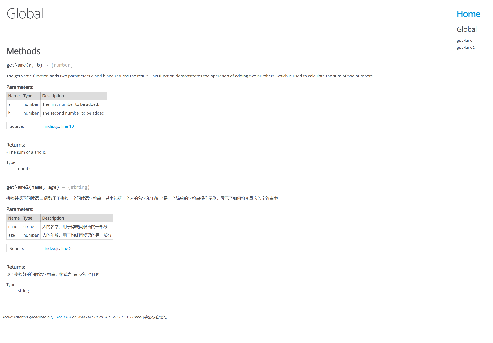

## 文档规范

使用 HTML5 的文档声明类型 `<!DOCTYPE html>` 来开启标准模式。
若不添加该声明，浏览器会开启怪异模式，按照浏览器自己的解析方式渲染页面，那么，在不同的浏览器下面可能会有不同的样式。

```html
<!-- HTML5文档声明使用标准模式 -->
<!DOCTYPE html>
<!-- 定义文档使用的语言，浏览器会根据语言进行排版和格式化 -->
<html lang="en">
  <head>
    <!-- 统一使用 UTF-8 编码，避免乱码问题。 -->
    <meta charset="UTF-8" />
    <!-- 移动端定义视口宽度 -->
    <meta name="viewport" content="width=device-width, initial-scale=1.0" />
    <title>Document</title>
  </head>
  <body>
    <!-- 使用语义化标签代替div进行布局 -->
    <header>
      <section>
        <nav></nav>
      </section>
    </header>
  </body>
</html>
```

## 常见命名方式

- Pascal Case 大驼峰式命名法：首字母大写。eg：StudentInfo、UserInfo、ProductInfo
- Camel Case 小驼峰式命名法：首字母小写。eg：studentInfo、userInfo、productInfo
- 烤串命名法：全部小写，单词用`-`分割。eg：student-info、user-info

## 文件资源命名规范

- 推荐使用烤串命名法。
- 文件名不得含有空格。
- 建议只使用小写字母，不使用大写字母。( 为了醒目，某些说明文件的文件名，可以使用大写字母，比如 README、LICENSE。 )
- 引入资源使用相对路径，不要指定资源所带的具体协议 ( http:,https: ) ，除非这两者协议都不可用。

```js
// 推荐
<script src="//cdn.bootcss.com/vue/2.6.10/vue.common.dev.js"></script>
// 不推荐：
<script src="https://cdn.bootcss.com/vue/2.6.10/vue.common.dev.js"></script>
```

## JS 命名规范

### 变量命名

- 命名方式 : 小驼峰式命名方法
- 命名规范 : 类型+对象描述的方式，如果没有明确的类型，就可以使前缀为名词。类型有：
  - function
  - boolean
  - string
  - object
  - array
  - int

```js
// 推荐
var tableTitle = "LoginTable";
// 不推荐：
var getTitle = "LoginTable";
```

### 常量命名

- 命名方法 : 全部大写
- 命名规范 : 使用大写字母和下划线来组合命名，下划线用以分割单词。

```js
const MAX_COUNT = 10;
const URL = "https://www.yuque.com/wuchendi/fe";
```

### 函数命名

- 命名方式 : 小驼峰方式 ( 构造函数使用大驼峰命名法 )
- 命名规则 : 前缀为动词
  - can：判断是否可执行某个动作
  - has：判断是否含有某个值
  - is：判断是否为某个值
  - get：获取某个值
  - set：设置某个值

## CSS 命名规范

1. id 采⽤驼峰式命名
2. less/sass 中的变量、函数、混合等采⽤驼峰式命名
3. class 使用 BEM 规范。‌BEM 规范 ‌（Block, Element, Modifier）是一种基于组件化的前端开发方式，旨在提升界面开发效率和代码复用性。它包含四个主要概念：Block、Element、Modifier 和 Mix。

- ‌Block‌：Block 是页面上的独立功能单元，可以重复使用。例如，一个按钮或一个菜单都可以是一个 Block。Block 的命名应该描述其用途而不是状态，例如使用“button”而不是“red-button”‌
- ‌Element‌：Element 是 Block 的一部分，只能在 Block 的上下文中使用。例如，一个按钮的图标可以是一个 Element。Element 的命名应该明确其在 Block 中的作用 ‌
- ‌Modifier‌：Modifier 用于定义 Block 和 Element 的外观、状态和行为。例如，一个按钮可以有不同的状态（如禁用、激活），这些状态可以通过 Modifier 来定义 ‌
  ‌- Mix‌：Mix 允许组合多个 BEM 实体，提供更灵活的样式定义方式 ‌

BEM 的命名规则通过双下划线`__`和双连字符（--）来区分 Block、Element 和 Modifier。具体规则：`block__element--modifier‌`

BEM 的优势：

- ‌ 可读性强 ‌：通过明确的命名方式，开发者可以快速理解类名所代表的意义 ‌
- ‌ 易于维护 ‌：结构化的 CSS 使得代码更容易维护和扩展 ‌
- ‌ 降低冲突风险 ‌：使用特定的命名模式减少了类名之间的冲突，增强了代码的可预测性 ‌
- ‌ 促进团队协作 ‌：统一的命名规范使得团队成员更容易理解彼此编写的代码，促进了协作效率 ‌

```js
// 布局
文档    doc
头部    header(hd)
主体    body
尾部    footer(ft)
主栏    main
侧栏    side
容器    box/container

// 通用组件
列表    list
列表项  item
表格    table
表单    form
链接    link
标题    caption/heading/title
菜单    menu
集合    group
条      bar
内容    content
结果    result

// 组件
按钮        button(btn)
字体        icon
下拉菜单     dropdown
工具栏       toolbar
分页         page
缩略图       thumbnail
警告框       alert
进度条       progress
导航条       navbar
导航         nav
子导航       subnav
面包屑       breadcrumb(crumb)
标签        label
徽章        badge
巨幕        jumbotron
面板        panel
洼地        well
标签页      tab
提示框      tooltip
弹出框      popover
轮播图      carousel
手风琴      collapse
定位浮标    affix

// 语义化小部件
品牌        brand
标志        logo
额外部件    addon
版权        copyright
注册        regist(reg)
登录        login
搜索        search
热点        hot
帮助        help
信息        info
提示        tips
开关        toggle
新闻        news
广告        advertise(ad)
排行        top
下载        download

// 功能部件
左浮动    fl
右浮动    fr
清浮动    clear

// 状态
前一个    previous
后一个    next
当前的    current

显示的    show
隐藏的    hide
打开的    open
关闭的    close

选中的    selected
有效的    active
默认的    default
反转的    toggle

禁用的    disabled
危险的    danger
主要的    primary
成功的    success
提醒的    info
警告的    warning
出错的    error

大型的    lg
小型的    sm
超小的    xs
```

## Vue 组件编码规范

- 组件名应该始终是多个单词的，根组件 App 除外，但最多不超过 5 个单词
- 单⽂件组件的⽂件名使用大驼峰：PascalCase
- 应⽤特定样式或者约定的基础组件应该全部以⼀个特定的前缀开头，⽐如 Base、App 或 V
- 只应该拥有单个活跃实例的单例组件应该以 The 前缀命名，以⽰其唯⼀性
- 和⽗组件紧密耦合的⼦组件应该以⽗组件名作为前缀命名
- 组件名应该倾向于完整单词⽽不是缩写
- 在声明和使用 prop 的时候，始终使⽤ camelCase，至少声明类型
-

```bash
# not good
components/
|- MyButton.vue
|- VueTable.vue
|- Icon.vue

# good 基础组件
components/
|- BaseButton.vue
|- BaseTable.vue
|- BaseIcon.vue

# good 父组件前缀命名
components/
|- TodoList.vue
|- TodoListItem.vue
|- TodoListItemButton.vue

# good
<!-- 在单⽂件组件和字符串模板中 -->
<MyComponent/>
<!-- 在 DOM 模板中 -->
<MyComponent></MyComponent>
```

## JSDoc 文档注释规范

jsDoc 是一个用于 JavaScript 的 API 文档生成器。它根据 JavaScript 文件中的注释信息，生成 JS 应用程序或模块的 API 文档。通过使用 JSDoc 标记如：命名空间，类，方法参数等，使开发者能够轻易地阅读代码，掌握代码定义的类和和其属性和方法，从而降低维护成本并提高开发效率

JSDoc 注释通常应该放在记录代码之前。为了被 JSDoc 解析器识别，每个注释必须以 /** 序列开头。以 /_、/_**开头或超过 3 颗星的注释将被忽略。这个特性用于控制解析注释块的功能。

```js
/**
 * 描述信息也可以写在开头
 * @func 普通函数 alias:@function @method [<type> <name>]
 * @constructor 构造函数 alias:@class [<type> <name>]
 * @classdesc <some description> 类提供一个描述
 * @author ⼩明 <xiaoming@example.com>
 * @createTime 创建时间
 * @desc 函数的描述信息 alias:@description <description>
 * @name <namePath> 强制 JSDoc 使用此名称，而忽略实际代码里的名称
 * @default [<some value>] 记录标识的赋值
 * @ignore 标签表示在代码中的注释不应该出现在文档中
 *
 * @enum [<type>] 一组静态属性
 * @constant [<type> <name>] 属于常量的符号。
 * @file 文件的说明：jsdoc测试文件
 * @copyright <some copyright text> 文件的版权信息
 *
 * @event Hurl#snowball Hurl 类中名为 snowball 事件
 * @type {object}
 * @property {boolean} isPacked - Indicates
 * @fires <className>#[event:]<eventName> alias:@emits
 * @fires Milkshake#drain 通过Milkshake.drain 调用此方法
 * @listens <eventName> 侦听指定的事件
 * @event 记录事件的内容。
 *
 * @deprecated 该函数已过时，请勿再使用
 * @example 表示示例代码
 * @abstract 表示抽象函数，不能直接调用，只能被继承
 * @access public|protected|private|package 访问权限:public
 * @package [{typeExpression}] 是包专用的= @access package
 * @alias <aliasNamepath> 函数的别名
 * @async 表示异步函数
 * @generator 表示生成器函数
 * @yield <type> 表示生成器函数的返回值
 * @borrows <that namepath> as <this namepath>
 * @lends <namepath> 对象的所有成员标记为某个标识符的成员
 * @callback <namepath> 回调函数（可传递给其他函数）的描述
 * @readonly 表示只读属性
 * @typedef [<type>] <namepath> 自定义类型，可以在@type @param 中使用
 * @type {typeName} 提供一个类型表达式
 *
 * @fileName 函数所在⽂件名
 * @filePath 函数所在⽂件路径
 * @fileLine 函数所在⽂件行号
 * @fileColumn 函数所在⽂件列号
 * @fileUrl 函数所在⽂件的URL
 *
 * @global 全局符号出现在文档中
 * @namespace [[{<type>}] <SomeName>] 声明为一个命名空间
 * @module my/pants 当前文件声明为一个模块
 * @exports color/mixer 模块导出的值
 * @see <namepath|text> 参考说明文档|外部资源
 * @extends Pointer - 继承的类.alias:@augments
 * @interface [<name>] 声明为接口
 * @implements {typeExpression} 实现的接口
 * @inheritdoc 从其父类继承其文档
 * @inner 标记为其父符号的内部成员 被 “Parent~Child” 引用。
 * @instance 标记为其父符号的实例成员 被称为 Parent#Child。
 * @version 1.0.0 表示该项的版本。
 * @since 1.0.0 特定版本中添加了类、方法或其他符号
 * @external <nameOfExternal> 包外部定义的类、命名空间或模块
 * @kind <kindName> 标记为特定类型的符号，如“类”、“函数”等。
 * @mixes <OtherObjectPath> 当前对象混入了 OtherObjectPath 对象的所有成员
 * @mixin [<MixinName>] 添加到其他对象的功能
 * @override 覆盖其父类同名的标识符
 * @requires <someModuleName> 模块需要的依赖项
 * @this <namePath> 指明 this 关键字的指向。
 * @throws {<type>} free-form description 函数可能引发的错误
 * @todo 记录要完成的任务
 * @tutorial <tutorialID> 指向向导教程的链接，作为文档的一部分
 * {@link} 内联标记创建指向指定的 namepath 或 URL 的链接
 * {@tutorial} 内联标记创建指向您指定的教程标识符的链接
 *
 * @param {array} a - 参数a描述信息
 * @param {number} b=1 - 参数b默认值为1
 * @param {string} c=2 - 参数c有两种取值：1表⽰x；2表⽰xx
 * @param {object} d - 参数d为⼀个对象
 * @param {string} d.e - 参数d的e属性
 * @param {object[]} g - 参数g为⼀个对象数组
 * @param {string} g[].h - 参数g数组中⼀项的h属性
 * @param {number} [j=1] - 可选&默认值参数
 * @property <type> <name> [<description>] alias:@prop 静态属性
 * @return {Promise<boolean>} 函数返回值，没有可省略
 */
function foo(a, b, c, d, g, j) {
  // ...
}
```

默认情况下，JSDoc 使用内置的“默认”模板将文档转换为 HTML。您可以根据自己的需要编辑此模板，或者创建一个全新的模板。在命令行上运行文档生成器：

```bash
# 全局安装依赖
npm install -g jsdoc
# 模板依赖包
npm install docdash

# 使用配置文件jsdoc.json
npx jsdoc -c jsdoc.json
npx jsdoc -c jsdoc.js

# 生成文档
jsdoc book.js
```

此命令将在当前工作目录中创建名为 out/ 的目录。在该目录中，您将找到生成的 HTML 页面。

### JSDoc 配置文件

可以是 json 文件，JSDoc 默认配置：

```json
{
  "plugins": [],
  "recurseDepth": 10,
  "source": {
    "includePattern": ".+\\.js(doc|x)?$",
    "excludePattern": "(^|\\/|\\\\)_"
  },
  "sourceType": "module",
  "tags": {
    "allowUnknownTags": true,
    "dictionaries": ["jsdoc", "closure"]
  },
  "templates": {
    "cleverLinks": false,
    "monospaceLinks": false
  }
}
```

也可以是 js 文件，需要通过 module.exports 导出配置对象:

```js
"use strict";
module.exports = {
  // Markdown 格式的文本转换为 HTML;为每个 doclet 生成摘要
  plugins: ["plugins/markdown", "plugins/summarize"],
  recurseDepth: 10, //JSDoc 递归源文件的层级数量
  //确定哪些文件要用 JSDoc 生成文档。
  source: {
    excludes: ["node_modules/"],
    excludePattern: "(node_modules/|docs)", //排除的文件模式
    includes: ["src/api/"], // 需要读取的文件
    includePattern: ".+\\.js(doc|x)?$", // 文件匹配模式
  },
  // 解析 JavaScript 文件的方式
  sourceType: "module" | "script",
  tags: {
    allowUnknownTags: true,
    dictionaries: ["jsdoc", "closure"],
  },
  // 影响外观和生成的文档内容。自定义模板可能不会实现所有的选项
  templates: {
    cleverLinks: false,
    monospaceLinks: false,
  },
  docdash: {
    sort: true,
    search: true,
  },
  // 命令行选项放入配置文件中
  opts: {
    template: "templates/default", // same as -t templates/default
    // "template": "./node_modules/docdash", //使用docdash模板
    encoding: "utf8", // same as -e utf8
    destination: "./out/", // same as -d ./out/
    recurse: true, // same as -r
    verbose: true,
    tutorials: "path/to/tutorials", // same as -u path/to/tutorials
  },
  // 哪些 JSDoc 标签允许被使用和解析。
  tags: {
    allowUnknownTags: true,
    dictionaries: ["jsdoc", "closure"],
  },
};
```
### 示例
```js
/**
 * The getName function adds two parameters a and b and returns the result.
 * This function demonstrates the operation of adding two numbers, which is used to calculate the sum of two numbers.
 * 
 * @param {number} a - The first number to be added.
 * @param {number} b - The second number to be added.
 * @returns {number} - The sum of a and b.
 */
function getName(a,b){
  return a+b
}

/**
 * 拼接并返回问候语
 * 
 * 本函数用于拼接一个问候语字符串，其中包括一个人的名字和年龄
 * 这是一个简单的字符串操作示例，展示了如何将变量嵌入字符串中
 * 
 * @param {string} name 人的名字，用于构成问候语的一部分
 * @param {number} age 人的年龄，用于构成问候语的另一部分
 * @return {string} 返回拼接好的问候语字符串，格式为'hello名字年龄'
 */
function getName2(name,age){
  return 'hello'+name+age
}
```

参考：https://jsdoc.bootcss.com/about-namepaths.html
