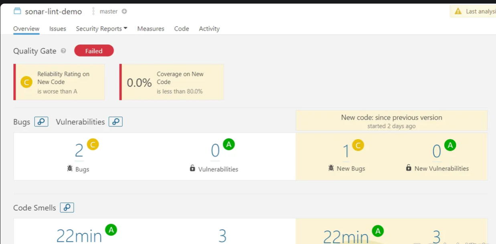
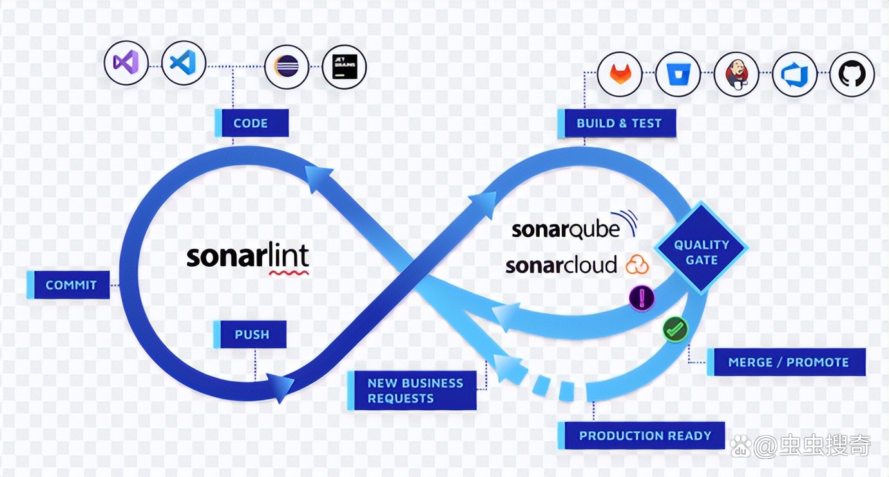

## 代码质量把控

代码质量包括:

- 代码风格: 代码风格是否统一
- 重复率: 重复出现的代码区块占比，通常要求在 5%以下(借助平台化工具如 Sonar)
- 复杂度: 项目代码量，模块大小，耦合度等

在前端开发中，实现代码质量与维护性的关键在于遵循一系列最佳实践和方法。以下是一些具体的建议：

1. 规范命名：使用有意义的变量名、函数名和类名，确保代码的可读性和一致性。这有助于其他开发者快速理解代码的意图，减少误解和错误。

2. 代码规范化：统一代码风格，包括缩进、空格、行宽等，使用工具如 ESLint、tslint、stylelint 和 Prettier 来强制执行这些规范。规范化可以提高代码的可读性和一致性，减少因风格不一致导致的错误。

3. 注释和文档：在必要的地方添加注释，解释代码的作用、输入输出和使用方法。良好的注释可以帮助其他开发者理解代码的逻辑，提高代码的可维护性。

4. 模块化开发：将代码分解为小的、独立的模块，每个模块负责特定的功能。模块化开发可以提高代码的复用性和可维护性，减少命名冲突，便于团队协作和代码管理。

5. 代码审查：进行代码审查是发现和修复潜在问题的有效方法。通过代码审查，可以确保代码符合团队的标准，减少低质量代码的引入。

6. 自动化测试：编写单元测试和集成测试，确保代码的正确性和稳定性。自动化测试可以及时发现代码中的问题，减少手动测试的时间和成本。

7. 版本控制：使用 Git 等版本控制系统管理代码，确保代码的可追溯性和协作性。版本控制可以帮助团队成员协同工作，避免代码冲突。并且可以在 commit 之前对代码进行风格检查，也可以使用 commitlint 对 commit 进行检查。

8. 性能优化：关注代码的性能，避免过早优化，但也要确保代码在实际使用中的高效性。性能优化可以提高用户体验，减少资源消耗。

9. 领域建模和设计模式：使用领域建模和设计模式来组织代码，确保代码的结构清晰、易于扩展。领域建模可以帮助理解业务逻辑，设计模式可以提高代码的复用性和可维护性。

10. 持续集成和持续部署（CI/CD） ：使用 CI/CD 工具自动化构建、测试和部署流程。CI/CD 可以确保代码的频繁集成和快速部署，减少人为错误。

## 模块化开发最佳实践

前端开发中模块化开发的最佳实践包括：

1. **理解模块化的概念和优势**：模块化开发的核心思想是将大型应用拆分成一系列小型、独立的部分，每个部分负责特定的功能。这样做的好处包括降低代码的耦合度，提高代码的可维护性和重用性

2. **使用模块化工具**：使用模块化工具（如 ES6 的模块）来组织代码，将功能拆分为独立的模块。这不仅提高了代码的可维护性和复用性，还能帮助开发者更好地管理大型项目

3. **合理的模块划分和组件设计**：在现代前端开发中，模块化和组件化已经成为提升项目可维护性和开发效率的核心原则。通过合理的模块划分和组件设计，可以优化前端项目的整体结构和性能

4. **选择合适的构建工具**：Webpack 是一个常用的构建工具，它能够支持新特性语言版本的编译，并针对 JavaScript 模块化打包以及所有资源（如样式、图片、字体等）进行模块化处理。Webpack 能够解决前端整体的模块化能力，是前端工程化的重要工具

5. **代码拆分和版本控制**：在模块化编程中，代码拆分和版本控制是重要的最佳实践。通过合理的代码拆分，可以提高项目的加载速度和性能；而版本控制则有助于管理不同版本的模块，确保项目的稳定性和一致性

6. **结合实例分析**：从理论出发，结合实例分析，为前端开发者提供一套行之有效的最佳实践指南。通过具体的代码示例和实际应用，帮助开发者更好地理解和掌握模块化开发的技巧

## 前端代码审查

有效地进行前端代码审查以提高代码质量，可以从以下几个方面入手：

1. **使用代码审查工具**：选择合适的代码审查工具是提高代码质量的关键。这些工具可以帮助开发团队发现和修复潜在的问题，确保代码的一致性和质量。例如，ESLint 可以自动检测 JavaScript 代码中的错误，帮助开发者保持代码风格的一致性。此外，还有许多其他工具如 SonarQube、styleLint 等，可以根据项目需求和团队工作流选择合适的工具

2. **编写单元测试**：单元测试是确保代码质量的重要手段。通过编写单元测试，可以验证代码的功能是否正确，并在后续开发过程中及时发现和修复问题

3. **遵循编码规范**：统一的编码规范有助于提高代码的可读性和可维护性。团队应该制定并遵循一套编码规范，并在代码审查过程中严格执行

4. **定期进行代码重构**：代码重构可以帮助优化现有代码，提高其性能和可维护性。定期进行代码重构可以避免代码积压问题，保持代码的整洁和高效

5. **重视代码审查流程**：建立并维护一个高效的代码审查流程是保证代码质量的重要环节。代码审查不仅可以发现潜在的问题，还可以提供优化建议，帮助团队提升整体代码质量

6. **采用模块化开发**：模块化开发可以提高代码的可维护性和可扩展性。通过将代码分解成独立的模块，可以更容易地管理和维护代码

## 自动化测试

在前端开发中，实施自动化测试的策略可以从以下几个方面进行详细探讨：

1. **选择合适的测试工具**：

   - **Nightwatch**：这是一个基于 Node.js 的端到端测试框架，适用于浏览器自动化测试。可以通过安装测试所需包、增加 npm script 入口、配置 Nightwatch、书写测试用例和运行测试来实现自动化测试

   - **Cypress**：这是一个现代的前端测试框架，支持 API 测试和 UI 自动化测试，可以集成到 DevOps 流水线中
   - **Vitest**：这是一个基于 Node.js 的单元测试框架

2. **设计有效的测试用例**：

   - 测试用例的设计应覆盖所有功能点，确保每个功能模块都能被充分测试。可以通过编写详细的测试脚本来模拟用户操作，确保测试的全面性和准确性

3. **维护测试脚本**：

   - 测试脚本的维护是自动化测试的重要环节。随着前端代码的不断更新和修改，测试脚本也需要相应地进行调整和更新，以确保其持续有效

4. **测试类型的选择**：

   - 前端自动化测试主要包括单元测试、功能测试、性能测试和安全测试等类型。单元测试和功能测试是最常见的两种测试方式，适用于普通开发者。单元测试可以测试代码中的最小可测试单元，例如函数或模块

5. **集成测试工具**：
   - 使用集成测试工具如 Testflowy，可以减少创建每个集成测试的成本，并扩大集成测试的覆盖范围

## Git 进行版本控制

使用 Git 进行版本控制时，掌握一些高级技巧可以帮助开发者更高效地管理代码和促进团队协作。以下是一些常见的高级技巧：

1. **交互式暂存（Interactive Staging）** ：Git 允许用户在提交之前选择性地暂存更改，这使得开发者可以更精细地控制哪些更改被包含在提交中

2. **撤销提交（Reverting Commits）** ：当需要撤销某个提交时，Git 提供了多种方法，如使用`git revert`来创建一个新的提交来撤销之前的更改，或者使用`git reset`来重置到之前的某个状态

3. **合并冲突处理（Handling Merge Conflicts）** ：在多分支开发中，合并分支时可能会遇到冲突。Git 提供了工具来帮助开发者解决这些冲突，确保合并过程顺利进行

4. **使用.gitignore 文件**：通过配置.gitignore 文件，可以忽略某些不需要版本控制的文件或目录，从而减少版本库的大小并提高管理效率

5. **Stash 功能**：当需要暂时保存当前工作状态但又不想提交时，可以使用`git stash`命令将更改保存起来，之后再恢复这些更改

6. **Cherry-pick**：此功能允许开发者选择性地将特定的提交应用到当前分支上，这对于修复特定问题或合并特定功能非常有用

7. **Rebase**：通过交互式重基（Interactive Rebase），开发者可以重新组织历史提交顺序，这有助于清理历史记录并使项目历史更加清晰

8. **定期拉取最新代码**：为了保持代码库的同步，定期从远程仓库拉取最新的更改是非常重要的实践

9. **遵循最佳实践**：如在提交前进行测试、避免手动编辑.git 目录、一次只进行少量重大更改等，这些习惯有助于减少合并冲突并确保代码质量

## SonarQube

SonarQube 是一种代码质量保证工具，可收集和分析源代码，并提供项目代码质量报告。SonarQube 由 SonarSource 开发并开源并免费提供（收费的企业版），可以用于持续检查代码质量，通过静态代码分析执行自动审查，以检测 20 多种编程语言（包括 C、C++、Java、Javascript、PHP、GO、Python 等）的错误、代码异常和安全漏洞。SonarQube 结合了静态和动态分析工具，并能够随着时间的推移持续扫描项目的代码质量。从细微的样式选择到设计错误，都可以通过 SonarQube 来进行检查和评估。

SonarQube 可以和用户的开发工作流程集成，以实现跨项目分支和拉取请求的持续代码检查。SonarQube 提供应用程序运行状况的详细报告并突出显示新引入的问题，为用户提供了丰富的可搜索代码历史记录，以分析代码出现问题的位置，并确定是否存在样式问题、代码失败、代码重复、缺乏测试覆盖率或代码过于复杂。能从不同方面分析源代码，并逐层钻取代码，将模块级别下移到类级别，每个级别都会生成指标值和统计数据，以揭示源代码中需要改进的问题区域。

Sonarqube 还确保代码可靠性、应用程序安全性，并通过使代码库干净且可维护来减少技术债务。SonarQube 还提供 CI/CD 集成，并在代码审查期间通过分支分析和拉取请求实时提供反馈

SonarQube 作为代码分析工具，使用起来也非常简单，就是在构建代码的同时运行 SonarQube+SonarScanner 来进行代码分析，发现严重问题则上报，没有问题就通过代码检测！

**_七个维度检测代码质量_**

(1) 复杂度分布(complexity)：代码复杂度过高将难以理解、难以维护

(2) 重复代码(duplications)：程序中包含大量复制粘贴的代码是质量低下的表现,默认是一个文件中连续十行代码与另一个文件中的代码一致

(3) 单元测试(unit tests)：统计并展示单元测试覆盖率

(4) 编码规范(coding rules)：通过 Findbugs,PMD,CheckStyle 等规范代码编写

(5) 注释(comments)：少了可读性差，多了看起来费劲

(6) 潜在的 Bug(potential bugs)：通过 Findbugs,PMD,CheckStyle 等检测潜在的 bug

(7) 结构与设计(architecture & design)：依赖、耦合等

**_静态代码分析或动态代码分析。_**

动态代码分析依赖于研究代码在执行过程中的行为方式。目的是在程序运行时发现程序中的错误，而不是通过离线反复检查代码。动态代码分析支持进行以下各项分析：

- 代码覆盖率：计算测试套件对一段代码进行了多少测试。

- 内存错误检测：检查是否发生内存泄漏或错误。

- 故障定位：将有 bug 的代码定位到具体位置。

- 不变推理：观察程序计算的值，然后报告在观察到的执行中为 true 的属性，并且这可能在所有执行中为 true。

- 安全分析：检测安全问题。

- 并发错误：动态使用运行时错误检测来暴露缺陷，例如竞争条件、异常、资源和内存泄漏以及安全攻击漏洞

- 程序切片：包括将程序减少到仍能产生所选行为的最小形式。

- 性能分析：在运行时动态跟踪软件应用程序并捕获可用于分析和识别性能不佳原因的数据。

静态代码分析是在不执行任何代码的情况下完成的。它通过白盒分析的方法扫描程序源代码以来搜索可能的错误用法和不良编码实践的算法和技术的集合。这是通过编译器错误和运行时调试技术来完成的。静态代码分析也被认为是自动化代码审查过程的一种方法。静态代码分析涉及的任务可以分为：

- 语法错误：语法错误，如语法错误、拼写错误、缩进错误等。
- 逻辑错误：逻辑错误，如条件语句错误、循环语句错误、函数调用错误等。
- 静态类型错误：静态类型错误，如类型转换错误、类型不匹配等。
- 运行时错误：运行时错误，如空指针异常、数组越界异常、类加载异常等。

- 命名错误：命名错误，如变量名、函数名、类名、包名等。
- 命名空间错误：命名空间错误，如包名、类名、函数名等。

- 代码风格错误：代码风格错误，如缩进、空格、换行符、引号等。
- 错误处理错误：错误处理错误，如 try-catch 语句错误、finally 语句错误、异常抛出错误等。

**_SonarQube 级别_**

这取决希望软件执行的功能以及您希望使用该软件进行的开发级别。

- 社区版：在 CI/CD 中采用代码质量的起点

- 开发人员版：最大的应用程序安全性以及 SonarQube 跨分支机构和 RS 的价值

- 企业版：管理应用程序组合，在企业级别实现代码质量和安全性

- 数据中心版：全球部署的高可用性

参考：https://www.sonarsource.com/

### SonarQube 类型规则

SonarQube 提供了丰富的规则，包括代码风格、安全性、性能、代码重复等，可以根据自己的需求进行配置。SonarQube 在源代码上执行规则来发现问题：

- 代码异味： (maintainability domain)（可维护性域）。针对代码中与可扩展性相关的问题。保持原样意味着开发人员在进行更改时，维护代码的时间将比他们应该做的更困难。在最坏的情况下，他们会对代码的状态感到困惑，以至于在进行更改时会引入额外的错误。
- Bug 问题：(reliability domain)（可靠性域）。针对代码中与可靠性相关的问题。
- Security 问题：(security domain)（安全性域）。针对代码中与安全性相关的问题。
- Performance 问题：(performance domain)（性能域）。针对代码中与性能相关的问题。
- Complexity 问题：(complexity domain)（复杂度域）。针对代码中与复杂度相关的问题。
- Style 问题：(style domain)（风格域）。针对代码中与风格相关的问题。
- Documentation 问题：(documentation domain)（文档域）。针对代码中与文档相关的问题。
- 漏洞问题：(vulnerability domain)（漏洞域）。针对代码中与漏洞相关的问题。
- 其他问题：(other domain)（其他域）。针对代码中与其他相关的问题。

### SonarQube 使用

- 在 Docker Hub 上找到您想要使用的 SonarQube 社区版本
- 通过运行一键命令启动服务器：

```bash
docker run -d --name sonarqube -p 9000:9000 <镜像名称>
```

- 通过浏览器 localhost:9000 访问 SonarQube 仪表板，默认用户名密码都是 admin
- 登录 sonarqube 后，要分析项目，可通过以下步骤操作：
  - 单击创建新项目按钮
  - 当询问希望如何创建项目时，请选择手动。
  - 提供项目密钥和显示名称，然后单击“设置”按钮。
  - 在“提供令牌”，选择“生成令牌”。为令牌命名，单击“生成” 按钮，然后单击 继续”。
  - 选择项目的主要语言在对项目运行分析，然后按照说明分析项目。在这里，将下载并在代码上执行扫描程序
  - 成功分析代码后，将在 SonarQube 看到分析结果：



### SonarQube 集成到 Jenkins 中

可以轻松地实现代码质量监控。

1.  在 Jenkins 中安装 SonarQube 插件。
2.  在 Jenkins 中配置 SonarQube 服务器。
3.  在 Jenkins 中配置 SonarQube 项目。
4.  在 Jenkins 中配置 SonarQube 构建步骤。
5.  在 Jenkins 中配置 SonarQube 构建后步骤。
6.  在 Jenkins 中配置 SonarQube 构建触发器。
7.  在 Jenkins 中配置 SonarQube 构建报告。
8.  在 Jenkins 中配置 SonarQube 构建结果。
9.  在 Jenkins 中配置 SonarQube 构建日志。
10. 在 Jenkins 中配置 SonarQube 构建邮件通知。
11. 在 Jenkins 中配置 SonarQube 构建报表。
12. 在 Jenkins 中配置 SonarQube 构建图表。
13. 在 Jenkins 中配置 SonarQube 构建仪表板。
14. 在 Jenkins 中配置 SonarQube 构建统计。
15. 在 Jenkins 中配置 SonarQube 构建历史。

### 工作原理和架构

SonarQube 是一个开源的代码质量工具，用于检测代码中的错误、漏洞、代码重复等。它使用插件机制来扩展功能，支持各种编程语言和框架。SonarQube 的主要组件包括：

- SonarQube Server：提供 SonarQube 用户交互界面和 Web 的 API 交互接口。
- SonarQube Scanner：用于在构建环境中执行分析。扫描仪会将报告发送到 SonarQube 服务器进行处理。
- SonarQube Plugins：用于扩展 SonarQube 的功能。
- SonarQube Rules：定义分析规则，用于检测代码中的错误、漏洞等。
- SonarQube Databases：用于存储分析结果。
- SonarQube Webhooks：用于接收外部系统发送的通知，并触发分析。
- SonarQube Web API：用于通过 HTTP 接口访问分析结果。



SonarQube 通过详细、系统地审查源代码来发挥作用。它集成在软件开发工作流程中，通常在新代码提交到版本控制系统时在持续集成过程中激活。

核心操作从 SonarQube 扫描器开始，只通过扫描代码而不执行它（静态分析）。 根据预定义的规则和模式审查代码以识别问题。这些规则的范围可以从潜在的错误和安全漏洞到代码异常，这些代码中的模式可能并不是真正的漏洞，但可能会在未来引起问题。

扫描完成后，SonarQube 会将结果编译成综合报告。该报告提供了一个仪表板，开发人员可以使用它来清晰地了解代码质量，突出显示重复代码、违反编码标准以及可以简化的复杂代码结构等问题。

该平台还提供代码质量的历史视图，使开发人员能够跟踪他们在一段时间内改进代码的进度。 这种历史视角不仅是为了发现问题所在，也是为了验证维护或提高代码质量的持续努力的有效性。

此外，SonarQube 可以配置为在不满足某些条件时使构建失败，从而确保新代码在合并和部署之前满足项目的质量标准。这创建了一种新变更必须通过的“质量门”，从而将代码质量检查直接集成到软件开发过程中。
