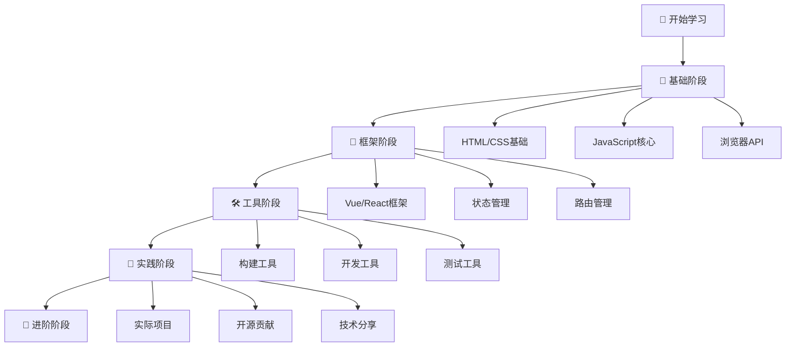

# 🎓 前端学习资源大全

> 💡 **精心整理的前端开发学习资源集合**，涵盖技术文档、开发工具、素材资源等各个方面，为前端开发者提供一站式的学习和开发支持。

## 📖 目录导航

- [📚 技术文档](#📚-技术文档)
  - [🌟 综合技术文档平台](#🌟-综合技术文档平台)
  - [🎨 Vue 生态系统](#🎨-vue-生态系统)
  - [🧩 UI 组件库](#🧩-ui-组件库)
  - [🛠️ 构建工具](#🛠️-构建工具)
  - [📊 可视化工具](#📊-可视化工具)
- [🎨 设计资源](#🎨-设计资源)
- [🎵 多媒体资源](#🎵-多媒体资源)
- [📦 CDN 服务](#📦-cdn-服务)
- [💻 在线编程平台](#💻-在线编程平台)
- [🔧 开发工具](#🔧-开发工具)
- [📱 实用工具](#📱-实用工具)
- [🧰 在线工具箱](#🧰-在线工具箱)
- [🎨 在线画图](#🎨-在线画图)
- [🎯 学习建议](#🎯-学习建议)

---

## 📚 技术文档

### 🌟 综合技术文档平台

| 平台 | 描述 | 特色 | 链接 |
|------|------|------|------|
| **DevDocs** | 各种技术文档终极奥义 | 🔍 快速搜索、离线支持 | [访问](https://devdocs.io/) |
| **印记中文** | 前端技术文档集合 | 🇨🇳 中文翻译、官方同步 | [访问](https://docschina.org/) |
| **DevHints** | 开发速查手册 | ⚡ 快速查询、简洁明了 | [访问](https://devhints.io/) |
| **MDN Web** | Web 技术权威文档 | 📖 权威标准、示例丰富 | [访问](https://developer.mozilla.org/zh-CN/docs/Web) |

### 🎨 Vue 生态系统

| 技术 | 版本 | 描述 | 文档链接 |
|------|------|------|----------|
| **Vue 3** | 3.x | 渐进式JavaScript框架 | [官方文档](https://v3.cn.vuejs.org/) |
| **Vue 2** | 2.x | Vue 2 稳定版本 | [官方文档](https://cn.vuejs.org/) |
| **Composition API** | - | Vue 3 组合式API | [API文档](https://composition-api.vuejs.org/zh/) |
| **Vue Router** | 4.x | Vue 3 路由管理器 | [路由文档](https://next.router.vuejs.org/) |
| **Vue Router** | 3.x | Vue 2 路由管理器 | [路由文档](https://router.vuejs.org/zh/) |
| **Vuex** | 4.x | Vue 3 状态管理 | [状态管理](https://next.vuex.vuejs.org/) |
| **Vuex** | 3.x | Vue 2 状态管理 | [状态管理](https://vuex.vuejs.org/zh/) |

### 🧩 UI 组件库

| 组件库 | 适用框架 | 特色 | 文档地址 |
|--------|----------|------|----------|
| **Element Plus** | Vue 3 | 🎨 企业级UI组件库 | [官方文档](https://element-plus.gitee.io/zh-CN/) |
| **Element UI** | Vue 2 | 🎯 成熟稳定的组件库 | [官方文档](https://element.eleme.cn/#/zh-CN) |
| **Ant Design Vue** | Vue 3 | 🐜 企业级设计语言 | [官方文档](https://antdv.com/components/overview) |
| **Vuetify** | Vue 2/3 | 🎨 Material Design风格 | [官方文档](https://vuetifyjs.com/) |

### 🛠️ 构建工具

| 工具 | 类型 | 特色 | 文档地址 |
|------|------|------|----------|
| **Vite** | 构建工具 | ⚡ 极速热重载 | [官方文档](https://vitejs.cn/) |
| **Vue CLI** | 脚手架 | 🔧 标准化项目结构 | [官方文档](https://cli.vuejs.org/zh/) |
| **TypeScript** | 类型系统 | 🔒 类型安全 | [官方文档](https://www.tslang.cn/docs/home.html) |
| **Webpack** | 打包工具 | 📦 模块化打包 | [官方文档](https://webpack.js.org/) |

### 📊 可视化工具

| 工具 | 用途 | 特色 | 文档地址 |
|------|------|------|----------|
| **jsPlumb** | 流程图连线 | 🔗 可视化连接 | [中文教程](https://wdd.js.org/jsplumb-chinese-tutorial/#/) |
| **ECharts** | 数据可视化 | 📈 丰富的图表类型 | [官方文档](https://echarts.apache.org/zh/index.html) |
| **D3.js** | 数据驱动文档 | 🎯 灵活的数据可视化 | [官方文档](https://d3js.org/) |

---

## 🎨 设计资源

### 📸 图片与视频素材

| 平台 | 类型 | 特色 | 访问地址 |
|------|------|------|----------|
| **Pexels** | 图片/视频 | 🆓 免费高质量素材 | [访问](https://www.pexels.com/zh-cn/) |
| **Unsplash** | 高清图片 | 📸 免费商用高清图片 | [访问](https://unsplash.com/) |
| **Wallspic** | 壁纸 | 🖼️ 高清壁纸资源 | [访问](https://wallspic.com/cn) |
| **unDraw** | SVG插图 | 🎨 可定制SVG插图 | [访问](https://undraw.co/illustrations) |
| **Pixabay** | 综合素材 | 🎭 图片、视频、音乐 | [访问](https://pixabay.com/) |

### 🔧 图片处理工具

| 工具 | 功能 | 特色 | 使用地址 |
|------|------|------|----------|
| **TinyPNG** | 图片压缩 | 🗜️ 无损压缩PNG/JPG | [在线使用](https://tinypng.com/) |
| **Squoosh** | 图片优化 | ⚙️ 多格式压缩对比 | [在线使用](https://squoosh.app/) |
| **Photopea** | 在线PS | 🎨 浏览器版Photoshop | [在线使用](https://www.photopea.com/) |
| **Remove.bg** | 背景移除 | ✂️ AI智能抠图 | [在线使用](https://www.remove.bg/) |

::: tip 💡 素材使用建议
- 选择高质量、符合项目风格的素材
- 注意版权问题，优先使用免费商用素材
- 适当压缩图片以优化加载速度
- 考虑响应式设计，准备不同尺寸的图片
:::

---

## 🎵 多媒体资源

### 🎶 音频素材

```javascript
// 经典音乐素材链接
const musicResources = {
  classical: [
    'https://sveltejs.github.io/assets/music/strauss.mp3',
    'https://sveltejs.github.io/assets/music/holst.mp3', 
    'https://sveltejs.github.io/assets/music/satie.mp3',
    'https://sveltejs.github.io/assets/music/beethoven.mp3'
  ],
  // 使用示例
  playMusic(index = 0) {
    const audio = new Audio(this.classical[index]);
    audio.play();
  }
};
```

### 🎬 视频素材

```javascript
// 高质量视频素材
const videoResources = {
  samples: [
    'https://videos.pexels.com/video-files/29523221/12708096_1080_1920_60fps.mp4',
    'https://videos.pexels.com/video-files/29295615/12633726_2560_1440_30fps.mp4',
    'https://videos.pexels.com/video-files/13423369/13423369-uhd_2560_1440_24fps.mp4'
  ],
  // 使用示例
  createVideoElement(src) {
    const video = document.createElement('video');
    video.src = src;
    video.controls = true;
    video.autoplay = false;
    return video;
  }
};
```

### 🎤 免费音频平台

| 平台 | 类型 | 特色 | 访问地址 |
|------|------|------|----------|
| **Freesound** | 音效素材 | 🔊 社区共享音效库 | [访问](https://freesound.org/) |
| **Zapsplat** | 音效/音乐 | 🎵 专业音效资源 | [访问](https://www.zapsplat.com/) |
| **YouTube Audio Library** | 背景音乐 | 🎼 YouTube官方音频库 | [访问](https://studio.youtube.com/) |

---

## 🗺️ 地图数据

| 平台 | 用途 | 特色 | 访问地址 |
|------|------|------|----------|
| **DataV.GeoAtlas** | 地图数据 | 🗺️ 中国行政区划数据 | [访问](http://datav.aliyun.com/tools/atlas/) |
| **Natural Earth** | 世界地图 | 🌍 免费的地理数据 | [访问](https://www.naturalearthdata.com/) |
| **OpenStreetMap** | 开源地图 | 🗺️ 开源地图数据 | [访问](https://www.openstreetmap.org/) |

---

## 📦 CDN 服务

| 服务商 | 特色 | 访问速度 | 使用地址 |
|--------|------|----------|----------|
| **BootCDN** | 🇨🇳 国内优化 | ⚡ 极速 | [访问](https://www.bootcdn.cn/) |
| **CDNJS** | 🌍 全球覆盖 | 🌐 稳定 | [访问](https://cdnjs.com/) |
| **jsDelivr** | 📦 GitHub集成 | 🔄 自动同步 | [访问](https://www.jsdelivr.com/) |
| **UnPkg** | 📦 npm包CDN | 🚀 直接访问npm包 | [访问](https://unpkg.com/) |

```javascript
// CDN使用示例
const cdnExamples = {
  // BootCDN
  vue3: 'https://cdn.bootcdn.net/ajax/libs/vue/3.3.4/vue.global.min.js',
  
  // jsDelivr
  lodash: 'https://cdn.jsdelivr.net/npm/lodash@4.17.21/lodash.min.js',
  
  // UnPkg
  axios: 'https://unpkg.com/axios/dist/axios.min.js'
};
```

::: warning ⚠️ CDN 使用注意
- 选择稳定可靠的CDN服务商
- 考虑国内外用户的访问速度
- 建议设置本地fallback方案
- 定期检查CDN链接的有效性
:::

---

## 💻 在线编程平台

### 🚀 代码编辑器

| 平台 | 特色 | 适用场景 | 访问地址 |
|------|------|----------|----------|
| **StackBlitz** | ⚡ 在线IDE | 完整项目开发 | [访问](https://stackblitz.com/) |
| **CodeSandbox** | 🏖️ 沙盒环境 | React/Vue项目 | [访问](https://codesandbox.io/) |
| **JSBin** | 🎯 简单快速 | 代码片段测试 | [访问](https://jsbin.com/) |
| **CodePen** | 🎨 社区分享 | 前端效果展示 | [访问](https://codepen.io/) |
| **RunKit** | 📊 Node.js | 后端代码测试 | [访问](https://runkit.com/) |
| **Repl.it** | 🔧 多语言 | 全栈开发环境 | [访问](https://replit.com/) |

### 💡 使用场景对比

| 场景 | 推荐平台 | 原因 |
|------|----------|------|
| **快速原型** | CodePen | 🎨 丰富的展示效果 |
| **完整项目** | StackBlitz | 🛠️ 完整的开发环境 |
| **代码调试** | JSBin | 🔍 简洁的调试界面 |
| **Node.js测试** | RunKit | ⚙️ 服务端环境支持 |
| **React项目** | CodeSandbox | ⚛️ React专门优化 |
| **多语言开发** | Repl.it | 🌐 支持多种编程语言 |

---

## 🔧 开发工具

### 📝 正则表达式

| 工具 | 功能 | 特色 | 使用地址 |
|------|------|------|----------|
| **RegexOne** | 正则学习 | 📚 交互式正则教程 | [访问](https://regexone.com/) |
| **I Hate Regex** | 正则速查 | 😅 通俗易懂的正则教程 | [访问](https://ihateregex.io/) |
| **RegExr** | 正则测试 | 🧪 实时正则表达式测试 | [访问](https://regexr.com/) |
| **Regex101** | 正则调试 | 🔍 详细的匹配解释 | [访问](https://regex101.com/) |

### 🌐 兼容性检查

| 工具 | 功能 | 特色 | 使用地址 |
|------|------|------|----------|
| **Can I Use** | 浏览器兼容性 | 📊 详细的兼容性数据 | [访问](https://caniuse.com/) |
| **MDN Compat Data** | Web标准兼容 | 📋 MDN官方兼容数据 | [访问](https://github.com/mdn/browser-compat-data) |

### 📸 代码分享

| 工具 | 功能 | 特色 | 使用地址 |
|------|------|------|----------|
| **Carbon** | 代码美化 | 🎨 生成漂亮的代码图片 | [访问](https://carbon.now.sh/) |
| **Ray.so** | 代码截图 | ✨ 优雅的代码分享 | [访问](https://ray.so/) |
| **Codeimg** | 代码图片 | 📷 快速代码图片生成 | [访问](https://codeimg.io/) |

### 🔍 API 测试

| 工具 | 功能 | 特色 | 使用地址 |
|------|------|------|----------|
| **Postman** | API测试 | 🚀 专业API开发工具 | [下载](https://www.postman.com/) |
| **Insomnia** | REST客户端 | 😴 简洁的API测试工具 | [下载](https://insomnia.rest/) |
| **HTTPie** | 命令行HTTP | 💻 命令行API测试 | [访问](https://httpie.io/) |

---

## 📱 实用工具

### 🔗 二维码生成

| 工具 | 功能 | 特色 | 使用地址 |
|------|------|------|----------|
| **草料二维码** | 二维码生成 | 🎯 功能丰富、统计分析 | [访问](https://cli.im/) |
| **QR Code Generator** | 在线生成 | 🔧 简单快速生成 | [访问](https://www.qr-code-generator.com/) |

### ✍️ 文档编辑

| 工具 | 功能 | 特色 | 使用地址 |
|------|------|------|----------|
| **Md Nice** | Markdown排版 | 💅 微信公众号样式 | [访问](https://mdnice.com/) |
| **Typora** | Markdown编辑器 | 📝 所见即所得编辑 | [下载](https://typora.io/) |
| **HackMD** | 协作文档 | 👥 多人实时协作 | [访问](https://hackmd.io/) |

### 😀 表情符号

| 工具 | 功能 | 特色 | 使用地址 |
|------|------|------|----------|
| **Emoji大全** | 表情查找 | 🎭 快速查找复制emoji | [访问](https://emoji.muan.co/) |
| **Emojipedia** | 表情百科 | 📚 表情符号详细信息 | [访问](https://emojipedia.org/) |
| **Get Emoji** | 表情复制 | 📋 分类浏览复制表情 | [访问](https://getemoji.com/) |

### 📷 截图工具

| 工具 | 功能 | 特色 | 下载地址 |
|------|------|------|----------|
| **Snipaste** | 截图贴图 | 🖼️ 强大的截图和贴图功能 | [下载](https://zh.snipaste.com/) |
| **Lightshot** | 轻量截图 | ⚡ 快速截图分享 | [下载](https://prnt.sc/) |
| **Greenshot** | 开源截图 | 🆓 免费开源截图工具 | [下载](https://getgreenshot.org/) |

---

## 🧰 在线工具箱

### 🔧 综合工具平台

| 平台 | 特色 | 主要功能 | 访问地址 |
|------|------|----------|----------|
| **独特工具** | 🎯 专业实用 | 格式转换、代码处理 | [访问](https://www.dute.org/) |
| **SoJSON** | 📊 数据处理 | JSON处理、时间戳转换 | [访问](https://www.sojson.com/) |
| **站长工具** | 🌐 网站检测 | DNS查询、网站分析 | [访问](https://ip.tool.chinaz.com/dns) |
| **一键生成** | ⚡ 快速生成 | 各种格式的快速生成 | [访问](https://theonegenerator.com/) |
| **Tool.lu** | 🛠️ 程序员工具 | 编码转换、格式化工具 | [访问](https://tool.lu/) |

### 📦 NPM 生态工具

| 工具 | 功能 | 特色 | 使用地址 |
|------|------|------|----------|
| **NPM Trends** | 包对比分析 | 📈 下载量趋势对比 | [访问](https://npmtrends.com/) |
| **BundlePhobia** | 包大小分析 | 📦 打包体积影响分析 | [访问](https://bundlephobia.com/) |
| **NPM Graph** | 依赖关系图 | 🕸️ 可视化依赖关系 | [访问](https://npmgraph.js.org/) |
| **RunPkg** | 包浏览器 | 🔍 在线浏览NPM包内容 | [访问](https://runpkg.com/) |

### 🏆 性能对比

| 工具 | 功能 | 特色 | 使用地址 |
|------|------|------|----------|
| **JS Framework Benchmark** | 框架性能对比 | ⚡ 客观的性能测试数据 | [访问](https://krausest.github.io/js-framework-benchmark/) |
| **Web.dev Measure** | 网站性能测试 | 🚀 Google官方性能测试 | [访问](https://web.dev/measure/) |
| **GTmetrix** | 网站速度测试 | 📊 详细的性能分析报告 | [访问](https://gtmetrix.com/) |

### 🔍 域名查询

| 工具 | 功能 | 特色 | 使用地址 |
|------|------|------|----------|
| **Namecheap WHOIS** | 域名反查 | 🔍 域名信息查询 | [访问](https://www.namecheap.com/domains/whois/) |
| **DNS Checker** | DNS传播检查 | 🌐 全球DNS传播状态 | [访问](https://dnschecker.org/) |

---

## 🎨 在线画图

### 📊 流程图工具

| 工具 | 类型 | 特色 | 使用地址 |
|------|------|------|----------|
| **乐吾乐** | 拓扑图 | 🔗 专业的网络拓扑图 | [访问](http://topology.le5le.com/) |
| **ProcessOn** | 流程图 | 📋 团队协作、模板丰富 | [访问](https://www.processon.com/) |
| **幕布** | 思维导图 | 🧠 大纲式思维整理 | [访问](https://mubu.com/) |
| **Draw.io** | 综合绘图 | 🎨 免费的在线绘图工具 | [访问](https://app.diagrams.net/) |
| **Excalidraw** | 手绘风格 | ✏️ 手绘风格的图表工具 | [访问](https://excalidraw.com/) |

### 🎯 专业设计工具

| 工具 | 用途 | 特色 | 使用地址 |
|------|------|------|----------|
| **Figma** | UI设计 | 👥 团队协作设计 | [访问](https://www.figma.com/) |
| **Canva** | 平面设计 | 🎨 模板丰富的设计工具 | [访问](https://www.canva.com/) |
| **Sketch** | UI设计 | 🖥️ Mac平台专业设计工具 | [访问](https://www.sketch.com/) |

::: info 📝 使用建议
根据不同的需求选择合适的工具：
- **技术架构图**: 推荐 Draw.io 或 ProcessOn
- **思维导图**: 推荐幕布或ProcessOn
- **网络拓扑**: 推荐乐吾乐
- **手绘风格**: 推荐 Excalidraw
- **UI设计**: 推荐 Figma
:::

---

## 🎯 学习建议

### 📚 学习路径



### 💡 高效学习技巧

1. **📖 理论结合实践**: 边学边做，及时验证
2. **🔄 定期复习**: 利用工具平台巩固知识
3. **🤝 社区参与**: 关注技术社区和开源项目
4. **📊 关注趋势**: 使用对比工具了解技术发展
5. **🎯 项目驱动**: 通过实际项目应用所学知识

### 🔗 推荐关注

```javascript
// 推荐的技术资源
const recommendedResources = {
  // 技术博客
  blogs: [
    '阮一峰的网络日志',
    '张鑫旭的博客',
    '掘金技术社区',
    'Vue.js官方博客'
  ],
  
  // GitHub项目
  github: [
    'vuejs/vue',
    'facebook/react',
    'microsoft/vscode',
    'vercel/next.js'
  ],
  
  // 技术会议
  conferences: [
    'Vue Conf',
    'React Conf',
    'JSConf',
    'FrontEnd Masters'
  ]
};
```

### 📈 学习进度跟踪

| 学习阶段 | 建议时长 | 核心内容 | 验证方式 |
|----------|----------|----------|----------|
| **基础阶段** | 2-3个月 | HTML/CSS/JS基础 | 制作静态网页 |
| **框架阶段** | 3-4个月 | Vue/React框架 | 开发SPA应用 |
| **工具阶段** | 1-2个月 | 构建工具/开发工具 | 搭建开发环境 |
| **实践阶段** | 持续进行 | 实际项目开发 | 完整项目上线 |
| **进阶阶段** | 持续学习 | 源码阅读/架构设计 | 技术分享/开源贡献 |

---

::: tip 🌟 收藏建议
- 将本页面加入书签，作为日常开发的快速参考工具
- 定期更新和补充新的资源链接
- 结合实际项目需求选择合适的工具
- 建立自己的工具收藏清单，提高开发效率
:::

::: warning 📌 更新说明
本文档会定期更新，添加新的工具和资源。如果您发现有用的工具或资源，欢迎提供建议！
:::

---

> 💫 **持续学习，永不止步** - 前端技术日新月异，保持学习热情是成长的关键！
