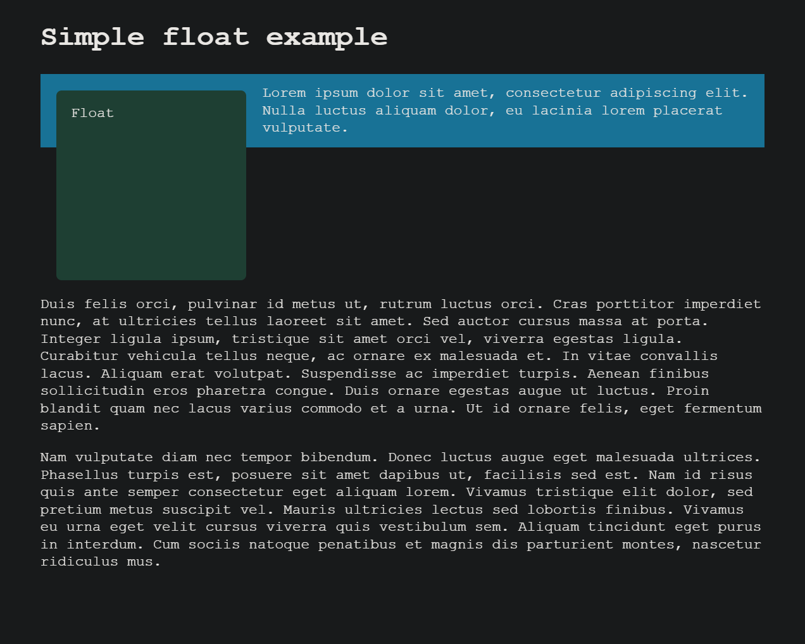

# float position 和 格式化上下文

## 什么是float浮动

>一个浮动元素会被移出正常文档流，块级元素会移动位置，占据浮动元素的空间，即上下重叠。但行内元素不会有重叠现象，会避开浮动元素，这是文字环绕的原因。

>给块级元素设置clear：both；后，就不会占据浮动元素原来的空间与浮动元素上下重叠了，也就不会改变页面布局，即清除浮动。

 

## float浮动带来的问题

1. 浮动后，其他块级元素会移动位置，来占据浮动元素原来的空间，导致布局改变
2. 浮动后，不在占据空间，可能导致父容器高度塌陷

## 清除浮动的方式

- 子元素后添加一个新的元素，例如div元素，添加样式clear：both；
- 使用伪元素，添加样式clear：both；
  
```css
.parent::after{
  display:block;
  content:'必须要有content属性';
  height:0;
  clear:both;
}

```
- 触发父元素成为BFC块级格式化上下文

## 什么是position定位

1. static 静态定位，默认。将元素放入它在文档布局流中的正常位置
2. relative 相对定位。与静态定位非常相似，占据在正常的文档流中，但可以设置top、left、right、bottom来移动位置，相对于原来的位置移动。
3. absolute 绝对定位。完全脱离文档流，绝对定位元素相对于最近的非 static 祖先元素定位。当这样的祖先元素不存在时，则相对于 ICB（initial containing block，初始包含块，有着和浏览器视口一样的尺寸，并且`<html>`元素也被包含在这个容器里面）。简单来说，算是根据浏览器视口来定位。
4. fixed 固定定位。固定元素则是相对于浏览器视口
5. sticky 粘性定位。粘性定位可以被认为是相对定位relative和固定定位fixed的混合。元素在跨越特定阈值前为相对定位，之后为固定定位。

设置position属性后，以下元素才会生效：
- left
- right
- top
- bottom
- z-index

## BFC块级格式化上下文
>每个格式上下文在其上下文中都有特定的布局规则。
Block Formatting Context，是页面一个隔离的容器，是一块独立的渲染区域，与外界互不影响。内部的元素从上到下排列，上下相邻的子元素会发生margin重叠。BFC的作用：
  - 可以用来清除浮动（内部元素会参与高度计算）
  - 防止被浮动元素覆盖（不会与浮动元素区域重叠）
  - 防止外边距margin重叠（不同BFC不会发生margin重叠）。
### 触发BFC的条件：

- float不为none
- position为absolute | fixed
- overflow不为visible
- display属性为inline-block，table-*，flow-root
- contain属性为layout、content或者strict
- flex items 或者 grid items
- colmun-span属性为all
- 设置contain属性，进行内容限制的容器
- html根元素

>flow-root 关键字的意义是，创建的内容本质上类似于一个新的根元素（如 `<html>`所做），并确定这个新的上下文如何创建及其流布局如何实现。

## 行内格式化上下文 
inline formatting contexts，存在于其他格式上下文中，可以将其视为段落的上下文。段落创建了一个内联格式上下文，其中在文本中使用诸如 `<strong>、<a>`或 `<span>` 元素等内容。

盒模型不完全适用于行内格式化上下文。水平margin和padding适用，垂直margin和padding不适用。

## 灵活格式上下文

flex formatting context。 flex弹性盒子、grid容器、mulcols多列布局容器：将其子元素布局为灵活项，子元素则为块级格式化上下文。
