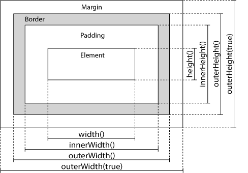

## jQuery 简介

jQuery 是一个快速、小巧、功能丰富的 JavaScript 库。利用一些容易上手的 API，它使一些任务，譬如 HTML 文档遍历和操纵、事件处理、动画，以及 Ajax 更简单，并能跨浏览器起作用。jQuery 库包含以下功能：

- HTML 元素选取
- HTML 元素操作
- CSS 操作
- HTML 事件函数
- JavaScript 特效和动画
- HTML DOM 遍历和修改
- AJAX
- Utilities

jQuery 使用 `$` 符号和 `jQuery` 对象，会注入 window 全局对象，作为全局对象的属性使用。但可能其他框架也使用 $ 符号，这样就会引发冲突（但 jQuery 也可以照常使用）。使用 `noConflict()`方法避免这个问题。

```js
// 使用noConflict()，释放对 $ 标识符的控制，返回值相当于起了个别名
var jq = $.noConflict();
jq(document).ready(function () {
  jq("button").click(function () {
    jq("p").text("jQuery 仍然在工作!");
  });
});
```

## jQuery 选择器

jQuery 选择器基于元素的 id、类、类型、属性、属性值等"查找"（或选择）HTML 元素。 传入任何 CSS 选择器即可选中该元素，返回该元素的 jQuery 对象。

jQuery 中所有选择器都以美元符号开头：`$()`。

伪类选择器：

- `:contains(text)`选择所有包含指定文本的元素。
- `:has(selector)`选择至少包含指定选择器的元素。
- `:empty`选择所有没有子元素的元素（包括文本节点）。
- `:parent`选择有子元素或者文本的元素。empty 相反

- `:it(index)`所有索引值小于给定 index 参数的元素
- `:gt(index)`所有索引值大于给定 index 参数的元素
- `:eq(index)`所有索引值等于给定 index 参数的元素
- `:even`偶数元素
- `:odd`奇数元素

jQuery 对象的方法：

- `.filter(selector|element|function(index))`过滤器
- `.first()`
- `.last()`
- `.is(selector|element|function(index))`
- `.not(selector|element|function(index))`
- `.has(selector)`有相匹配的选择器或 DOM 元素的后代元素的元素
- `.map(callback(index, domElement))`返回新 jQuery 对象
- `.slice()`根据指定的下标范围，过滤匹配的元素集合，并生成一个新的 jQuery 对象

- `contents()`筛选包括文字和注释节点的元素
- `add(selector)`添加元素到匹配的元素集合。
- `find()`通过一个选择器，jQuery 对象，或元素过滤，得到当前匹配的元素集合中每个元素的后代。
- `children(selector)`获得匹配元素集合中每个元素的子元素，选择器选择性筛选。
- `closest(selector)`返回最先匹配的祖先元素
- `offsetParent()`取得离指定元素最近的含有定位信息的祖先元素
- `end()`终止在当前链的最新过滤操作，并返回匹配的元素的以前状态。

```js
// 通过选择器selector选中元素，然后执行相应的action操作
$(selector).action();

// 在 DOM 加载完成后才可以对 DOM 进行操作。类似DOMContentLoaded事件之后
$(document).ready(function () {
  // 开始写 jQuery 代码...
});
// 上述解析语法：
$(function () {
  // 开始写 jQuery 代码...
});

//选取 class 为 intro 的 <p> 元素
$("p.intro");

//选取每个 <ul> 元素的第一个 <li> 元素
$("ul li:first-child");
```

## jQuery 事件

页面对不同访问者的响应叫做事件。事件处理程序指的是当 HTML 元素发生某些事件时所调用的方法。

常用的事件类型有：

鼠标事件：

- `click`
- `dbclick`
- `mouseenter`
- `mousemove`
- `mouseleave`
- `mouseout`
- `hover`

键盘事件：

- `keydown`
- `keyup`

表单事件：

- `submit`
- `change`
- `input`
- `focus`
- `blur`

文档事件：

- `load`
- `resize`
- `scroll`

附加处理程序的类型：

- `bind(eventType [, eventData ], handler(eventObject) )`绑定一个事件处理程序
- `unbind(eventType [, eventData ], handler(eventObject) )`删除一个事件处理程序
- `on(events [, selector ] [, data ], handler(eventObject))`绑定一个或多个事件处理函数
- `one( events [, selector ] [, data ], handler(eventObject))`只会执行一次的事件处理器
- `off(events [, selector ] [, handler(eventObject) ])`移除一个事件处理函数。

- `delegate(selector, eventType, eventData, handler(eventObject))`绑定一个或多个事件处理函数
- `undelegate(selector, eventType, handler(eventObject))`删除事件处理程序
- `trigger(customEventName)`触发给定事件类型所有的处理程序
- `triggerHandler( eventType [, extraParameters ] )`为一个事件执行所有处理程序。

给元素添加事件：

```js
//eventData对象，它包含的数据键值对映射将被传递给事件处理程序
delegate(selector, eventType, eventData, handler(eventObject));
//一个对象，包含一个或多个DOM事件类型和函数并执行它们。
delegate(selector, events);

$("table").delegate("td", "click", function () {
  $(this).toggleClass("chosen");
});

// 给选中的p元素田间click事件处理器
$("p").click(function () {
  // 动作触发后执行的代码!!
});

// 给#p1元素添加hover事件，参数分别是hover进入和离开的回调
$("#p1").hover(
  function () {
    alert("你进入了 p1!");
    $(this).css("background-color", "#cccccc");
  },
  function () {
    alert("拜拜! 现在你离开了 p1!");
    $(this).css("background-color", "#ffffff");
  }
);
```

## jQuery 效果

隐藏、显示、切换，滑动，淡入淡出，以及动画。。。。。。

- `show(speed,callback)`显示
- `hide(speed,callback)`隐藏
- `toggle(speed,callback)`切换显示/隐藏

- `fadeIn(speed,callback)`淡入
- `fadeOut(speed,callback)`淡出
- `fadeTo(speed,opacity,callback)` 渐变为给定的不透明度（值介于 0 与 1 之间）。
- `fadeToggle(speed,callback)`切换淡入/淡出

- `slideDown(speed,callback)`向下滑入
- `slideUp(speed,callback)`向上滑出
- `slideToggle(speed,callback)`切换滑入/滑出

- `animate({params},speed,callback)`创建自定义动画
- `stop(stopAll,goToEnd)`停止动画
- `delay(duration [, queueName ] )`设置一个延时来推迟执行队列中后续的项。
- `finish( [queue ])`停止当前正在运行的动画，删除所有排队的动画，并完成匹配元素所有的动画

```js
$(document).ready(function () {
  /**
   * @params 定义形成动画的 CSS 属性
   * @speed 动画速度
   * @callback 结束的回调
   *
   */
  $("div").animate({
    left: "250px",
    opacity: "0.5",
    height: "toggle", //可以设置为 "show"、"hide" 或 "toggle"：
    height: "+=150px", //可以是相对值
    width: "+=150px",
  });

  /**停止动画
   * @stopAll 是否应该清除动画队列.默认是 false，即仅停止活动的动画，
   * 允许任何排入队列的动画向后执行。
   * @goToEnd 是否立即完成当前动画。默认是 false
   */
  $("div").stop();
  $(".hidebtn").click(function () {
    /**
     * @1000:显示/隐藏速度1000ms，也可以用slow、fast关键字
     * @linear：运动曲线 linear\swing，也可以使用其他插件提供的运动曲线
     * @callback:运动结束后的回调函数
     */
    $("div").hide(1000, "linear", function () {
      alert("Hide() 方法已完成!");
    });

    //可以链式调用
    $("#div2")
      .fadeToggle("slow")
      .delay(800)
      .fadeToggle(3000)
      .fadeTo("slow", 0.7)
      .slideUp();
  });
});
```

## jQuery 内容操作

jQuery 中非常重要的部分，就是操作 DOM 的能力。提供一系列与 DOM 相关的方法，这使访问和操作元素和属性变得很容易。

- `text()`设置或返回文本内容
- `html()`设置或返回内容（包括 HTML 标签）
- `val()`设置或返回表单字段的
- `attr()`获取或设置属性值
- `removeAttr()`
- `prop()`获取或设置特性值
- `removeProp()`
- `clone()`创建一个匹配的元素集合的深度拷贝副本。
- `wrap(wrappingElement)`在每个匹配的元素外层包上一个 html 元素。
- `wrapAll(wrappingElement)`在所有匹配元素外面包一层 HTML 结构。
- `wrapInner(wrappingElement)`在匹配元素里的内容外包一层结构。
- `unwrap()`将匹配元素集合的父级元素删除

- `data(name,value)`添加自定义数据
- `hasData()`判断是否有数据
- `removeData()`移除数据
- `dequeue()`执行匹配元素队列的下一个函数。
- `queue()`显示在匹配的元素上的已经执行的函数列队
- `clearQueue()`从列队中移除所有未执行的项。

- `append()`在被选元素的结尾插入内容
- `appendTo()`把被选元素插入到指定元素最后面
- `prepend()`
- `prependTo()`
- `before()`
- `insertBefore()`
- `after()`在被选元素之后插入内容
- `insertAfter()`把被选元素插入指定元素之后
- `replaceAll(target)`匹配元素替换每个目标元素
- `replaceWith(newContent)`用内容替换匹配的元素并且返回被删除元素的集合。

- `remove()`删除被选元素（及其子元素）
- `empty()`从被选元素中删除子元素
- `detach()`从 DOM 中去掉所有匹配的元素

- `addClass()`向被选元素添加一个或多个类
- `hasClass()`否有被分配给定的（样式）类
- `removeClass()`从被选元素删除一个或多个类
- `toggleClass()`对被选元素进行添加/删除类的切换操作
- `css()`设置或返回样式属性

- `width()`设置或返回元素的宽度
- `height()`
- `innerWidth()`
- `innerHeight()`
- `outerWidth()`
- `outerHeight()`
- `offset()`获取和设置第一个元素的当前坐标，坐标相对于文档
- `position()`获取匹配元素中第一个元素的当前坐标，相对于 offset parent 的坐标
- `scrollLeft()`获取和设置每个匹配元素的水平滚动条位置
- `scrollTop()`

```js
$("button").click(function () {
  $("p").css("background-color", "yellow").css("background-color");
  $("p").css({ "background-color": "yellow", "font-size": "200%" });
  $("body div:first").addClass("important blue");
  $("body").append(txt1, txt2, txt3); // 追加新元素

  $("#idname").attr("href", "http://www.baidu.com/jquery");

  //设置多个属性值
  $("#runoob").attr({
    href: "http://www.runoob.com/jquery",
    title: "jQuery 教程",
  });

  //用回调函数返回值设置属性值，参数：被选元素列表中当前元素的下标，以及原始（旧的）值
  $("#runoob").attr("href", function (i, origValue) {
    return origValue + "/jquery";
  });
});
```



## jQuery 遍历

- `length`在 jQuery 对象中元素的数量
- `selector`返回传给 jQuery()的原始选择器。
- `jquery`一个包含了 jQuery 版本号的字符串。
- `context`传给 jQuery()的原始的 DOM 节点的内容；如果没有东西被传递，那么上下文将可能是该文档（document）

- `parent()`返回被选元素的直接父元素。
- `parents()`返回被选元素的所有祖先元素
- `parentsUntil(refParent)`返回介于给定元素之间的所有祖先元素
- `children(selector)`返回被选元素的所有直接子元素。
- `find()`返回被选元素的后代元素，一路向下直到最后一个后代

- `siblings(selector)`返回被选元素的所有同胞元素
- `next()`返回被选元素的下一个同胞元素。
- `nextAll()`所有跟随的同胞元素。
- `nextUntil()`给定参数之间的所有跟随的同胞元素
- `prev()`
- `prevAll()`
- `prevUntil()`

- `first()`返回被选元素的首个元素
- `last()`返回被选元素的最后一个元素。
- `eq()`返回被选元素中带有指定索引号的元素，从 0 开始
- `filter(selector)`匹配的元素会被返回
- `not(selector)`返回不匹配的所有元素

- `get( [index ] )`获取一个对应 index 的 DOM 元素
- `index(selector|element)`从匹配的元素中搜索给定元素的索引值，从 0 开始计数。
- `size()`匹配的 DOM 元素的数量
- `toArray()`返回一个包含 jQuery 对象集合中的所有 DOM 元素的数组。
- `each(callback(index, Element))`为每个匹配元素执行一个函数。
- `jQuery.param( obj, traditional )`创建一个数组或对象序列化的的字符串，适用于一个 URL 地址查询字符串或 Ajax 请求

```js
$("div").children();
$("div").children("p.1");
$("div").find("span");

$("h2").nextUntil("h6");

$("p").eq(1);
$("p").filter(".url");
$("p").not(".url");
```

## jQuery 全局函数

- `dequeue()`执行匹配元素队列的下一个函数
- `clearQueue()`取得离指定元素最近的含有定位信息的祖先元素
- `contains()`检查一个 DOM 元素是另一个 DOM 元素的后代。
- `data(element, name, value)`存储任意数据到指定的元素,返回设置的值
- `each()`一个通用的迭代函数，它可以用来无缝迭代对象和数组
- `extend()`将两个或更多对象的内容合并到第一个对象。
- `fn.extend()`一个对象的内容合并到 jQuery 的原型，以提供新的 jQuery 实例方法。
- `globalEval()`在全局上下文下执行一些 JavaScript 代码。
- `grep()`查找满足过滤函数的数组元素。原始数组不受影响。
- `inArray()`在数组中查找指定值并返回它的索引（如果没有找到，则返回-1）。
- `isArray()`确定的参数是一个数组。
- `isEmpryObject()`检查对象是否为空（不包含任何属性）。
- `isFunction()`确定参数是否为一个 Javascript 函数。

- `isNumeric()`确定它的参数是否是一个数字。

- `isPlainObject()`测试对象是否是纯粹的对象（通过 "{}" 或者 "new Object" 创建的）

- `isWindow()`确定参数是否为一个 window 对象。

- `makeArray()`转换一个类似数组的对象成为真正的 JavaScript 数组。

- `map()`将一个数组中的所有元素转换到另一个数组中。

- `merge()`合并两个数组内容到第一个数组。

- `noop()`一个空函数

- `now()`返回一个数字，表示当前时间。

- `parseHTML()`将字符串解析到一个 DOM 节点的数组中。

- `proxy()`接受一个函数，然后返回一个新函数，并且这个新函数始终保持了特定的上下文语境。

- `queue()`显示在匹配的元素上的已经执行的函数列队。操作匹配元素上将要执行的函数队列。

- `removeData()`删除一个先前存储的数据片段。

- `trim()`去掉字符串起始和结尾的空格。

- `type()`确定 JavaScript 对象的类型[[Class]] 。

- `unique()`删除数组中重复元素。只处理删除 DOM 元素数组，而不能处理字符串或者数字数组。

- `uniqueSort()`去重并排序数组

## jQuery AJAX

通过 jQuery AJAX 方法，使用 HTTP Get 和 HTTP Post 从远程服务器上请求文本、HTML、XML 或 JSON - 同时您能够把这些外部数据直接载入网页的被选元素中。

- `load(URL,data,callback(responseTxt,statusTxt,xhr))` 从服务器加载数据，并放入被选元素中。
- `get( URL [, data ] [, callback ] [, dataType ] )`
- `post( URL [, data ] [, callback ] [, dataType ] )`

```js
$("#div1").load("demo_test.txt");
//把 "demo_test.txt" 文件中 id="p1" 的元素的内容，<div> 元素中
$("#div1").load("demo_test.txt #p1");

/** jQuery AJAX配置对象参数：
 * @url 规定发送请求的 URL。默认是当前页面。
 * @type 规定请求的类型（GET 或 POST）。
 * @data 规定要发送到服务器的数据。
 * @dataType 预期的服务器响应的数据类型。
 * @dataFilter(data,type) 用于处理 XMLHttpRequest 原始响应数据的函数。
 * @contentType 内容类型。默认是："application/x-www-form-urlencoded"。
 * @async 布尔值，表示请求是否异步处理。默认是 true。
 * @beforeSend(xhr) 发送请求前运行的函数。
 * @complete(xhr,status) 请求完成时运行的函数，无论成功或失败
 * @success(result,status,xhr) 当请求成功时运行的函数
 * @error(xhr,status,error) 请求失败要运行的函数。
 * @cache 布尔值，表示浏览器是否缓存被请求页面。默认是 true。
 * @context 为所有 AJAX 相关的回调函数规定 "this" 值。
 * @global 是否为请求触发全局 AJAX 事件处理程序。默认是 true
 * @ifModified 是否仅在最后一次请求以来响应发生改变时才请求成功。默认是 false
 * @jsonp 在一个 jsonp 中重写回调函数的字符串。
 * @jsonpCallback 在一个 jsonp 中规定回调函数的名称。
 * @username 规定在 HTTP 访问认证请求中使用的用户名。
 * @password 规定在 HTTP 访问认证请求中使用的密码。
 * @processData 请求发送的数据是否转换为查询字符串。默认是 true。
 * @scriptCharset 规定请求的字符集。
 * @timeout 设置本地的请求超时时间（以毫秒计）。
 * @traditional 是否使用参数序列化的传统样式。
 * @xhr 用于创建 XMLHttpRequest 对象的函数。
 */
$("button").click(function () {
  $.ajax({
    url: "demo_test.txt",
    success: function (result) {
      $("#div1").html(result);
    },
  });
});
```
