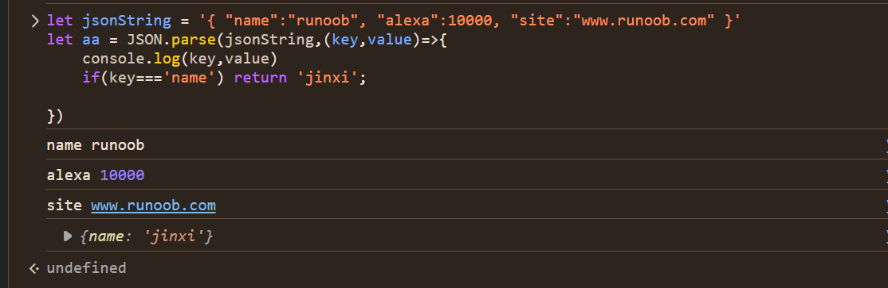
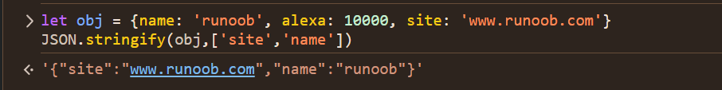

## JSON 简介

- JSON: JavaScript Object Notation(JavaScript 对象表示法)
- JSON 是存储和交换文本信息的语法，类似 XML。
- JSON 比 XML 更小、更快，更易解析。
- JSON 易于人阅读和编写。
- C、Python、C++、Java、PHP、Go 等编程语言都支持 JSON。

## JSON.parse()

在接收服务器数据时一般是字符串。可以使用 JSON.parse() 方法将数据转换为 JavaScript 对象。

```js
let jsonString = '{ "name":"runoob", "alexa":10000, "site":"www.runoob.com" }';
/**
 * @jsonString :要转成对象的json字串
 * @callback : 选填，可以对键值对进行操作转换和过滤操作，当callback返回undefind时，会过滤这个字段。
 */
JSON.parse(jsonString, callback(key, value));
```

运行结果如图：



### JSON.stringify()

向服务器发送数据时一般是字符串。可以使用 JSON.stringify() 方法将 JavaScript 对象转换为字符串。

```js
let object = { name: "runoob", alexa: 10000, site: "www.runoob.com" };
/**
1. object 为将要转成json字符串的对象
2. replacer 为需要转为JSON的key组成的数组，可以为输出的值做过滤和排序
3. callback 会传进每个键值对，返回值会替换原来的value值，如果返回undefined，输出结果会过滤掉该项
4. space 缩进空格数(最多10个)。也可以使用非数字，如：\t --等代替空格。 */
JSON.stringify(object, replacer | callback(key, value), space);
```



## JSON.rowJSON(jsonText)

将 JSON 字符串转换为 raw JSON

```js
console.log(JSON.rawJSON('"hello world"'));
{
  rawJSON: '"hello world"';
}
```

## JSON.isRowJSON(obj)

判断是否 JSON.rawJSON()返回的对象

```js
JSON.isRawJSON(JSON.rawJSON('"hello world"')); // true
```
